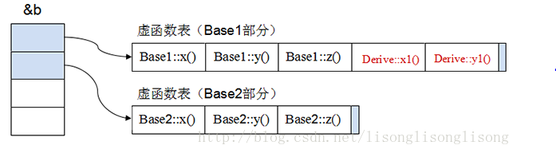

# C++最强八股

## C++基础

### 数据类型

#### 整型 short int long 和 long long

C++ 整型数据⻓度标准
short ⾄少 16 位
int ⾄少与 short ⼀样⻓
long ⾄少 32 位，且⾄少与 int ⼀样⻓
long long ⾄少 64 位，且⾄少与 long ⼀样⻓
在使⽤8位字节的系统中，1 byte = 8 bit
很多系统都使⽤最⼩⻓度，short 为 16 位即 2 个字节，long 为 32 位即 4 个字节，long long 为 64 位即 8 个字
节，int 的⻓度较为灵活，⼀般认为 int 的⻓度为 4 个字节，与 long 等⻓。
可以通过运算符 sizeof 判断数据类型的⻓度。例如：

```cpp
cout << "int is " << sizeof (int) << " bytes. \n";
cout << "short is " << sizeof (short) << " bytes. \n";
```

头⽂件climits定义了符号常量：例如：INT_MAX 表示 int 的最⼤值，INT_MIN 表示 int 的最⼩值。

#### ⽆符号类型

即为不存储负数值的整型，可以增⼤变量能够存储的最⼤值，数据⻓度不变。
int 被设置为⾃然⻓度，即为计算机处理起来效率最⾼的⻓度，所以选择类型时⼀般选⽤ int 类型。

#### 怎样判断两个浮点数是否相等？

对两个浮点数判断大小和是否相等不能直接用==来判断，会出错！明明相等的两个数比较反而是不相等！对于两个浮点数比较只能通过相减并与预先设定的精度比较，记得要取绝对值！浮点数与0的比较也应该注意。与浮点数的表示方式有关

#### nullptr和null的区别

[非常详细的参考链接0](https://blog.csdn.net/justdoithai/article/details/51492133)

- 首先给出NULL在C和C++中的定义

```c++
#ifdef __cplusplus  // 检查是否在C++环境中编译
#define NULL 0   // 如果是在C++环境下，那么NULL被定义为整数值0
#else  
#define NULL ((void *)0)  // 在C中，直接使用整数0作为指针可能会导致警告或错误，因为C语言要求显式地将整数转换为指针类型。因此，在C中NULL被定义为((void *)0)，这是一个类型安全的空指针常量。
#endif  
```

> 要明白一点儿，NULL是一个无类型的东西，而且是一个宏。而宏这个东西，从C++诞生开始，就是C++之父嗤之以鼻的东西，他推崇尽量避免宏。

下面看一段代码：

```c++
void f(void*){}

void f(int){}

int main()
{
    f(NULL); // what function will be called?
}
```

我们本来是想用NULL来代替空指针，但是在将NULL输入到函数中时，它却选择了int形参这个函数版本，所以是有问题的，这就是用NULL代替空指针在C++程序中的二义性。**而引入了nullptr，这个问题就得到了真正解决，会很顺利的调到void f(void*)这个版本。**

**nullptr，可以保证在任何情况下都代表空指针:**

nullptr并非整型类别，甚至也不是指针类型，但是能转换成任意指针类型。nullptr的实际类型是std:nullptr_t。

**总结**：

- **nullptr**：是C++11引入的关键字，专门用于表示空指针。
  - **类型安全**：nullptr是一个特殊的指针字面量，它的类型是nullptr_t。这意味着它可以安全地转换为任何指针类型，而不需要显式的类型转换。这避免了以前使用NULL或0时可能出现的类型不匹配警告。
  - **区分指针和整数零**：在C++中，nullptr明确表示一个空指针，而整数0或NULL可能在某些情况下被解释为整数零。nullptr消除了这种混淆，提高了代码的可读性和安全性。
  - **统一C++和C++模板库（STL）**：在C++11之前，C++标准库中的一些容器和算法可能使用0作为空指针值。引入nullptr后，整个语言和标准库在处理空指针时更加一致和安全。

- **null**：
  - 在C++中，`null`并不是一个预定义的关键字或标识符。在C++11之前的版本中，NULL通常被定义为0或((void*)0)
    - C语言中`null`被定义为`((void*)0)`
    - C++中`null`被定义为`0`
  - 在C++11中，NULL宏已经被废弃，鼓励使用nullptr
  - 在C++11及更高版本中，如果你在代码中看到null，它可能是程序员自定义的宏或标识符，并非语言的标准部分。

- 使用场景：
  - C++11及更高版本：推荐使用nullptr来表示空指针，以获得更好的类型安全性和代码清晰度。
  - C++11之前的版本：可以使用NULL宏，但要注意它可能被定义为0或((void*)0)，这取决于具体的编译器和平台。
  - C语言：在C中，NULL通常被定义为((void*)0)，并且在标准库中使用NULL来表示空指针。

### 指针和引⽤

[指针](./数据类型/指针.md)
[引用](./数据类型/引用.md)
[指针和引用](./数据类型/指针和引用.md)

- `指针`存放**某个对象的地址**，其本身就是变量（命了名的对象），本身就有地址，所以可以有指向指针的指针；可变，包括其所指向的地址的改变和其指向的地址中所存放的数据的改变
- `引⽤`就是**变量的别名，从⼀而终，不可变**，必须初始化
- 不存在指向空值的引⽤，但是存在指向空值的指针

1. 定义和声明：

    指针是⼀个变量，其值是另⼀个变量的地址。声明指针时，使⽤ `*` 符号

    ```cpp
    int x = 10;
    int *ptr = &x;
    ```

    引⽤是⼀个别名，它是在已存在的变量上创建的。在声明引⽤时，使⽤ `&` 符号。

    ```cpp
    int y = 20;
    int &ref = y;
    ```

2. 使⽤和操作：
    指针： 可以通过解引⽤操作符 * 来访问指针指向的变量的值，还可以通过地址运算符 & 获取变量的地址。
    引⽤： 引⽤在声明时被初始化，并在整个生命周期中⼀直引⽤同⼀个变量。不需要使⽤解引⽤操作符，因为引⽤本身就是变量的别名

    ```cpp
    int value = *ptr; // 获取指针指向的值
    int address = &x; // 获取变量 x 的地址
    ```

    ```cpp
    int newValue = ref; // 获取引⽤的值
    ```

3. 空值和空引⽤：
    指针可以为空（nullptr）表示不指向任何有效的地址。
    引⽤必须在声明时初始化，并且不能在后续改变引⽤的绑定对象。因此，没有空引⽤的概念

4. 可变性：
    指针： 可以改变指针的指向，使其指向不同的内存地址。
    引⽤： ⼀旦引⽤被初始化，它将⼀直引⽤同⼀个对象，不能改变绑定。

5. ⽤途：
    指针： 通常⽤于动态内存分配、数组操作以及函数参数传递。
    引⽤： 通常⽤于函数参数传递、操作符重载以及创建别名。

#### 指针和引用的本质

[关于引用的本质可以看这个](https://blog.csdn.net/K346K346/article/details/46805159)

**引用的底层本质：**

从高级语言层面的概念来说：引用是变量的别名，它不能脱离被引用对象独立存在。接下来看一下底层引用到底是什么？

```c++
//一段引用的代码
int i=5;
int &ri=i;
ri=8;

//上述代码对应的汇编代码
int i=5;
00A013DE  mov        dword ptr [i],5     //将文字常量5送入变量i

//这一步是引用的初始化过程，对于引用十分重要
int &ri=i;
00A013E5  lea        eax,[i]          //将变量i的地址送入寄存器eax
00A013E8  mov        dword ptr [ri],eax   //将寄存器的内容（也就是变量i的地址）送入变量ri

ri=8;
00A013EB  mov        eax,dword ptr [ri]   //将变量ri的值送入寄存器eax
00A013EE  mov        dword ptr [eax],8    //将数值8送入以eax的内容为地址的单元中
return 0;
00A013F4  xor        eax,eax
```

可以看到在汇编代码中ri这个引用的数据类型是dword(double word-4字节)。所以ri确实是一个变量，存放的是被引用的对象的地址。指针和引用的区别要看下一段代码：

```c++
//一段常量指针的代码
int i=5;
int* const pi=&i;
*pi=8;

//上述代码对应的汇编代码
int i=5;
011F13DE  mov         dword ptr [i],5  

int * const pi=&i;
011F13E5  lea         eax,[i]  
011F13E8  mov         dword ptr [pi],eax  

*pi=8;
011F13EB  mov         eax,dword ptr [pi]  
011F13EE  mov         dword ptr [eax],8  
```

可以看到引用和常量指针的汇编代码是一模一样的，所以可以得出在底层，引用就是一个常量指针。

#### 高级语言层面引用与指针常量的关系

1. 相同点：指针和引用在内存中都占用4个或者8个字节的存储空间，都必须在定义的时候给初始化。

2. 指针常量本身（以p为例）允许寻址，即&p返回指针常量本身的地址，*p表示被指向的对象

   引用变量本身（以r为例）不允许寻址，&r返回的是被引用对象的地址，而不是变量r的地址(r的地址由编译器掌握，程序员无法直接对它进行存取)

3. 引用不能为空，指针可以为空；

4. 指针数组这一块。数组元素允许是指针但不允许是引用，主要是为了避免二义性。假如定义一个“引用的数组”，那么array[0]=8;这条语句该如何理解？是将数组元素array[0]本身的值变成8呢，还是将array[0]所引用的对象的值变成8呢?

5. 在C++中，指针和引用经常用于函数的参数传递，然而，指针传递参数和引用传递参数是有本质上的不同的：**指针传递**参数本质上是**值传递**的方式，它所传递的是一个地址值。值传递的特点是被调函数对形式参数的任何操作都是作为局部变量进行，不会影响主调函数的实参变量的值。而在**引用传递**过程中， 被调函数的形参虽然也作为局部变量在栈中开辟了内存空间，但是这时存放的是由主调函数放进来的实参变量的地址（指针放的是实参变量地址的副本）。

6. "sizeof引用"得到的是所指向的变量(对象)的大小，而"sizeof指针"得到的是指针本身的大小；

#### C++ 中的指针参数传递和引用参数传递

指针参数传递本质上是值传递，它所传递的是⼀个地址值。值传递过程中，被调函数的形式参数作为被调函数的局部变量处理，会在栈中开辟内存空间以存放由主调函数传递进来的实参值，从而形成了实参的⼀个副本（替身）。 值传递的特点是，被调函数对形式参数的任何操作都是作为局部变量进行的，不会影响主调函数的实参变量的值 （形参指针变了，实参指针不会变）。 引⽤参数传递过程中，被调函数的形式参数也作为局部变量在栈中开辟了内存空间，但是这时存放的是由主调函数 放进来的实参变量的地址。被调函数对形参（本体）的任何操作都被处理成间接寻址，即通过栈中存放的地址访问 主调函数中的实参变量（根据别名找到主调函数中的本体）。因此，被调函数对形参的任何操作都会影响主调函数 中的实参变量。

引用传递和指针传递是不同的，虽然他们都是在被调函数栈空间上的⼀个局部变量，但是任何对于引⽤参数的处理 都会通过⼀个间接寻址的⽅式操作到主调函数中的相关变量。而对于指针传递的参数，如果改变被调函数中的指针 地址，它将应⽤不到主调函数的相关变量。如果想通过指针参数传递来改变主调函数中的相关变量（地址），那就 得使⽤指向指针的指针或者指针引⽤。

从编译的⻆度来讲，程序在编译时分别将指针和引⽤添加到符号表上，符号表中记录的是变量名及变量所对应地 址。指针变量在符号表上对应的地址值为指针变量的地址值，而引用在符号表上对应的地址值为引⽤对象的地址值 （与实参名字不同，地址相同）。符号表生成之后就不会再改，因此指针可以改变其指向的对象（指针变量中的值 可以改），而引用对象则不能修改。

#### 实现一个引用计数功能？c++中共享指针是怎样计数的？

> **什么是引用计数？**
>
> 使用一个计数器来标识当前对象被多少指针所指或者被引用的次数。当引用对象被创建或被拷贝时，引用计数要加1；当引用对象被销毁或被覆盖时，引用计数减1；当引用计数为0时，数据对象被销毁。（也是核心原理）。通俗的来讲即这块地址上每多一个指针指向他，计数加一；
>
> 因为有多个指针指向了同一个内存，如果提前释放了这个内存，那其他指向这个地址的指针则会成为野指针，就是指针悬挂现象。同时如果所有的指针都不指向这个地址，这块地址还没被释放，就会被造成内存泄漏。所以采用计数的方式来判断这个地址上还有多少个指针，当最后一个指针不再指向这块内存的时候，就释放掉这块内存。
>
> **实现引用计数的目的**
>
> 1. [右值引用](#左值和右值)一旦一个对象通过调用new被分配出来，记录谁拥有这个对象是很重要的，因为其所有者要负责对它进行delete。但是对象所有者可以有多个，且所有权能够被传递，这就使得内存跟踪变得困难。引用计数可以跟踪对象所有权，并能够自动销毁对象。
> 2. 节省内存，提高程序运行效率。如何很多对象有相同的值，为这多个相同的值存储多个副本是很浪费空间的，所以最好做法是让所有对象都共享同一个值的实现。

```c++
template <class T>
class Ref_count{
private:
    T* ptr;         //数据对象指针
    int* count;     //引用计数器指针
public:
    /*
    普通指针构造共享指针,注意这样有问题，造成二龙治水
    因为同一块内存的普通指针构建的共享指针也指的是同一块内存，所以不应该是1，应该++
    比如shared_ptr<int> s_ptr(p);     s_ptr指向了这块地址，pCount = 1
    shared_ptr<int> s_ptr1 = s_ptr;  s_ptr1也指向了这块地址，pCount = 2
    shared_ptr<int> s_ptr2(p);       s_ptr2也指向了这块地址，不过重新创建了引用计数，pCount1 = 1，这样显然不行*/
    //所以要避免一个原生指针多次使用这个函数
    Ref_count(T* t):ptr(t),count(new int(1)){}
    
    
    ~Ref_count(){
        decrease();
    }

    //拷贝构造
    Ref_count(const Ref_count<T>& tmp){
        count = tmp->count;
        ptr = tmp->ptr
        increase();
    }

    //注意=在指针里面是指向的意思，因此说明=左边的共享指针指向了=右边的
    //因此=左边的共享指针-1，=右边的共享指针+1
    Ref_count<T>& operator=(const Ref_count& tmp){
        if(tmp != this){
            decrease();
            ptr = tmp->ptr;
            count = tmp->count;
            increase();
        }
        return *this
    }

    T* operator ->() const{
        return ptr;
    }

    T& operator *() const{
        return *ptr;
    }

    void increase(){
        if(count){
            *(count)++;
        }
    }

    void decrease(){
        if(count){
            *(count)--;
            if(*count == 0){
                //引用计数为0的时候就删除数据对象指针和引用对象指针
                delete ptr;
                ptr = nullptr;
                delete count;
                count = nullptr;
            }
        }
    }

    T* get() const{
        return ptr;
    }

    int get_count() const{
        if(!count){
            return 0;
        }
        return *count;
    }
};
```

**注意千万不要吧一个原生指针给多个共享指针管理，会造成错误，具体看我的注释。**

#### 指针没有初始化会怎么样

没有初始化的指针叫做野指针

指针未初始化能通过编译，但是运行的时候可能报错也可能不报错。因为你如果没使用这个指针，那倒是无所谓。但是如果你使用了，可能会出问题。因为这个指针由于没有初始化，可能会指向任何内存空间，完全随机的，有两种情况：

1. 指向的地址是系统使用的内存，用户程序不能使用，如果用户程序使用则会报错
2. 指向的不是系统的内存，不报错。但是如果这个指针指向了你之前程序使用过的内存，则你在个指针赋值，就会修改之前的内存上的数据，也会出问题。

指针变量设置为nullptr表明它不指向任何内容,这样引用她也不会出现上面的问题。

**空指针到底是什么？**

 由系统保证空指针不指向任何实际的对象或函数，也就是说，任何对象或者函数的地址都不可能是空指针，空指针与任何对象或函数的指针值都不相等。空指针表示“未分配”或者“尚未指向任何地方”。它与未初始化的指针有所不同，空指针可以确保不指向任何对象或函数，而未初始化指针可能指向任何地方。

#### 野指针和指针悬挂

野指针(wild pointer)指的是未经初始化的指针

悬挂指针(dangling pointer)指的是已经销毁的对象或已经回收的地址

#### void*（泛型指针）

指针是对内存区域的抽象。指针变量中存放着目标对象的内存地址，而与指针相复合的类型，则说明了相应内存区域中的内容具有哪些属性，以及能做什么事情。也就是说，在内存空间某块区域中的内容，原本可以是不可解读的；但是，如果有一个描述这块内存区域的指针存在，我们就能找到它（地址的作用），并且合理地使用它（类型的作用）。void* 只有其中一半的作用。因为没有明确与指针相复合的类型，所以不能解引用，也不能使用基于类型之上（sizeof(T)）的指针运算。

### 数组

#### 一维数组名和二维数组名的区别

不管是一维还是多维数组，都是内存中一块线性连续空间，因此在内存级别上，其实都只是一维。

所以一维数组名是指向该数组的指针，二维数组名也是指向该数组的指针，但是+1之后，跳过的是一行。

问：二维数组名为什么不能直接赋值给二级指针？

答：一句话来说就是二维数组名是行指针，也就是指向数组的指针。而二级指针是指向指针的指针，它们不是同一类型。

> 定义一维数组 `int a[i]` 和二维数组`int b[i][j]`，a相当于`int (*)`，而b相当于`int (*)[j]`。想要获得 a[i] 中第 x 个元素，可以直接使用 `*(a+x)`。而想要获得 `b[i][j]`中第 x 行第 y 个元素，则需用 `*(*(b+x)+y)`，因为 b 相当于数组指针，(b+x) 则是指向第 x 个数组的指针，注意，是指向数组，而不是数组元素！所以`*(b+x)` 获得的是第 x 个数组的数组名，即该数组的首元素地址，这时再结合偏移量 y 就可以取得该元素。

#### arr和&arr[0]和&arr的不同

首先如果打印的话，三个打印的完全一样，都是数组首元素的地址。

首先&arr应该是整个元素的地址，但是打印出来却是首元素的地址，不同之处在于对地址做加法运算后有不同，如下：

```c++
int arr[10]={0};
printf("%p\n",arr);//首元素的地址
printf("%p\n",arr+1);

printf("%p\n",&arr[0]);//首元素的地址
printf("%p\n",&arr[0]+1);

printf("%p\n",&arr);//整个数组元素的地址
printf("%p\n",&arr+1); 
```

输出首元素地址都是相同的，arr+1和&arr[0]+1都是只移动了4个字节，但是&arr+1移动了40个字节

**结论：&arr代表的是整个数组的地址，虽然它具体表现为首个元素的地址，但是在对其进行操作时，是以整个数组为单位的。**

补充

arr 本身是左值（但不可仅凭此表达式修改），指代数组对象。不过 arr 会在大多数场合隐式转换成右值表达式 &(arr[0]) ，为指针类型，指向 arr[0] 。&arr 是右值表达式，为指针类型，指向 arr 本身。简单来说就是 arr 本身不是地址而是指代整个数组，只不过会隐式转成指针罢了。

#### char a,char a[],char *a,char*[],char **a 之间的区别

1. char a
   - 定义了一个存储空间，存储的是char类型的变量

2. char a[]
   - 是一个字符数组，数组中的每一个元素是一个char类型的数据

3. char *a
   - **字符串的本质（在计算机眼中）是其第一个字符的地址，c和c++中操作字符串是通过内存中其存储的首地址来完成的**

   - 对于char a[]来说a代表的是数组的首地址，那么对char *a来说a代表的也是字符串的首地址

   - 因此char a[]和char *a可以放到一块看，这两个没有本质区别。

   - 但是要注意对于char s[]和char* a我们可以有`a=s`，但不能有`s=a`，因为创建数组的时候s的地址不为空已经确定，但是a是一个空指针，不能将非空的地址指向空指针

4. char *a[]
   `*`的优先级是低于`[]`的，因此要先看`a[]`再看 `*`

   因此这是一个char数组，数组中的每一个元素都是指针，这些指针指向char类型

   `char *a[ ] = {"China","French","America","German"}`

5. char **a
   两个**代表相同的优先级，因此从右往左看，即`char*(*a)`

   char *a不就是一个字符串数组，a代表首地址。那么char* (*a)就是和char*a[]一样的数据结构

#### 哈希表时间复杂度为什么是O(1)?

首先要参考数组的查找，数组在内存中是一块连续的地址空间，只要知道查找数据的下标就可以快速定位到数据的内存。

那么哈希表就是利用了数组的这种特性，即**hash表的物理存储其实是数组**。

事实上，(“abc”,“hello”) 这样的 Key、Value 数据并不会直接存储在 Hash 表的数组中，因为数组要求存储固定数据类型，主要目的是每个数组元素中要存放固定长度的数据。所以，数组中存储的是 Key、Value 数据元素的地址指针。一旦发生 Hash 冲突，只需要将相同下标，不同 Key 的数据元素添加到这个链表就可以了。查找的时候再遍历这个链表，匹配正确的 Key。

.png)

### 变量声明和定义区别？

- **声明**仅仅是把变量的声明的位置及类型提供给编译器，并不分配内存空间

- **定义**要在定义的地方为其分配存储空间。

**相同变量可以在多处声明（外部变量extern），但只能在一处定义:**

### 静态局部变量\全局变量\局部变量的区别和使⽤场景

1. 静态局部变量
   - 作⽤域： 限定在定义它的函数内。
   - 生命周期： 与程序的生命周期相同，但只能在定义它的函数内部访问。
   - 关键字： 使⽤ static 关键字修饰。
   - 初始化： 仅在第⼀次调⽤函数时初始化，之后保持其值

    当希望在函数调⽤之间保留变量的值，并且不希望其他函数访问这个变量时，可以使⽤静态局部变量

    ```cpp
    void exampleFunction() {
        static int count = 0; // 静态局部变量
        count++;
        cout << "Count: " << count << endl;
    }
    ```

2. 全局变量
   - 作⽤域： 整个程序。
   - 生命周期： 与程序的生命周期相同。
   - 关键字： 定义在全局作⽤域，不使⽤特定关键字。

    当多个函数需要共享相同的数据时，可以使⽤全局变量。

    ```cpp
    int globalVar = 10; // 全局变量
    void function1() {
        globalVar++;
    }
    void function2() {
        globalVar--;
    }
    ```

3. 局部变量
   - 作⽤域： 限定在定义它的块（⼤括号内）。
   - 生命周期： 在块结束时销毁。
   - 关键字： 定义在函数、语句块或类的成员函数中。
   - 当变量只在某个特定作⽤域内有效，并且不需要其他作⽤域访问时，可以使⽤局部变量。

4. 总结
   - 静态局部变量⽤于在函数调⽤之间保留变量的值。
   - 全局变量适⽤于多个函数需要共享的数据。
   - 局部变量适⽤于仅在特定作⽤域内有效的情况。

### 局部静态变量的问题

#### 局部静态变量的理解

局部静态变量位于内存中的静态存储区，未经初始化的局部静态变量会自动初始化为0。但是局部静态变量的作用于还是还是局部作用于，定义它的函数或者代码块结束的时候，作用于也随之结束。但是该变量值不会被销毁，而是在内存中驻留下来，知道程序全部结束，这个驻留的值我们不能访问她。

#### 静态局部变量的构造和析构

对于全局变量的构造和析构，肯定是排在首位的。

而对于局部静态变量，程序首次执行到局部静态变量的定义处时才发出构造，其构造和析构都取决于程序的执行顺序。很显然，对于分布在程序各处的静态局部变量，其构造顺序取决于它们在程序的实际执行路径上的先后顺序，而析构顺序则正好与之相反。这就有两个问题：

1. 一方面是因为程序的实际执行路径有多个决定因素（例如基于消息驱动模型的程序和多线程程序），有时是不可预知的；
2. 另一方面是因为局部静态变量分布在程序代码各处，彼此直接没有明显的关联，很容易让开发者忽略它们之间的这种关系（这是最坑的地方）。

所以我们应该尽量少使用静态变量。

#### 函数局部静态变量的返回

```c++
int tmp(){
    static int b = 5;
    return b;
}
int main(){
    static int a = 0;
    int c = tmp();
    std::cout<<"a:"<<a<<std::endl;
    std::cout<<"c:"<<c<<std::endl;
}
```

对于g++编译器来说，可以返回哦

### c++中四种变量存储类型总结

在C++语言中，变量的存储类共有如下四种：

（1）auto存储类（自动存储类）

（2）static存储类 （静态存储类）

（3）extern存储类  (外部存储类)

（4）register存储类（寄存器存储类）

- **自动存储类**

  auto存储类，即自动存储类。在函数内部定义的变量，如果不指定其存储类，那么它就是auto类变量。这个是最常见的，所以我们不加关键字auto

  这是我们经常见到的一种变量存储类型。见如下代码：

  ```c++
  void func( ) { int a; auto int b; … }
  //a和b都是auto存储类变量
  ```

  > 自动存储类在在进入代码块（函数）之前生成，在函数体内部存活，出了函数体（函数返回）后就消失。
  >
  > 自动变量默认初始值是不确定的、
  >
  > 自动存储类每调用一次函数时都要赋一次初始值

- **静态存储类**

  static关键字在c和c++中是不同的，这个在上面说过了，具体的话可以去看上面。

- **extern存储类**

  如果在一个文件中要引用另一个文件中定义的外部变量，则在此文件中应用extern关键字把此变量说明为外部的。例如：

  ```c++
  extern int a; //a为别的文件中定义的外部变量
  int mydata; //外部变量的定义 
  extern int mydata;  //外部变量的说明 
  ```
  
  > 大型程序为了易于维护和理解，通常需要把程序划分为多个文件来保存，每个文件都可以单独编译，最后再把多个文件的编译结果（即目标文件）连接到一起来生成一个可执行程序。这种情况下，如果在一个文件中需要引用另一个文件中的外部变量，就需要利用extern说明。
  
- **register存储类**

  为了提高某些自动类变量或函数参数的处理速度，可以在定义这些变量的类型说明符的前面加上register关键字，以通知编译系统为这些变量分配寄存器来存放其值。若使用register（而非auto）存储类标识代码块内的变量，编译器就会将变量缓存于处理器内的寄存器中，此种情况下不能对该变量或其成员变量使用引用操作符&以获取其地址，因为&只能获取内存空间中的地址

### C++强制类型转换

关键字：`static_cast`、`dynamic_cast`、`reinterpret_cast`和 `const_cast`

1. static_cast
**没有运行时类型检查来保证转换的安全性**
进行上行转换（把派生类的指针或引⽤转换成基类表示）是安全的。
进行下行转换（把基类的指针或引⽤转换为派生类表示），由于没有动态类型检查，所以是不安全的。
使⽤：
   1. ⽤于基本数据类型之间的转换，如把int转换成char。
   2. 把任何类型的表达式转换成void类型。

2. dynamic_cast
在进行下行转换时，dynamic_cast具有类型检查（信息在虚函数中）的功能，⽐static_cast更安全。
转换后必须是类的指针、引⽤或者void*，基类要有虚函数，可以交叉转换。
dynamic本身只能⽤于存在虚函数的⽗子关系的强制类型转换；对于指针，转换失败则返回nullptr，对于引⽤，转换失败会抛出异常。

3. reinterpret_cast
可以将整型转换为指针，也可以把指针转换为数组；可以在指针和引⽤⾥进行肆⽆忌惮的转换，平台移植性⽐价差。

4. const_cast
常量指针转换为⾮常量指针，并且仍然指向原来的对象。常量引⽤被转换为⾮常量引⽤，并且仍然指向原来的对象。去掉类型的const或volatile属性。

### c++四种强制类型转换

[参考链接](https://blog.csdn.net/starryheavens/article/details/4617637?spm=1001.2101.3001.6650.12&utm_medium=distribute.pc_relevant.none-task-blog-2%7Edefault%7EBlogCommendFromBaidu%7Edefault-12-4617637-blog-79570788.pc_relevant_multi_platform_whitelistv1&depth_1-utm_source=distribute.pc_relevant.none-task-blog-2%7Edefault%7EBlogCommendFromBaidu%7Edefault-12-4617637-blog-79570788.pc_relevant_multi_platform_whitelistv1&utm_relevant_index=15)

#### 向上类型转换和向下类型转换

说这个之前要说一下类对象的内存结构：


**向上类型转换：**upcast，把派生类的指针或引用转换成基类的指针或者引用是安全的（或者说基类指针指向派生类）；因为用转换后的指针只能访问基类部分的函数时候，都可以访问，肯定安全。这个是隐式转换，c++认为是安全的。

**向下类型转换：**downcast，把基类指针或引用转换成派生类表示（或者说把派生类指针指向基类）时，由于没有动态类型检查，所以是不安全的。如果转换后的指针访问派生类新增加的函数，这个时候基类中本来没有这个函数，那就会出错。

> 很形象，向上就是派生类指针变成基类指针，向下就是基类指针变成派生类指针。

#### 四种强制类型转换

1. **static_cast**

   用于基本数据类型之间的转换

   void*和其他类型指针之间的转换

   子类对象的指针转换成父类对象指针

   以上三个都是隐式转换，最好吧所有隐式转换都用static_cast代替

2. **dynamic_cast**

   只用于对象的指针和引用，主要用于执行“安全的向下转型”，因为downcast是不安全的

   dynamic_cast是唯一一个在运行时处理的，因为我们转换后的指针如果请求一块无效的内存的话是会报错的，但是用该强转后会返回null，即转换成功会返回引用或者指针，失败返回null。如果一个引用类型执行了类型转换并且这个转换是不可能的，运行时一个`bad_cast`的异常类型会被抛出：

3. **const_cast**

   const_cast转换符是用来移除const或volatile属性。一般用于强制消除对象的常量性。而*C*不提供消除*const*的机制（已验证）。

   但是不能用于去除变量的常量性，而是去除指向对象的引用或指针的常量性，因此去除对象必须是指针或者引用。

   指向常量的指针被转化成非常量指针，并且仍然指向原来的对象；常量引用被转换成非常量引用，并且仍然指向原来的对象；常量对象被转换成非常量对象。

4. **reinterpret_cast**

   `reinpreter_cast<type-id> (expression)`

   reinterpret的意思是重新解释，可以将任意类型指针转换为其他类型的指针。所以他的type-id必须是一个指针、引用、算术类型。

   这个操作符能够在非相关的类型之间转换。它可以把一个指针转换成一个整数，也可以把一个整数转换成一个指针。

   底层实现是从一个指针到别的指针的值的二进制拷贝。

#### 为什么要引入四种强制类型转换

> c语言可以在任意类型之间进行转换，但是有一点就是不安全。可能会不经意间将指向const对象的指针转换成非const对象的指针，也有可能将基类对象指针转换成派生类对象的指针。因此这四种强制类型转换是的代码更加严谨规范

同时c++风格的强转很清晰的知道在干什么，只要扫一眼就知道这样转换的目的

#### 为什么说不要使用 dynamic_cast

没有说一定不能用，而是需要在恰当的场合使用恰当的特性。比如：能在编译时解决掉的问题没必要留到运行时、能用多态搞定的事情也没必要使用 dynamic_cast 和 [typeid](https://www.zhihu.com/search?q=typeid&search_source=Entity&hybrid_search_source=Entity&hybrid_search_extra={"sourceType"%3A"answer"%2C"sourceId"%3A170472080}) 等。

### 前置++与后置++

#### 前置++（++i）

- 行为：前置++在使用之前就立即增加变量的值。也就是说，它先执行自增操作，然后返回自增后变量的新值。
- 返回值：前置++通常返回的是自增操作后的变量的引用。这允许连续自增或在表达式中直接使用更新后的值。
- 效率：由于不需要创建临时对象来保存原始值，前置++通常被认为更高效。这是因为没有额外的复制操作。

#### 后置++（i++）

- 行为：后置++在使用之后才增加变量的值。这意味着它会在返回原始值之后执行自增操作。
- 返回值：为了能够提供自增之前的值，后置++必须返回自增前变量的一个副本（通常是通过临时对象）。这使得后置++的操作相比前置++多了一个复制步骤。
- 效率：由于涉及到临时对象的创建和返回，后置++在某些情况下可能不如前置++高效，尤其是在性能敏感的循环中。

```cpp
int i = 0;

// 使用前置++
int a = ++i; // 先将i的值增加到1，然后a被赋值为1，此时i的值也是1

// 使用后置++
int b = i++; // 先将i的当前值（1）赋给b，然后i的值增加到2，此时b的值是1，i的值是2
```

- 当你只需要增加变量的值，并不需要变量自增前的值时，使用前置++更为合适，因为它更高效。
- 如果你需要先保留变量的原始值并在之后增加它，那么应该使用后置++。

#### 重载**前置自增运算符**和**后置自增运算符**

```cpp
// 重载前置操作符(++operator)
self &operator++() {
    node = (linktype)((node).next);
    return *this;
}

// 重载后置操作符(operator++)
const self operator++(int) {
    self tmp = *this;
    ++*this;
    return tmp;
}
```

为了区分前后置，重载函数是以参数类型来区分，在调⽤的时候，编译器默默给int指定为⼀个0。

1. 为什么后置返回对象，而不是引⽤
因为后置为了返回旧值创建了⼀个临时对象，在函数结束的时候这个对象就会被销毁，函数返回的是存储旧值的临时变量而非原对象，如果返回引⽤，返回的是临时变量的引用，此时临时变量在函数返回后已经被销毁，会产生未定义行为。

2. 为什么后置前⾯也要加const
其实也可以不加，但是为了防⽌你使⽤i++++,连续两次的调⽤后置++重载符，为什么呢?
原因：
它与内置类型行为不⼀致；你⽆法获得你所期望的结果，因为第⼀次返回的是旧值，而不是原对象，你调⽤两次后置++，结果只累加了⼀次，所以我们必须⼿动禁⽌其合法化，就要在前⾯加上const。

3. 处理⽤户的⾃定义类型
最好使⽤前置++，因为他不会创建临时对象，进而不会带来构造和析构而造成的格外开销。

### 什么是函数指针，如何定义和使⽤场景

函数指针是指向函数的指针变量。它可以⽤于存储函数的地址，允许在运行时动态选择要调⽤的函数。

```cpp
// 返回类型 (*指针变量名)(参数列表)
int add(int a, int b) {
    return a + b;
}
int subtract(int a, int b) {
    return a - b;
}
int main() {
    // 定义⼀个函数指针，指向⼀个接受两个int参数、返回int的函数
    int (*operationPtr)(int, int);
    // 初始化函数指针，使其指向 add 函数
    operationPtr = &add;
    // 通过函数指针调⽤函数
    int result = operationPtr(10, 5);

    cout << "Result: " << result << endl;
    // 将函数指针切换到 subtract 函数
    operationPtr = &subtract;
    // 再次通过函数指针调⽤函数
    result = operationPtr(10, 5);
    cout << "Result: " << result << endl;
    return 0;
}
```

使⽤场景：

1. 回调函数： 函数指针常⽤于实现回调机制，允许将函数的地址传递给其他函数，以便在适当的时候调⽤。
2. 函数指针数组： 可以使⽤函数指针数组实现类似于状态机的逻辑，根据不同的输⼊调⽤不同的函数。
3. 动态加载库： 函数指针可⽤于在运行时动态加载库中的函数，实现动态链接库的调⽤。
4. 多态实现： 在C++中，虚函数和函数指针结合使⽤，可以实现类似于多态的效果。
5. 函数指针作为参数： 可以将函数指针作为参数传递给其他函数，实现⼀种可插拔的函数行为。
6. 实现函数映射表： 在⼀些需要根据某些条件调⽤不同函数的情况下，可以使⽤函数指针来实现函数映射表。

### 函数指针和指针函数的区别

函数指针是指向函数的指针变量。可以存储特定函数的地址，并在运行时动态选择要调⽤的函数。通常⽤于回调函数、动态加载库时的函数调⽤等场景。

```cpp
int add(int a, int b) {
    return a + b;
}
int (*ptr)(int, int) = &add; // 函数指针指向 add 函数
int result = (*ptr)(3, 4); // 通过函数指针调⽤函数
```

指针函数是⼀个返回指针类型的函数，⽤于返回指向某种类型的数据的指针。

```cpp
int* getPointer() {
    int x = 10;
    return &x; // 返回局部变量地址，不建议这样做
}
```

### struct和Class的区别

- 通常，`struct`⽤于表示⼀组相关的数据，而`class`⽤于表示⼀个封装了数据和操作的对象,在实际使⽤中，可以根据具体的需求选择使⽤`struct`或`class`。如果只是⽤来组织⼀些数据，而不涉及复杂的封装和继承关系， `struct` 可能更直观；如果需要进行封装、继承等⾯向对象编程的特性，可以选择使⽤ `class` 。
- `struct`结构体中的成员默认是公有的`public`。类中的成员默认是私有的`private`。
- `struct`继承时默认使⽤公有继承。`class`继承时默认使⽤私有继承。
- 如果结构体没有定义任何构造函数，编译器会生成默认的⽆参数构造函数。如果类没有定义任何构造函数，编译器也会生成默认的⽆参数构造函数。

```cpp
// 使⽤ struct 定义
struct MyStruct {
    int x; // 默认是 public
    void print() {
    cout << "Struct method" << endl;
    }
};

// 使⽤ class 定义
class MyClass {
public: // 如果省略，默认是 private
    int y;
    void display() {
    cout << "Class method" << endl;
    }
};
```

### 深拷⻉和浅拷⻉的区别

主要区别在于如何处理对象内部的动态分配的资源。

1. 深拷⻉
   - 深拷⻉是对对象的完全独⽴复制，包括对象内部动态分配的资源。在深拷⻉中，不仅复制对象的值，还会复制对象所指向的堆上的数据。
   - 主要特点：
     - 复制对象及其所有成员变量的值。
     - 动态分配的资源也会被复制，新对象拥有⾃⼰的⼀份资源副本。
   - 深拷⻉通常涉及到⼿动分配内存，并在拷⻉构造函数或赋值操作符中进⾏资源的复制。
   - 在未定义显示拷贝构造函数的情况下，系统会调用默认的拷贝函数——即浅拷贝，它能够完成成员的一一复制。
   - 当数据成员中没有指针时，浅拷贝是可行的；
   - **但当数据成员中有指针时，会出问题。如果没有自定义拷贝构造函数，会调用默认拷贝构造函数，这样就会调用两次析构函数。**第一次析构函数delete了内存，第二次的就指针悬挂了。所以，此时，必须采用深拷贝。

    ```cpp
    class DeepCopyExample {
    public:
    int *data;
    DeepCopyExample(const DeepCopyExample &other) 
    {
      // ⼿动分配内存并复制数据
      data = new int(*(other.data));
    }

    ~DeepCopyExample() 
    {
      // 释放动态分配的资源
      delete data;
    }
    
    DeepCopyExample& operator=(const DeepCopyExample &other) 
    {
      // 复制数据
      if (this != &other)
      {
        delete data;
        data = new int(*(other.data));
      }
      return *this;
    }
    };
    ```

2. 浅拷⻉
   - 浅拷⻉仅复制对象的值，⽽不涉及对象内部动态分配的资源。在浅拷⻉中，新对象和原对象共享相同的资源，⽽不是复制⼀份新的资源。
   - 主要特点：
     - 复制对象及其所有成员变量的值。
     - 对象内部动态分配的资源不会被复制，新对象和原对象共享同⼀份资源。
   - 浅拷⻉通常使⽤默认的拷⻉构造函数和赋值操作符，因为它们会逐成员地复制原对象的值。

    ```cpp
    class ShallowCopyExample {
    public:
      int *data;
      // 使⽤默认拷⻉构造函数和赋值操作符
    };
    ```

- 深拷贝与浅拷贝的区别就在于深拷贝会在堆内存中另外申请空间来储存数据，从而也就解决了指针悬挂的问题。简而言之，当数据成员中有指针时，必须要用深拷贝。

### inline 内联函数与宏定义

首先分析一下C宏定义的好处：首先C语言是一个效率很高的语言，使用预处理器实现，没有参数压栈，函数返回等操作，效率很高。

1. 相当于把内联函数里面的代码写在调用内联函数处。不用执行进入函数的步骤，直接执行函数体。

2. 从上面那一条的角度说，内联函数更像是宏，但却比宏多了类型检查，真正具有函数特性。

3. 在类声明中定义的函数，除了虚函数的其他函数都会自动隐式地当成内联函数。

4. 编译器会为所用 inline 函数中的局部变量分配内存空间

5. 会将 inline 函数的的输入参数和返回值映射到调用方法的局部变量空间中；

- 优点
  - 内联函数同宏函数一样将在被调用处进行代码展开，省去了参数压栈、栈帧开辟与回收，结果返回等，从而提高程序运行速度。
  - 内联函数相比宏函数来说，在代码展开时，会做安全检查或自动类型转换（同普通函数），而宏定义则不会。
  - 内联函数在运行时可调试，而宏定义不可以。
  - 可以说inline函数不仅吸收了了C宏定义的，同时消除宏定义的缺点。
- 缺点
  - 代码膨胀。内联是以代码膨胀（复制）为代价，消除函数调用带来的开销。
  - inline 函数无法随着函数库升级而升级。inline函数的改变需要重新编译。
  - 万一又递归调用，代码量很大。
  
- 虚函数（virtual）可以是内联函数（inline）吗？
- 首先要明白，内联函数是编译器做出的选择，是否内联决定权在编译器，程序员不可控。同时，虚函数是多态性的一种体现，多态性表现在函数的运行阶段而不是函数的编译阶段。因此，**虚函数表现为多态性时（运行期）不可以内联。**
- 唯一可以内联的时候是：编译器知道所调用的对象是哪个类。**只有在编译器具有实际对象而不是对象的指针或引用时才会发生。**

> inline说明对编译器来说只是一种建议，编译器可以忽略这个建议的，比如，你将一个长达100多行的函数指定为inline，编译器就会自动忽略这个inline，将这个函数还原成普通函数。在调用内联函数时，要保证内联函数的定义让编译器看到，也就是说，内联函数inline必须要定义在头文件中，这与通常的函数定义是不一样的。

### 带返回值的函数如果不return会怎么样？

首先不是BUG，这种情况属于**未定义的行为**，而未定义的行为不会导致编程失败。

当main函数没有return结尾的时候会在生成的目标文件中自动加入return 0

## 关键字

### const 关键字

[const](./关键字与限定符/const.md)

const的作⽤：
const 关键字主要⽤于指定变量、指针、引⽤、成员函数等的性质

1. 常量变量：声明常量，使变量的值不能被修改。
2. 指针和引⽤：声明指向常量的指针，表示指针所指向的值是常量，不能通过指针修改。声明常量引⽤，表示引⽤的值是常量，不能通过引⽤修改。
    - `const int* ptr = &constantValue; // 指向常量的指针`
    - `const int& ref = constantValue; // 常量引⽤`
3. 成员函数：⽤于声明常量成员函数，表示该函数不会修改对象的成员变量（对于成员变量是⾮静态的情况）。
4. 常量对象：声明对象为常量，使得对象的成员变量不能被修改。
5. 常引⽤参数：声明函数参数为常量引⽤，表示函数不会修改传⼊的参数。
6. 常量指针参数：声明函数参数为指向常量的指针，表示函数不会通过指针修改传⼊的数据。

#### const 修饰指针

只有两种情况：**指向常量的指针**和**常量指针**

**指向常量的指针**表明不能通过解除引用运算符去改变其值，指向的变量是常量

**常量指针**表明初始化后的指针指向的地址是不能改变的，但这块地址上的存储的值可以改变，地址跟随一生。所以`p2= &a是错误的，而*p2 = a 是正确的。`

```c++
const int p     //p为常量，初始化后不能更改
const int *p //*p为常量，不能通过*p改变其内容
int const *p //同上
int *const p //常量指针
```

##### 常量指针（底层const）

**常量指针**：
是指定义了⼀个指针，这个指针指向⼀个只读的对象，不能通过常量指针来改变这个对象的值。常量指针强调的是
指针对其所指对象的不可改变性。

**特点**：
靠近变量名。

**形式**：
（1）`const 数据类型 *指针变量 = 变量名`
（2）`数据类型 const *指针变量 = 变量名`

**示例**：

```cpp
int temp = 10;
const int* a = &temp;
int const *a = &temp;
// 更改：
*a = 9; // 错误：只读对象
temp = 9; // 正确
```

##### 指针常量（顶层const）

**指针常量**：
指针常量是指定义了⼀个指针，这个指针的值只能在定义时初始化，其他地⽅不能改变。指针常量强调的是指针的不可改变性。

**特点**：
靠近变量类型。

**形式**：
数据类型 * const 指针变量

**示例**：

```cpp
int temp = 10;
int temp1 = 12;
int* const p = &temp;
// 更改：
p = &temp2; // 错误
*p = 9; // 正确
```

##### 底层修饰和顶层修饰

const：
指针常量: `const int* d = new int(2);`
常量指针: `int *const e = new int(2);`

区别⽅法：
左定值，右定向：指的是const在*的左还是右边

拓展：
顶层const：指针本身是常量；
底层const：指针所指的对象是常量；
若要修改const修饰的变量的值，需要加上关键字volatile；
若想要修改const成员函数中某些与类状态⽆关的数据成员，可以使⽤mutable关键字来修饰这个数据成员；

##### 常量指针和指针常量的区别

- 常量指针是指针本身是常量，内容可变。
- 指针常量是指针所指向的内容是常量，指针本身可变。
- 在常量指针中， `const` 关键字位于 `*`之前。
- 在指针常量中， `const` 关键字位于 `*` 之后。

常量指针是指指针本身是⼀个常量，即指针的值（地址）不能被修改，但它所指向的内容可以被修改。

```cpp
int x = 10;
int y = 20;
const int *ptr = &x; // 常量指针，不能修改指针的值，但可以修改指针所指向的内容
// ptr = &y; // 错误，不能修改指针的值
// *ptr = 30; // 错误，不能修改指针所指向的内容
```

指针常量是指指针所指向的内容是⼀个常量，即指针所指向的内容不能被修改，但指针本身的值（地址）可以被修改。

```cpp
int x = 10;
int y = 20;
int *const ptr = &x; // 指针常量，不能修改指针的值，但可以修改指针所指向的内容
// ptr = &y; // 错误，不能修改指针的值
*ptr = 30; // 正确，可以修改指针所指向的内容
```

#### constexpr 和 const

const 表示“只读”的语义，constexpr 表示“常量”的语义
constexpr 只能定义编译期常量，而 const 可以定义编译期常量，也可以定义运行期常量。
你将⼀个成员函数标记为constexpr，则顺带也将它标记为了const。如果你将⼀个变量标记为constexpr，则同样它是const的。但相反并不成⽴，⼀个const的变量或函数，并不是constexpr的

1. constexpr变量

    复杂系统中很难分辨⼀个初始值是不是常量表达式，可以将变量声明为constexpr类型，由编译器来验证变量的值是否是⼀个常量表达式。

2. 必须使⽤常量初始化：

    ```cpp
    constexpr int n = 20;
    constexpr int m = n + 1;
    static constexpr int MOD = 1000000007;
    ```

    如果constexpr声明中定义了⼀个指针，constexpr仅对指针有效，和所指对象⽆关。

    ```cpp
    constexpr int *p = nullptr; //常量指针 顶层const
    const int *q = nullptr; //指向常量的指针， 底层const
    int *const q = nullptr; //顶层const
    ```

3. constexpr函数：
    constexpr函数是指能⽤于常量表达式的函数。
    函数的返回类型和所有形参类型都是字⾯值类型，函数体有且只有⼀条return语句。

    ```cpp
    constexpr int new() {return 42;}
    ```

    为了可以在编译过程展开，constexpr函数被隐式转换成了内联函数。
    constexpr和内联函数可以在程序中多次定义，⼀般定义在头⽂件。

4. constexpr 构造函数：

    构造函数不能说const，但字⾯值常量类的构造函数可以是constexpr。
    constexpr构造函数必须有⼀个空的函数体，即所有成员变量的初始化都放到初始化列表中。对象调⽤的成员函数必须使⽤ constexpr 修饰

5. constexpr的好处
   1. 为⼀些不能修改数据提供保障，写成变量则就有被意外修改的⻛险。
   2. 有些场景，编译器可以在编译期对constexpr的代码进行优化，提⾼效率。
   3. 相⽐宏来说，没有额外的开销，但更安全可靠。


### static 关键字

[static](./关键字与限定符/static.md)

static 关键字主要用于控制变量和函数的生命周期、作用域以及访问权限。

1. 变量
   1. 局部变量
      - 在局部变量之前加上关键字static，局部变量就被定义成为一个局部静态变量。
      - 内存中的位置：data段
      - 初始化：局部的静态变量只能被初始化一次
      - 作用域：作用域仍为局部作用域，当定义它的函数或者语句块结束的时候，作用域随之结束。
      - > 当static用来修饰局部变量的时候，它就**改变了局部变量的存储位置（从原来的栈中存放改为静态存储区）及其生命周期（局部静态变量在离开作用域之后，并没有被销毁，而是仍然驻留在内存当中，直到程序结束，只不过我们不能再对他进行访问），但未改变其作用域。**
   2. 全局变量
      - 在全局变量之前加上关键字static，全局变量就被定义成为一个全局静态变量。
      - 内存中的位置：静态存储区（静态存储区在整个程序运行期间都存在）
      - 初始化：未经初始化的全局静态变量会被程序自动初始化为0
      - 作用域：全局静态变量在声明他的文件之外是不可见的。准确地讲从定义之处开始到文件结尾。(只能在本文件中存在和使用)
      > 全局变量本身就是静态存储方式， 静态全局变量当然也是静态存储方式。两者的区别在于非静态全局变量的作用域是整个源程序， 当一个源程序由多个源文件组成时，非静态的全局变量在各个源文件中都是有效的（在其他源文件中使用时加上extern关键字重新声明即可）。 而**静态全局变量则限制了其作用域， 即只在定义该变量的源文件内有效， 在同一源程序的其它源文件中不能使用它**。

2. 静态函数
   - 在类内部使⽤ static 关键字修饰的函数是静态函数。
   - 静态函数属于类而不是类的实例，可以通过类名直接调⽤，而⽆需创建对象。
   - 静态函数不能直接访问⾮静态成员变量或⾮静态成员函数

    ```cpp
    class ExampleClass {
    public:
        static void staticFunction() {
        cout << "Static function" << endl;
    }
    };
    ```

3. 类
   1. 静态成员变量
      - 在类中使⽤ static 关键字修饰的成员变量是静态成员变量。
      - 所有类的对象共享同⼀个静态成员变量的副本。
      - 静态成员变量必须在类外部单独定义，以便为其分配存储空间。

      ```cpp
      class ExampleClass {
      public:
          static int staticVar; // 静态成员变量声明
      };
      // 静态成员变量定义
      int ExampleClass::staticVar = 0;
      ```

   2. 静态成员函数
      - 在类中使⽤ static 关键字修饰的成员函数是静态成员函数。
      - 静态成员函数不能直接访问⾮静态成员变量或⾮静态成员函数。
      - 静态成员函数可以通过类名调⽤，而不需要创建类的实例。

      ```cpp
      class ExampleClass {
      public:
          static void staticMethod() {
          cout << "Static method" << endl;
          }
      };
      ```

#### static初始化时机和线程安全问题

**先说在C语言中：**

静态局部变量和全局变量一样，数据都存放在全局区域，所以在主程序之前，编译器已经为其分配好了内存，在编译阶段分配好了内存之后就进行初始化，在程序运行结束时变量所处的全局内存会被回收。所以在c语言中无法使用变量对静态局部变量进行初始化。

**再说C++和C语言的区别：**

c++主要引入了类这种东西，要进行初始化必须考虑到相应的构造函数和析构函数，而且很多时候构造或者析构函数中会指定我们定义的操作，并非简单的分配内存。因此为了造成不必要的影响（一些我不需要的东西被提前构造出来）所以c++规定全局或者静态对象在首次用到的时候才会初始化。

所以c++整了两种初始化的情况，我理解就是编译初始化和运行初始化。

编译初始化也叫静态初始化。对全局变量和const类型的初始化主要是，叫做zero initialization 和 const initialization，静态初始化在程序加载的过程中完成。从具体实现上看，zero initialization 的变量会被保存在 bss 段，const initialization 的变量则放在 data 段内，程序加载即可完成初始化，这和 c 语言里的全局变量静态变量初始化基本是一致的。其次全局类对象也是在编译器初始化。

动态初始化也叫运行时初始化。主要是指需要经过函数调用才能完成的初始化或者是类的初始化，一般来说是局部静态类对象的初始化和局部静态变量的初始化。


下面是我自己的实验的一段代码：

```c++
#include<stdio.h>
static int a;
int main()
{
  int b = 5;
  { 
    //g++编译报错
    static int c = b;
    //gcc编译不报错
    static int c = b; 
  }
  return 0;
}
```

如果在c语言中有局部静态变量赋值操作的话会报错：`undefined reference to ' __cxa_guard_acquire'和 '__cxa_guard_release'`。而这两个API接口恰恰是c++中保证局部静态变量运行时初始化的关键，具体参考[c++局部静态变量和线程安全具体实现参考](https://www.cnblogs.com/william-cheung/p/4831085.html)

**线程安全问题：**

C语言中非局部静态变量一般在main执行之前的静态初始化过程中分配内存并初始化，可以认为是线程安全的；C++11标准针规定了局部静态变量初始化是线程安全的。这里的线程安全指的是：一个线程在初始化 m 的时候，其他线程执行到 m 的初始化这一行的时候，就会挂起而不是跳过。

具体实现如下：局部静态变量在编译时，编译器的实现是和全局变量类似的，均存储在bss段中。然后编译器会生成一个`guard_for_bar` 用来保证线程安全和一次性初始化的整型变量，是编译器生成的，存储在 bss 段。它的最低的一个字节被用作相应静态变量是否已被初始化的标志， 若为 0 表示还未被初始化，否则表示已被初始化(`if ((guard_for_bar & 0xff) == 0)`判断)。 `__cxa_guard_acquire` 实际上是一个加锁的过程， 相应的 `__cxa_guard_abort` 和`__cxa_guard_release` 释放锁。

```c++
void foo() {
    static Bar bar;
}

//gcc 4.8.3 编译器生成的汇编代码
void foo() {
    if ((guard_for_bar & 0xff) == 0) {
        if (__cxa_guard_acquire(&guard_for_bar)) {
            try {
                Bar::Bar(&bar);
            } catch (...) {
                __cxa_guard_abort(&guard_for_bar);
                throw;
            }
            __cxa_guard_release(&guard_for_bar);
            __cxa_atexit(Bar::~Bar, &bar, &__dso_handle);
        }
    }
    // ...
}
```

#### const 和 static

[const和static](./images/const和static.png)

- static和const可以同时修饰成员函数吗?

  答：不可以。C++编译器在实现const的成员函数的时候为了确保该函数不能修改类的实例的状态，会在函数中添加一个隐式的参数const this*。但当一个成员为static的时候，该函数是没有this指针的。也就是说此时const的用法和static是冲突的。两者的语意是矛盾的。**static的作用是表示该函数只作用在类型的静态变量上，与类的实例没有关系；而const的作用是确保函数不能修改类的实例的状态**，与类型的静态变量没有关系。因此不能同时用它们。--

### #define 和 typedef 的区别

[define](./关键字与限定符/#define.md)

[typedef](./关键字与限定符/typedef.md)

- define
  1. 只是简单的字符串替换，没有类型检查
  2. 是在编译的预处理阶段起作⽤
  3. 可以⽤来防⽌头⽂件重复引⽤
  4. 不分配内存，给出的是⽴即数，有多少次使⽤就进行多少次替换

- typedef
  1. 有对应的数据类型，是要进行判断的
  2. 是在编译、运行的时候起作⽤
  3. 在静态存储区中分配空间，在程序运行过程中内存中只有⼀个拷⻉

### #define宏常量和const常量的区别

**类型和安全检查不同:**

宏定义是字符替换，没有数据类型的区别，同时这种替换没有类型安全检查，可能产生边际效应等错误；

const常量是常量的声明，有类型区别，需要在编译阶段进行类型检查

**编译器处理不同:**

宏定义是一个"编译时"概念，在预处理阶段展开，不能对宏定义进行调试，生命周期结束与编译时期；

const常量是一个"运行时"概念，在程序运行使用，放在内存中的data段中。

**存储方式不同:**

宏定义是直接替换，不会分配内存，存储于程序的代码段中；

const常量需要进行内存分配，存储于程序的数据段中

**是否可以做函数参数:**

宏定义和const常量可以在函数的参数列表中出现

### typedef与#define的区别

**typedef:**

typedef故名思意就是类型定义的意思，但是它**并不是定义一个新的类型而是给已有的类型起一个别名**。主要有两个作用，第一个是给一些复杂的变量类型起别名，起到简化的作用。第二个是定义与平台无关的类型，屏蔽不同平台之间的差异。在跨平台或操作系统的时候，只需要改typedef本身就可以

**#define:**

define为一宏定义语句，本质就是文本替换

**区别:**

1. 关键字typedef在编译阶段有效，由于是在编译阶段，因此typedef有类型检查的功能。\#define则是宏定义，发生在预处理阶段，也就是编译之前，它只进行简单而机械的字符串替换，而不进行任何检查。

2. #define没有作用域的限制，只要是之前预定义过的宏，在以后的程序中都可以使用。而typedef有自己的作用域。

3. 对指针操作不同。见下面代码

```c++
typedef int * pint;
#define PINT int *
 
int i1 = 1, i2 = 2;

const pint p1 = &i1; //p不可更改，p指向的内容可以更改，相当于 int * const p;
const PINT p2 = &i2; //p可以更改，p指向的内容不能更改，相当于 const int *p；或 int const *p；
```

### struct 和 typedef struct

```c
/代码1（c语言）
typedef struct test3{
 int a;
 int b;
 int c;
}test4;
//代码2（c++）
struct test3{
 int a;
 int b;
 int c;
}test4;
```

- **在c语言中**

  对于代码1。**test3**相当于标识符，而**test4**相当于变量类型.定义一个结构体变量为`test4 t`，即`struct test3 = test4`

  对于代码2。要定义结构体变量必须写成`struct test3 t`

- **在c++中**

  对于代码1。不要这样写，基本上是代码二的类型。test4变成了变量名

  对于代码2 。这是c++的写法，test4相当于一个结构体变量。

### define 和 inline 的区别

- define：
  - 定义预编译时处理的宏，只是简单的字符串替换，⽆类型检查，不安全。
- inline：
  - inline是先将内联函数编译完成生成了函数体直接插⼊被调⽤的地⽅，减少了压栈，跳转和返回的操作。没有普通
  - 函数调⽤时的额外开销；
  - 内联函数是⼀种特殊的函数，会进行类型检查；
  - 对编译器的⼀种请求，编译器有可能拒绝这种请求；

C++中inline编译限制：

  1. 不能存在任何形式的循环语句
  2. 不能存在过多的条件判断语句
  3. 函数体不能过于庞⼤
  4. 内联函数声明必须在调⽤语句之前

### const 和 define的区别

const⽤于定义常量；而define⽤于定义宏，而宏也可以⽤于定义常量。都⽤于常量定义时，它们的区别有：

1. const生效于编译的阶段；define生效于预处理阶段。
2. const定义的常量，在C语⾔中是存储在内存中、需要额外的内存空间的；define定义的常量，运行时是直接的操作数，并不会存放在内存中。
3. const定义的常量是带类型的；define定义的常量不带类型。因此define定义的常量不利于类型检查

### new 和 malloc的区别

1. new内存分配失败时，会抛出bac_alloc异常，它不会返回NULL；malloc分配内存失败时返回NULL。
2. 使⽤new操作符申请内存分配时⽆须指定内存块的⼤⼩，而malloc则需要显式地指出所需内存的尺⼨。
3. opeartor new /operator delete可以被重载，而malloc/free并不允许重载。
4. new/delete会调⽤对象的构造函数/析构函数以完成对象的构造/析构。而malloc则不会
5. malloc与free是C++/C语⾔的标准库函数,new/delete是C++的运算符
6. new操作符从⾃由存储区上为对象动态分配内存空间，而malloc函数从堆上动态分配内存。


### volatile

- 定义：
  - **与const绝对对⽴的，是类型修饰符**影响编译器编译的结果，⽤该关键字声明的变量表示该变量随时可能发生变化，与该变量有关的运算，不要进行编译优化；会从内存中重新装载内容，而不是直接从寄存器拷贝内容。
- 作⽤：
  - 指令关键字，确保本条指令不会因编译器的优化而省略，且要求每次直接读值，保证对特殊地址的稳定访问
- 使⽤场合：
  - 在中断服务程序和cpu相关寄存器的定义
- 举例说明：
  - 空循环：`for(volatile int i=0; i<100000; i++); // 它会执行，不会被优化掉`

#### Volatile的作用？是否具有原子性？对编译器有什么影响？

对于volatile这个单词，权威词典有三个意思：

1. likely：可能的。这意味着被 volatile 形容的对象「有可能也有可能不」发生改变，因此我们不能对这样的对象的状态做出任何假设。
2. suddenly：突然地。这意味着被 volatile 形容的对象可能发生瞬时改变。
3. unexpectedly：不可预期地。这与 likely 相互呼应，意味着被 volatile 形容的对象可能以各种不可预期的方式和时间发生更改。

因此，volatile 其实就是告诉我们，被它修饰的对象出现任何情况都不要奇怪，我们不能对它们做任何假设。

volatile是一种类型修饰符

**在常规程序中的volatile:**

```c++
volatile int *p = /* ... */;
int a, b;
a = *p;
b = *p;
```

如果忽略volatile关键字，上述代码只需要从内存读取一次就够了。因为从内存中读取一次之后，CPU 的寄存器中就已经有了这个值；把这个值直接复用就可以了。这样一来，编译器就会做优化，把两次访存的操作优化成一次。但是如果加上 volatile 关键字后，编译器对访问该变量的代码就不再进行优化，从而可以提供稳定访问，

总结： 当读取一个变量时，为提高存取速度，编译器优化时有时会先把变量读取到一个寄存器中；以后，再取变量值时，就直接从寄存器中取值。这个时候在寄存器和内存中都有我们的值，按道理来说应该是一致的，但有几种情况：

1. 当变量值在本线程里改变时，会同时把变量的新值copy到该寄存器中，以便保持一致
2. 当变量在因别的线程而改变了值，该寄存器的值不会相应改变，从而造成应用程序读取的值和实际的变量值不一致
3. 当该寄存器在因别的线程而改变了值，原变量的值不会改变，从而造成应用程序读取的值和实际的变量值不一致

volatile的意思是让编译器每次操作该变量时一定要从内存中真正取出，而不是使用已经存在寄存器中的值

但是要知道volatile并不能真正解决多线程之间的问题。对于临界区的资源我们可以用锁机制来保护，对于非临界区的资源，如果使用 `volatile` 会禁止编译器优化相关变量，从而降低性能，所以也不建议依赖 `volatile` 在这种情况下做线程同步。

使用`std::atomic<type>` 操作是原子的，同时构建了良好的内存屏障

**多线程编程中什么情况下需要加 volatile？**

C/C++多线程编程中不要使用volatile。C++11标准中明确指出解决多线程的数据竞争问题应该使用原子操作或者互斥锁。

因为C和C++中的volatile并不是用来解决多线程竞争问题的，而是用来修饰一些因为程序不可控因素导致变化的变量，比如访问底层硬件设备的变量，以提醒编译器不要对该变量的访问擅自进行优化。

**是否可以和const一起使用？**

没问题，这俩又不冲突

### extern 对比 static

extern：声明外部变量【在函数或者⽂件外部定义的全局变量】

static：实现**文件内**多个对象之间的数据共享 + 隐藏，并且使⽤静态成员还不会破坏隐藏原则；默认初始化为0

### noexcept

noexcept告诉编译器指定某个函数不抛异常

C++中的异常处理是在运行时而不是编译时检测的。为了实现运行时检测，编译器创建额外的代码，然而这会妨碍程序优化。

一个操作或者函数不可能抛出任何异常，在以往的C++版本中常用throw()表示，在C++ 11中已经被noexcept代替。

如果在运行时，noexecpt函数向外抛出了异常（如果函数内部捕捉了异常并完成处理，这种情况不算抛出异常），程序会直接终止，调用std::terminate()函数，该函数内部会调用std::abort()终止程序。

> 成员函数声明后面跟上throw()，表示告诉类的使用者：我的这个方法不会抛出异常，所以，在使用该方法的时候，不必把它至于 try/catch 异常处理块中。

```c++
void swap(Type& x, Type& y) throw()   //C++11之前
{
    x.swap(y);
}
void swap(Type& x, Type& y) noexcept  //C++11
{
    x.swap(y);
}

```

### override

告诉编译器要重写父类的方法（函数参数、返回类型必须相同）

### final

该关键字用来修饰类，当用final修饰后，该类不允许被继承，在 C++ 11 中 final 关键字要写在类名的后面

### =default

如果一个 C++ 类没有显式地给出构造函数、析构函数、拷贝构造函数、operator = 这几类函数的实现，在需要它们时，编译器会自动生成；或者，在给出这些函数的声明时，如果没有给出其实现，编译器在链接时就会报错。=default 如果标记这类函数，编译器会给出默认实现。

=default 笔者觉得最大的作用就是，在开发中简化了那些构造函数中没有实际的初始化代码的写法，尤其是声明和实现分别属于一个 .h 和 .cpp 文件。

### =delete

禁止编译器生成这些函数

### using

一般的using关键子我们都是用来声明当前文件的命名空间，比如标准库的命名空间std-> using namespace std;

但在c++11中，它的用处还有几个 :

1. 取代typedef
2. 让父类同名函数在子类中以重载方式使用

### explicit

explicit关键字主要是用来修饰类中的构造函数的，对于仅有一个参数或除第一个参数外其余参数均有默认值的类构造函数，尽可能使用explicit关键字修饰。因为只有一个参数或者出了第一个参数其他参数是默认参数的构造函数来说，他还有另一个名字叫做转换构造函数。

**所以explicit主要用来防止隐式转换。**因为仅含一个参数的构造函数和除了第一个参数外其余参数都有默认值的多参构造函数承担了两个角色。 第一个是成为带参数的构造函数，第二个是一个默认且隐含的类型转换操作符（就是单参数的构造函数是一种隐含的类型转换符）

额外说一下隐式类型转换：

> c++隐式类型转换是指c++自动将一种类型转换成另一种类型，是编译器的一种自主行为。

举一些类型转换的例子：

```c++
int i=3;
double j = 3.1;
i+j;//i会被转换成double类型，然后才做加法运算。

class A{};
class B: public A
{};//B是子类
void Fun(A& a);
B b;
Fun(b);//使用子类对象代替父类对象是可以的，也是因为隐式类型转换。

class Test
{
 public:
  Test(int i);
};

Test t1 = 1;//正确，由于强制类型转换，1先被Test构造函数构造成Test对象，然后才被赋值给t1
Test t2(1);//正确
```

### mutable

mutable：可变的

首先想到的是在lamba表达式中有这个东西，表示如果是值传递的，可以修改，不加这个mutable属性不能修改，表示传递过来的是常量。虽然在匿名函数内部改变了变量的值，但是在外部还是原来的值

除了lamba表达式中的，就只有类中的了

mutable 在类中只能够修饰非静态数据成员，用来修饰一个 const 示例的部分可变的数据成员的。如下代码：

```c++
struct Test
{
    int a;
    mutable int b;
};

const struct Test test = {1,2};
test.a = 10;  # 编译错误
test.b = 20;  # 允许访问
```

### extern

①为了能够正确实现C++代码调用其他C语言代码。加上extern "C"后，会指示编译器这部分代码按C语言的进行编译，而不是C++的。主要原因是C++和C程序编译完成后在目标代码中的命名规则不同。比如C++语言在编译的时候为了解决函数的多态问题，会将函数名和参数联合起来生成一个中间的函数名称，而C语言则不会，因此会造成链接时找不到对应函数的情况，此时C函数就需要用extern “C”进行链接指定，这告诉编译器，请保持我的名称，不要给我生成用于链接的中间函数名。

②extern是C/C++语言中表明函数和全局变量作用范围（可见性）的关键字，该关键字告诉编译器，其声明的函数和变量可以在本模块或其它模块中使用。

### #include<>和#include“ ”的区别

**`#include<>`**

一般用来查找标准库文件所在目录，在编译器设置的include路径内搜索；

**`#include""`**

 \#include "" 的查找位置是当前源文件所在目录

> 要注意的一点就是，如果我们自己写的头文件，而不是标准库函数中的，那么引用这个头文件要使用`#include""`，而不能使用`#include<>`，因为我们自己写的头文件并不在编译器设置的路径内，使用`#include<>`会提示无法找到。
>
> 若 #include "" 查找成功，则遮蔽 #include <> 所能找到的同名文件；否则再按照 #include <> 的方式查找文件。

## C++底层与内存

[C++内存对象](./编译内存相关/C++内存模型.md)

### 堆和栈的区别

栈和堆都是⽤于存储程序数据的内存区域。栈是⼀种有限的内存区域，⽤于存储局部变量、函数调⽤信息等。堆是⼀种动态分配的内存区域，⽤于存储程序运行时动态分配的数据。

栈上的变量生命周期与其所在函数的执行周期相同，而堆上的变量生命周期由程序员显式控制，可以（使⽤ new或 malloc ）和释放（使⽤ delete 或 free）。

栈上的内存分配和释放是⾃动的，速度较快。而堆上的内存分配和释放需要⼿动操作，速度相对较慢。

### C++函数调用的压栈过程

当函数从入口函数main函数开始执行时，编译器会将我们操作系统的运行状态，main函数的返回地址、main的参数、mian函数中的变量、进行依次压栈；

当main函数开始调用func()函数时，编译器此时会将main函数的运行状态进行压栈，再将func()函数的返回地址、func()函数的参数从右到左、func()定义变量依次压栈；当func()调用f()的时候，编译器此时会将func()函数的运行状态进行压栈，再将的返回地址、f()函数的参数从右到左、f()定义变量依次压栈

### 如何定义一个只能在堆上（栈上）生成对象的类?

综述：在c++中，建立对象有两种方式，分为静态建立和动态建立，如代码所示：

```c
//静态建立
A a;
//动态建立
A *a = new A; 
```

静态建立对象时，由编译器自动为对象在栈中分配内存，是直接移动栈顶指针，腾出适当的空间，然后再这片空间上调用构造函数生成对象，这种静态建立是直接调用类的构造函数。

动态建立对象时，程序员使用new 运算符在堆中建立。这个过程分为两步，第一部是调用operator new()函数在堆空间中搜索出来适当的内存并进行分配，第二步是调用构造函数生成对象，初始化这片内存空间，间接调用构造函数。

- 只能在堆上生成对象的类。

  只能在堆上也就意味着不能再栈上，在栈上是编译器分配内存空间，构造函数来构造栈对象。在栈上当对象周期完成，编译器会调用析构函数来释放栈对象所占的空间，也就是说编译器管理了对象的整个生命周期。**编译器在调用构造函数为类的对象分配空间时，会先检查析构函数的访问性**，不光是析构函数，编译器会检查所有非静态函数的访问性。因此，如果类的析构函数是私有的，编译器不会为对象在栈上分配内存空间。

  扩展一下，如果把析构函数写在private中的话，不能用A a这种静态方式建立对象。但也会有其他问题，如果这个类是父类的话，通常要将析构函数加上virtual关键字，然后再子类重写，实现多态性。但是子类不能访问private成员，可以使用protected，子类可以访问父类的protected成员，但不能访问private。

  另一个问题，当用new建立后，无法delete。因为delete会调用对象的析构函数，但是析构函数在类外无法访问。可以这样写：

  ```c++
  class  A  
  {  
  protected :  
      A(){}  
      ~A(){}  
  public :  
      static  A* create()  
      {  
          return  new  A();  
      }  
      void  destory()  
      {  
          delete  this ;  
      }  
  };  
  ```

- 只能在栈上生成对象的类。

  只有使用new运算符才会在堆上创建对象。设为私有即可。

  动态建立类对象，是使用new运算符将对象建立在堆空间中。这个过程分为两步，第一步是执行operator new()函数，在堆空间中搜索合适的内存并进行分配；第二步是调用构造函数构造对象，初始化这片内存空间（这种方法，间接调用类的构造函数），但是operator new()函数用于分配内存，无法提供构造功能，**所以不能将构造函数设为私有**；
  
  ```c++
  class  A  
  {  
  private :  
      void * operator  new ( size_t  t){}      // 注意函数的第一个参数和返回值都是固定的   
      void  operator  delete ( void * ptr){}  // 重载了new就需要重载delete   
  public :  
      A(){}  
      ~A(){}  
  }; 
  ```
  
### C++内存分区

C++程序运行时，内存被分为⼏个不同的区域，每个区域负责不同的任务。

[C++内存分区](./images/C++内存分区.png)

1. 栈：栈⽤于存储函数的局部变量、函数参数和函数调⽤信息的区域。函数的调⽤和返回通过栈来管理。
2. 堆：堆⽤于存储动态分配的内存的区域，由程序员⼿动分配和释放。使⽤ new 和 delete 或 malloc 和 free 来进
行堆内存的分配和释放。
3. 全局/静态区：全局区存储全局变量和静态变量。生命周期是整个程序运行期间。在程序启动时分配，程序结束时释放。
4. 常量区：常量区也被称为只读区。存储常量数据，如字符串常量。
5. 代码区：存储程序的代码。

### 内存泄漏？如何避免？

#### 什么是内存泄露?

内存泄漏(memory leak)是指由于疏忽或错误造成了程序未能释放掉不再使⽤的内存的情况。内存泄漏并⾮指内存在物理上的消失，而是应⽤程序分配某段内存后，由于设计错误，失去了对该段内存的控制，因而造成了内存的浪费。

#### 检测内存泄露的手段

1. 良好的程序设计能力，把new和delete全部都封装到构造函数和析构函数中，保证任何资源的释放都在析构函数中进行
2. 智能指针（万一被问道，这也是一个问题）
3. valgrind ，这个可以打印出发生内存泄露的部分代码
4. linux使用swap命令观察还有多少可以用的交换空间，两分钟内执行三四次，肉眼看看交换区是不是变小了
5. 使用/usr/bin/stat工具如netstat、vmstat等。如果发现波段有内存被分配且没有释放，有可能进程出现了内存泄漏。

**valgrind:**

[参考](http://senlinzhan.github.io/2017/12/31/valgrind/)
可以使⽤Valgrind, mtrace进行内存泄漏检查。

#### 内存泄漏的分类

1. 堆内存泄漏 （Heap leak）
对内存指的是程序运行中根据需要分配通过malloc,realloc new等从堆中分配的⼀块内存，再是完成后必须通过调⽤对应的 free或者 delete 删掉。如果程序的设计的错误导致这部分内存没有被释放，那么此后这块内存将不会被使⽤，就会产生 Heap Leak.

2. 系统资源泄露（Resource Leak）
主要指程序使⽤系统分配的资源⽐如 Bitmap,handle ,SOCKET 等没有使⽤相应的函数释放掉，导致系统资源的浪费，严重可导致系统效能降低，系统运行不稳定。

3. 没有将基类的析构函数定义为虚函数
当基类指针指向子类对象时，如果基类的析构函数不是 virtual，那么子类的析构函数将不会被调⽤，子类的资源没有正确是释放，因此造成内存泄露。

#### 内存泄露的原因

1. 未释放动态分配内存
   1. malloc/new和delete/free没有匹配
   2. new[] 和 delete[]也没有匹配
   3. 没有将父类的析构函数定义为虚函数，当**父类的指针指向子类对象**时，delete该对象不会调用子类的析构函数
2. 指针指向改变

#### 如何防⽌内存泄露?

将内存的分配封装在类中，构造函数分配内存，析构函数释放内存；使⽤智能指针

#### 智能指针有了解哪些?

智能指针是为了解决动态分配内存导致内存泄露和多次释放同⼀内存所提出的，C11标准中放在`include<memory>`头⽂件。包括:共享指针，独占指针，弱指针

#### 构造函数，析构函数要设为虚函数吗，为什么？

（1）析构函数
析构函数需要。当派生类对象中有内存需要回收时，如果析构函数不是虚函数，不会触发动态绑定，只会调⽤基类析构函数，导致派生类资源⽆法释放，造成内存泄漏。

（2）构造函数
构造函数不需要，没有意义。虚函数调⽤是在部分信息下完成⼯作的机制，允许我们只知道接⼝而不知道对象的确切类型。 要创建⼀个对象，你需要知道对象的完整信息。 特别是，你需要知道你想要创建的确切类型。 因此，构造函数不应该被定义为虚函数

### c++出现的内存问题

c++中内存问题大致有这几个方面：

1. 缓冲区溢出。一般来说vector或者string都很智能帮我们管理缓冲区，所以很多时候不会出现
2. 指针悬挂/野指针，用shared_ptr和weak_ptr就可以解决
3. 重复释放，用boost的scoped_ptr或者仔细检查，只在对象析构的时候释放一次
4. 内存泄漏，也可以用scoped_ptr，这个比其他的来说还算正常，至少用一段时间内感觉不出来
5. new[]和delete不配对，moduo书中给的方案是把new[]统统换成vector就行
6. 内存碎片，这个就非常深邃了

### new delete 和 malloc free

#### new 和 malloc 有什么区别？

- 类型安全性
  - new 是C++的运算符，可以为对象分配内存并调⽤相应的构造函数。
  - malloc 是C语⾔库函数，只分配指定⼤⼩的内存块，不会调⽤构造函数。

- 返回类型：
  - new 返回的是具体类型的指针，而且不需要进行类型转换。
  - malloc 返回的是 void* ，需要进行类型转换，因为它不知道所分配内存的⽤途。

- 内存分配失败时的行为：
  - new 在内存分配失败时会抛出 std::bad_alloc 异常。
  - malloc 在内存分配失败时返回 NULL 。

- 内存块⼤⼩：
  - new 可以⽤于动态分配数组，并知道数组⼤⼩。
  - malloc 只是分配指定⼤⼩的内存块，不了解所分配内存块的具体⽤途。

- 释放内存的⽅式：
  - delete 会调⽤对象的析构函数，然后释放内存。
  - free 只是简单地释放内存块，不会调⽤对象的析构函数。

#### delete 和 free 有什么区别？

- 类型安全性：
  - delete 会调⽤对象的析构函数，确保资源被正确释放。
  - free 不了解对象的构造和析构，只是简单地释放内存块。

- 内存块释放后的行为：
  - delete 释放的内存块的指针值会被设置为 nullptr ，以避免野指针。
  - free 不会修改指针的值，可能导致野指针问题。

- 数组的释放：
  - delete 可以正确释放通过 new[] 分配的数组。
  - free 不了解数组的⼤⼩，不适⽤于释放通过 malloc 分配的数组。

#### new[] 和 delete不匹配会发生什么？

如果是带有⾃定义析构函数的类类型，⽤ new [] 来创建类对象数组，而⽤ delete来释放会发⽣什么？用例子来说明：

```cpp
class A {};
A* pAa = new A[3];
delete pAa;
```

那么 delete pAa; 做了两件事：

1. 调⽤⼀次 pAa 指向的对象的析构函数
2. 调⽤ operator delete(pAa);释放内存

显然，这⾥只对数组的第⼀个类对象调⽤了析构函数，后⾯的两个对象均没调⽤析构函数，如果类对象中申请了⼤量的内存需要在析构函数中释放，而你却在销毁数组对象时少调⽤了析构函数，这会造成内存泄漏。
上⾯的问题你如果说没关系的话，那么第⼆点就是致命的了！直接释放`pAa`指向的内存空间，这个总是会造成严重的 段错误，程序必然会奔溃！因为分配的空间的起始地址是 `pAa` 指向的地⽅减去 4 个字节的地⽅。你应该传⼊参
数设为那个地址！

#### new delete，new[] delete[]一定要配对使用吗？为什么？

首先可以明确一点：配套使用是肯定没有错的。

- **new和delete**

  new和delete主要是为了为那些自定义类型的对象开辟空间，因为这些对象在创建的时候要自动执行构造函数，消亡的时候要执行析构函数，对于自定义类型对象如果不配对使用的话，可能会出现没有析构干净的情况

- **new[]和delete[]**

  我们再用new[]创建数组的时候，比如一个对象大小为N，则K个数组需要K*N个空间来构造。那当delete的时候如何知道这个数组空间的大小呢？我们会在new出来的这个空间的头部申请一个int类型的字节，4字节用来存储数组的长度，这样调用delete[]的时候就知道数组的大小，才会调用K次析构函数，释放K* N + 4字节大小的内存。

  下面针对自定义类型变量：

  如果new和delete[]使用，delete的时候会找前4个字节，看要释放的内存有多大。但是使用new导致没有设备区部分4个字节用来存放数组长度，这样会导致这4个字节是未定义的，因此会调用不定次的delete。同时比如说其实地址为A，应该从A开始释放，现在会从A-4开始释放。

  如果new[]和delete一起使用，程序会认为这是一个对象占用的空间，而不是数组，因此就析构一次。同时释放的是new[]中表示长度的前4个字节的地址，应该从A-4开始释放，如果不从头释放的话回出问题。

#### new/delete和malloc/free的区别和联系（c++管理内存的方式）

- **相同点**

  都是用来申请动态内存和释放动态内存的

- **区别（主要是new和malloc的却别）**

  - 概念上的区别

    malloc/free是C++/C语言的标准**库函数**，而new/delete是C++的**运算符**。因此malloc仅仅只分配内存，而不会进行初始化类成员的工作，new不止分配内存，而且还是调用类的构造函数。

  - 返回类型的安全性

    new操作符内存分配成功时候，返回的是对象类型的指针，不需要进行类型转换，从这个角度来说比较安全

    malloc内存分配成功则返回`void*`类型（泛型指针），必须通过强制类型转换将`void*`转换成需要的类型。

  - 分配失败后返回值也不同
  
    malloc失败，会返回空指针。
  
    new失败，默认是抛出异常，要捕获异常`bad_alloc`
  
    ```c++
    try
    {
        int *a = new int();
    }
    catch (bad_alloc)
    {
        ...
    }
    ```
  
  - 是否需要指定内存大小
  
    new操作符申请内存的时候不需要指定内存块的大小，编译器会自动根据类型信息来计算
  
    malloc需要显示的指出内存的大小
  
  - new的内部
  
    调用new 操作符分配对象时会经历三个步骤：
  
    1. 调用operator new函数分配一块足够大的，原始的空间
    2. 编译器运行相应的构造函数以构造对象，并传入初值
    3. 构造完对象后，就返回一个指向该对象的指针。
  
  - 后续内存的分配

    当malloc分配内存后，发现后续内存分配不足的时候，可以使用realloc函数进行内存重载实现内存的扩充。realloc会先判断当前指针所指向的内存是否有足够的连续空间，如果有则可以原地扩大内存地址，并返回原来地址空间指针。如果空间不够，就从新分配一个空间，将原来的数据拷贝到新分配的内存区域，释放原来的内存区域。

    new没有这样的配套设施

#### 有了malloc/free为什么还要new/delete？

对于一些非内部数据类型(eg:类对象)来说，光用maloc/free无法满足要求。对象在创建的同时要自动执行构造函数，对象在消亡的时候要自动执行析构函数，而由于malloc/free是库函数而不是运算符，不在编译器的控制权限内（库函数是编译好的代码由链接器链接到为我们的代码中），也就不能自动执行构造函数和析构函数。所以，在c++中需要一个能完成动态内存分配和初始化工作的运算符new，以及一个能完成清理和释放内存工作的运算符delete。

比如有一个类，你用malloc后，可以看到该对象的成员变量并没有被初始化，因此自定义类型的用malloc不合适。

既然new/delete 的功能完全覆盖了malloc/free，为什么C++不把malloc/free 淘
汰出局呢？这是因为C++程序经常要调用C 函数，而C 程序只能用malloc/free 管理动
态内存。
如果用free 释放“new 创建的动态对象”，那么该对象因无法执行析构函数而可能
导致程序出错。如果用delete 释放“malloc 申请的动态内存”，理论上讲程序不会出错，
但是该程序的可读性很差。所以new/delete 必须配对使用，malloc/free 也一样。

#### free释放内存的理解

> 其实malloc算法有很多，除了glibc使用的ptmalloc以外，还有tcmalloc, jemalloc等等。但总体上个人认为主要分两个流派。第一个流派是ptmalloc为代表的隐藏头风格，第二个流派就是以tcmalloc和jemalloc为代表的位图风格。且就目前的情况看，后者在性能上要占据上风。其中一个重要原因在于，隐藏头风格的算法，元数据（即chunk size）之间间隔太远，不利于CPU cache命中。

- 如何知道要释放的空间大小？

  对于glibc的malloc算法，**空间的大小记录在参数指针指向地址的前面，free的时候通过这个记录即可知道要释放的内存有多大。**

> 你把房子卖了，你就算还拿着钥匙，能进门，这也不是你的房子了。你照样可以把你的钱放在在这个房子里，但是不保证过一会还在。
>
> p，你的房子所在地址，根据p这个地址，你可以找到你的房子，在有效范围内生活（如做饭、大便等），但记得别越界到邻居家了；如memcpy(p, xxx, xx);需要指定长度
>
> free(p)后你把房子卖了，但p这个地址还存在你的记忆中，除非你把你房子的地址从你记忆中抹去，即p = NULL;
>
> 如果你没有抹去对你房子的记忆，即p != NULL; 你仍然可以找到那所房子，但是那房子已经不属于你了；
>
> 如果你还要进房子生活（如做饭、大便等），即对p进行写入操作，那么你已经违法了

[参考链接](https://bbs.csdn.net/topics/300014026/)

**被free回收的内存是立即返还给操作系统吗？**

这个需要看源码。

被free回收的内存会首先被ptmalloc使用双链表保存起来，当用户下一次申请内存的时候，会尝试从这些内存中寻找合适的返回。这样就避免了频繁的系统调用，占用过多的系统资源。同时ptmalloc也会尝试对小块内存进行合并，避免过多的内存碎片

#### 怎么在栈上栈上分配内存？

alloca函数

alloca函数分配的内存不需要手动释放，和普通的栈上对象的处理一样：超出作用域自动回收内存。

alloca函数并不被推荐使用，因为它不安全。对于一个很大的数据结构，如果采用默认的内存分配模式，会引起爆栈。但是你用alloca去分配，虽然能够在栈上得到一个地址，但是这个地址可能超出了栈的边界，可能对其他的内存空间造成了破坏。并且alloca函数本身不知道是否踩了其他的内存空间。

使用场景：有时候我们只是想暂时打印日志信息或者错误信息，并不需要长期保存其内容，随着程序运行超出数组作用域，[内存](https://so.csdn.net/so/search?q=内存&spm=1001.2101.3001.7020)自动释放。下次需要的时候再动态的申请，不用管理释放，这样很方便

```c++
if(!result){
 int length; 
 length = getLogLength();    //凭空捏造的函数
 char* message = (char*)alloca(sizeof(char) * length);
 message = getLogInformation(); //凭空捏造的函数
 std:cout << message << std::endl;
}
```

### 什么是野指针，怎么产生的，如何避免

野指针是指指向已被释放的或⽆效的内存地址的指针。使⽤野指针可能导致程序崩溃、数据损坏或其他不可预测的行为。

#### 野指针产生的情况

1. 释放后没有置空指针

    ```cpp
    int* ptr = new int;
    delete ptr;
    // 此时 ptr 成为野指针，因为它仍然指向已经被释放的内存
    ptr = nullptr; // 避免野指针，应该将指针置为 nullptr 或赋予新的有效地址
    ```

2. 返回局部变量的指针

    ```cpp
    int* createInt() {
    int x = 10;
    return &x; // x 是局部变量，函数结束后 x 被销毁，返回的指针成为野指针
    }
    // 在使⽤返回值时可能引发未定义行为
    ```

3. 释放内存后没有调整指针

    ```cpp
    int* ptr = new int;
    // 使⽤ ptr 操作内存
    delete ptr;
    // 此时 ptr 没有被置为 nullptr 或新的有效地址，成为野指针
    // 避免：delete ptr; ptr = nullptr;
    ```

4. 函数参数指针被释放

```cpp
void foo(int* ptr) {
  // 操作 ptr
  delete ptr;
}
int main() {
  int* ptr = new int;
  foo(ptr);
  // 在 foo 函数中 ptr 被释放，但在 main 函数中仍然可⽤，成为野指针
  // 避免：在 foo 函数中不要释放调⽤方传递的指针
}
```

#### 如何避免野指针

- 在释放内存后将指针置为 nullptr

```cpp
int* ptr = new int;
// 使⽤ ptr 操作内存
delete ptr;
ptr = nullptr; // 避免成为野指针
```

- 避免返回局部变量的指针

```cpp
int* createInt() {
  int* x = new int;
  *x = 10;
  return x;
}
```

- 使⽤智能指针（如 std::unique_ptr 和 std::shared_ptr ）

```cpp
#include <memory>
std::unique_ptr<int> ptr = std::make_unique<int>(42);
// 使⽤ std::unique_ptr，避免显式 delete，指针会在超出作⽤域时⾃动释放
```

- 注意函数参数的生命周期， 避免在函数内释放调⽤方传递的指针，或者通过引⽤传递指针。

```cpp
void foo(int*& ptr) {
  // 操作 ptr
  delete ptr; // 这⾥可能造成调⽤⽅的指针成为野指针
  ptr = nullptr;
}
int main() {
  int* ptr = new int;
  foo(ptr);
}
```

### 野指针和悬浮指针的区别

- **野指针(Wild Pointer)**是指向未知的或者没有被初始化以及已经被释放或者⽆效的内存地址的指针。野指针可能指向随机的/任意的操作地址。
  - 产生野指针的情况：
    - 指针被声明，但未被初始化，指针的值是未知的。
    - 指针指向的内存被释放，但指针本身没有被置为`nullptr` 或者重新分配有效的内存，导致指针仍然包含之前的内存地址。
    - 指针越界访问了未分配给程序的内存区域。
  - 通常由于使⽤野指针进行访问会导致未定义行为，可能引发程序崩溃、数据损坏等问题。

- **悬浮指针(Dangling Pointer)**是指向已经被销毁的对象的或者指向不再有效的内存地址的指针，但指针本身仍然保留着这个地址。
  - 产生悬浮指针的情况：
    - 指针指向的内存被释放，但指针未被置为`NULL`。
    - 指针指向的内存是局部变量的地址，在函数返回后该内存被释放。
    - 指针指向的内存是动态分配的内存，在释放内存后未将指针置为`NULL`。
  - 访问悬浮引⽤会导致未定义行为，因为引⽤指向的对象已经被销毁，数据不再有效。

- 野指针的概念比悬浮指针的概念大，悬浮指针是野指针，野指针不一定是悬浮指针。

### 什么是智能指针？有哪些种类？

智能指针⽤于管理动态内存的对象，其主要⽬的是在避免内存泄漏和⽅便资源管理。

#### 1. std::unique_ptr 独占智能指针

`std::unique_ptr` 提供对动态分配的单⼀对象所有权的独占管理。通过独占所有权，确保只有⼀个`std::unique_ptr` 可以拥有指定的内存资源。移动语义和右值引⽤允许 `std::unique_ptr` 在所有权转移时⾼效地进行转移。

```cpp
#include <memory>
std::unique_ptr<int> ptr = std::make_unique<int>(42);
```

#### 2. std::shared_ptr （共享智能指针）

`std::shared_ptr` 允许多个智能指针共享同⼀块内存资源。内部使⽤引⽤计数来跟踪对象被共享的次数，当计数为零时，资源被释放。提供更灵活的内存共享，但可能存在循环引⽤的问题。

```cpp
#include <memory>
std::shared_ptr<int> ptr1 = std::make_shared<int>(42);
std::shared_ptr<int> ptr2 = ptr1;
```

#### 3. std::weak_ptr （弱引⽤智能指针）

- `std::weak_ptr` ⽤于解决 `std::shared_ptr` 可能导致的循环引⽤问题。
- `std::weak_ptr` 可以从 std::shared_ptr 创建，但不会增加引⽤计数，不会影响资源的释放。
- 通过 `std::weak_ptr::lock()` 可以获取⼀个 `std::shared_ptr` 来访问资源

```cpp
#include <memory>
std::shared_ptr<int> sharedPtr = std::make_shared<int>(42);
std::weak_ptr<int> weakPtr = sharedPtr;
```

### 内存对⻬是什么？为什么需要考虑内存对⻬？

#### 什么是内存对⻬

内存对⻬是指数据在内存中的存储起始地址是某个值的倍数。

在C语⾔中，结构体是⼀种复合数据类型，其构成元素既可以是基本数据类型（如int、long、float等）的变量，也可以是⼀些复合数据类型（如数组、结构体、联合体等）的数据单元。在结构体中，编译器为结构体的每个成员按其⾃然边界（alignment）分配空间。各个成员按照它们被声明的顺序在内存中顺序存储，第⼀个成员的地址和整个结构体的地址相同。

为了使CPU能够对变量进行快速的访问，变量的起始地址应该具有某些特性，即所谓的“对⻬”，⽐如4字节的int型，其起始地址应该位于4字节的边界上，即起始地址能够被4整除，也即“对⻬”跟数据在内存中的位置有关。如果⼀个变量的内存地址正好位于它⻓度的整数倍，他就被称做⾃然对⻬。

⽐如在32位cpu下，假设⼀个整型变量的地址为0x00000004(为4的倍数)，那它就是⾃然对⻬的，而如果其地址为0x00000002（⾮4的倍数）则是⾮对⻬的。现代计算机中内存空间都是按照byte划分的，从理论上讲似乎对任何类型的变量的访问可以从任何地址开始，但实际情况是在访问特定类型变量的时候经常在特定的内存地址访问，这就需要各种类型数据按照⼀定的规则在空间上排列，而不是顺序的⼀个接⼀个的排放，这就是对⻬。

#### 为什么需要考虑内存对⻬

需要字节对⻬的根本原因在于**CPU访问数据的效率问题**。假设上⾯整型变量的地址不是⾃然对⻬，⽐如为`0x00000002`，则CPU如果取它的值的话需要访问两次内存，第⼀次取从`0x00000002-0x00000003`的⼀个`short`，第⼆次取从`0x00000004-0x00000005`的⼀个`short`然后组合得到所要的数据，如果变量在`0x00000003`地址上的话则要访问三次内存，第⼀次为`char`，第⼆次为`short`，第三次为`char`，然后组合得到整型数据。

而如果变量在⾃然对⻬位置上，则只要⼀次就可以取出数据。⼀些系统对对⻬要求⾮常严格，⽐如sparc系统，如果取未对⻬的数据会发生错误，而在x86上就不会出现错误，只是效率下降。

各个硬件平台对存储空间的处理上有很⼤的不同。⼀些平台对某些特定类型的数据只能从某些特定地址开始存取。
⽐如有些平台每次读都是从偶地址开始，如果⼀个`int`型（假设为32位系统）如果存放在偶地址开始的地⽅，那么⼀个读周期就可以读出这`32bit`，而如果存放在奇地址开始的地⽅，就需要2个读周期，并对两次读出的结果的⾼低字节进行拼凑才能得到该`32bit`数据。显然在读取效率上下降很多

- ⼤多数计算机硬件要求基本数据类型的变量在内存中的地址是它们⼤⼩的倍数。例如，⼀个 32 位整数通常需要在内存中对⻬到 4 字节边界。
- 内存对⻬可以提⾼访问内存的速度。当数据按照硬件要求的对⻬⽅式存储时，CPU可以更⾼效地访问内存，减少因为不对⻬而引起的性能损失。
- 许多计算机体系结构使⽤缓存行（cache line）来从内存中加载数据到缓存中。如果数据是对⻬的，那么⼀个缓存行可以装载更多的数据，提⾼缓存的命中率。
- 有些计算机架构要求原子性操作（⽐如原子性读写）必须在特定的内存地址上执行。如果数据不对⻬，可能导致⽆法执行原子性操作，进而引发竞态条件。

#### 对齐规则

由于在x86下，GCC默认按4字节对齐，但是可以使用`__attribute__`选项改变对齐规则， vs studio上用`#pragma pack (n)`方式改变

举例子：

```c++
//sizeof stu = 4 +4 + 12 = 20
struct stu{
    char sex;   //4
    int length;   //4
    char name[10];  //12
};

// size of str1 = 1 + 1+(2)+4 = 8
//两个char后需要再补充两个字节凑够4字节
struct node1  
{
    char c1;
    char c2;
    int a;
}str1 ;

// 5+2+1+4 = 12
//char前4个元素占4字节，第5个元素和short一共3字节，需要补1个字节
struct str4  {
    char c1[5];
    short c;
    int b;
}str4 ;

// 1+(7)+8+1+(7) = 24
struct str6 {
    char c1;
    double a;
    char c2;
}str6 ;
```

**易错点:**

```c++
//sizeof = 8
struct str{
    char p;
    int a;
    int b[0];
}

//sizeof = 4
struct str{
    int b[0];
}

//sizeof = 1
struct str{
    
}
```

上面三个结构体都包含空数组，空数组指的是长度为0的数组`int[]`或`int[0]`

这种定义只能在类或者结构体中定义，在外部是非法定义。空数组不占空间，也无需初始化

空数组名是一个指针，（但是又不占空间）指向一个位置；对于结构体，空数组名这个指针指向了前面一个成员结束的第一个空间。

> 不能再函数中定义Int a[0] 或int a[];这种

### 经典题目

#### 以下为WindowsNT 32位C++程序，请计算下⾯sizeof的值

```cpp
char str[] = "hello";
char* p = str;
int n = 10;

// 请计算
sizeof(str) = ?
sizeof(p) = ?
sizeof(n) = ?

void Func(char str[100])
{
  // 请计算
  sizeof(str) = ?
}

void* p = malloc(100);
// 请计算
sizeof(p) = ?
```

参考答案：

```cpp
sizeof(str) = 6;  // sizeof()计算的是数组的所占内存的⼤⼩包括末尾的 '\0'

sizeof(p) = 4;  // p为指针变量，32位系统下⼤⼩为 4 bytes

sizeof(n) = 4;  // n 是整型变量，占⽤内存空间4个字节

void Func(char str[100])
{
  sizeof(str) = 4;  // 函数的参数为字符数组名，即数组⾸元素的地址，⼤⼩为指针的⼤⼩
}

void* p = malloc(100);
sizeof(p) = 4;  // p指向malloc分配的⼤⼩为100 byte的内存的起始地址，sizeof(p)为指针的⼤⼩，而不是它指向内存的⼤⼩
```

#### 分析运行下⾯的Test函数会有什么样的结果

```cpp
void GetMemory1(char* p)
{
  p = (char*)malloc(100);
}
void Test1(void)
{
  char* str = NULL;
  GetMemory1(str);
  strcpy(str, "hello world");
  printf(str);
}
char *GetMemory2(void)
{
  char p[] = "hello world";
  return p;
}
void Test2(void)
{
  char *str = NULL;
  str = GetMemory2();
  printf(str);
}
void GetMemory3(char** p, int num)
{
  *p = (char*)malloc(num);
}
void Test3(void)
{
  char* str = NULL;
  GetMemory3(&str, 100);
  strcpy(str, "hello");
  printf(str);
}
void Test4(void)
{
  char *str = (char*)malloc(100);
  strcpy(str, "hello");
  free(str);
  if(str != NULL) {
    strcpy(str, "world");
    cout << str << endl;
  }
}
```

参考答案：

`Test1(void)：`
程序崩溃。 因为GetMemory1并不能传递动态内存，Test1函数中的 str⼀直都是NULL。strcpy(str, "hello world")将使程序奔溃

`Test2(void)：`
可能是乱码。 因为GetMemory2返回的是指向“栈内存”的指针，该指针的地址不是NULL，使其原现的内容已经被
清除，新内容不可知。

`Test3(void)：`
能够输出hello, 内存泄露。GetMemory3申请的内存没有释放

`Test4(void)：`
篡改动态内存区的内容，后果难以预料。⾮常危险。因为 free(str)；之后，str成为野指针，if(str != NULL)语句不起作⽤。

#### 实现内存拷⻉函数

```cpp
char* strcpy(char* strDest, const char* strSrc);
```

参考答案：(函数实现)

```cpp
char* strcpy(char *dst,const char *src) { // [1]
  assert(dst != NULL && src != NULL);     // [2]
  char *ret = dst;                        // [3]
  while ((*dst++=*src++)!='\0');          // [4]
  return ret;
}
```

**[1] const修饰**：
（1）源字符串参数⽤const修饰，防⽌修改源字符串。
**[2] 空指针检查**：
（1）不检查指针的有效性，说明答题者不注重代码的健壮性。
（2）检查指针的有效性时使⽤ `assert(!dst && !src);`
char *转换为 bool 即是类型隐式转换，这种功能虽然灵活，但更多的是导致出错概率增⼤和维护成本升⾼。
（3）检查指针的有效性时使⽤ `assert(dst != 0 && src != 0);`
直接使⽤常量（如本例中的0）会减少程序的可维护性。而使⽤NULL代替0，如果出现拼写错误，编译器就会检查
出来。
**[3] 返回⽬标地址**：
（1）忘记保存原始的strdst值。
**[4] '\0'**：
（1）循环写成`while (*dst++=*src++);` 明显是错误的。
（2）循环写成 `while (*src!='\0') *dst++ = *src++;`循环体结束后，dst字符串的末尾没有正确地加上`'\0'`。
（3）为什么要返回`char *`？
**返回dst的原始值使函数能够⽀持链式表达式**
链式表达式的形式如：
`int l=strlen(strcpy(strA,strB));`
⼜如：
`char * strA=strcpy(new char[10],strB);`
返回strSrc的原始值是错误的。
理由：

1. 源字符串肯定是已知的，返回它没有意义
2. 不能⽀持形如第⼆例的表达式
3. 把 `const char *`作为`char *` 返回，类型不符，编译报错

#### 假如考虑dst和src内存重叠的情况，strcpy该怎么实现

```cpp
char s[10]="hello";
strcpy(s, s+1);
// 应返回 ello
strcpy(s+1, s);
// 应返回 hhello 但实际会报错
// 因为dst与src重叠了，把'\0'覆盖了
```

所谓重叠叠，就是src未处理的部分已经被dst给覆盖了，只有⼀种情况： `src<=dst<=src+strlen(src)`
C函数 memcpy ⾃带内存重叠检测功能，下⾯给出 memcpy 的实现my_memcpy

```cpp
char * strcpy(char *dst,const char *src)
{
 assert(dst != NULL && src != NULL);
 char *ret = dst;
 my_memcpy(dst, src, strlen(src)+1);
 return ret;
}
/* my_memcpy的实现如下 */
char *my_memcpy(char *dst, const char* src, int cnt)
{
  assert(dst != NULL && src != NULL);
  char *ret = dst;
  /*内存重叠，从⾼地址开始复制*/
  if (dst >= src && dst <= src+cnt-1)
  {
    dst = dst+cnt-1;
    src = src+cnt-1;
    while (cnt--)
    {
      *dst-- = *src--;
    }
  }
  else //正常情况，从低地址开始复制
  {
    while (cnt--)
    {
      *dst++ = *src++;
    }
  }
  return ret;
}
```

#### 按照下⾯描述的要求写程序

```cpp
class String
{
public:
  String(const char *str = NULL);
  String(const String &other);
  ~ String(void);
  String & operate =(const String &other);
private:
  char *m_data;
};
```

请编写上述四个函数

**参考答案：**
此题考察对构造函数赋值运算符实现的理解。实际考察类内含有指针的构造函数赋值运算符函数写法。

```cpp
// 构造函数
String::String(const char *str)
{
  if(str==NULL)
  {
    m_data = new char[1]; //对空字符串⾃动申请存放结束标志'\0'
    *m_data = '\0';
  } 
  else
  {
    int length = strlen(str);
    m_data = new char[length + 1];
    strcpy(m_data, str);
  }
}

// 析构函数
String::~String(void)
{
  delete [] m_data; // 或delete m_data;
}

//拷⻉构造函数
String::String(const String &other)
{
  int length = strlen(other.m_data);
  m_data = new char[length + 1];
  strcpy(m_data, other.m_data);
}

//赋值函数
String &String::operate =(const String &other)
{ 
  if(this == &other)
  {
    return *this; // 检查⾃赋值
  } 
  delete []m_data; // 释放原有的内存资源
  int length = strlen(other.m_data);
  m_data = new char[length + 1]; //对m_data加NULL判断
  strcpy(m_data, other.m_data); 
  return *this; //返回本对象的引⽤
}
```

#### 说⼀说进程的地址空间分布

参考答案：
对于⼀个进程，其空间分布如下图所示：


如上图，从⾼地址到低地址，⼀个程序由命令行参数和环境变量、栈、⽂件映射区、堆、BSS段、数据段、代码段
组成。
（1）命令行参数和环境变量
命令行参数是指从命令行执行程序的时候，给程序的参数。
（2）栈区
存储局部变量、函数参数值。栈从⾼地址向低地址增⻓。是⼀块连续的空间。
（3）⽂件映射区
位于堆和栈之间。
（4）堆区
动态申请内存⽤。堆从低地址向⾼地址增⻓。
（5）BSS 段
存放程序中未初始化的 全局变量和静态变量 的⼀块内存区域。
（6）数据段
存放程序中已初始化的 全局变量和静态变量 的⼀块内存区域。
（7）代码段
存放程序执行代码的⼀块内存区域。只读，代码段的头部还会包含⼀些只读的常数变量。

#### 说⼀说C与C++的内存分配⽅式

（1）从静态存储区域分配
内存在程序编译的时候就已经分配好，这块内存在程序的整个运行期间都存在，如全局变量，static变量。

（2）在栈上创建
在执行函数时，函数内局部变量的存储单元都可以在栈上创建，函数执行结束时这些存储单元⾃动被释放。栈内存分配运算内置于处理器的指令集中，效率很⾼，但是分配的内存容量有限。

（3）从堆上分配(动态内存分配)
程序在运行的时候⽤malloc或new申请任意多少的内存，程序员负责在何时⽤free或delete释放内存。动态内存的生存期⾃己决定，使⽤⾮常灵活。

### sizeof相关面试题

> **sizeof的定义**
>
> sizeof是C语言的一种单目操作符，它并不是函数。**sizeof操作符以字节形式给出了其操作数所占存储空间的大小。**操作数可以是一个表达式或括在括号内的类型名。操作数所占存储空间的大小由操作数的类型决定。作用就是返回一个对象或者类型所占的内存字节数。sizeof在头文件中typedef为unsigned int，其值在编译时即计算好了，参数可以是数组、指针、类型、对象、函数等。它的功能是：获得保证能容纳实现所建立的最大对象的字节大小。由于在编译时计算，因此sizeof不能用来返回动态分配的内存空间的大小。
>
> 数组——编译时分配的数组空间大小；
>
> 指针——存储该指针所用的空间大小（存储该指针的地址的长度，是长整型，应该为4）；
>
> 类型——该类型所占的空间大小；
>
> 对象——对象的实际占用空间大小；
>
> 函数——函数的返回类型所占的空间大小。函数的返回类型不能是void。
>
> 对了，还要注意结构体的内存对齐原则！！！这个也是考点

问：定义一个不包含任何成员变量和成员函数的空的类，对该类型sizeof，得到的结果是多少？

答：1。因为该类的实例不包含任何信息，按常理来说应该sizeof=0的。但是当我们声明该类实例时，必须在内存中占用一定的空间才行，否则你无法使用这些实例。至于占用多少内存是由编译器决定的。用了一个char为了保证空类和空类之间在内存中不会有相同的地址。c++中的struct和class本质其实没有区别，区别仅仅是默认的“权限不同”，class是private，struct是public，sizeof(class)或者sizeof(struct)是1。

问：如果在空类里面添加一个构造函数和析构函数，sizeof是多少？

答：还是一样的。因为调用构造函数和析构函数或者其他函数只需要知道函数的地址就行，函数的地址和类的实例无关。

问：如果吧析构函数或者其他函数编程虚函数呢？

答：如果类中有虚函数，会生成虚函数表，并且每个对象都会在头部添加一个指向虚函数表的指针。所以sizeof就是指针的大小，计算机内部地址总线的宽度，32位机器上是4，64位机器上是8。

问：不用sizeof如何获得int所占的字节数？

思路：设初始值为1，则循环将值左移，直到值为0，记录循环的次数，即总共的位数，再除以8（一个字节=8位），即该类型的字节长度。

```c++
int main()
{
    int i = 1;
    int count = 0;
    while(i)
        i = i <<1;//一个循环，每次左移一位
     count++;
    cout << count/8 << endl;//因为一个字节8位
    return 0;
}
```

### C++从源代码到可执行程序的流程是怎样的

源程序（source code）→预处理器（preprocessor）→编译器（compiler）→汇编程序（assembler）→目标程序（object code）→连接器（链接器，Linker）→可执行程序（executables）

- **预处理**

  生成test.i文件，做一下处理：

  1. 展开宏定义
  2. 处理#if，#end，#ifndef
  3. 处理#include指令，把.h文件插入对应位置
  4. 删除注释

- **编译**

  编译过程所进行的是对预处理后的文件进行语法分析，词法分析，语义分析，符号汇总，然后生成汇编代码文件test.s

  词法分析阶段是编译过程的第一个阶段。这个阶段的任务是从左到右一个字符一个字符地读入源程序，即对构成源程序的字符流进行扫描然后根据构词规则识别单词(也称单词符号或符号)。词法分析程序实现这个任务。词法分析程序可以使用lex等工具自动生成。

  语法分析是编译过程的一个逻辑阶段。语法分析的任务是在词法分析的基础上将单词序列组合成各类语法短语，如“程序”，“语句”，“表达式”等等.语法分析程序判断源程序在结构上是否正确.源程序的结构由上下文无关文法描述.

  语义分析是编译过程的一个逻辑阶段. 语义分析的任务是对结构上正确的源程序进行上下文有关性质的审查, 进行类型审查

  生成test.s文件

- **汇编**

  将汇编代码转成二进制文件，二进制文件就可以让机器来读取。每一条汇编语句都会产生一句机器语言。生成test.o文件

- **链接**

  将二进制文件变成一个可执行文件。链接会涉及到动态链接和静态链接。

### 编译器优化：O0、O1、O2、O3优化

**-O0:**

不做任何优化，这是默认的编译选项。

**-O1:**

主要对代码的分支、常量以及表达式进行优化。会减小代码的尺寸，缩短执行周期啥的

-floop-optimize：执行循环优化,将常量表达式从循环中移除，简化判断循环的条件，并且optionally do strength-reduction，或者将循环打开等。在大型复杂的循环中，这种优化比较显著。

**-O2:**

O2优化再打开O1优化的前提下，尝试更多的寄存器级的优化以及指令级的优化，它会在编译期间占用更多的内存和编译时间。

所以一般来说可以直接开-O2的优化等级，

**-O3:**

在O2的基础上进行更多的优化，例如使用伪寄存器网络，普通函数的内联，以及针对循环的更多优化。

这个好像不推荐，因为会增加编译失败和程序不可预知的一些行为，不建议使用

### C++程序优化的方法

- 空间足够时，可以将经常需要读取的资源，缓存在内存中。
- 尽量减少大内存对象的构造与析构，考虑缓存暂时不用的对象，等待后续继续使用。
- 尽量使用C++11的右值语义，减少临时对象的构造。
- 简单的功能函数可以使用内联。少用继承，多用组合，尽量减少继承层级。
- 在循环遍历时，优化判断条件，减少循环次数。
- 优化线程或进程的同步方式，能用原子操作的就不用锁。能应用层同步的就不用内核对象同步。
- 优化堆内存的使用，如果有内存频繁的申请与释放，可以考虑内存池。
- 优化线程的使用，节省系统资源与切换造成的性能损耗，线程使用频繁的可以考虑线程池。
- 尽量使用事件通知，谨慎使用轮循或者sleep函数。
- 界面开发中，耗时的业务代码不要放在UI线程中执行，使用单独的线程去异步处理耗时业务，提高界面响应速度。
- 经常重构、优化代码结构。优化算法或者架构，从设计层面进行性能的优化。

### 如何让函数在 main 函数执行前执行？

```c++
//第⼀种：gcc扩展，标记这个函数应当在main函数之前执行。
//同样有⼀个__attribute((destructor))，标记函数应当在程序结束之前（main结束之后，或者调⽤了exit后）执行;
__attribute((constructor))void before() {
  printf("before main 1\n");
}
//第⼆种：全局和static变量的初始化在程序初始阶段，先于 main 函数的执行
int test1(){
     cout << "before main 2" << endl;
     return 1;
}
static int i = test1();

// 第三种：知乎⼤⽜ Milo Yip 的回答利⽤ lambda 表达式
int a = []() {
 cout << "before main 3" << endl;
 return 0;
}();

int main(int argc, char** argv) {
 cout << "main function" <<endl;
 return 0;
}

//输出
before main 1
before main 2
before main 3
main function
```

## C++面向对象

### ⾯向对象的三⼤特性

#### 访问权限

C++通过 public、protected、private 三个关键字来控制成员变重和成员函数的访问权限，它们分别表示公有的、受保护的、私有的，被称为成员访问限定符。
在类的内部（定义类的代码内部），⽆论成员被声明为 public、protected 还是 private，都是可以互相访问的，没有访问权限的限制。
在类的外部（定义类的代码之外），只能通过对象访问成员，并且通过对象只能访问 public 属性的成员，不能访问 private、protected 属性的成员。
⽆论共有继承、私有和保护继承，私有成员不能被“派⽣类”访问，基类中的共有和保护成员能被“派⽣类”访问。
对于共有继承，只有基类中的共有成员能被“派⽣类对象”访问，保护和私有成员不能被“派⽣类对象”访问。对于私有和保护继承，基类中的所有成员不能被“派⽣类对象”访问。

**封装:**

最开始接触代码是C语言，那么开始写一些逻辑代码的时候会很麻烦，因为你要在函数中定义变量，然后按顺序写对应的逻辑，接着可以将逻辑封装成函数。当时会感觉很麻烦，因为很散装，知道后面学了struct结构体，把对应逻辑需要的数据可以放到一个结构体里面，这样就会比较好看。接着出现的问题就是数据封装到了一起，但是处理数据对应的逻辑即函数却还是在外面。因此就有了将数据和对应逻辑进行封装的类的出现。

封装就是将抽象得到的数据和行为相结合，形成一个有机的整体，也就是将数据与操作数据的源代码进行有机的结合，形成类，其中数据和函数都是类的成员，目的在于将对象的使用者和设计者分开，可以隐藏实现细节包括包含私有成员，使得代码模块增加安全指数，同时提高软件的可维护性和可修改性。

所以总结来说封装这个特性包含两三特点：

1. 结合性，即是将属性和方法结合
2. 信息隐蔽性，利用接口机制隐蔽内部实现细节，只留下接口给外界调用
3. 实现代码重用

**继承:**

类的派生指的是从已有类产生新类的过程。原有的类成为基类或父类，产生的新类称为派生类或子类，子类继承基类后，可以创建子类对象来调用基类的函数，变量等。

一般来说有如下三种继承方式：

1. 单一继承：继承一个父类，这种继承称为单一继承，这也是我们用的做多的继承方式。
2. 多重继承：一个派生类继承多个基类，类与类之间要用逗号隔开，类名之前要有继承权限，假使两个或两个基类都有某变量或函数，在子类中调用时需要加**类名限定符**如obj.classA::i = 1；
3. 菱形继承：多重继承掺杂隔代继承1-n-1模式，此时需要用到虚继承，例如 B，C虚拟继承于A，D再多重继承B，C，否则会出错。后面有将具体虚继承怎么做。

此外还有继承权限的问题，如下图：


**多态:**

可以简单概括为“一个接口，多种方法”，即用的是同一个接口，但是效果各不相同，多态有两种形式的多态，一种是静态多态，一种是动态多态。

定义：
同⼀事物表现出不同事物的能⼒，即向不同对象发送同⼀消息，不同的对象在接收时会产⽣不同的⾏为（重载实现编译时多态，虚函数实现运⾏时多态）

功能：
多态性是允许你将⽗对象设置成为和⼀个或更多的他的⼦对象相等的技术，赋值之后，⽗对象就可以根据当前赋值给它的⼦对象的特性以不同的⽅式运作;

**实现多态有两种⽅式:**

- 覆盖（Override）：
  - 发生在继承关系中，子类重新定义父类中的虚函数（virtual function）。
  - 要求子类中的函数与父类中的函数有相同的函数名、参数列表和返回类型。
  - 使用override关键字（C++11起）明确表明意图，以增强代码的可读性和编译时检查。
  - 实现动态多态，即在运行时根据对象的实际类型来决定调用哪个版本的函数。

- 重载（Overload）：
  - 发生在同一作用域内，可以有多个同名函数，但它们的参数列表必须不同（参数类型、个数或顺序）。
  - 返回类型不影响重载，仅参数列表的不同就能构成重载。
  - 编译器根据调用时提供的参数类型和数量在编译时决定调用哪个函数版本。
  - 实现静态多态，即在编译时就已经决定了调用哪个函数。

- 静态多态（Static Polymorphism）：
  - 包括函数重载和模板（Template）两种形式。
  - 决策过程发生在编译时期，编译器根据函数调用的上下文（如参数类型）来选择正确的函数版本。
  - 不涉及运行时类型信息，因此效率较高，但灵活性较低。
  - 重载是静态多态的一个典型例子，它允许程序员用同一个名称实现不同功能的函数。

- 动态多态（Dynamic Polymorphism）：
  - 主要通过虚函数（virtual functions）和继承机制实现。
  - 决策过程发生在运行时期，根据对象的实际类型动态地调用相应的函数版本。
  - 需要使用指针或引用来实现，且通常与类型转换（如dynamic_cast）和抽象基类配合使用。
  - 提供了更高的灵活性和扩展性，是面向对象设计中实现接口和实现分离的重要手段。

多态是以封装和继承为基础实现的性质，一个形态的多种表现方式。硬要解释的话可以说是一个接口，多个功能，在用父类指针调用函数时，实际调用的是指针指向的实际类型（子类）的成员函数。

c++多态有以下几种：

1. 重载。函数重载和运算符重载，编译期。

2. 虚函数。子类的多态性，运行期。

   在继承关系中，对于父类的方法我们也同样使用。但是正常来说，我们希望方法的行为取决于调用方法的对象，而不是指针或引用指向的对象有关。

3. 模板，类模板，函数模板。编译期

> 比如你家有亲属结婚了，让你们家派个人来参加婚礼，邀请函写的是让你爸来，但是实际上你去了，或者你妹妹去了，这都是可以的，因为你们代表的是你爸，但是在你们去之前他们也不知道谁会去，只知道是你们家的人。可能是你爸爸，可能是你们家的其他人代表你爸参加。这就是多态。

#### 有哪些访问修饰符

C++提供了三个访问修饰符：`public`、`private`和`protected`。这些修饰符决定了类中的成员对外部代码的可⻅性和访问权限。
`public`修饰符⽤于指定类中的成员可以被类的外部代码访问。公有成员可以被类外部的任何代码（包括类的实例）访问。
`private`修饰符⽤于指定类中的成员只能被类的内部代码访问。私有成员对外部代码是不可⻅的，只有类内部的成员函数可以访问私有成员。
`protected`修饰符⽤于指定类中的成员可以被类的派⽣类访问。受保护成员对外部代码是不可⻅的，但可以在派⽣类中被访问

#### c++的public、private、protected继承特点

##### c++默认是什么继承？

c++类中默认是私有继承

c++结构体中默认是public继承。

##### 什么不能被继承？


**1、构造函数:**

构造函数不能被继承第一个原因：在创建派生类对象时必须调用派生类的构造函数。派生类构造函数通常使用成员列表初始化来调用基类构造函数以创建派生类中的基类部分。如果派生类没有使用成员列表初始化语法，则将使用默认的基类构造函数，如果基类没有默认的构造函数就会报错。第二个原因：因为即使继承了，它的名字和派生类的名字也不一样（构造函数名字和类名一样），不能成为派生类的构造函数，当然更不能成为普通的成员函数。在设计派生类时，对继承过来的成员变量的初始化工作也要由派生类的构造函数完成，但是大部分基类都有private属性的成员变量，它们在派生类中无法访问，更不能使用派生类的构造函数来初始化。这种矛盾在C++继承中是普遍存在的，解决这个问题的思路是：**在派生类的构造函数中调用基类的构造函数**。

**2、析构函数:**

析构函数不能被继承，释放对象的时候需要先调用派生类析构函数然后调用基类析构函数。

**3、赋值运算符=:**

这里面说一下为什么赋值运算符不能被继承，其实不应该说不能被继承，而是被覆盖了。第一点是在c++的编译器中如果没有定义赋值运算符，会自动加上一个默认的。所以如果赋值运算符可以被继承，则会导致派生类也会有这个赋值运算符。第二就是在如果派生类的成员和基类的成员有相同的声明，那么派生类会覆盖基类的成员，哪怕参数和数据类型都不相同，也会被覆盖。显然，B1中的赋值运算符函数名operator =和基类A1中的operator =同名，所以，A1中的赋值运算符函数int perator=(int a);被B1中的隐含的赋值运算符函数B1& perator =(const B1& robj);所覆盖。所以赋值运算符会被覆盖，不能被继承，那么派生类就不能使用基类中的赋值运算符做一些事情，就像图上说的特征标随类而异。举个例子就是基类A中赋值运算符参数是int，但是派生类赋值运算符参数是类类型，导致编译出错。

```c++
class A1
{
public:
    int perator=(int a)
    {
        return 8;
    }
};


class B1 : public A1
{
public:
     B1& operator =(const B1& robj); // 注意这一行是编译器添加的，派生类和基类参数都不一样，肯定会报错。
};
B1 b;
int a= 8
b=a//报错。
```

除了如上面的三个函数不能被继承外还有一些，如：

**c++11的final关键字:**

**将自身的构造函数与析构函数放在private作用域内:**

**友元+虚继承:**

解释一下这个，首先要明白什么是友元和虚继承。

友元：友元的本质就是想在类外不通过成员函数访问类的私有成员，分为友元函数和友元类。友元函数内部可以直接访问私有成员。一个类A可以将另一个类B声明为自己的友元，类B的所有成员函数就都可以访问类 A 对象的私有成员。

虚继承：虚拟继承是多重继承中特有的概念。虚拟基类是为解决多重继承而出现的。如:类D继承自类B1、B2，而类B1、B2都继承自类A，因此在类D中两次出现类A中的变量和函数。为了节省内存空间，可以将B1、B2对A的继承定义为虚拟继承，而A就成了虚拟基类。虚拟继承在一般的应用中很少用到，所以也往往被忽视，这也主要是因为在C++中，多重继承是不推荐的，也并不常用，而一旦离开了多重继承，虚拟继承就完全失去了存在的必要因为这样只会降低效率和占用更多的空间。

```c++
class CFinalClassMixin {//从这个类中继承的类都不能再被继承
  friend class Cparent;
private:
  CFinalClassMixin() {}
  ~CFinalClassMixin(){}
};
class Cparent: virtual public CFinalClassMixin, public CXXX {
public:
  Cparent() {}
  ~Cparent(){}
};
class CChild : public Cparent {
public:
  CChild() {};//编译错误
  ~CChild() {};//编译错误
};
```

如果不是虚继承，那么CChild直接调用Cparent的构造函数，这是成立的，而且CChild是不需要调用CFinalClassMixin的构造函数。若把它声明为虚继承（派生类对象一定会调用基类的构造函数），那么CChild就必须负责CFinalClassMixin构造函数的调用，这样又因为不能继承friend类，所以不能调用，造成了错误。

#### 什么是多重继承？

⼀个类可以从多个基类（⽗类）继承属性和⾏为。在C++等⽀持多重继承的语⾔中，⼀个派⽣类可以同时拥有多个基类。

多重继承可能引⼊⼀些问题，如菱形继承问题, ⽐如当⼀个类同时继承了两个拥有相同基类的类，而最终的派⽣类⼜同时继承了这两个类时， 可能导致⼆义性和代码设计上的复杂性。为了解决这些问题，C++ 提供了虚继承, 通过在继承声明中使⽤ virtual 关键字，可以避免在派⽣类中⽣成多个基类的实例，从而解决了菱形继承带来的⼆义性。

```cpp
#include <iostream>
class Animal {
public:
 void eat() {
 std::cout << "Animal is eating." << std::endl;
 }
};
class Mammal : public Animal {
public:
 void breathe() {
 std::cout << "Mammal is breathing." << std::endl;
 }
};
class Bird : public Animal {
public:
 void fly() {
 std::cout << "Bird is flying." << std::endl;
 }
};
// 菱形继承，同时从 Mammal 和 Bird 继承
class Bat : public Mammal, public Bird {
public:
 void navigate() {
 // 这⾥可能会引起⼆义性，因为 Bat 继承了两个 Animal
 // navigate ⽅法中尝试调⽤ eat ⽅法，但不明确应该调⽤ Animal 的哪⼀个实现
 eat();
 }
};
int main() {
 Bat bat;
 bat.navigate();
 return 0;
}
```


```cpp
#include <iostream>
class Animal {
public:
  void eat() {
    std::cout << "Animal is eating." << std::endl;
  }
};
class Mammal : virtual public Animal {
public:
  void breathe() {
    std::cout << "Mammal is breathing." << std::endl;
  }
};

class Bird : virtual public Animal {
public:
  void fly() {
    std::cout << "Bird is flying." << std::endl;
  }
};
class Bat : public Mammal, public Bird {
public:
  void navigate() {
    // 不再存在⼆义性，eat ⽅法来⾃于共享的 Animal 基类
    eat();
 }
};
int main() {
  Bat bat;
  bat.navigate();
  return 0;
}
```

#### C++编译期多态与运行期多态

**编译期多态:**

又叫做静态多态。指的是c++的泛型编程中（引申出泛型编程）模板的具现化与函数的重载解析。

编译期多态的类之间没有继承关系，约束他们的是相似的接口。在编译期间，编译器推断出模板参数，因此确定调用函数是哪个具体类型的接口。不同的推断结果调用不同的函数，这就是编译器多态。这类似于重载函数在编译器进行推导，以确定哪一个函数被调用。

**运行期多态:**

又叫做动态多态。指的是c++面向对象编程中的三大特性之一。（引申出虚函数）

运行期多态要归结于类的继承思想。对于有相关功能的对象集合，我们总希望能够抽象出它们共有的功能集合，在基类中将这些功能声明为虚接口（虚函数），然后由子类继承基类去重写这些虚接口，以实现子类特有的具体功能。

运行期多态的实现依赖于虚函数机制。当某个类声明了虚函数时，编译器将为该类对象安插一个虚函数表指针，并为该类设置一张唯一的虚函数表，虚函数表中存放的是该类虚函数地址。运行期间通过虚函数表指针与虚函数表去确定该类虚函数的真正实现。

**运行期多态与编译期多态优缺点分析:**

- 运行期多态优点
  1. 灵活
  2. 方便程序耦合同时减少内聚
  3. 能够处理异质对象集合（一个动物园有一堆动物，每一种动物都是一个对象）
- 运行期多态缺点
  1. 运行期间进行虚函数绑定，提高了程序运行开销。
  2. 庞大的类继承层次，对接口的修改易影响类继承层次。
  3. 由于虚函数在运行期在确定，所以编译器无法对虚函数进行优化。
- 编译期多态优点
  1. 它带来了泛型编程的概念，使得C++拥有泛型编程与STL这样的强大武器。
  2. 在编译器完成多态，提高运行期效率。
  3. 具有很强的适配性与松耦合性，对于特殊类型可由模板偏特化、全特化来处理。
- 编译期多态缺点
  1. 程序可读性降低，代码调试带来困难。
  2. 无法实现模板的分离编译，当工程很大时，编译时间不可小觑。
  3. 无法处理异质对象集合。

#### 重载和重写的区别

1、重载是指在同⼀作⽤域内，使⽤相同的函数名但具有不同的参数列表或类型，使得同⼀个函数名可以有多个版本。

```cpp
int add(int a, int b) {
 return a + b;
}
double add(double a, double b) {
 return a + b;
}
```

2、重写是指派⽣类（⼦类）重新实现（覆盖）基类（⽗类）中的虚函数，以提供特定于派⽣类的实现。重写是⾯
向对象编程中的多态性的⼀种体现，主要涉及基类和派⽣类之间的关系，⽤于实现运⾏时多态。

```cpp
class Base {
public:
  virtual void print() {
    cout << "Base class" << endl;
  }
};
class Derived : public Base {
public:
  void print() override {
    cout << "Derived class" << endl;
  }
};
```

1. override是重写（覆盖）了⼀个⽅法
以实现不同的功能，⼀般是⽤于⼦类在继承⽗类时，重写⽗类⽅法。
规则：
   1. 重写⽅法的参数列表，返回值，所抛出的异常与被重写⽅法⼀致
   2. 被重写的⽅法不能为private
   3. 静态⽅法不能被重写为⾮静态的⽅法
   4. 重写⽅法的访问修饰符⼀定要⼤于被重写⽅法的访问修饰符(public>protected>default>private)

2. overload是重载，这些⽅法的名称相同而参数形式不同
⼀个⽅法有不同的版本，存在于⼀个类中。
规则：
   1. 不能通过访问权限、返回类型、抛出的异常进⾏重载
   2. 不同的参数类型可以是不同的参数类型，不同的参数个数，不同的参数顺序（参数类型必须不⼀样）
   3. ⽅法的异常类型和数⽬不会对重载造成影响

**使⽤多态是为了避免在⽗类⾥⼤重重载引起代码臃肿且难于维护。**
**重写与重载的本质区别是,加⼊了override的修饰符的⽅法,此⽅法始终只有⼀个被你使⽤的⽅法。**

#### c++的多态如何实现

C++中的多态性是通过虚函数（virtual function）和虚函数表（vtable）来实现的。多态性允许在基类类型的指针
或引⽤上调⽤派⽣类对象的函数，以便在运⾏时选择正确的函数实现。

1. 基类声明虚函数：在基类中声明虚函数，使⽤ virtual 关键字，以便派⽣类可以重写（override）这些函数。

    ```cpp
    class Shape {
    public:
    virtual void draw() const {
    // 基类的默认实现
    }
    };
    ```

2. 派⽣类重写虚函数:在派⽣类中重写基类中声明的虚函数，使⽤ override 关键字

    ```cpp
    class Circle : public Shape {
    public:
    void draw() const override {
    // 派⽣类的实现
    }
    };
    ```

3. 使⽤基类类型的指针或引⽤指向派⽣类对象

    ```cpp
    Shape* shapePtr = new Circle();
    ```

4. 调⽤虚函数：通过基类指针或引⽤调⽤虚函数。在运⾏时，系统会根据对象的实际类型来选择调⽤正确的函数实现。

    ```cpp
    shapePtr->draw(); // 调⽤的是 Circle 类的 draw() 函数
    ```

5. 虚函数表：编译器在对象的内存布局中维护了⼀个虚函数表，其中存储了指向实际函数的指针。这个表在运⾏时⽤于动态查找调⽤的函数。

#### C语言怎么实现多态

c++的多态分为两种：

1. 编译时多态：重载

2. 运行时多态：重写即虚函数。虚函数本身其实就是回调函数

思路就是使用函数指针来实现多态。

**编译时多态：**

先说一个c中的宏，`__V_ARGS__`，是c99引入进来的可变参宏，一般是用来输出debug信息。可以用这个宏实现一个简单的多态机制。代码举例：

```c
#define Check(...) printf(__VA_ARGS__);
int main(int argc, char *argv[])
{
    int i = 1, j = 2;
    char *Error = "error!!";
    Check("i = %d\n", j);
    Check("i = %d, j = %d\n", i, j);
    Check("i = %d, j = %d, Error:%s\n", i, j, Error);
 return 0;
}
/*********************关于结构体的*****************************/
#define func(...) myfunc((struct mystru) { __VA_ARGS__})

struct mystru
{
    const char *name;
    double d;
    int number;
};
 
void myfunc(struct mystru ms)
{
    printf("%s, %lf, %d\n", ms.name, ms.d, ms.number);
}
 
int main(int argc, char *argv[])
{
    func();
    func("hello", 1.1);
    func("hello");
    func("hello", 1.1, 100);
    func(.name = "hello");
    func(.d = 1.1);
    func(.number = 100);
    func(.d = 1.1, .name = "hello");
 return 0;
}
```

注意：一般我们在使用结构体的时候都是先赋值在传参数，这里实际上是用"..."可变参数替换为了`__VA_ARGS__`这个宏，然后转化为`(struct mystru){ __VA_ARGS__ }`，其实就是`
(struct mystru){ ... }` 。 通过（struct mystru）把参数转化结构体，这也是为什么如果我们不指定.name或者是.number时，必须按顺序传递参数，否则报错，因为在内存中结构体布局是确定的。不明确指定哪个参数只能按顺序传递。

**运行时多态：**

在c中sizeof(struct)是0,从内存上来看，c++的class和struct不仅仅有数据还有成员函数，这些成员函数如果是non-inline的，那么只会在内存中产生一份实例供所有对象使用，如果是inline的，会为每一个使用着产生一个实例。而c的struct就简单多了，它不占用内存空间，每一个实例按照struct分配一份就好，但这也是问题所在，它在内存中没实例啊。那么用c的struct实现时，我们就要想办法让它在内存中存在一份，大家都能找到它。

所以主要关键点就是在于函数指针的使用

```c++
//虚函数表结构
struct base_vtbl
{
 void(*dance)(void *);
 void(*jump)(void *);
};

//基类
struct base
{
    /*virtual table*/
 struct base_vtbl *vptr;
};
//基类的构造函数
struct base * new_base()
{
    struct base *temp = (struct base *)malloc(sizeof(struct base));
    //基类虚表结构中函数指针具体关联的函数名
 temp->vptr->dance = base_dance;
    temp->vptr->jump = base_jump;
 return temp;
}
//基类的成员函数
void base_dance()
{
 printf("base dance\n");
}
void base_jump()
{
 printf("base jump\n");
}


//派生类
struct derived1
{
 struct base super;
 int high;
};
//派生类的构造函数
struct derived1 * new_derived1(int h)
{
    struct derived1 * temp= (struct derived1 *)malloc(sizeof(struct derived1));
    //派生类虚表结构中函数指针具体关联的函数名
 temp->super->vptr->dance = derived1_table;
    temp->super->vptr->jump = derived1_jump;
 temp->high = h;
 return temp;
}
//派生类对象成员函数
void derived1_dance()
{
 printf("derived1 dance\n");
}
void derived1_jump(void * this)
{
 struct derived1* temp = (struct derived1 *)this;
 printf("derived1 jump:%d\n", temp->high);
}

/*******实际调用***********/
 struct base * bas = new_base();
//这里调用的是基类的成员函数
bas->vptr->dance();
bas->vptr->jump();

struct derived1 * child = new_derived1(100);
//基类指针指向派生类
bas  = (struct base *)child;

//这里调用的其实是派生类的成员函数
bas->vptr->dance();
bas->vptr->jump((void *)bas);
```

### 面向对象和面向过程语言的区别

首要要知道这两个都是一种编程思想

**面向过程**就是分析出解决问题所需要的步骤，然后用函数把这些步骤一步一步实现，使用的时候一个一个依次调用就可以了。

**面向对象**是把构成问题事务分解成各个对象，建立对象的目的不是为了完成一个步骤，而是为了描叙某个事物在整个解决问题的步骤中的行为。

**举一个例子：**

例如五子棋，面向过程的设计思路就是首先分析问题的步骤：1、开始游戏，2、黑子先走，3、绘制画面，4、判断输赢，5、轮到白子，6、绘制画面，7、判断输赢，8、返回步骤2，9、输出最后结果。把上面每个步骤用分别的函数来实现，问题就解决了。

而面向对象的设计则是从另外的思路来解决问题。整个五子棋可以分为 1、黑白双方，这两方的行为是一模一样的，2、棋盘系统，负责绘制画面，3、规则系统，负责判定诸如犯规、输赢等。第一类对象（玩家对象）负责接受用户输入，并告知第二类对象（棋盘对象）棋子布局的变化，棋盘对象接收到了棋子的i变化就要负责在屏幕上面显示出这种变化，同时利用第三类对象（规则系统）来对棋局进行判定。

可以明显地看出，面向对象是以功能来划分问题，而不是步骤。同样是绘制棋局，这样的行为在面向过程的设计中分散在了总多步骤中，很可能出现不同的绘制版本，因为通常设计人员会考虑到实际情况进行各种各样的简化。而面向对象的设计中，绘图只可能在棋盘对象中出现，从而保证了绘图的统一。功能上的统一保证了面向对象设计的可扩展性。

**面向过程:**

优点：性能比面向对象高，因为类调用时需要实例化，开销比较大，比较消耗资源;比如单片机、嵌入式开发、 Linux/Unix等一般采用面向过程开发，性能是最重要的因素。

缺点：没有面向对象易维护、易复用、易扩展

**面向对象:**

优点：易维护、易复用、易扩展，由于面向对象有封装、继承、多态性的特性，可以设计出低耦合的系统，使系统 更加灵活、更加易于维护

缺点：性能比面向过程低

### 结构体(struct)和共同体(union)的区别

结构体struct：把不同类型的数据组合成一个整体。struct里每个成员都有自己独立的地址。sizeof(struct)是内存对齐后所有成员长度的加和。（引申出**内存对齐**的问题）

共同体union：各成员共享一段内存空间, 一个union变量的长度等于各成员中最长的长度，以达到节省空间的目的。所谓的共享不是指把多个成员同时装入一个union变量内, 而是指该union变量可被赋予任一成员值,但每次只能赋一种值, 赋入新值则冲去旧值。 sizeof(union)是最长的数据成员的长度。

> 总结： struct和union都是由多个不同的数据类型成员组成, 但在任何同一时刻, union中只存放了一个被选中的成员, 而struct的所有成员都存在。在struct中，各成员都占有自己的内存空间，它们是同时存在的。一个struct变量的总长度等于所有成员长度之和。**在Union中，所有成员不能同时占用它的内存空间，它们不能同时存在。**Union变量的长度等于最长的成员的长度。对于union的不同成员赋值, 将会对其它成员重写, 原来成员的值就不存在了, 而对于struct的不同成员赋值是互不影响的。

### 成员函数/成员变重/静态成员函数/静态成员变重的区别

1. 成员函数
   - 成员函数是属于类的函数，它们可以访问类的成员变重和其他成员函数。
   - 成员函数可以分为普通成员函数和静态成员函数。
   - 普通成员函数使⽤对象调⽤，可以访问对象的成员变重。
   - 普通成员函数的声明和定义通常在类的内部，但定义时需要使⽤类名作为限定符。

2. 成员变重
成员变重是属于类的变重，存储在类的每个对象中。
每个对象拥有⼀份成员变重的副本，它们在对象创建时分配，并在对象销毁时释放。
成员变重的访问权限可以是 public 、 private 或 protected 。

    ```cpp
    class MyClass {
    public:
      int memberVariable; // 成员变重的声明
      void memberFunction() {
      // 成员函数的实现
      }
    };
    ```

3. 静态成员函数
   - 静态成员函数属于类而不是对象，因此可以直接通过类名调⽤，而不需要创建类的实例。
   - 静态成员函数不能直接访问普通成员变重，因为它们没有隐含的 this 指针。
   - 静态成员函数的声明和定义也通常在类的内部，但在定义时需要使⽤类名作为限定符。

4. 静态成员变重
   - 静态成员变重是属于类而不是对象的变重，它们在所有对象之间共享。
   - 静态成员变重通常在类的声明中进⾏声明，但在类的定义外进⾏定义和初始化。
   - 静态成员变重可以通过类名或对象访问。

```cpp
class MyClass {
public:
  static int staticMemberVariable; // 静态成员变重的声明
  static void staticMemberFunction() {
  // 静态成员函数的实现
  }
};
int MyClass::staticMemberVariable = 0; // 静态成员变重的定义和初始化
```

### 虚函数、纯虚函数和抽象类

#### c++虚函数

##### 虚函数前瞻

虚函数是实现多态的一个技术之一。在c++中，动态联编通过指针和引用来实现。但是，想一想，正常来说我们不允许程序将一种类型的指针指向另外一种类型的地址。但是在类中却可以这样做，派生类的指针指向基类对象的地址（派生类对象的地址赋给基类指针），而且不用进行显式转换，如下：

```c++
BrassPlus dilly;
Brass *pb = &dilly;
Brass &pb = dilly;
```

派生类的指针指向基类对象的地址（派生类对象的地址赋给基类指针）称为向上转型，c++允许隐式向上转型。将子类指向父类，向下转换则必须强制类型转换。

然后我们就可以用父类的指针指向其子类的对象，然后通过父类的指针调用实际子类的成员函数。如果子类重写了该成员函数就会调用子类的成员函数，没有声明重写就调用基类的成员函数。这种技术可以让父类的指针有“多种形态”。

> 用到的情形举例：比如你有个游戏，游戏里有个虚基类叫「怪物」，有纯虚函数 「攻击」。然后派生出了三个子类「狼」「蜘蛛」「蟒蛇」，都实现了自己不同的「攻击」函数，比如狼是咬人，蜘蛛是吐丝，蟒蛇把你缠起来～～。然后出现好多怪物的时候就可以定义一个 虚基类指针数组，把各种怪物的指针给它，然后迭代循环的时候直接 monster[i]->attack() 攻击玩家就行了，如下图：
>
> 

##### 虚函数工作原理

c++没有强制规定虚函数的实现方式。**编译器中主要用虚表指针（vptr）和虚函数表（vtbl）来实现的**

先直接上图，然后再看一下虚函数的执行过程：


当调用一个对象对应的函数时，通过对象内存中的vptr找到一个虚函数表（注意这虚函数表既不在堆上，也不再栈上）。虚函数表内部是一个函数指针数组，记录的是该类各个虚函数的首地址。然后调用对象所拥有的函数。

##### 继承情况下的虚函数表

- 原始基类的虚函数表


- 单继承时的虚函数（**无重写基类虚函数**）


- 单继承时的虚函数（**重写基类虚函数**）
.png)

- 多重继承时的虚函数（Derived ::public Base1,public Base2）


这样就会有内存和执行速度方面的成本：

1. 每个对象都会增大，因为在对象最前面的位置加入了指针
2. 对于每个类，编译器都会创建虚函数地址表
3. 对于每个函数调用，都要查找表中地址

##### 虚函数的性能分析

第一步是通过对象的vptr找到该类的vtbl，因为虚函数表指针是编译器加上去的，通过vptr找到vtbl就是指针的寻址而已。

第二部就是找到对应vtbl中虚函数的指针，因为vtbl大部分是指针数组的形式实现的

在单继承的情况下调用虚函数所需的代价基本上和非虚函数效率一样，在大多数计算机上它多执行了很少的一些指令

在多继承的情况由于会根据多个父类生成多个vptr，在对象里为寻找 vptr 而进行的偏移量计算会变得复杂一些

空间层面为了实现运行时多态机制，编译器会给每一个包含虚函数或继承了虚函数的类自动建立一个虚函数表，所以虚函数的一个代价就是会增加类的体积。在虚函数接口较少的类中这个代价并不明显，虚函数表vtbl的体积相当于几个函数指针的体积，如果你有大量的类或者在每个类中有大量的虚函数,你会发现 vtbl 会占用大量的地址空间。但这并不是最主要的代价，主要的代价是发生在类的继承过程中，在上面的分析中，可以看到，当子类继承父类的虚函数时，子类会有自己的vtbl，如果子类只覆盖父类的一两个虚函数接口，子类vtbl的其余部分内容会与父类重复。**如果存在大量的子类继承，且重写父类的虚函数接口只占总数的一小部分的情况下，会造成大量地址空间浪费**。同时由于虚函数指针vptr的存在，虚函数也会增加该类的每个对象的体积。在单继承或没有继承的情况下，类的每个对象只会多一个vptr指针的体积，也就是4个字节；在多继承的情况下，类的每个对象会多N个（N＝包含虚函数的父类个数）vptr的体积，也就是4N个字节。当一个类的对象体积较大时，这个代价不是很明显，但当一个类的对象很轻量的时候，如成员变量只有4个字节，那么再加上4（或4N）个字节的vptr，对象的体积相当于翻了1（或N）倍，这个代价是非常大的。

##### 虚函数的一些问题

- **构造函数可以设置为虚的吗？**

  答：不能。因为虚函数的调用是需要通过“虚函数表”来进行的，而虚函数表也需要在对象实例化之后才能够进行调用。在构造对象的过程中，还没有为“虚函数表”分配内存。所以，这个调用也是违背先实例化后调用的准则。

  子类的默认构造函数总要执行的操作：执行基类的代码后调用父类的构造函数。

- **c++虚析构函数**

  如果类是父类，则必须声明为虚析构函数。基类声明一个虚析构函数，为了确保释放派生对象时，按照正确的顺序调用析构函数。

  如果析构函数不是虚的，那么编译器只会调用对应指针类型的虚构函数。切记，是指针类型的，不是指针指向类型的！而其他类的析构函数就不会被调用。例如如下代码：

  ```c++
  Employee* pe = new Singer;
  delete pe;
  ```

  只会调用Employee的析构函数而不会调用Singer类的析构函数。如果这个类不是父类也可以定义虚析构函数，只是效率方面问题罢了

- **那些函数不能是虚函数？**

  除了上面说的构造和析构函数往外。

  ①**友元函数**不是虚函数，因为友元函数不是类成员，只有类成员才能使虚函数。

  ②**静态成员函数**不能是虚。在C++中，静态成员函数不能被声明为virtual函数。首先会编译失败，也就是不能同过编译。

  原因如下：

  1. static成员不属于任何类对象或类实例，所以即使给此函数加上virtual也是没有任何意义的。
  2. 静态与非静态成员函数之间有一个主要的区别。那就是静态成员函数没有隐藏的this指针。对于虚函数，它的调用恰恰需要this指针。在有虚函数的类实例中，this指针调用vptr指针，vptr找到vtable(虚函数列表)，通过虚函数列表找到需要调用的虚函数的地址。总体来说虚函数的调用关系是：this指针->vptr->vtable ->virtual虚函数。所以说，static静态函数没有this指针，也就无法找到虚函数了

  ③**内联函数**也不能是虚的，因为要在编译的时候展开，而虚函数要求动态绑定。另外就是虚函数的类对象必须包含vptr，但是内联函数是没有地址的，编译的时候直接展开了所以不行。

  ④**构造函数**也不行。

  ⑤**成员函数模板不能是虚函数**。因为c++ 编译器在解析一个类的时候就要确定虚函数表的大小，如果允许一个虚函数是模板函数，那么compiler就需要在parse这个类之前扫描所有的代码，找出这个模板成员函数的调用（实例化），然后才能确定vtable的大小，而显然这是不可行的，除非改变当前compiler的工作机制。因为类模板中的成员函数在调用的时候才会创建

- **虚函数表是共享还是独有的？**

  答：虚函数表是针对类的，一个类的所有对象的虚函数表都一样。在gcc编译器的实现中虚函数表vtable存放在可执行文件的只读数据段.rodata中。是编译器在编译器为我们处理好的。

- **虚函数表和虚函数指针的位置？**

  答：既不在堆上，也不在栈上。虚函数表（vtable）的表项在编译期已经确定，也就是一组常量函数指针。跟代码一样，在程序编译好的时候就保存在**可执行文件里面**。程序运行前直接加载到内存中即可。而堆和栈都是在运行时分配的。而跟虚函数表对应的，是虚函数表指针（vptr），作为对象的一个（隐藏的）成员，总是跟对象的其他成员一起。如果对象分配在堆上，vptr也跟着在堆上；如果对象分配在栈上，vptr也在栈上……

- **编译器如何处理虚函数表**

  对于派生类来说，编译器简历虚表的过程有三步：

  1. 拷贝基类的虚函数表，如果是多继承，就拷贝每个基类的虚函数表
  2. 查看派生类中是否有重写基类的虚函数，如果有，就替换成已经重写后的虚函数地址
  3. 查看派生类中是否有新添加的虚函数，如果有，就加入到自身的虚函数表中

- **构造函数或析构函数中调用虚函数会怎样？**

  首先不应该在构造函数和析构函数中调用虚函数。

  在构造函数中调用虚函数。假如有一个动物基类，这个基类定义了一个虚函数来表示动物的行为，叫做action。我们在基类的构造函数中调用这个虚函数。然后有一个派生类重写了该虚函数。当我们创建一个派生类对象的时候，首先会执行基类部分，因此执行基类的构造函数，然后才会执行子类的构造函数。编译器在执行基类构造函数中的虚函数时，会认为这是一个基类的对象，因为派生类还并没有构造出来。因此达不到动态绑定的效果，父类构造函数中调用的仍然是父类版本的函数，子类中调用的仍然是子类版本的函数

  在析构函数中调用虚函数。析构函数也是一样，派生类先进行析构，如果有父类的析构函数中有virtual函数的话，派生类的内容已经被析构了，C++会视其基类，执行基类的virtual函数。
  
- **如何获取 虚表地址和虚函数地址？**

  ```c++
  //该类如下：
  class Base {
  public:
      virtual void f() { cout << "Base::f" << endl; }
      virtual void g() { cout << "Base::g" << endl; }
      void h() { cout << "Base::h" << endl; }
  };
  
  Base b;
  //  1.&b代表对象b的起始地址
  //  2.(int *)&b 强转成int *类型,为了后面取b对象的前4个字节,前四个字节是虚表指针
  //  3.*(int *)&b 取前四个字节,即vptr虚表地址
  printf("虚表地址:%p\n", *(int *)&b);
  //  根据上面的解析我们知道*(int *)&b是vptr,即虚表指针.并且虚表是存放虚函数指针的
  //  所以虚表中每个元素(虚函数指针)在32位编译器下是4个字节,因此(int *)*(int *)&b
  //  这样强转后为了后面的取四个字节.所以*(int *)*(int *)&b就是虚表的第一个元素.
  printf("第一个虚函数地址:%p\n", *(int *)*(int *)&b);
  printf("第二个虚函数地址:%p\n", *((int *)*(int *)(&b) + 1));
  //始终记着vptr指向的是一块内存,
  //  这块内存存放着虚函数地址,这块内存就是我们所说的虚表.
  //64位下把int换成longlong就好了
  ```

#### 什么是虚函数和虚函数表？

1. 虚函数
C++中的虚函数的作⽤主要是实现了多态的机制。虚函数允许在派⽣类中重新定义基类中定义的函数，使得通过基类指针或引⽤调⽤的函数在运⾏时根据实际对象类型来确定。这样的机制被称为动态绑定或运⾏时多态。
在基类中，通过在函数声明前⾯加上 virtual 关键字，可以将其声明为虚函数。派⽣类可以重新定义虚函数，如果派⽣类不重新定义，则会使⽤基类中的实现。

    ```cpp
    class Base {
    public:
      virtual void virtualFunction() {
      // 虚函数的实现
      }
    };
    class Derived : public Base {
    public:
      void virtualFunction() override {
      // 派⽣类中对虚函数的重新定义
      }
    };
    ```

2. 虚函数表
虚函数的实现通常依赖于⼀个被称为虚函数表（虚表）的数据结构。每个类（包括抽象类）都有⼀个虚表，其中包含了该类的虚函数的地址。每个对象都包含⼀个指向其类的虚表的指针，这个指针被称为虚指针（vptr）。
当调⽤⼀个虚函数时，编译器会使⽤对象的虚指针查找虚表，并通过虚表中的函数地址来执⾏相应的虚函数。这就是为什么在运⾏时可以根据实际对象类型来确定调⽤哪个函数的原因。

#### 虚函数和纯虚函数的区别

1. 虚函数
   - 有实现： 虚函数有函数声明和实现，即在基类中可以提供默认实现。
   - 可选实现： 派⽣类可以选择是否覆盖虚函数。如果派⽣类没有提供实现，将使⽤基类的默认实现。
   - 允许实例化： 虚函数的类可以被实例化。即你可以创建⼀个虚函数的类的对象。
   - 调⽤靠对象类型决定： 在运⾏时，根据对象的实际类型来决定调⽤哪个版本的虚函数。
   - ⽤ virtual 关键字声明： 虚函数使⽤ virtual 关键字声明，但不包含 = 0 。

    ```cpp
    class Base {
    public:
      // 虚函数有实现
      virtual void virtualFunction() {
      // 具体实现
      }
    };
    ```

2. 纯虚函数
   - 没有实现： 纯虚函数没有函数体，只有函数声明，即没有提供默认的实现。
   - 强制覆盖： 派⽣类必须提供纯虚函数的具体实现，否则它们也会成为抽象类。
   - 禁⽌实例化： 包含纯虚函数的类⽆法被实例化，只能⽤于派⽣其他类。
   - ⽤ = 0 声明： 纯虚函数使⽤ = 0 在函数声明末尾进⾏声明。
   - 为接⼝提供规范： 通过纯虚函数，抽象类提供⼀种接⼝规范，要求派⽣类提供相关实现。

    ```cpp
    class AbstractBase {
    public:
      // 纯虚函数，没有具体实现
      virtual void pureVirtualFunction() = 0;
      // 普通成员函数可以有具体实现
      void commonFunction() {
      // 具体实现
      }
    };
    ```

#### 什么是抽象类和纯虚函数？

抽象类是不能被实例化的类，它存在的主要⽬的是为了提供⼀个接⼝，供派⽣类继承和实现。抽象类中可以包含普通的成员函数、数据成员和构造函数，但它必须包含⾄少⼀个纯虚函数。即在声明中使⽤ virtual 关键字并赋予函数⼀个 `= 0`的纯虚函数。

```cpp
class AbstractShape {
public:
  // 纯虚函数，提供接⼝
  virtual void draw() const = 0;
  // 普通成员函数
  void commonFunction() {
  // 具体实现
  }
};
```

纯虚函数是在抽象类中声明的虚函数，它没有具体的实现，只有函数的声明。通过在函数声明的末尾使⽤ = 0 ，
可以将虚函数声明为纯虚函数。派⽣类必须实现抽象类中的纯虚函数，否则它们也会成为抽象类。

```cpp
class AbstractShape {
public:
  // 纯虚函数
  virtual void draw() const = 0;
};
```

- 定义纯虚函数是为了实现一个接口，起到一个规范的作用，规范继承这个类的程序员必须实现这个函数。

- 有纯虚函数的类叫做抽象基类，对于抽象类来说，C++是不允许它去实例化对象的。也就是说，抽象类无法实例化对象

- “=0”这个操作在虚函数中有2层意思，即告诉编译器：
  1. 有的朋友误解这是返回值为0的意思，但是它并不是，它仅表示的是这个是个纯虚函数，是个抽象函数，没有实现
  2. 这个类的继承类里面必须要实现这个函数。

#### 简述⼀下虚析构函数，什么作⽤

虚析构函数是⼀个带有 virtual 关键字的析构函数。 主要作⽤是确保在通过基类指针删除派⽣类对象时，能够正确调⽤派⽣类的析构函数，从而释放对象所占⽤的资源。
通常，如果⼀个类可能被继承，且在其派⽣类中有可能使⽤ delete 运算符来删除通过基类指针指向的对象，那么该基类的析构函数应该声明为虚析构函数。

```cpp
class Base {
public:
  // 虚析构函数
  virtual ~Base() {
  // 基类析构函数的实现
  }
};
class Derived : public Base {
public:
  // 派⽣类析构函数，可以覆盖基类的虚析构函数
  ~Derived() override {
  // 派⽣类析构函数的实现
  }
};
```

#### 说说为什么要虚析构，为什么不能虚构造

为什么需要虚析构函数？

- 虚析构函数允许在运⾏时根据对象的实际类型调⽤正确的析构函数，从而实现多态性。
- 如果基类的析构函数不是虚的，当通过基类指针删除指向派⽣类对象的对象时，只会调⽤基类的析构函数，而不会调⽤派⽣类的析构函数。这可能导致派⽣类的资源未被正确释放，造成内存泄漏。

构造函数在对象的创建阶段被调⽤，对象的类型在构造函数中已经确定。因此，构造函数调⽤不涉及多态性，也就是说，在对象的构造期间⽆法实现动态绑定。虚构造函数没有意义，因为对象的类型在构造过程中就已经确定，不需要动态地选择构造函数。

1. 从存储空间⻆度：虚函数对应⼀个vtale,这个表的地址是存储在对象的内存空间的。如果将构造函数设置为虚函数，就需要到vtable 中调⽤，可是对象还没有实例化，没有内存空间分配，如何调⽤。（悖论）
2. 从使⽤⻆度：虚函数主要⽤于在信息不全的情况下，能使重载的函数得到对应的调⽤。构造函数本身就是要初始化实例，那使⽤虚函数也没有实际意义呀。所以构造函数没有必要是虚函数。虚函数的作⽤在于通过⽗类的指针或者引⽤来调⽤它的时候能够变成调⽤⼦类的那个成员函数。而构造函数是在创建对象时⾃动调⽤的，不可能通过⽗类的指针或者引⽤去调⽤，因此也就规定构造函数不能是虚函数。
3. 从实现上看，vbtl 在构造函数调⽤后才建⽴，因而构造函数不可能成为虚函数。从实际含义上看，在调⽤构造函数时还不能确定对象的真实类型（因为⼦类会调⽗类的构造函数）；而且构造函数的作⽤是提供初始化，在对象⽣命期只执⾏⼀次，不是对象的动态⾏为，也没有太⼤的必要成为虚函数。

```cpp
class Base {
public:
  // 错误！不能声明虚构造函数
  virtual Base() {
  // 虚构造函数的实现
  }
  virtual ~Base() {
  // 基类析构函数的实现
  }
};
```

#### 哪些函数不能被声明为虚函数？

常⻅的不不能声明为虚函数的有：普通函数（⾮成员函数），静态成员函数，内联成员函数，构造函数，友元函
数。

- 构造函数：
  - 构造函数在对象的创建期间调⽤，对象的类型在构造期间已经确定。因此，构造函数不能是虚函数，因为虚函数的动态绑定是在运⾏时实现的，而构造函数在对象还未创建完全时就会被调⽤。
- 普通函数
  - 普通函数（⾮成员函数）只能被overload，不能被override，声明为虚函数也没有什么意思，因此编译器会在编译时绑定函数。
- 静态成员函数
  - 静态成员函数对于每个类来说只有⼀份代码，所有的对象都共享这⼀份代码，他也没有要动态绑定的必要性。
- 友元函数
  - 因为C++不⽀持友元函数的继承，对于没有继承特性的函数没有虚函数的说法。
- 内联成员函数
  - 内联函数就是为了在代码中直接展开，减少函数调⽤花费的代价，虚函数是为了在继承后对象能够准确的执⾏⾃⼰的动作，这是不可能统⼀的。（再说了，inline函数在编译时被展开，虚函数在运⾏时才能动态的绑定函数）
  - 内联函数是在编译时期展开,而虚函数的特性是运⾏时才动态联编,所以两者矛盾,不能定义内联函数为虚函数

### 运算符重载

重载运算符函数，本质还是函数调⽤，所以重载后：
（1）可以是和调⽤运算符的⽅式调⽤，data1+data2
（2）也可以是调⽤函数的⽅式，operator+(data1, data2)，这就要注意运算符函数的名字是“operator运算符”
在可以重载的运算符⾥有逗号、取地址、逻辑与、逻辑或

**不建议重载：**
逗号、取地址，本身就对类类型有特殊定义；逻辑与、逻辑或，有短路求值属性；逗号、逻辑与、或，定义了求值顺序。
运算符重载应该是作为类的成员函数or⾮成员函数（具体后⾯各⼩节会涉及）。有个对应知识点，

**注意：**
重载运算符，**它本身是⼏元就有⼏个参数**，对于⼆元的，第⼀个参数对应左侧运算对象，第⼆个参数对应右侧运算对象。⽽！类的成员函数的第⼀个参数隐式绑定了this指针，所以重载运算符如果是类的成员函数，左侧运算对象就相当于固定了是this。

**建议⾮成员：**
⼜因为要访问类的私有成员，多为类的友元。返回值iostream的引⽤，第⼀个参数iostream的引⽤，第⼆个参数，输出⽤const、输⼊⾮常量。输⼊的重载⾥注意判断是否成功，避免输⼊了不合预期的内容。

**⼀些规则：**
（1）算术和关系运算符建议⾮成员
因为这些运算符是对称性的，形参都是常量引⽤
（2）赋值运算符必须成员。复合赋值运算符建议成员
（3）下标运算符必须成员
返回访问元素的引⽤，建议两版本（常量、⾮常量）
（4）递增递减运算符，建议成员
因其会改变对象状态，后置与前置的区分——接受⼀个额外的不被使⽤的int类型形参，前置返回变后的对象引⽤，后置返回对象的原值（⾮引⽤）；解引⽤（*）建议成员，因其与给定类型关系密切，箭头（->）必须成员。

**函数调⽤运算符：**
lambda是函数对象。编译器是将lambda表达式翻译为⼀个未命名类的未命名对象，‘[’捕获列表‘]’(参数列表){函数体} 对应类中重载调⽤运算符的参数列表、函数体，捕获列表的内容就对应类中的数据成员。所以捕获列表，值传递时，要拷⻉并初始化那些数据成员，引⽤传递就是直接⽤。

### C++中this指针相关问题

#### This指针的来源

通过转化成c语言好理解一点。早期还没有针对特定c++的编译器，因此编译c++的时候都先翻译成c语言，再进行编译。

对于class结构来说，c语言中与之对应的就是结构体。

类中的成员变量可以翻译成结构体域中的变量，但是结构体中没有成员函数这个概念，因此成员函数就翻译成为全局函数。

那么如果函数内部想使用成员数据，可以使用该对象指针的方式，指向成员变量。

**其作用就是指向非静态成员函数所作用的对象。**

1. `this` 指针是一个隐含于每一个非静态成员函数中的特殊指针。它指向**调用该非静态成员函数的那个对象。**
2. 当对一个对象调用成员函数时，编译程序先将对象的地址赋给 `this` 指针，然后调用成员函数，每次成员函数存取数据成员时，都隐式使用 `this` 指针。
3. `this` 并不是一个常规变量，而是个右值，所以不能取得 `this` 的地址（不能 `&this`）。

#### this指针是什么时候创建的？

this在成员函数的开始执行前构造，在成员的执行结束后清除。

但是如果class里面没有方法的话，它们是没有构造函数的，只能当做C的struct使用。采用TYPE xx的方式定义的话，在栈里分配内存，这时候this指针的值就是这块内存的地址。采用new的方式创建对象的话，在堆里分配内存，new操作符通过eax（累加寄存器）返回分配的地址，然后设置给指针变量。之后去调用构造函数（如果有构造函数的话），这时将这个内存块的地址传给ecx

#### this指针存放在何处？堆、栈、全局变量，还是其他？

this指针会因编译器不同而有不同的放置位置。可能是栈，也可能是寄存器，甚至全局变量。在汇编级别里面，一个值只会以3种形式出现：立即数、寄存器值和内存变量值。不是存放在寄存器就是存放在内存中，它们并不是和高级语言变量对应的。

#### 如果我们知道一个对象this指针的位置，可以直接使用吗？

**this指针只有在成员函数中才有定义。**

因此，你获得一个对象后，也不能通过对象使用this指针。所以，我们无法知道一个对象的this指针的位置（只有在成员函数里才有this指针的位置）。当然，在成员函数里，你是可以知道this指针的位置的（可以通过&this获得），也可以直接使用它。

#### 在成员函数中调用delete this会出现什么问题？

在类对象的内存空间中，只有数据成员和虚函数表指针，类的成员函数单独放在代码段中。在调用成员函数时，隐含传递一个this指针，让成员函数知道当前是哪个对象在调用它。

当调用delete this时，类对象的内存空间被释放。在delete this之后进行的其他任何函数调用，只要不涉及到this指针的内容，都能够正常运行。一旦涉及到this指针，如操作数据成员，调用虚函数等，就会出现不可预期的问题。

#### 如果在类的析构函数中调用delete this，会发生什么？

会导致堆栈溢出。原因很简单，delete的本质是“为将被释放的内存调用一个或多个析构函数，然后，释放内存”。显然，delete this会去调用本对象的析构函数，而析构函数中又调用delete this，形成无限递归，造成堆栈溢出，系统崩溃。

### friend友元类和友元函数

[看这里](https://blog.csdn.net/adriano119/article/details/5914443?utm_medium=distribute.pc_relevant_t0.none-task-blog-2%7Edefault%7EBlogCommendFromMachineLearnPai2%7Edefault-1.control&depth_1-utm_source=distribute.pc_relevant_t0.none-task-blog-2%7Edefault%7EBlogCommendFromMachineLearnPai2%7Edefault-1.control)

采用类的机制后实现了数据的隐藏与封装，类的数据成员一般定义为私有成员，成员函数一般定义为公有的，依此提供类与外界间的通信接口。有时需要定义一些函数，这些函数不是类的一部分，但又需要频繁地访问类的数据成员，这时可以将这些函数定义为该函数的友元函数。如果不用友元你可以使用成员函数来set这些数据成员。

除了友元函数外，还有友元类，两者统称为友元。

**友元函数**能够使得普通函数直接访问类的保护数据和私有数据成员，避免了类成员函数的频繁调用，可以节约处理器开销，提高程序的效率，但所矛盾的是，即使是最大限度大保护，同样也破坏了类的封装特性，这即是友元的缺点，在现在cpu速度越来越快的今天我们并不推荐使用它。

**友元类**友元类的所有成员函数都是另一个类的友元函数，都可以访问另一个类中的隐藏信息（包括私有成员和保护成员）。

友元的作用是提高了程序的运行效率（即减少了类型检查和安全性检查等都需要时间开销），但它破坏了类的封装性和隐藏性，使得非成员函数可以访问类的私有成员。

> 我碰到了一种必须使用友元的情况。如下图
>
> [必须使用友元的情况](./images/必须使用友元的情况.png)
>
> 上述代码由于使用了priority_queue，而且每个成员是一个结构体，所以需要重新定义std::less的比较方式，所以在结构体重重载了`<`号，这个时候重载运算符需要用到友元。因为std::less类中的比较运算符需要调用struct中的，因此需要把结构体中的设置为友元。

### C++如何阻止类被实例化？

> 为什么要组织实例化？
>
> 一个类不想被实例化通常有两种情况：一种是抽象类，一种是工具类。

**抽象类:**

比如现在需要计算图形的面积，可以是正方形、长方形、圆形等等。于是抽象出了基类，叫图形。这部分抽象的没办法实例化，如：

```c++
class Sharp{};

class Circle : public Sharp{};

class Rectangle : public Sharp{};
```

**工具类:**

我们需要一个类来封装加、减、乘、除。这个类就是一个典型的工具类，用它创建对象没有意义，可以直接通过类名调用静态成员函数。

```c++
class Calculate
{
public:
    static int add(int x, int y);
    static int sub(int x, int y);
    static int mul(int x, int y);
    static int div(int x, int y);
};
```

#### 如何阻止？

**方法一：类中包含纯虚函数。**

```c++
class Sharp
{
public:
    virtual void get_s() = 0;    //纯虚函数
};
```

纯虚函数没有函数体。含有纯虚函数的类叫抽象类。抽象类不好创建对象，因为就算是创建了对象，调用纯虚函数的时候，也不知道如何执行。

**方法二：构造函数私有**:

把构造函数设置成私有，就不能在类的外部创建对象，相当于间接的阻止了该类实例化对象。

```c++
class Calculate
{
private:
    Calculate();
public:
    static int add(int x, int y);
    static int sub(int x, int y);
    static int mul(int x, int y);
    static int div(int x, int y);
};
```

### 构造函数和析构函数

#### 什么是构造函数和析构函数？

1. 构造函数
构造函数是在创建对象时⾃动调⽤的特殊成员函数。它的主要⽬的是初始化对象的成员变重，为对象分配资源，执⾏必要的初始化操作。构造函数的特点包括：
   - 函数名与类名相同： 构造函数的函数名必须与类名相同，且没有返回类型，包括 void。
   - 可以有多个构造函数： ⼀个类可以有多个构造函数，它们可以根据参数的类型和数重不同而重载。
   - 默认构造函数： 如果没有为类定义任何构造函数，编译器会⾃动⽣成⼀个默认构造函数。默认构造函数没有参数，也可能执⾏⼀些默认的初始化操作。

    ```cpp
    class MyClass {
    public:
      // 默认构造函数
      MyClass() {
      // 初始化操作
      }
      // 带参数的构造函数
      MyClass(int value) {
      // 根据参数进⾏初始化操作
      }
    };
    ```

2. 析构函数
析构函数是在对象⽣命周期结束时⾃动调⽤的特殊成员函数。它的主要⽬的是释放对象占⽤的资源、执⾏必要的清
理操作。析构函数的特点包括：
函数名与类名相同，前⾯加上波浪号 ~ ： 析构函数的函数名为 ~ClassName ，其中 ClassName 是类名。
没有参数： 析构函数没有参数，不能重载，每个类只能有⼀个析构函数。
默认析构函数： 如果没有为类定义任何析构函数，编译器会⾃动⽣成⼀个默认析构函数，执⾏简单的清理操
作。

    ```cpp
    class MyClass {
    public:
      // 析构函数
      ~MyClass() {
      // 清理操作，释放资源
      }
    };
    ```

#### C++构造函数有⼏种，分别什么作⽤

1. 默认构造函数：没有任何参数的构造函数。如果⽤户没有为类定义构造函数，编译器会⾃动⽣成⼀个默认构造
函数。默认构造函数⽤于创建对象时的初始化，当⽤户不提供初始化值时，编译器将调⽤默认构造函数。

    ```cpp
    class MyClass {
    public:
      // 默认构造函数
      MyClass() {
      // 初始化操作
      }
    };
    ```

2. 带参数的构造函数：接受⼀个或多个参数，⽤于在创建对象时传递初始化值。可以定义多个带参数的构造函
数，以⽀持不同的初始化⽅式。

    ```cpp
    class MyClass {
    public:
      // 带参数的构造函数
      MyClass(int value) {
      // 根据参数进⾏初始化操作
      }
    };
    ```

3. 拷⻉构造函数：⽤于通过已存在的对象创建⼀个新对象，新对象是原对象的副本。参数通常是对同类型对象的
引⽤。

    ```cpp
    class MyClass {
    public:
      // 拷⻉构造函数
      MyClass(const MyClass &other) {
      // 进⾏深拷⻉或浅拷⻉，根据实际情况
      }
    };
    ```

4. 委托构造函数：在⼀个构造函数中调⽤同类的另⼀个构造函数，减少代码重复。通过成员初始化列表或构造函数体内部调⽤其他构造函数。

    ```cpp
    class MyClass {
    public:
      // 委托构造函数
      MyClass() : MyClass(42) {
      // 委托给带参数的构造函数
      }
      MyClass(int value) {
      // 进⾏初始化操作
      }
    };
    ```

#### C++所有构造函数

类对象被创建时，编译器为对象分配内存空间，并自动调用构造函数，由构造函数完成成员的初始化工作。

因此构造函数的的作用是初始化对象的成员函数。

**默认构造函数：**如果没有人为构造函数，则编译器会自动默认生成一个无参构造函数。

**一般构造函数：**包含各种参数，一个类可以有多个一般构造函数，前提是参数的个数和类型和传入参数的顺序都不相同，根据传入参数调用对应的构造函数。

**拷贝构造函数：**拷⻉构造函数的函数参数为对象本身的引用，用于根据⼀个已存在的对象复制出⼀个新的该类的对象，⼀般在函数中会将已存在的对象的数据成员的值⼀⼀复制到新创建的对象中。如果没有显示的写拷⻉构造函数，则系统会默认创建⼀个拷⻉构造函数，但当类中有指针成员时，最好不要使⽤编译器提供的默认的拷⻉构造函 数，最好⾃己定义并且在函数中执行深拷⻉。

**移动构造函数：**有时候我们会遇到这样一种情况，我们用对象a初始化对象b后对象a我们就不在使用了，但是对象a的空间还在呀（在析构之前），既然拷贝构造函数，实际上就是把a对象的内容复制一份到b中，那么为什么我们不能直接使用a的空间呢？这样就避免了新的空间的分配，大大降低了构造的成本。这就是移动构造函数设计的初衷。拷贝构造函数中，对于指针，我们一定要采用深层复制，而移动构造函数中，对于指针，我们采用浅层复制。

> 但是指针的浅层复制是非常危险的。浅层复制之所以危险，是因为两个指针共同指向一片内存空间，若第一个指针将其释放，另一个指针的指向就不合法了（pointer dangling）。所以我们只要避免第一个指针释放空间就可以了。避免的方法就是将第一个指针（比如a->value）置为NULL，这样在调用析构函数的时候，由于有判断是否为NULL的语句，所以析构a的时候并不会回收a->value指向的空间（同时也是b->value指向的空间）

**赋值构造函数：**=运算符的重载，类似拷贝构造函数，将=右边的类对象赋值给类对象左边的对象，不属于构造函数，=两边的对象必须都要被创建。

**类型转换构造函数：**有时候不想要隐式转换，用explict关键字修饰。一般来说带一个参数的构造函数，或者其他参数是默认的构造函数

#### 什么情况下会调用拷贝构造函数？

1. 对象以值传递的方式进入函数体
2. 对象以值传递的方式从函数返回
3. 一个对象需要另外一个对象初始化

#### 为什么拷贝构造函数必须是引用？

**为了防止递归调用。**

如果不用引用，就会是值传递的方式，但是值传递会调用拷贝构造函数生成临时对象，从而又调用一次拷贝构造函数。就这样无穷的递归下去。

**如果是指针类型:**

就变成了一个带参数的构造函数了。。。

比如`A(A* test)`

#### 构造函数析构函数是否能抛出异常

**构造函数可以抛出异常:**

对象只有在构造函数执行完成之后才算构造妥当，c++只会析构已经完成的对象。因此如果构造函数中发生异常，控制权就需要转移出构造函数，执行异常处理函数。在这个过程中系统会认为对象没有构造成功，导致不会调用析构函数。在构造函数中抛出异常会导致当前函数执行流程终止，在构造函数流程前构造的成员对象会被释放，但是如果在构造函数中申请了内存操作，则会造成内存泄漏。另外，如果有继承关系，派生类中的构造函数抛出异常，那么基类的构造函数和析构函数可以照常执行的。

解决办法：用智能指针来管理内存就可以

**C++标准指明析构函数不能、也不应该抛出异常:**

C++异常处理模型最大的特点和优势就是对C++中的面向对象提供了最强大的无缝支持。那么如果对象在运行期间出现了异常，C++异常处理模型有责任清除那些由于出现异常所导致的已经失效了的对象(也即对象超出了它原来的作用域)，并释放对象原来所分配的资源， 这就是调用这些对象的析构函数来完成释放资源的任务，所以从这个意义上说，析构函数已经变成了异常处理的一部分。

析构函数不能抛出异常原因有两个：

1. 如果析构函数抛出异常，则异常点之后的程序不会执行，如果析构函数在异常点之后执行了某些必要的动作比如释放某些资源，则这些动作不会执行，会造成诸如资源泄漏的问题。
2. 异常发生时，c++的异常处理机制在异常的传播过程中会进行栈展开（stack-unwinding）。在栈展开的过程中就会调用已经在栈构造好的对象的析构函数来释放资源，此时若其他析构函数本身也抛出异常，则前一个异常尚未处理，又有新的异常，会造成程序崩溃。

解决办法：把异常完全封装在析构函数内部，决不让异常抛出函数之外，代码如下：

```c++
DBConn::~DBconn()
{
    try
    {
     db.close(); 
    }
    catch(...)
    {
        abort();
    }
}
//如果close抛出异常就结束程序，通常调用abort完成：
```

#### 创建派生类对象，构造函数的执行顺序是什么？析构函数的执行顺序？

首先要知道类的构造函数不能被继承，构造函数不能被继承是有道理的，因为即使继承了，它的名字和派生类的名字也不一样（构造函数名字和类名一样），不能成为派生类的构造函数，当然更不能成为普通的成员函数。在设计派生类时，对继承过来的成员变量的初始化工作也要由派生类的构造函数完成，但是大部分基类都有private属性的成员变量，它们在派生类中无法访问，更不能使用派生类的构造函数来初始化。这种矛盾在C++继承中是普遍存在的，解决这个问题的思路是：**在派生类的构造函数中调用基类的构造函数**。

对象创建时候执行顺序是：**静态代码 --> 非静态代码 --> 构造函数。**静态代码包括（静态方法，静态变量，静态代码块等），非静态代码即（成员方法，成员变量，成员代码块等）。代码块中或者成员变量中如果有类对象的话，肯定要先将类对象创建出来。所以说先执行代码块再执行构造函数，而且如果代码块中有多个成员变量，则按照成员变量的声明顺序进行构造。初始化列表的顺序, 不影响成员变量构造顺序

因为静态变量等这些在内存中属于全局变量，所以要先创建。然后类会查看成员函数的相关信息，为该类的对象中的每个成员变量分配相应的存储空间，然后再执行构造函数创建对象，如果构造函数有初始化，则将值放到准备好的内存空间中。

**构造函数执行顺序:**

1. 基类构造函数。如果有多个基类，则构造函数的调用顺序是该基类在派生类中出现的顺序，而不是他们在成员初始化列表中的顺序。
2. 成员类对象构造函数。如果有多个成员类构造函数调用顺序是对象在类中被声明的顺序，而不是他们在成员初始化列表中的顺序
3. 派生类构造函数

**析构函数顺序:**

1. 派生类析构函数
2. 成员类对象的析构函数
3. 调用基类的析构函数

### 成员列表初始化

首先要说明成员列表初始化的格式

**其次说明必须被初始化的几个情况：**

1. const修饰的成员变量。因为const只能被初始化不能被赋值

2. 类中有对象或者继承关系时（没有默认构造函数的情况下）。首先要明确一点就是如果一个类有自定义的构造函数时后，编译器就不会创建默认构造函数了。

   所以类中引用了其他的类时候（成员类），那么这个被引用的类如过有自定义的构造函数没有默认构造函数时候，就会报错

   还有继承的时候也是，创建派生类对象时会先创建基类对象，调用基类的构造函数，如果基类有自定义的构造函数的话你有没有列表初始化，编译器会调用默认构造函数，但是你没有就会出错

3. 引用的数据成员。因为const和引用都必须初始化而不能被赋值，都需要成员列表初始化。

**成员初始化的一些特点：**

1. 成员的初始化顺序与成员的声明顺序相同
2. 成员的初始化顺序与初始化列表中的位置无关
3. 初始化列表先于构造函数的函数体执行

**为什么用成员初始化列表会快一些？或者类中初始化数据成员与对数据成员赋值有什么区别？**

（区分基本类型和非基本类型）

答：构造函数执行有两个阶段，首先是初始化阶段，这个阶段所有类中的成员都会被初始化，即使成员没有出现在初始化列表中。第二个阶段是计算阶段，一般是执行构造函数体内部的赋值操作。对于基本内置类型，没啥区别，所以不讨论。主要讨论的是类类型相关的问题。举个例子：

```c++
class classA {...};
class classB
{
public:
    //赋值
    classB(classA a) {mA = a;}
    //成员列表初始化
    classB(classA a): mA(a) {}
private:
    classA mA;
};
```

对上述两个构造函数的实现来说，结果上是一样的，但在内部实现上有很大的区别。使用成员列表初始化的时候，直接调用的是A的拷贝构造函数完成。但是当赋值的时候，首先调用一次A的构造函数生成对象a，然后在调用一次A的构造函数生成对象mA，然后执行赋值构造函数。可以看到成员列表初始化的情况下少一次构造函数的调用，效率上肯定会提高。

就好比：

```c++
//拷贝构造
classA a;  //1次默认构造函数
classA b = a;
//赋值构造
classA a;  //1次默认构造函数
classA b;  //2次默认构造函数
b = a;
```

#### C++成员变量的初始化顺序问题

```c++
class A
{
private:
    int n1;
    int n2;
public:
    A():n2(0),n1(n2+2){}
    void Print(){
        cout << "n1:" << n1 << ", n2: " << n2 <<endl;
    }
};

int main()
{
    A a;
    a.Print();
    return 1;
}

//输出：n1: 是一个随机数；n2: 0
//有的编译器是n1:2, n2=0
```

1. 成员变量在使用初始化列表初始化时，只与定义成员变量的顺序有关，与构造函数中初始化成员列表的顺序无关。因为成员变量的初始化次序是根据变量在内存中次序有关，而内存中的排列顺序早在编译期就根据变量的定义次序决定了。
2. 如果不使用初始化列表初始化，在构造函数内初始化时，此时与成员变量在构造函数中的位置有关。
3. 类成员在定义时，是不能初始化的
4. 类中const成员常量必须在构造函数初始化列表中初始化。
5. 类中static成员变量，必须在类外初始化。

**变量的初始化顺序：**

1. 初始化基类中的静态成员变量和静态代码块，按照在程序中出现的顺序初始化；
2. 初始化派生类中的静态成员变量和静态代码块，按照在程序中出现的顺序初始化；
3. 初始化基类的普通成员变量和代码块，再执行父类的构造方法；
4. 初始化派生的普通成员变量和代码块，在执行子类的构造方法；

### 可变参数模板

可变参数模板和普通模板的语义是一样的，只是写法上稍有区别，声明可变参数模板时需要在typename或class后面带上省略号“...”。比如我们常常这样声明一个可变模版参数：template<typename...>或者template<class...>，一个典型的可变模版参数的定义是这样的：

```c++
template <class... T>
void f(T... args);
```

省略号的作用如下：

1. 声明一个参数包T... args，这个参数包中可以包含0到任意个模板参数；
2. 在模板定义的右边，可以将参数包展开成一个一个独立的参数。

### C++的静态链接和动态链接讲一下

#### 静态链接

在程序的链接阶段，将上一阶段生成的test.o文件与库函数合并生成可执行文件。

这样做好处就是以后的代码和库函数无关了，可以随便移植。

坏处是①静态链接的文件体积太大。②如果库函数更新的话需要重新链接。③在内存中会存在多分拷贝，因为每个程序都会存在一份库函数，如下图：


静态库的生成使用如下命令：

```shell
ar -crv libadd.a add.o
```

#### 动态链接

显然程序员都比较懒，比如我只用一个功能，我把所有静态库链接进去肯定是不科学的，而且每次库省级都要重新编译链接

动态库在程序编译时并不会被连接到目标代码中，而是在程序运行是才被载入。不同的应用程序如果调用相同的库，那么在内存里只需要有一份该共享库的实例，规避了空间浪费问题。动态库在程序运行是才被载入，也解决了静态库对程序的更新、部署和发布页会带来麻烦。用户只需要更新动态库即可，增量更新。

我们把静态链接与动态链接做一个这样子的比喻：把链接过程看做我们平时学习时做笔记的过程。我们平时学习时准备一本笔记本专门记录我们的学习笔记，比如在某本书的某一页上看到一个很好很有用的知识，这时候我们有两种方法记录在我们的笔记本上。一种是直接把那一页的内容全部抄写一遍到笔记本上（静态链接）；另一种是我们在笔记本上做个简单的记录（动态链接），比如写上：xxx知识点在《xxx》的xxx页。从这两种方法中我们可以很清楚地知道两种方式的特点。第一种方式的优点就是我们在复习的时候就很方便，不用翻阅其它书籍了，但是缺点也很明显，就是占用笔记本的空间很多，这种方法很快就把我们的笔记本给写满了。第二种方式的优点就是很省空间，缺点就是每当我们复习的时候，手头上必须备着相关的参考书籍，比如我们去教室复习的时候，就得背着一大摞书去复习，这样我们复习的效率可能就没有那么高了。


#### 动态编译和静态编译

静态编译，编译器在编译可执行文件时，把需要用到的对应链接库中的部分提出来，连接到可执行文件中，使可执行文件在运行时不需要依赖于动态链接库。

动态编译，可执行文件需要附带一个动态链接库，在执行的时候，需要调用其对应动态链接库的命令。优点是缩小了执行文件本身的体积，另一方面加快了编译速度，节省系统资源。缺点是需要附着一个动态链接库，当这个库很大的时候很麻烦；其次是如果该环境没有安装对应的库，动态编译的可执行文件不能运行。

#### 动态联编和静态联编

在c++中联编指的是计算机程序不同部分彼此关联起来的过程。

静态联编指联编工作在编译期完成，这种联编过程是在程序运行之前完成的，又叫做早期联编。如果要实现静态联编，就必须在编译阶段确定程序中的操作调用与执行该操作代码的关系。静态联编对函数的选择是基于执行对象的指针或引用的类型，优点是效率高，但灵活性太差。

动态联编指的是程序运行的时候动态的进行。实际上是虚函数的实现过程，又叫做晚期联编。动态联编对成员函数的选择是基于对象类型的，针对不同对象类型做出不同编译结果。

c++一般情况下的联编是静态联编，当涉及到虚函数的时候就会使用动态联编。

### 基础变量没有初始化怎么样

不怎么样，不使用他就行。

建议变量在构造函数时均初始化完成，避免不必要的问题。比如变量char buf[2000]，把字符串"hello world"拷贝进入buf，恰好EOF("\0")没有被复制，由于没有使用memset初始化变量，buf空间时随机值,那么调用print，strcmp之类的操作时，有可能会因为没有EOF,导致访问到非法地址，然后程序异常。

### c/c++参数入栈顺序和参数计算顺序

**c/c++中规定了函数参数的压栈顺序是从右至左:**

举个例子：

```c++
void fun(int x, int y, int z)
{
    cout << x << &x << endl;
    cout << y << &y << endl;
    cout << z << &z << endl;
}

int main(int argc, char *argv[])
{
    fun(1, 2, 3);
    system("pause");
    return 0;
}
```

输出如下：

```cpp
100B3F628
100B3F62C
100B3F630
```

我们知道先入栈的占高地址，从结果看出入栈的顺序依次为`z->y->x`，即压栈顺序从右至左。

**why?**

本质上是因为支持可变长参数导致的。如果是从左至右的入站方式，最左边的参数就会被压在栈底，栈顶指针指向的是最右边的长度参数，由于可变长度，编译器无法找到最左边的参数吧。但是如果从右至左入栈，最左边的参数就在栈顶。

**printf的原理:**

C/C++的函数参数是通过压入堆栈的方式来给函数传参数的。 最先压⼊的参数最后出来，在计算机的内存中，数据有 2 块，⼀块是堆，⼀块是栈（函数参数及局部变量在这里），而栈是从内存的高地址向低地址生长的，控制生长的就是堆栈指针了，最先压入的参数是在最上面，就是说在所有参数的最后面，最后压⼊的参数在最下面，结构上看起来是第⼀个，所以最后压⼊的参数总是能够被函数找到。 因为它就在堆栈指针的上方。printf的第⼀个被找到的参数就是那个字符指针，就是被双引号括起来的那⼀部分， 函数通过判断字符串里控制参数的个数来判断参数个数及数据类型，通过这些就可算出数据需要的堆栈指针的偏移了。

### 模板元编程

泛型编程是一种编程风格。

在c中不同参数相同功能函数名不同，现在函数名相同，但是可能参数类型不同也要重新写函数。模板出现就是提高了程序的复用性，提高效率。我觉得，编程能力本质上就是一个量变引起质变的过程，当刚上手的时候肯定是根据具体的数据类型来组织代码。但是随着越来越熟了，就会偷懒就会方便，所以你想用一种广泛的表达去取代具体数据类型，这在c++中就叫做模板编程。

c++模板主要分成两大类：函数模板和类模板。

模板的格式是`template<template T>`或者`template<class T>`。template是一个声明模板的关键字，表示声明一个模板关键字class不能省略，如果类型形参多余一个 ，每个形参前都要加class <类型 形参表>可以包含基本数据类型可以包含类类型.

#### 模板底层怎么实现？

编译器并不是把函数模板处理成能够处理任意类的函数；

编译器从函数模板通过具体类型产生不同的函数；

编译器会对函数模板进行两次编译：在声明的地方对模板代码本身进行编译，在调用的地⽅对参数替换后的代码进行编译。 这是因为函数模板要被实例化后才能成为真正的函数，在使用函数模板的源⽂件中包含函数模板的头文件，如果该头文件中只有声明，没有定义，那编译器⽆法实例化该模板，最终导致链接错误。

#### 函数模板

函数模板分为成员函数模板和普通函数模板。

**调用方式（重要）：**

1. 自动类型推导，隐式调用

   `mySwap(a, b)`

2. 显式指定类型

   `mySwap<int>(a, b)`

**模板注意事项：**

1. 自动类型推导，必须推导出一致的数据类型T才可以使用。也就是说参数类型和你模板定义的得一致才行。
2. 模板必须要确定出T的类型

**普通函数与模板函数的区别：**

1. 普通函数调用时可以发生自动类型转换（隐式类型转换）
2. 如果使用函数模板，自动类型推导的话，则不会发生隐式转换
3. 如果使用函数模板，显式指定类型，则可以发生隐式转换

**普通函数与函数模板的调用规则：**

1. 优先调用普通函数

2. 可以使用空模板参数来强制调用模板函数

   `myPrint<>(arg1, arg2,...)`

3. 函数模板也可以重载

4. 如果函数模板可以产生更好的匹配，优先调用函数模板

#### 类模板

> 为什么成员函数模板不能是虚函数(virtual)？
>
> 这是因为c++ 编译器在解析一个类的时候就要确定虚函数表的大小，如果允许一个虚函数是模板函数，那么compiler就需要在parse这个类之前扫描所有的代码，找出这个模板成员函数的调用（实例化），然后才能确定vtable的大小，而显然这是不可行的，除非改变当前compiler的工作机制。因为类模板中的成员函数在调用的时候才会创建

类模板没有自动类型推导的使用方式，只有显式指定参数类型

**类模板中成员函数创建时间：**

1. 普通类中的成员函数在编译的时候就创建
2. 类模板中的成员函数在调用的时候才会创建

**类模板对象做函数参数：**

就是类模板实例化出的对象，作为参数的形式传入函数

1. 指定传入的类型 —— 直接显示对象的数据类型

   ```c++
   void print(Person<string, int>&p);
   ```

2. 参数模板化 —— 将对象中的参数变为模板进行传递

   ```c++
   template<class T1, class T2>
   void print(Person<T1, T2>& p);
   ```

3. 整个类模板化 —— 将整个对象类型模板化进行传递

   ```c++
   template<class T>
   void print(T& p);
   ```

**类模板与继承：**

1. 当派生类继承基类的一个类模板时，子类在声明时，要指定出分类中的T类型

   ```c++
   template<class T>
   class Father{
       T m;
   };
   
   //报错
   class Son: public Father{
       
   }; 
   
   //正确
   class Son: public Father<int>{
       
   }; 
   ```

   > 因为子类要继承父类中的成员变量，但是模板没有指定内存大小，所以是不确定的，而不确定性是c++所嗤之以鼻的。因此继承的时候得指定要继承模板的数据类型才行。
   >
   > 但是这样不灵活，父类中的类型就被定死了，有违背c++灵活编程，所以这种方法不太实用

2. 如果不指定，编译器无法给子类非配内存

3. 如果要灵活的话，子类也需变为类模板

   ```c++
   template<class T1, class T2>
   class Son: public Father<T2>{
       T1 obj;
   }; 
   ```

**类模板成员函数的类外实现:**

```c++
//构造函数类外实现
template<class T1, class T2>
Person<T1, T2>::Person(T1 name, T2 age){}

//成员函数类外实现
template<class T1, class T2>
void Person<T1, T2>::show(){}
```

#### 模板和实现可不可以不写在一个文件里面？为什么？

不可以，实习的时候出错过。编译能通过，连接不能通过。如下代码：

```c++
// add.h
template <typename T>
T add(const T &a, const T &b);

// add.cpp
#include "add.h"
template <typename T>
T add(const T &a, const T &b)
{
    return a + b;
}

// main.cpp
#include "add.h"
int main()
{
    int i = add(1, 1);
    return 0;
}

$ gcc -c main.cpp          # main.cpp编译通过
$ gcc -c add.cpp           # add.cpp编译通过
$ gcc -o main main.o add.o # 链接失败！
main.o: In function `main':
main.cpp:(.text+0x34): undefined reference to `int add<int>(int const&, int const&)'
collect2: error: ld returned 1 exit status
```

编译器面对巨量代码的时候，也是以一个一个的.cpp/.c文件作为基本单元，根据代码的include包含找到声明，翻译代码产生.o文件。注意他们每个cpp/c文件都是相互独立完成自己工作的，对于缺少的部分，如果妥善声明，会留待链接过程的时候产生引用关系。由于我们在编译main.cpp的时候只是找到了.h文件，即模板的声明，但是没有模板函数的具体实现，因此就没有办法实例化add函数。在add.cpp中有模板函数的使用，可以实例化，但是cpp编译单元中并没有人使用该函数，因此该cpp不会产生任何可执行代码，编译add.cpp时没有生成可执行代码。因此在链接的时候会报错，因为没有可执行代码

《C++编程思想》第15章(第300页)说明了原因：模板定义很特殊。由template<…>处理的任何东西都意味着编译器在当时不为它分配存储空间，它一直处于等待状态直到被一个模板实例告知。在编译器和连接器的某一处，有一机制能去掉指定模板的多重定义。所以为了容易使用，几乎总是在头文件中放置全部的模板声明和定义。

#### 模板类和模板函数的区别是什么？

函数模板的实例化是由编译程序在处理函数调用时自动完成的，而类模板的实例化必须由程序员在程序中显式地指定。即函数模板允许隐式调用和显式调用而类模板只能显示调用。在使用时类模板必须加`<T>`，而函数模板不必

### 模板和继承，这个区别是什么？

**第一点：**

模板可以生成一组类或者函数，这些类或函数的实现都是一样的

继承是事物之间的一种关系，从父类到子类实际上就是从普遍到特殊、从共性到特性

**第二点：**

模板和继承都是多态性的体现，继承是运行时的多态性，模板是编译时的多态性。

**第三点：**

继承是数据的复制、模版是代码的复制。

模板函数在编译完成之后，会生成对应参数数类型的函数；

继承是对虚表、数据的复制

### 虚继承

**为什么要引入虚拟继承:**

虚拟继承是多重继承中特有的概念。虚拟基类是为解决多重继承而出现的。如:类D继承自类B1、B2，而类B1、B2都继承自类A，因此在类D中两次出现类A中的变量和函数。实现的代码如下：

class A

class B1:public virtual A;

class B2:public virtual A;

class D:public B1,public B2;


上述就是菱形继承会产生两个问题。首先是空间问题，不节省空间。类B中有类A的数据，类C中也有。其次是二义性，歧义问题。当类D调用类A中的数据时候，到底是走类B的还是走类D的？如下：

```c++
void seta(int a){ B::m_a = a; } // B类中的m_a
void seta(int a){ C::m_a = a; } // C类中的m_a
```

虚拟继承在一般的应用中很少用到，所以也往往被忽视，这也主要是因为在C++中，多重继承是不推荐的，也并不常用，而一旦离开了多重继承，虚拟继承就完全失去了存在的必要因为这样只会降低效率和占用更多的空间。

> C++标准库中的 iostream 类就是一个虚继承的实际应用案例。iostream 从 istream 和 ostream 直接继承而来，而 istream 和 ostream 又都继承自一个共同的名为 base_ios 的类，是典型的菱形继承。此时 istream 和 ostream 必须采用虚继承，否则将导致 iostream 类中保留两份 base_ios 类的成员。
>
> 

**引入虚继承和直接继承会有什么区别呢:**

由于有了间接性和共享性两个特征，所以决定了虚继承体系下的对象在访问时必然会在时间和空间上与一般情况有较大不同。

时间：在通过继承类对象访问虚基类对象中的成员（包括数据成员和函数成员）时，都必须通过某种间接引用来完成，这样会增加引用寻址时间（就和虚函数一样），其实就是调整this指针以指向虚基类对象，只不过这个调整是运行时间接完成的。

空间：由于共享所以不必要在对象内存中保存多份虚基类子对象的拷贝，这样较之多继承节省空间。虚拟继承与普通继承不同的是，虚拟继承可以防止出现diamond继承时，一个派生类中同时出现了两个基类的子对象。也就是说，为了保证这一点，在虚拟继承情况下，基类子对象的布局是不同于普通继承的。因此，它需要多出一个指向基类子对象的指针。

在虚继承中，虚基类是由最终的派生类初始化的，换句话说，最终派生类的构造函数必须要调用虚基类的构造函数。对最终的派生类来说，虚基类是间接基类，而不是直接基类。这跟普通继承不同，在普通继承中，派生类构造函数中只能调用直接基类的构造函数，不能调用间接基类的。比如 在最终派生类 D 的构造函数中，除了调用 B 和 C 的构造函数，还调用了 A 的构造函数，这说明 D 不但要负责初始化直接基类 B 和 C，还要负责初始化间接基类 A。而在以往的普通继承中，派生类的构造函数只负责初始化它的直接基类，再由直接基类的构造函数初始化间接基类，用户尝试调用间接基类的构造函数将导致错误。

为什么这么做呢？因为现在采用了虚继承，虚基类 A 在最终派生类 D 中只保留了一份成员变量 m_a，如果由 B 和 C 初始化 m_a，那么 B 和 C 在调用 A 的构造函数时很有可能给出不同的实参，这个时候编译器就会犯迷糊，不知道使用哪个实参初始化 m_a。为了避免出现这种矛盾的情况，C++ 干脆规定必须由最终的派生类 D 来初始化虚基类 A，直接派生类 B 和 C 对 A 的构造函数的调用是无效的。在第 50 行代码中，调用 B 的构造函数时试图将 m_a 初始化为 90，调用 C 的构造函数时试图将 m_a 初始化为 100，但是输出结果有力地证明了这些都是无效的，m_a 最终被初始化为 50，这正是在 D 中直接调用 A 的构造函数的结果。

**笔试，面试中常考的C++虚拟继承的知识点:**

```c++
第一种情况：　　　　　　　　    第二种情况：　　　　　　　　　　第三种情况　　　　　　　　　　　　  第四种情况：
class a　　　　　　　　　　　  class a　　　　　　　　　　　　  class a　　　　　　　　　　　　　　class a
{　　　　　　　　　　　　　     {　　　　　　　　　　　　　　　    {　　　　　　　　　　　　　　　　　 {
    virtual void func();　　　　　　virtual void func();　　　　　　virtual void func();　　　　  virtual void func();
};　　　　　　　　　　　　　    };　　　　　　　　　　　　　　　　　    char x;　　　　　　　　　　　　   char x;
class b:public virtual a　　　  class b :public a　　　　　　　 };　　　　　　　　　　　　　　　   };
{　　　　　　　　　　　　　　       {　　　　　　　　　　　　　　 　   class b:public virtual a　　　 class b:public a
    virtual void foo();　　　　　　  virtual void foo();　　　　{　　　　　　　　　　　　　　　　  {
};　　　　　　　　　　　　　        };　　　　　　　　　　　　　　　　　　virtual void foo();　　　　　　　virtual void foo();
　　　　　　　　　　　　　　　　　　　　　　　　　　　　　　　           };　　　　　　　　　　　　　　　　 };
```

如果对这四种情况分别求sizeof(a）, sizeof(b)。结果是什么样的呢？下面是输出结果：

第一种：4，12   第二种：4，4   第三种：8，16   第四种：8，8

每个存在虚函数的类都要有一个4字节的指针指向自己的虚函数表，所以每种情况的类a所占的字节数应该是没有什么问题的。同时虚继承要有这样的一个指针vptr_b_a，这个指针叫虚类指针，也是四个字节；还要包括类a的字节数，所以类b的字节数就求出来了。而“第二种”和“第四种”情况则不包括vptr_b_a这个指针，这回应该木有问题了吧。

## STL

### STL介绍

Standard Template Library，标准模板库，是C++的标准库之一，一套基于模板的容器类库，还包括许多常用的算法，提高了程序开发效率和复用性。

**STL包含6大部件：容器、迭代器、算法、仿函数、适配器和空间配置器。**

- 容器：容纳一组元素的对象，提供各种数据结构。
- 迭代器：提供一种访问容器中每个元素的方法，从实现的角度来说，迭代器是一种将`operator*`, `operator->`, `operator++`等指针操作赋予 重载的类模板。
- 仿函数：一个行为类似函数的对象，调用它就像调用函数一样，重载了`operator()`的类或者类模板。
- 算法：包括查找算法、排序算法等等。

- 适配器：用来修饰容器等，比如queue和stack，底层借助了deque。
- 空间配置器：负责空间配置和管理，是一个实现了动态空间配置，空间管理，空间释放的类模板。

### **各个容器特点总结**

> 容器分类：
>
> 1. 序列容器 sequence containers
>
>    - array
>    - vector
>    - deque
>    - list
>    - forward-list
>
> 2. 关联容器 associative containers
>
>    （红黑树实现）
>
>    - set
>    - multiset
>    - map
>    - multimap
>
>    (hash表实现）
>
>    - hash_set
>    - hash_multiset
>    - hash_map
>    - hash_multimap
>
> 3. 无序容器
>
>    - unordered_map
>    - unordered_multimap
>    - unordered_set
>    - unordered_multiset

1. vector:底层数据结构为数组 ，支持快速随机访问。

2. array：固定大小数组。支持快速随机访问，不能添加或者删除元素

3. list:底层数据结构为双向链表，支持快速增删。

4. forward_list:单向链表，只支持单向顺序访问

5. deque:底层数据结构为一个中央控制器和多个缓冲区，支持首尾（中间不能）快速增删，也支持随机访问。

6. stack:底层一般用23实现，封闭头部即可，不用vector的原因应该是容量大小有限制，扩容耗时

7. queue:底层一般用23实现，封闭头部即可，不用vector的原因应该是容量大小有限制，扩容耗时（stack和queue其实是适配器,而不叫容器，因为是对容器的再封装）

8. priority_queue:底层数据结构一般为vector为底层容器，堆heap为处理规则来管理底层容器实现

9. set:底层数据结构为红黑树，有序，不重复。

10. multiset:底层数据结构为红黑树，有序，可重复。

11. map:底层数据结构为红黑树，有序，不重复。

12. multimap:底层数据结构为红黑树，有序，可重复。

13. hash_set:底层数据结构为hash表，无序，不重复。

14. hash_multiset:底层数据结构为hash表，无序，可重复 。

15. hash_map :底层数据结构为hash表，无序，不重复。

16. hash_multimap:底层数据结构为hash表，无序，可重复。

17. 4种无序容器

    | 无序容器           | 功能                                                         |
    | ------------------ | ------------------------------------------------------------ |
    | unordered_map      | 存储键值对 <key, value> 类型的元素，其中各个键值对键的值不允许重复，且该容器中存储的键值对是无序的。 |
    | unordered_multimap | 和 unordered_map 唯一的区别在于，该容器允许存储多个键相同的键值对。 |
    | unordered_set      | 不再以键值对的形式存储数据，而是直接存储数据元素本身（当然也可以理解为，该容器存储的全部都是键 key 和值 value 相等的键值对，正因为它们相等，因此只存储 value 即可）。另外，该容器存储的元素不能重复，且容器内部存储的元素也是无序的。 |
    | unordered_multiset | 和 unordered_set 唯一的区别在于，该容器允许存储值相同的元素。 |

18. 支持随机访问的容器：string,array,vector,deque

    支持在任意位置插入/删除的容器：list,forward_list

    支持在尾部插入元素：vector,string,deque

### vector

#### vector描述

vector是动态空间，随着元素的加入它内部机制会自行空充空间以容纳新元素。vector维护了一个连续的线性空间，普通指针就可以满足要求作为vector的迭代器，随机访问迭代器。vector里面其实有三个迭代器，分别是指向空间头部的iterator，指向空间尾部的iterator和指向可用空间的iterator。当有新的元素插入时，如果当前容量够就直接插入，如果容量不够则扩容至两倍或1.5倍，如果两倍不足，则扩容至足够大的空间。由于扩充过程不是在原有的空间后面追加，而是重新申请一块新的连续内存，所以所有迭代器都会失效。

#### vector的底层原理

vector底层是一个**动态数组**，包含三个迭代器，start和finish之间是已经被使用的空间范围，end_of_storage是整块连续空间包括备用空间的尾部。如图：


#### vector内存增长机制

**当空间不够装下数据（vec.push_back(val)）时，会自动申请另一片更大的空间（1.5倍或者2倍），然后把原来的数据拷贝到新的内存空间，接着释放原来的那片空间**(gcc是2倍，vs下的mingw是1.5倍)

当释放或者删除（vec.clear()）里面的数据时，其存储空间不释放，仅仅是清空了里面的数据。

因此，对vector的任何操作一旦引起了空间的重新配置，指向原vector的所有迭代器会都失效了。

#### vector中的reserve和resize的区别

reserve是**直接扩充到已经确定的大小**，可以减少多次开辟、释放空间的问题（优化push_back），就可以提高效率，其次还可以减少多次要拷贝数据的问题。reserve只是保证vector中的空间大小（capacity）最少达到参数所指定的大小n。**reserve()只有一个参数。**

resize()可以改变有效空间的大小，也有改变默认值的功能。capacity的大小也会随着改变。**resize()可以有多个参数。**

 vector 的reserve增加了vector的capacity，但是它的size没有改变！而resize改变了vector的capacity同时也增加了它的size！
原因如下：

1. reserve是容器预留空间，但在空间内不真正创建元素对象，所以在没有添加新的对象之前，不能引用容器内的元素。加入新的元素时，要调用push_back()/insert()函数。
2. resize是改变容器的大小，且在创建对象，因此，调用这个函数之后，就可以引用容器内的对象了，因此当加入新的元素时，用operator[]操作符，或者用迭代器来引用元素对象。此时再**调用push_back()函数，是加在这个新的空间后面的。**

可能大家平时用reserve()比较多，顾名思义，reserve就是预留内存。为的是避免内存重新申请以及容器内对象的拷贝。说白了，reserve()是给push_back()准备的！而resize除了预留内存以外，还会调用容器元素的构造函数，不仅分配了N个对象的内存，还会构造N个对象。从这个层面上来说，resize()在时间效率上是比reserve()低的。但是在多线程的场景下，用resize再合适不过。

#### vector中size()和capacity()的区别

size()指容器当前拥有的元素个数（对应的resize(size_type)会在容器尾添加或删除一些元素，来调整容器中实际的内容，使容器达到指定的大小。

capacity()指容器在必须分配存储空间之前可以存储的元素总数。

size表示的这个vector里容纳了多少个元素，capacity表示vector能够容纳多少元素，它们的不同是在于vector的size是2倍增长的。如果vector的大小不够了，比如现在的capacity是4，插入到第五个元素的时候，发现不够了，此时会给他重新分配8个空间，把原来的数据及新的数据复制到这个新分配的空间里。（会有迭代器失效的问题)

#### vector的元素类型可以是引用吗？

vector中的元素有两个要求：

1. 元素必须能赋值
2. 元素必须能复制

对于类类型来说，需要拷贝构造和赋值运算符支持，对于像map，set这种容器需要重载运算符<的支持，而引用是必须初始化的，指向一个特定对象，本质上是一个常量指针，因此引用是不能复制，意味着容器的拷贝复制就失效了

容器开辟的时候还没有值，无法初始化，你咋能用引用

#### vector迭代器失效的情况

当插入一个元素到vector中，由于引起了内存重新分配，所以指向原内存的迭代器全部失效。

当删除容器中一个元素后,该迭代器所指向的元素已经被删除，那么也造成迭代器失效。erase方法会返回下一个有效的迭代器，所以当我们要删除某个元素时，需要it=vec.erase(it)

#### vector在栈还是堆，能开10万个元素的vector吗，怎么扩容的，怎么开辟内存

[参考链接](https://blog.csdn.net/apacat/article/details/111502396?utm_medium=distribute.pc_relevant.none-task-blog-2~default~baidujs_baidulandingword~default-4.pc_relevant_default&spm=1001.2101.3001.4242.3&utm_relevant_index=7)

无论你的定义是：
`vector<int*> *p = new vector<int*>`;
还是
`vector<int*> p`
其元素都是在堆上进行分配。

C++语言中，所有`new`和`malloc`创建的变量均存放在堆区，这已经是一个共识。但是鲜为人知的是，STL库中的容器虽没有经过这两个关键字创建，但同样是存放在堆区。这与动态数组性质相同。如果从汇编角度观察便会发现，容器均调用了`allocator`来创建。

#### vector作为函数返回值用法

1. 在C++11中提供了RVO/NRVO机制可以防止这种重复拷贝开销。另一种是RVO/NRVO机制实现复制消除机制。
2. RVO机制使用父栈帧（或任意内存块）来分配返回值的空间，来避免对返回值的复制。也就是将Base fun();改为void fun(Base &x);

#### emplace_back和push_back

**相同:**

emplace_back和push_back都支持左值和右值的传入。

我们这里就说类元素，不说内置和基本类型了。

传入左值的时候，会调用拷贝构造函数构造出一个匿名对象，然后将该对象存储到vector中

传入右值的时候，调用的是两个函数的移动构造函数构。

**不同:**

emplace_back 还支持另一种调用方式，原地构造（in-place construction）！

即emplace_back的参数是可变的，传入的参数可以是vector类型的构造函数的参数，直接原地构造

比如emplace_back(10, “test”)可以只调用一次constructor

而push_back(MyClass(10, “test”))中MyClass(10, “test”)调用了一次构造函数，同时值传递又调用拷贝构造函数。

#### 一个vetor内存很大但实际我只用了很小一部分怎么解决

swap

#### vector元素是指针类型

清空 vector 数据时，如果保存的数据项是指针类型，需要逐项 delete，否则会造成内存泄漏。

#### 频繁调用push_back的影响

向 vector 的尾部添加元素，很有可能引起整个对象存储空间的重新分配，重新分配更大的内存，再将原数据拷贝到新空间中，再释放原有内存，这个过程是耗时耗力的，频繁对 vector 调⽤ push_back()会导致性能的下降。

所以我们可以用reserver（容器预留空间）解决这个问题。

#### Vector如何释放空间?

vector的内存占用空间只增不减，比如你首先分配了10,000个字节，然后erase掉后面9,999个，留下一个有效元素，但是内存占用仍为10,000个。

**所有的内存空间是在vector析构时候才能被系统回收。**

empty()用来检测容器是否为空的，clear()可以清空所有元素。但是即使clear()，vector所占用的内存空间依然如故，无法保证内存的回收。

如果需要空间动态缩小，可以考虑使用deque。如果vector，可以用swap()来帮助你释放内存。

```c++
vector(Vec).swap(Vec); //将Vec的内存清除； 
vector().swap(Vec); //清空Vec的内存；
```

#### vector的插入复杂度

- push_back:O(1)
- pop_back:O(1)
- insert:O(n)
- erase:O(n)
- 访问操作符[]:O(1)

#### vector为什么是成倍增长而不是固定大小的一个容量呢？

空间和时间的权衡。

简单来说， 空间分配的多，平摊时间复杂度低，但浪费空间也多。

如果是以固定数量扩容的话，通过数学方法可以算出来平摊下来的push_back时间是O(n)

而以倍数增长的扩容方式push_back的时间复杂度是O(1)

### **为什么选择以1.5倍或者2倍方式进行扩容？而不是3倍4倍扩容？**

扩容原理为：申请新空间，拷贝元素，释放旧空间，理想的分配方案是在第N次扩容时如果能复用之前N-1次释放的空间就太好了。

**使用2倍（k=2）扩容机制扩容时，每次扩容后的新内存大小必定大于前面的总和。**

**而使用1.5倍（k=1.5)扩容时，在几次扩展以后，可以重用之前的内存空间了。**

**linux下是按照2倍的方式扩容的，而vs下是按照1.5倍的方式扩容的。**

### deque

#### deque描述

vector是单向开口的连续线性空间，deque是一种双向开口的连续线性空间。双向开口就是说deque支持从头尾两端进行元素的插入和删除操作相比于vector的扩容空间的方式，deque实际上更加贴切的实现了动态空间的概念。deque没有容量的概念，因为它是动态以分段连续空间组合而成，随时可以增加一段新的空间并连接起来。由于要维护这种整体连续的假象，并提供随机存取的接口，也就是说提供random access iterator，避开重新配置，复制，释放的轮回，代价是复杂的迭代器结构。也就是说如果非必要的话，我们尽量使用vector。

#### deque容器的底层存储机制

deque 容器存储数据的空间是由一段一段等长的连续空间构成，各段空间之间并不一定是连续的，可以位于在内存的不同区域。

采用一块所谓的map作为主控，这里的map实际上是一块大小连续的空间，其中每一个元素我们称之为节点node，都指向了另一段连续线性空间，成为缓冲区，缓冲期才是deque的真正存储空间主体。

通过建立 map 数组，deque 容器申请的这些分段的连续空间就能实现“整体连续”的效果。换句话说，当 deque 容器需要在头部或尾部增加存储空间时，它会申请一段新的连续空间，同时在 map 数组的开头或结尾添加指向该空间的指针，由此该空间就串接到了 deque 容器的头部或尾部。

**问：如果 map 数组满了怎么办？**

答：再申请一块更大的连续空间供 map 数组使用，将原有数据（很多指针）拷贝到新的 map 数组中，然后释放旧的空间。

#### deque的iterator

deque另外一个关键的就是它的iterator设计。deque中的iterator有四个部分，cur指向缓冲区现行元素。First指向缓冲区的头，last指向缓出去的尾（有时会包含备用空间），node指向管控中心。所以总结来说，deque数据结构中包含了指向第一个节点的iterator star和指向最后一个节点的iterator finist，一块儿连续空间作为主控map，也需要记住map的大小，已备判断何时配置更大的map。

#### deque和vector的区别

- vector是单向开口的连续区间，deque是双向开口的连续区间（可以在头尾两端进行插入和删除操作）
- deque没有提供空间保留功能，也就是没有capacity这个概念，而vector提供了空间保留功能。即vector有capacity和reserve函数，deque 和 list一样，没有这两个函数。

deque是在功能上合并了vector和list。

**优点：**

1. 随机访问方便，即支持[ ]操作符和vector.at()

2. 在内部方便的进行插入和删除操作

3. 可在两端进行push、pop

缺点：占用内存多

### list

#### list描述

与 vector 相比，list的好处就是每次插⼊或删除⼀个元素就配置或释放⼀个空间，而且原有的迭代器也不会失 效。list 是⼀个双向链表，普通指针已经不能满足 list 迭代器的需求，因为 list 的存储空间是不连续的。list的迭代器必需具备前移和后退功能，所以list提供的是 BidirectionalIterator。list 的数据结构中只要⼀个指向 node 节点的指针就可以了。

#### list和vector的区别

vector数据结构 vector和数组类似，拥有一段连续的内存空间，并且起始地址不变。因此能高效的进行随机存取，时间复杂度为o(1);但因为内存空间是连续的，所以在进行插入和删除操作时，会造成内存块的拷贝，时间复杂度为o(n)。它与数组最大的区别就是vector不需程序员自己去考虑容量问题，库里面本身已经实现了容量的动态增长，而数组需要程序员手动写入扩容函数进形扩容。

list数据结构 list是由双向链表实现的，因此内存空间是不连续的。只能通过指针访问数据，所以list的随机存取非常没有效率，时间复杂度为o(n);但由于链表的特点，能高效地进行插入和删除。非连续存储结构：list是一个双链表结构，支持对链表的双向遍历。每个节点包括三个信息：元素本身，指向前一个元素的节点（prev）和指向下一个元素的节点（next）。因此list可以高效率的对数据元素任意位置进行访问和插入删除等操作。由于涉及对额外指针的维护，所以开销比较大。

区别如下：

1. vector的随机访问效率高，但在插入和删除时（不包括尾部）需要挪动数据，不易操作。
2. list的访问要遍历整个链表，它的随机访问效率低。但对数据的插入和删除操作等都比较方便，改变指针的指向即可。
3. 从遍历上来说，list是单向的，vector是双向的。
4. vector中的迭代器在使用后就失效了，而list的迭代器在使用之后还可以继续使用。

#### 怎么找某vector或者list的倒数第二个元素

**vector:**

int mySize = vec.size();vec.at(mySize -2);

**list:**

list不提供随机访问，所以不能用下标直接访问到某个位置的元素，要访问list里的元素只能遍历，不过你要是只需要访问list的最后N个元素的话，可以用反向迭代器来遍历：

```c++
list<int> test_list; 
for (size_t i = 1; i < 8; i++) { 
    test_list.push_back( i*2 ); 
} 
list<int>::reverse_iterator rit = find(test_list.rbegin(), test_list.rend(), 8); 
list<int>::iterator it(rit.base()); 
cout << *rit << endl; 
cout << *it << endl;
```

### stack

是⼀种先进后出的数据结构，只有⼀个出口，stack 允许从最顶端新增元素，移除最顶端元素，取得最顶端元素。 deque 是双向开口的数据结构，所以使⽤ deque 作为底部结构并封闭其头端开口，就形成了⼀个 stack。

### queue

是⼀种先进先出的数据结构，有两个出口，允许从最底端加入元素，取得最顶端元素，从最底端新增元素，从最顶端移除元素。deque 是双向开⼝的数据结构，若以 deque 为底部结构并封闭其底端的出口，和头端的⼊口就形成了⼀个 queue。（其实 list 也可以实现 deque）

### vector, list, map等容器使用场合是什么？

顺序容器首选 vector，关联容器首选 unordered_map。

### 关联式容器（map,multimap,set,multiset）

#### 为何关联容器的插入删除效率一般比用其他序列容器高？

答：关联容器一般指map,multimap,set,multiset这四种底层实现都是红黑树。**对于关联容器来说，存储的只是节点。插入删除只是节点指针的换来换去，不需要做内存拷贝和内存移动。**

#### set multiset 重复数据是怎么实现的？

set提供的插入函数接口：

```c++
pair<iterator,bool> insert(const value_type& elem);
iterator insert(iterator pos_hint, const value_type& elem);
```

multiset提供的插入函数的接口：

```c++
iterator insert(const value_type& elem);
iterator insert(iterator pos_hint, const value_type& elem);
```

set的返回值型别是由pair组织起来的两个值：

1. pair第一个元素返回新元素的位置，或返回现存的同值元素的位置。
2. pair第二个元素表示插入是否成功。

set的第二个insert函数，如果插入失败，就只返回重复元素的位置！

multiset中所有拥有位置提示参数的插入函数的返回值型别是相同的。这样就确保了至少有了一个通用型的插入函数，在各种容器中有共通接口。

#### 为何每次insert之后，以前保存的iterator不会失效？

因为每次只是节点指针的改变，每个节点的内存没有改变。iterator就是指向每个节点内存的指针，所以插入之后，该指针是不会变的。

#### 为何map和set不能像vector一样有个reserve函数来预分配数据？

最主要的原因是关联式容器内部存储的不是元素的本身，同时还有元素的节点信息，是无法预分配的。

#### 当数据元素增多时（10000和20000个比较），map和set的插入和搜索速度变化如何？

查找时间复杂度是logn，所以不会有什么变化

#### map用[]越界会发生什么？

- **首先要了解通过key获得map的方法都有哪些？**

  - 首先要判断key存不存在，有两种判断办法
    1. 通过count函数计算key的个数，0表示不存在，1表示存在1个
    2. 通过find函数，如果`map.find(key) != map.end()`，即find指针不是最后一个就表明找到了
  - 获得value的方法
    1. 通过重载的`[]`，即`map[key]`
    2. 通过map自身的迭代器iter，即`iter->first = key`和`iter->second = value`

- 如果通过下标去访问map中的value会有越界的可能，会发生什么？

  map源码如下：

  ```c++
  mapped_type& operator[](key_type&& _Keyval){ 
     iterator _Where = this->lower_bound(_Keyval);
      //如果没有返回end指针
     if (_Where == this->end()|| this->comp(_Keyval, this->_Key(_Where._Mynode())))
         _Where = this->insert(_Where,_STD pair<key_type, mapped_type>(_STD move(_Keyval),mapped_type()));
     return ((*_Where).second);
  }
  ```

  可以发现如果当没有要找的key的话，会返回end，然后会执行insert语句，插入一个pair类型的对儿，key是你输入的和默认的value。
  
  所以会自动插入一个你搜索的key和默认的value。如果value为内置类型，其值将被初始化为0；如果value为自定义数据结构且用户定义了默认值则初始化为默认值，否则初始化为0。

#### map和set为什么用红黑树

高度越小越好，BST这种有特殊情况，比如只有左子树有值，导致O(n)复杂度

AVL树平衡有点太变态了，导致每次自适应的时候效率低一点。所以综合来说红黑树是最优秀的

#### map中[]与find的区别？

1. map的下标运算符[]的作用是：将key作为下标去执行查找，并返回对应的值；如果不存在这个key，就将一个具有该关键码和值类型的默认值的项插入这个map。
2. map的find函数：用key执行查找，找到了返回该位置的迭代器；如果不存在这个关键码，就返回尾迭代器。

### 容器内部删除一个元素

**顺序容器（序列式容器，比如vector、deque）:**

erase迭代器不仅使所指向被删除的迭代器失效，而且使被删元素之后的所有迭代器失效(list除外)，所以不能使用erase(it++)的方式，但是erase的返回值是下一个有效迭代器；

```c++
It = c.erase(it);
```

**关联容器(关联式容器，比如map、set、multimap、multiset等):**

erase迭代器只是被删除元素的迭代器失效，但是返回值是void，所以要采用erase(it++)的方式删除迭代器；

```c++
c.erase(it++)
```

### allocator的使用

[参考链接](https://zhuanlan.zhihu.com/p/34725232)

### 迭代器的底层机制和失效的问题

**迭代器失效的定义：对容器的操作影响了元素的存放位置，称为迭代器失效。**

失效情况分为三种：

1. 当容器调用`erase()`方法后，当前位置到容器末尾元素的所有迭代器全部失效。
2. 当容器调用`insert()`方法后，当前位置到容器末尾元素的所有迭代器全部失效。
3. 如果容器扩容，在其他地方重新又开辟了一块内存。原来容器底层的内存上所保存的迭代器全都失效了。

通过迭代器可以在不了解容器内部原理的情况下遍历容器

它的底层实现包含两个重要的部分：萃取技术和模板偏特化。

- 萃取技术

  萃取技术可以进行类型推导，根据迭代器的不同类型处理不同流程。例如vector的迭代器类型为随机访问迭代器，list为双向迭代器

- 模板偏特化

  比较深澳

- 迭代器的类型

  1. 输入迭代器。从容器中读取元素。输入迭代器只能一次读入一个元素向前移动
  2. 输出迭代器。向容器中写入元素。输出迭代器只能一次一个元素向前移动。
  3. 正向迭代器。组合输入迭代器和输出迭代器的功能，并保留在容器中的位置
  4. 双向迭代器。组合正向迭代器和逆向迭代器的功能
  5. 随机访问迭代器。组合双向迭代器的功能与直接访问容器中任何元素的功能，即可向前向后跳过任意个元素

**序列式容器失效:**

**失效原因：**因为 vetor、deque 使用了连续分配的内存，`erase`操作删除一个元素导致后面所有的元素都会向前移动一个位置，这些元素的地址发生了变化，所以当前位置到容器末尾元素的所有迭代器全部失效。

**解决办法：**由于`erase`可以返回下一个有效的iterator，因此`q.earse(it)`不行，但是`it=q.erase(it)`可以

```c++
int main() {
 vector<int> q{ 1,2,3,4,5,6 };
 // 在这里想把大于2的元素都删除
 for (auto it = q.begin(); it != q.end(); it++) {
  if (*it > 2)
   q.erase(it); // 这里就会发生迭代器失效
 }
 // 打印结果
 for (auto it = q.begin(); it != q.end(); it++) {
  cout << *it << " ";
 }
 cout << endl;
 return 0;
}

//解决办法
for(auto it=q.begin();it!=q.end();)
{
    if(*it>2)
    {
     it=q.erase(it); // 这里会返回指向下一个元素的迭代器，因此不需要再自加了
    }
    else
    {
     it++;
    }
}
```

**链表式容器失效**和**关联式容器失效**

**失效原因：**链表的插入和删除节点不会对其他节点造成影响，因此只会使得当前的iterator失效

**解决办法：**利用`erase`可以返回下一个有效的iteratord的特性，或者直接iterator++

```c++
//方法1
for (iter = cont.begin(); it != cont.end();)
{
   (*iter)->doSomething();
   if (shouldDelete(*iter))
      cont.erase(iter++);
   else
      iter++;
}
//方法2
for (iter = cont.begin(); iter != cont.end();)
{
   (*it)->doSomething();
   if (shouldDelete(*iter))
      iter = cont.erase(iter);  //erase删除元素，返回下一个迭代器
   else
      ++iter;
}
```

### 迭代器和指针的区别

迭代器实际上是对“遍历容器”这一操作进行了封装。迭代器不是指针，是类模板。重载了指针的一些操作符如：，->, * , ++, --等。

在编程中我们往往会用到各种各样的容器，但由于这些容器的底层实现各不相同，所以对他们进行遍历的方法也是不同的。例如，数组使用指针算数就可以遍历，但链表就要在不同节点直接进行跳转。c++我觉得是一门非常讲究方便的语言，显然这种情况是不能够出现的。因此就出现了迭代器，将遍历容器的操作封装起来，可以针对所有容器进行遍历。

### 迭代器的种类

- 前向迭代器（forward iterator）

  则 p 支持 ++p，p++，*p 操作，还可以被复制或赋值，可以用 == 和 != 运算符进行比较。

- 双向迭代器（bidirectional iterator）

  双向迭代器具有正向迭代器的全部功能，除此之外，假设 p 是一个双向迭代器，则还可以进行 --p 或者 p-- 操作（即一次向后移动一个位置）。

- 随机访问迭代器（random access iterator）

  随机访问迭代器具有双向迭代器的全部功能。除此之外，假设 p 是一个随机访问迭代器，i 是一个整型变量或常量，则 p 还支持以下操作：

  1. p+=i：使得 p 往后移动 i 个元素。
  2. p-=i：使得 p 往前移动 i 个元素。
  3. p+i：返回 p 后面第 i 个元素的迭代器。
  4. p-i：返回 p 前面第 i 个元素的迭代器。
  5. p[i]：返回 p 后面第 i 个元素的引用。

- 输入迭代器 (input iterator)

  可用于读取容器中的元素，但是不保证能支持容器的写入操作。

  只支持自增运算

- 输出迭代器 (output iterator)

  可视为与输入迭代器功能互补的迭代器；

  输出迭代器可用于向容器写入元素，但是不保证能支持读取容器内容。

  只支持自增运算

### 算法

#### stable_sort

stable_sort (first, last)和sort() 函数功能相似，不同之处在于该函数不会改变它们的相对位置。

stable_sort() 函数是基于归并排序实现的。

sort() 函数是基于快速排序实现的。

### STL容器是线程安全的吗？

众所周知，STL容器不是线程安全的。对于vector，即使写方（生产者）是单线程写入，但是并发读的时候，由于潜在的内存重新申请和对象复制问题，会导致读方（消费者）的迭代器失效。实际表现也就是招致了core dump。另外一种情况，如果是多个写方，并发的push_back()，也会导致core dump。

**解法如下：**

1、加锁

2、通过固定vector的大小，避免动态扩容（无push_back）来做到lock-free！即在开始并发读写之前（比如初始化）的时候，给vector设置好大小。代码如下：

```c++
vector<int> v;
v.resize(1000);
```

注意是resize，不是reserve！

### c++STl中vector、list和map插入1000万个元素，消耗对比

毫无疑问vector最小

使用std::map和std::list存放数据，消耗内存比实际数据大得多

原因：std::list和std::map属于散列容器，容器的空间之间是通过指针来关联的，所以指针会占用一部分内存，当自身存放的数据较2*8（std::list，双向链表）差别不大时，会有很大的额外内存开销。为了避免此开销，可以使用线性容器，std::vector。

## 多线程

### std::atomic 原子操作

所谓的原子操作，取的就是“原子是最小的、不可分割的最小个体”的意义，它表示在多个线程访问同一个全局资源的时候，能够确保所有其他的线程都不在同一时间内访问相同的资源。也就是他确保了在同一时刻只有唯一的线程对这个资源进行访问。这有点类似互斥对象对共享资源的访问的保护，但是原子操作更加接近底层，因而效率更高。

互斥对象的使用，保证了同一时刻只有唯一的一个线程对这个共享进行访问，从执行的结果来看，互斥对象保证了结果的正确性，但是也有非常大的性能损失

在以往的C++标准中并没有对原子操作进行规定，我们往往是使用汇编语言，或者是借助第三方的线程库，例如intel的pthread来实现。在新标准C++11，引入了原子操作的概念，并通过这个新的头文件提供了多种原子操作数据类型，例如，atomic_bool,atomic_int等等，如果我们在多个线程中对这些类型的共享资源进行操作，编译器将保证这些操作都是原子性的，也就是说，确保任意时刻只有一个线程对这个资源进行访问，编译器将保证，多个线程访问这个共享资源的正确性。从而避免了锁的使用，提高了效率。

#### 原子操作具体问题

问题：a++ 和 int a = b 在C++中是否是线程安全的？
答案：不是

**例1**：

a++：从C/C++语法的级别来看，这是⼀条语句，应该是原子的；但从编译器得到的汇编指令来看，其实不是原子的。
其⼀般对应三条指令，⾸先将变量a对应的内存值搬运到某个寄存器（如eax）中，然后将该寄存器中的值⾃增1，再将该寄存器中的值搬运回a代表的内存中

```cpp
mov eax, dword ptr [a] # (1)
inc eax # (2)
mov dword ptr [a], eax # (3)
```

现在假设i的值是0，有两个线程，每个线程对变量a的值都递增1，预想⼀下，其结果应该是2，可实际运行结构可能是1！是不是很奇怪？

分析如下：

```cpp
int a = 0;
// 线程1（执行过程对应上⽂汇编指令(1)(2)(3)）
void thread_func1() {
a++;
}
// 线程2（执行过程对应上⽂汇编指令(4)(5)(6)）
void thread_func2() {
a++;
}
```

我们预想的结果是线程`1`和线程`2`的三条指令各⾃执行，最终`a`的值变为`2`，但是由于操作系统线程调度的不确定性，线程`1`执行完指令`(1)`和`(2)`后，`eax`寄存器中的值变为`1`，此时操作系统切换到线程2执行，执行指令`(3)(4)(5)`，此时`eax`的值变为`1`；接着操作系统切回线程`1`继续执行，执行指令`(6)`，得到`a`的最终结果`1`。

**例2**：

`int a = b;`从C/C++语法的级别来看，这是条语句应该是原子的；但从编译器得到的汇编指令来看，由于现在计算机CPU架构体系的限制，数据不能直接从内存某处搬运到内存另外⼀处，必须借助寄存器中转，因此这条语句⼀般对应两条计算机指令，即将变量b的值搬运到某个寄存器（如eax）中，再从该寄存器搬运到变量a的内存地址中:

```cpp
mov eax, dword ptr [b]
mov dword prt [a], eax
```

既然是两条指令，那么多个线程在执行这两条指令时，某个线程可能会在第⼀条指令执行完毕后被剥夺CPU时间⽚，切换到另⼀个线程而出现不确定的情况。

**解决办法**： C++11新标准发布后改变了这种困境，新标准提供了对整形变量原子操作的相关库，即std::atomic，这是⼀个模板类型：

```cpp
template<class T>
struct atomic:
```

我们可以传⼊具体的整型类型对模板进行实例化，实际上stl库也提供了这些实例化的模板类型:

```cpp
// 初始化1
std::atomic<int> value;
value = 99;
// 初始化2
// 下⾯代码在Linux平台上⽆法编译通过（指在gcc编译器）
std::atomic<int> value = 99;
// 出错的原因是这行代码调⽤的是std::atomic的拷⻉构造函数
// 而根据C++11语⾔规范，std::atomic的拷⻉构造函数使⽤=delete标记禁⽌编译器⾃动生成
// g++在这条规则上遵循了C++11语⾔规范。
```

### 计算机中的乱序执⾏

1. ⼀定会按正常顺序执⾏的情况
   1. 对同⼀块内存进⾏访问，此时访问的顺序不会被编译器修改
   2. 新定义的变重的值依赖于之前定义的变重，此时两个变重定义的顺序不会被编译器修改
2. 其他情况计算机会进⾏乱序执⾏
   - 单线程的情况下允许，但是多线程情况下就会产⽣问题
3. C++中的库中提供了六种内存模型

⽤于在多线程的情况下防⽌编译器的乱序执⾏

（1）memory_order_relaxed：最放松的

（2）memory_order_consume：当客户使⽤，搭配release使⽤，被release进⾏赋值的变重y，获取的时候如果写成consume，那么所有与y有关的
变重的赋值⼀定会被按顺序进⾏

（3）memory_order_acquire：⽤于获取资源

（4）memory_order_release：⼀般⽤于⽣产者，当给⼀个变重y进⾏赋值的时候，只有⾃⼰将这个变重释放了，别⼈才可以去读，读的时候如果
使⽤acquire来读，编译器会保证在y之前被赋值的变重的赋值都在y之前被执⾏，相当于设置了内存屏障

（5）memory_order_acq_rel（acquire/release）

（6）memory_order_seq_cst（squentially consistent）

好处：不需要编译器设置内存屏障，morden c++开始就会有底层汇编的能⼒

#### 副作⽤

1、⽆副作⽤编程
存在⼀个函数，传⼀个参数x进去，⾥⾯进⾏⼀系列的运算，返回⼀个y。中间的所有过程都是在栈中进⾏修改

2、有副作⽤编程
⽐如在⼀个函数运⾏的过程中对全局变重进⾏了修改或在屏幕上输出了⼀些东⻄。此函数还有可能是类的成员⽅法，在此⽅法中如果对成员变重进⾏了修改，类的状态就会发⽣改变

3、在多线程情况下的有副作⽤编程
在线程1运⾏的时候对成员变重进⾏了修改，此时如果再继续运⾏线程2，此时线程2拥有的就不是这个类的初始状态，运⾏出来的结果会收到线程1的影响解决办法：将成员⽅法设为const，此时就可以放⼼进⾏调⽤

#### 信号重

1、binary_semaphore
定义：
可以当事件来⽤，只有有信号和⽆信号两种状态，⼀次只能被⼀个线程所持有。
使⽤步骤：
（1）初始创建信号重，并且⼀开始将其置位成⽆信号状态
std::binary_semaphore sem(0)
（2）线程使⽤acquire()⽅法等待被唤醒
（3）主线程中使⽤release()⽅法，将信号重变成有信号状态

2、counting_semaphore
定义：
⼀次可以被很多线程所持有，线程的数重由⾃⼰指定
使⽤步骤：
（1）创建信号重
指定⼀次可以进⼊的线程的最⼤数重，并在最开始将其置位成⽆信号状态：std::biinary_semaphore<8> sem(0);
（2）主线程中创建10个线程
并且这些线程全部调⽤acquire()⽅法等待被唤醒。但是主线程使⽤release(6)⽅法就只能随机启⽤6个线程。

#### future库

⽤于任务链（即任务A的执⾏必须依赖于任务B的返回值）
1、例⼦：⽣产者消费者问题
（1）⼦线程作为消费者
参数是⼀个`future`，⽤这个`future`等待⼀个`int`型的产品：`std::future& fut`
（2）⼦线程中使⽤`get()`⽅法等待⼀个未来的`future`，返回⼀个`result`
（3）主线程作为⽣产者,做出⼀个承诺：`std::promise prom`
（4）⽤此承诺中的`get_future()`⽅法获取⼀个`futur`
（5）主线程中将⼦线程创建出来,并将刚刚获取到的`future`作为参数传⼊
（6）主线程做⼀些列的⽣产⼯作,最后⽣产完后使⽤承诺中的`set_value()`⽅法，参数为刚刚⽣产出的产品
（7）此时产品就会被传到⼦线程中,⼦线程就可以使⽤此产品做⼀系列动作
（8）最后使⽤`join()`⽅法等待⼦线程停⽌,但是join只适⽤于等待没有返回值的线程的情况
2、如果线程有返回值
（1）使⽤`async`⽅法可以进⾏异步执⾏
参数⼀： 可以选择是⻢上执⾏还是等⼀会执⾏（即当消费者线程调⽤`get()`⽅法时才开始执⾏）
参数⼆： 执⾏的内容（可以放⼀个函数对象或`lambda`表达式）
（2）⽣产者使⽤`async`⽅法做⽣产⼯作并返回⼀个`future`
（3）消费者使⽤`future`中的`get()`⽅法可以获取产品


## 异常

### C++异常处理的方法

**1、try、throw和catch关键字:**

C++中的异常处理机制主要使用**try**、**throw**和**catch**三个关键字。就是程序中需要throw一个类型的异常，然后catch住这个类型的异常进行处理。

程序的执行流程是先执行try包裹的语句块，如果执行过程中没有异常发生，则不会进入任何catch包裹的语句块，如果发生异常，则使用throw进行异常抛出，再由catch进行捕获，throw可以抛出各种数据类型的信息，代码中使用的是数字，也可以自定义异常class。

**2、函数的异常声明列表:**

有时候，程序员在定义函数的时候知道函数可能发生的异常，可以在函数声明和定义时，指出所能抛出异常的列表，写法如下：

```text
int fun() throw(int,double,A,B,C){...};
```

这种写法表名函数可能会抛出int,double型或者A、B、C三种类型的异常，如果throw中为空，表明不会抛出任何异常，如果没有throw则可能抛出任何异常

**3、C++标准异常类 exception:**

exception 类位于` <exception> `头文件中

下表是对层次结构中出现的每个异常的说明：

| 异常                  |                             描述                             |
| --------------------- | :----------------------------------------------------------: |
| **std::exception**    |              该异常是所有标准 C++ 异常的父类。               |
| std::bad_alloc        |                  该异常可以通过 new 抛出。                   |
| std::bad_cast         |              该异常可以通过 dynamic_cast 抛出。              |
| std::bad_exception    |        这在处理 C++ 程序中无法预期的异常时非常有用。         |
| std::bad_typeid       |                 该异常可以通过 typeid 抛出。                 |
| std::logic_error      |            理论上可以通过读取代码来检测到的异常。            |
| std::domain_error     |          当使用了一个无效的数学域时，会抛出该异常。          |
| std::invalid_argument |             当使用了无效的参数时，会抛出该异常。             |
| std::length_error     |        当创建了太长的 std::string 时，会抛出该异常。         |
| std::out_of_range     | 该异常可以通过方法抛出，例如 std::vector 和 std::bitset<>::operator。 |
| std::runtime_error    |           理论上不可以通过读取代码来检测到的异常。           |
| std::overflow_error   |               当发生数学上溢时，会抛出该异常。               |
| std::range_error      |           当尝试存储超出范围的值时，会抛出该异常。           |
| std::underflow_error  |               当发生数学下溢时，会抛出该异常。               |

**4、自定义异常类:**

c++网络库的源码中有

### codedump

coredump是程序由于异常或者bug在运行时异常退出或者终止，在一定的条件下生成的一个叫做core的文件，这个core文件会记录程序在运行时的内存，寄存器状态，内存指针和函数堆栈信息等等。对这个文件进行分析可以定位到程序异常的时候对应的堆栈调用信息。

## c++工具类

### double buffer代替锁（无锁化）

在“读多写一”的场景下代替锁，实现高效的性能。

在《Linux服务器面试》那部分中详细讲述了锁的开销问题

**思路：**一个线程对一个变量进行写的话不会有任何问题，同时多个线程读一个变量也不会有什么问题。所以我们可以想到，用两个变量或者对象是否就可以代替锁的功能。具体的思路是假设有两个共享资源A和B，当前情况下，读线程正在读资源A。突然在某一个时刻，写线程需要更新资源，写线程发现资源A正在被访问，那么其更新资源B，更新完资源B后，进行切换，让读线程读资源B，然后写线程继续写资源A，这样就能完全实现了lock-free的目标，此种方案也可以成为双buffer方式。

**重点：**一定要保证写的时候那个buffer不能有读操作。因为写操作时删除的话，读操作读到了被删除的元素位置，会产生不可预估的问题。

**具体实现：**

- 双 buffer 的备份机制，避免了同时读写同一变量。双buffer 就是指对于通常要被多个线程访问的变量，再额外定义一个备份变量。由于是一写多读，写线程只向备份变量中写入，而所有的读线程只需要访问主变量本身即可。当写进程对备份变量的写操作完成后，会触发主变量指针和备份变量指针的互换操作，即指针切换，从而将原变量和备份变量的身份进行互换，达到数据更新的目的。
- 共享指针 shared_ptr，由于其记录了对变量的引用次数，因而可以避免指针切换时的“访问丢失”问题。要解决的问题是就是如何判断一个对象上存在线程读操作。std::shared_ptr内部有个成员函数use_count()来判断当前智能指针所指向变量的访问个数

代码部分一直没看明白

[1](https://github.com/MachinePlay/DoubleBuffer)

[2](http://www.4k8k.xyz/article/INGNIGHT/107296427)

[3](https://juejin.cn/post/6976431184892936228)

[4](https://blog.51cto.com/u_15403441/5010426)

**扩展:**

双buffer方案在“一写多读”的场景下能够实现lock-free的目标，那么对于“多写一读”或者“多写多读”场景，是否也能够满足呢？

答：不太合适。首先在多写的场景下，多个写之间需要通过锁来进行同步，虽然避免了对读写互斥情况加锁，但是多线程写时通常对数据的实时性要求较高，如果使用双buffer，所有新数据必须要等到索引切换时候才能使用，很可能达不到实时性要求。其次多线程写时若用双buffer模式，则在索引切换时候也需要给对应的对象加锁，并且也要用类似于上面的while循环保证没有现成在执行写入操作时才能进行指针切换，而且此时也要等待读操作完成才能进行切换，这时候就对备用对象的锁定时间过长，在数据更新频繁的情况下是不合适的。

**应用场景：**

双buffer方案在多线程环境下能较好的解决 “一写多读” 时的数据更新问题，特别是适用于数据需要定期更新，且一次更新数据量较大的情形。

### 内存池

#### 内存池概述

我们在进行数据库操作的时候为了提高数据库（关系型数据库）的访问瓶颈，除了在服务器端增加缓存服务器（例如 redis）缓存常用的数据之外，还可以增加连接池，来提高数据库服务器的访问效率。一般来说，对于数据库操作都是在访问数据库的时候创建连接，访问完毕断开连接。但是如果在高并发情况下，有些需要频繁处理的操作就会消耗很多的资源和时间，比如：

1. 建立通信连接的 TCP 三次握手
2. 数据库服务器的连接认证
   数
3. 据库服务器关闭连接时的资源回收
4. 断开通信连接的 TCP 四次挥手

#### 连接数据库的步骤

MySQL 数据库是一个典型的 C/S 结构，即：客户端和服务器端。如果我们部署好了 MySQL 服务器，想要在客户端访问服务器端的数据，在编写程序的时候就可以通过官方提供的 C 语言的 API 来实现。

在程序中连接 MySql 服务器，主要分为已经几个步骤：

- 初始化连接环境

- 连接 mysql 的服务器，需要提供如下连接数据:

  1. 服务器的 IP 地址
  2. 服务器监听的端口（默认端口是 3306）
  3. 连接服务器使用的用户名（默认是 root），和这个用户对应的密码
  4. 要操作的数据库的名字

- 连接已经建立，后续操作就是对数据库数据的添删查改(调用API完成)

- 如果要进行数据 添加 / 删除 / 更新，需要进行事务的处理需要对执行的结果进行判断

  成功：提交事务

  失败：数据回滚

- 数据库的读操作 -> 查询 -> 得到结果集

- 遍历结果集 -> 得到了要查询的数据

- 释放资源

## C++11 新特性

### auto类型推断的原理

[参考链接](https://www.cnblogs.com/harlanc/p/10628321.html)

auto使用的是**模板实参推断**（Template Argument Deduction）的机制。

从函数实参来确定模板实参的过程被称为模板实参推断(template argument deduction)；

在使用类模板创建对象时，程序员需要显式的指明实参（也就是具体的类型）,而对于函数模板，调用函数时可以不显式地指明实参,编译器会根据传入的实参类型来自动推导出模板实参类型。

看代码：

```c++
template<typename Container>
void useContainer(const Container& container)
{
    auto pos = container.begin();
    while (pos != container.end())
    {
        auto& element = *pos++;
        … // 对元素进行操作
    }
}

// auto pos = container.begin()的推断等价于如下调用模板的推断
template<typename T>
void deducePos(T pos);
deducePos(container.begin());
```

auto被一个虚构的模板类型参数T替代，然后进行推断，即相当于把变量设为一个函数参数，将其传递给模板并推断为实参，auto相当于利用了其中进行的实参推断，承担了模板参数T的作用

### C++11的enum class 、enum struct 和 enum

枚举类型(enumeration)使我们可以将一组整型常量组织在一起。每个枚举类型定义了一种新的类型。枚举属于字面值常量类型。

- 旧版本enum存在的问题
  1. 没有非常完全的类型安全。即不同枚举之间不能赋值，同时整形不能向枚举类型转换，但是枚举可以向整形转。
  2. 无法确定数据的类型，导致无法明确枚举类型所占用的内存大小。
  3. 枚举中的成员可以在括号外部直接访问，而不需要使用域运算符。

- enum class 、enum struct

  有更好的类型安全和封装的特性。

  1. 与整形之间不会发生隐式类型转换，除非用static_cast强制转换
  2. 可以指定底层的数据类型，默认是int
  3. 需要通过域运算符来访问枚举成员

### c++智能指针

<https://aijishu.com/a/1060000000286819>

> 智能指针是一个`RAII`（`Resource Acquisition is initialization`）类模型，用来动态的分配内存。
>
> 把指针用类封装然后实例化成对象，在对象过期的时候，让析构函数删除指向的内存
>
> 它提供所有普通指针提供的接口，却很少发生异常。在构造中，它分配内存，当离开作用域时，它会自动释放已分配的内存。这样的话，程序员就从手动管理动态内存的繁杂任务中解放出来了。

|   指针类别   |     支持     |                 备注                  |
| :----------: | :----------: | :-----------------------------------: |
| `unique_ptr` |    C++ 11    |   拥有独有对象所有权语义的智能指针    |
| `shared_ptr` |    C++ 11    |   拥有共享对象所有权语义的智能指针    |
|  `weak_ptr`  |    C++ 11    | 到 std::shared_ptr 所管理对象的弱引用 |
|  `auto_ptr`  | C++ 17中移除 |   拥有严格对象所有权语义的智能指针    |

#### 为什么要用智能指针？

原因1：内存泄露，即new和delete不匹配

原因2：多线程下对象析构问题，造成这个问题本质的原因是类对象自己销毁(析构)的时候无法对自己加锁,所以要独立出来,采用这个中间层(shared_ptr).

#### auto_ptr

最早的智能指针，c++11之后就删除了，有以下问题：

1. auto_ptr不能指向一组对象，不能和new[]一起使用
2. auto_ptr不能和标准容器一起用
3. 容易野指针。有两个auto_ptr比如说`p1和p2`，当在函数参数见传递指针的时候，所有权也会发生转移。具体来说比如p1指向一块内存，然后p2是p1的拷贝，因此p2也指向了这块内存。当函数调用完后，p2指向的这块内存释放掉了，p1不就成为了一个野指针。

所以这个东西很烂，没什么人用。

#### shared_ptr

**概述:**

共享所有权，也就是说多个指针可以指向一个相同的对象，当最后一个shared_ptr离开作用域的时候才会释放掉内存。

实现原理：在shared_ptr内部有一个共享引用计数器来自动管理，计数器实际上就是指向该资源指针的个数，每当复制一个 shared_ptr，引用计数会 + 1。当一个 shared_ptr 离开作用域时，引用计数会 - 1，当引用计数为 0 的时候，则delete 内存。这样相比auto来说就好很多，当计数器为0的时候指针才会彻底释放掉这个资源。

**线程安全问题？**

[参考，有时间总结一下](https://www.zhihu.com/question/56836057)

> Boost 文档对于 shared_ptr 的线程安全有一段专门的记述，内容如下：
>
> shared_ptr objects offer the same level of thread safety as built-in types.
>
> A shared_ptr instance can be "read" (accessed using only const operations) simultaneously by multiple threads. 一个 shared_ptr 实例可以同时被多个线程“读”（仅使用不变操作进行访问）
>
> Different shared_ptr instances can be "written to" (accessed using mutable operations such as operator= or reset) simultaneosly by multiple threads (even when these instances are copies, and share the same reference count underneath.)Any other simultaneous accesses result in undefined behavior.不同的 shared_ptr 实例可以同时被多个线程“写入”（使用类似 operator= 或 reset 这样的可变操作进行访问）（即使这些实
> 例是拷贝，而且共享下层的引用计数）。
> 任何其它的同时访问的结果会导致未定义行为。”
>
> 总结：1、同一个shared_ptr被多个线程“读”是安全的。2、同一个shared_ptr被多个线程“写”是不安全的。3、共享引用计数的不同的shared_ptr被多个线程”写“ 是安全的。

所以说我们可以借助shared_ptr实现线程安全的对象释放，但是shared_ptr本身不是100%线程安全的，不考虑其管理对象的安全级别

看线程安全问题之前最好还是要看一下源码解析。

shared_ptr 可能的线程安全隐患大概有如下几种，一是引用计数的加减操作是否线程安全，二是shared_ptr修改指向时，是否线程安全。

1. shared_ptr 的引用计数是原子操作的，所以引用计数的加减是线程安全的。

2. shared_ptr修改指针指向的时候会不安全。 同一个shared_ptr被多个线程“读”是安全的。同一个shared_ptr被多个线程“写”是不安全的(多个线程操作同一个shared_ptr对象)。如下面的代码：

   ```c++
   void fn(shared_ptr<A>& sp) {
       ...
       if (..) {
           sp = other_sp;
       } else if (...) {
           sp = other_sp2;
       }
   }
   ```

   当你在多线程回调中修改shared_ptr指向的时候。shared_ptr内数据指针要修改指向，sp原先指向的引用计数的值要减去1，other_sp指向的引用计数值要加1。然而这几步操作加起来并不是一个原子操作，如果多少线程都在修改sp的指向的时候，那么有可能会出问题。比如在导致计数在操作减一的时候，其内部的指向，已经被其他线程修改过了。引用计数的异常会导致某个管理的对象被提前析构，后续在使用到该数据的时候触发core dump。当然如果你没有修改指向的时候，是没有问题的。

   测试：在多个线程中同时对一个shared_ptr循环执行两遍swap。
   shared_ptr的swap函数的作用就是和另外一个shared_ptr交换引用对象和引用计数，是写操作。执行两遍swap之后,
   shared_ptr引用的对象的值应该不变。

   ```c++
   #include <stdio.h>
   #include <tr1/memory>
   #include <pthread.h>
   
   using std::tr1::shared_ptr;
   
   shared_ptr<int> gp(new int(2000));
   
   //多线程操作不同的shared_ptr对象，安全
   //该函数拷贝了一个p1，用p1进行操作
   shared_ptr<int>  CostaSwapSharedPtr1(shared_ptr<int> & p)
   {
       shared_ptr<int> p1(p);
       shared_ptr<int> p2(new int(1000));
       p1.swap(p2);
       p2.swap(p1);
       return p1;
   }
   
   //多线程操作指向同一个shared_ptr对象，不安全
   //直接对全局变量gp进行操作
   shared_ptr<int>  CostaSwapSharedPtr2(shared_ptr<int> & p)
   {
       shared_ptr<int> p2(new int(1000));
       p.swap(p2);
       p2.swap(p);
       return p;
   }
   
   //线程执行函数
   void* thread_start(void * arg)
   {
       int i =0;
       for(;i<100000;i++)
       {
           shared_ptr<int> p= CostaSwapSharedPtr2(gp);
           if(*p!=2000)
           {
               printf("Thread error. *gp=%d \n", *gp);
               break;
           }
       }
       printf("Thread quit \n");
       return 0;
   }
   
   int main()
   {
       pthread_t thread;
       int thread_num = 10, i=0;
       pthread_t* threads = new pthread_t[thread_num];
       for(;i<thread_num;i++)
           pthread_create(&threads[i], 0 , thread_start , &i);
       for(i=0;i<thread_num;i++)
           pthread_join(threads[i],0);
       delete[] threads;
       return 0;
   }
   ```

   解决方案之一就是加锁。所以甭管安全不安全，加锁就完事儿了。

**所管理数据的线程安全性:**

我们上面说的是针对shared_ptr本身的线程安全问题。但是用shared_ptr管理对象的线程安全问题又是另一会儿事。

如果shared_ptr管理的数据是STL容器，那么多线程如果存在同时修改的情况，是极有可能触发core dump的。比如多个线程中对同一个vector进行push_back，或者对同一个map进行了insert。甚至是对STL容器中并发的做clear操作，都有可能出发core dump，当然这里的线程不安全性，其实是其所指向数据的类型的线程不安全导致的，并非是shared_ptr本身的线程安全性导致的。尽管如此，由于shared_ptr使用上的特殊性，所以我们有时也要将其纳入到shared_ptr相关的线程安全问题的讨论范围内。

**拥有的一些方法:**

1. reset方法

   reset() 释放并销毁原生指针。如果参数为一个新指针，将管理这个新指针

   ”当智能指针调用了reset函数的时候,就不会再指向这个对象了,所以如果还有其它智能指针指向这个对象,那么其他的智能指针的引用计数会减1

   [cppreference参考](https://en.cppreference.com/w/cpp/memory/shared_ptr/reset)

2. make_shared方法

   返回一个指定类型的 std::shared_ptr，和shared_ptr的构造函数一样都是用来初始化一个智能指针对象的。但是效率上有所不同：

   > make_shared执行一次堆分配，而shared_ptr构造函数执行两次

   读过源码的应该都知道，stared_ptr里面维护了两个部分，或者叫两个控制块：

   - 引用计数相关控制块，添加删除等等
   - 被管理的对象，原生指针

   如果使用new即自身构造函数来分配内存的话，就会对于上面两部分执行heap-allocation，即两次堆分配

   但是如果使用make_shared的话，只用执行一次heap_allocation

   **其次使用make_shared还是异常安全的**

   在c++17之后就不是问题了，因为函数的求职顺序发生了变化，函数的每个参数都需要在计算其他参数之前完全执行

   比如下面代码：

   ```c++
    //潜在的资源泄露 
   processWidget(std::shared_ptr<Widget>(new Widget),computePriority());
   ```

   在运行期，函数的参数必须在函数被调用前被估值，所以在调用processWidget时，下面的事情肯定发生在processWidget能开始执行之前：

   1、表达式`new Widget`必须被估值即一个Widget必须被创建在堆上。2、std::shared_ptr（负责管理由new创建的指针）的构造函数必须被执行。
   3、computePriority必须跑完。
   编译器不需要必须产生这样顺序的代码。**但`new Widget`必须在std::shared_ptr的构造函数被调用前执行**，因为new的结构被用为构造函数的参数，但是computePriority可能在这两个调用前（后，或很奇怪地，中间）被执行。也就是，编译器可能产生出这样顺序的代码：

   ```cpp
   执行“new Widget”。
   执行computePriority。
   执行std::shared_ptr的构造函数。
   ```

   如果computePriority产生了一个异常，则在第一步动态分配的Widget就会泄露了，因为它永远不会被存放到在第三步才开始管理它的std::shared_ptr中。

   使用std::make_shared可以避免这样的问题。

3. swap方法

   swap 交换两个 shared_ptr 对象(即交换所拥有的对象)

4. shared_from_this

   我们往往会需要在类内部使用自身的 shared_ptr，如下代码：

   ```c++
   class Widget
   {
   public:
       void do_something(A& a)
       {
           a.widget = 该对象的 shared_ptr;
       }
   }
   ```

   上述代码是说我们将当前对象的sp交由对象a管理，那就意味着当前对象的生命周期的结束不能早于对象 a。因为对象 a 在析构之前还是有可能会使用到 `a.widget`。如果我们直接 `a.widget = this;`那肯定不行， 因为这样并没有增加当前 shared_ptr 的引用计数。shared_ptr 还是有可能早于对象 a 释放。如果我们使用 `a.widget = std::make_shared<Widget>(this);`，肯定也不行，因为这个新创建的 shared_ptr，跟当前对象的 shared_ptr 毫无关系。当前对象的 shared_ptr 生命周期结束后，依然会释放掉当前内存，那么之后 `a.widget` 依然是不合法的。对于这种，需要在对象内部获取该对象自身的 shared_ptr, 那么该类必须继承 `std::enable_shared_from_this<T>`。

**总结：**智能指针的优势在于一旦某个对象不再被引用，系统会立刻回收内存，通常发生在关键任务完成后的清理时期。同时，内存中所有的对象都是有用的，绝对没有垃圾占内存的现象出现。

#### weak_ptr

`weak_ptr` 比较特殊，它主要是为了配合`shared_ptr`而存在的。就像它的名字一样，它本身是一个弱指针，因为它本身是不能直接调用原生指针的方法的。如果想要使用原生指针的方法，需要将其先转换为一个`shared_ptr`。那`weak_ptr`存在的意义到底是什么呢？

weak指针的出现是为了解决shared指针循环引用造成的内存泄漏的问题。由于`shared_ptr`是通过引用计数来管理原生指针的，那么最大的问题就是循环引用（比如 a 对象持有 b 对象，b 对象持有 a 对象），这样必然会导致内存泄露(无法删除)。而`weak_ptr`不会增加引用计数，因此将循环引用的一方修改为弱引用，可以避免内存泄露。

如下述代码：

```c++
struct A{
    shared_ptr<B> b;
};
struct B{
    shared_ptr<A> a;
};
shared_ptr<A> pa = make_shared<A>();
shared_ptr<B> pb = make_shared<B>();
pa->b = pb;
pb->a = pa;
```

pa 和 pb 存在着循环引用，根据 shared_ptr 引用计数的原理，pa 和 pb 都无法被正常的释放，因为我们需要对方先释放。对于这种情况, 我们可以使weak_ptr：

```c++
struct A{
    shared_ptr<B> b;
};
struct B{
    weak_ptr<A> a;
};
shared_ptr<A> pa = make_shared<A>();
shared_ptr<B> pb = make_shared<B>();
pa->b = pb;
pb->a = pa;
```

weak_ptr 不会增加引用计数，因此可以打破 shared_ptr 的循环引用。

当创建一个shared指针对象时候，该指针所指向的资源数为1，当用shared对象指针创建一个weak对象时候，资源计数器没有变化。weak_ptr的构造和析构并不会改变引用计数的大小，同时由于weak_ptr没有重载运算符*，->，因此他不操作资源，只是观测

**方法:**

1. expired() 判断所指向的原生指针是否被释放，如果被释放了返回 true，否则返回 false
2. use_count() 返回原生指针的引用计数
3. lock() 返回 shared_ptr，如果原生指针没有被释放，则返回一个非空的 shared_ptr，否则返回一个空的 shared_ptr
4. reset() 将本身置空

**有以下问题：**

1. 要是用weak指针对象如何判断该指针指向的对象是否销毁？

   答：weak_ptr类中有一个成员函数lock()，这个函数可以返回一个指向共享对象的shared_ptr，如果weak指针所指向的资源不存在，那么lock函数返回一个空shared指针，通过这个可以判断

2. weak_ptr类中没有重载operator *和operator->，因此不能使用weak_ptr类对象直接访问指针所指向的资源，因此如果想要访问weak_ptr指向的资源的时候，必须首先使用lock成员函数获取到该weak_ptr所指向资源的shared_ptr的对象，然后再去访问。这样做也为了避免我们在写程序时，忘记考虑weak_ptr所指向的资源被释放的情况。

> 弱指针的使用有两个：第一当 parent 类持有 child 的 shared_ptr, child 持有指向 parent 的 weak_ptr。第二是定义对象时，用强智能指针shared_ptr，在其它地方引用对象时，使用弱智能指针weak_ptr。

#### unique_ptr

`unique_ptr`的核心特点就如它的名字一样，它拥有对持有对象的唯一所有权。即两个`unique_ptr`不能同时指向同一个对象。

那具体这个唯一所有权如何体现呢？

1. `unique_ptr`不能被复制到另外一个`unique_ptr`
2. `unique_ptr`所持有的对象只能通过转移语义将所有权转移到另外一个`unique_ptr`

```c++
std::unique_ptr<A> a1(new A());
std::unique_ptr<A> a2 = a1;//编译报错，不允许复制
std::unique_ptr<A> a3 = std::move(a1);//可以转移所有权，所有权转义后a1不再拥有任何指针
```

**`unique_ptr`本身拥有的方法主要包括：**

1. get() 获取其保存的原生指针，尽量不要使用
2. bool() 判断是否拥有指针
3. release() 释放所管理指针的所有权，返回原生指针。但并不销毁原生指针。
4. reset() 释放并销毁原生指针。如果参数为一个新指针，将管理这个新指针

```c++
std::unique_ptr<A> a1(new A());
A *origin_a = a1.get();//尽量不要暴露原生指针
std::unique_ptr<A> a2(a1.release());//常见用法，转义拥有权
a2.reset(new A());//释放并销毁原有对象，持有一个新对象
a2.reset();//释放并销毁原有对象，等同于下面的写法
a2 = nullptr;//释放并销毁原有对象
```

### RITT--运行时类型识别

**概念：**

RTTI(Run Time Type Identification)即通过运行时类型识别，C++引入这个机制是为了让程序在运行时能根据基类的指针或引用来获得该指针或引用所指的对象的实际类型。但是现在RTTI的类型识别已经不限于此了，它还能通过typeid操作符识别出所有的基本类型（int，指针等）的变量对应的类型。

和很多其他语言一样，C++是一种静态类型语言。其数据类型是在编译期就确定的，不能在运行时更改。然而由于面向对象程序设计中多态性的要求，C++中的指针或引用(Reference)本身的类型，可能与它实际代表(指向或引用)的类型并不一致。有时我们需要将一个多态指针转换为其实际指向对象的类型，就需要知道运行时的类型信息，这就产生了运行时类型识别的要求。C++要想获得运行时类型信息，只能通过RTTI机制，并且C++最终生成的代码是直接与机器相关的。

**如何实现：**

C++通过以下的两个操作提供RTTI：

（1）typeid运算符，该运算符返回其表达式或类型名的实际类型。返回指针和引用所指的实际类型；

（2）dynamic_cast运算符，该运算符将基类的指针或引用安全地转换为派生类类型的指针或引用。

我们知道C++的多态性（运行时）是由虚函数实现的，对于多态性的对象，无法在程序编译阶段确定对象的类型。当类中含有虚函数时，其基类的指针就可以指向任何派生类的对象，这时就有可能不知道基类指针到底指向的是哪个对象的情况，类型的确定要在运行时利用运行时类型标识做出。为了获得一个对象的类型可以使用typeid函数，该函数反回一个对type_info类对象的引用，要使用typeid必须使用头文件`<typeinfo>`，因为typeid是一个返回类型为typ_info的引用的函数

### RAII--资源获取就初始化

**基本概念：**RAII是c++中的一个惯用法，即“Resource Acquisition Is Initialization”，翻译为“资源获取就初始化”。是一种资源管理技术。c++之父说这种技术是依赖于类中构造函数和析构函数的性质以及与异常处理的交互性质来管理资源。

**提出原因：**首先要明确在计算机系统中，资源的数量是有限的，一定要合理管理和使用有限的资源。比如内存，文件，套接字等等吧。因此在使用资源的时候要遵循三个步骤：

1. 获取资源
2. 使用资源
3. 释放资源

正常情况下没什么问题，大家都非常规规矩矩的这样做。但是我们都知道程序员很懒，一般不喜欢干重复性很高的工作，因此有两种情况下会出现一些问题。第一种比如说对文件操作，考虑一种极端情况，各种if判断后都要释放资源，也就是说释放资源的语句要写很多次，这样是非常麻烦的。第二种情况就是在使用资源的过程中程序会抛出异常，我们必须用catch来捕获所有异常然后关闭文件，当控制流程特别复杂的时候就很烦，代码很臃肿。而且有时候释放资源的语句就不会被执行。那么有些资源就是放不掉，因此Bjarne Stroustrup就想到不管啥情况都能释放资源的就是析构函数，因为stack unwinding（栈展开）导致析构函数能被执行。因此将资源的初始化和释放都放到一个类中就能解决上面遇到的问题。

stack winding:When program run, each function(data, registers, program counter, etc) is mapped onto the stack as it is called. Because the function calls other functions, they too are mapped onto the stack. This is stack winding.

stack unwinding:Unwinding is the removal of the functions from the stack in the reverse order.(展开是以相反的顺序从堆栈中删除函数)。在c++中，系统必须确保调用所有创建起来的局部对象的析构函数。

**总结：**在构造函数中申请分配资源，在析构函数中释放资源。因为C++的语言机制保证了，当一个对象创建的时候，自动调用构造函数，当对象超出作用域的时候会自动调用析构函数。所以，在RAII的指导下，我们应该使用类来管理资源，将资源和对象的生命周期绑定。**RAII的核心思想是将资源或者状态与对象的生命周期绑定，通过C++的语言机制，实现资源和状态的安全管理,智能指针是RAII最好的例子**。

> RALL是c++区别于其他所有编程语言的重要特性。最初学习c++时的教条是new和delete一定要配套使用，但是使用RALL思想后，改成每一个资源配置动作都应该在单一语句执行，获得资源后立刻交给对象去管理，一般不要出现delete，用智能指针。

### C++11 RVO/NRVO机制

RVO (return value optimization) 和NRVO (named return value optimization) 是C++在处理 “返回一个class object的函数” 时常用的优化技术，主要作用就是消除临时对象的构造和析构成本。

RVO就是我经常自己写的那种，就是如果函数返回值有返回值，编译器会优化成传入一个引用，然后直接将值放在引用中：

```c++
int get_max(){
    int a;
    return a;
}
//改成
int get_max(int& a){
    int a = max;
}
```

[参考链接](https://blog.csdn.net/qq_32378713/article/details/79354943)

### auto和decltype

auto和decltype都是c++11新增的关键字，都用于自动类型推到，但是语法格式有区别。一句话概括，当你需要某个表达式的返回值类型而又不想实际执行它时用decltype。

- **auto**

  auto的出现有对我的代码来说两个作用：

  1. 为了避免太长的类型描述影响代码可读性。比如`std::vector<MyType>::iterator it =  myArray.begin();`
  2. 这个类型不是我们所关注的，也会用。比如遍历容器中的值，用到

  auto自动帮我们获得定义变量的类型所以auto定义的变量必须有初始值。

  auto可以推断基本类型，也可以推断引用类型，当推断引用类型时候，将引用对象的类型作为推断类型（重要）

  auto的自动类型推断发生在编译期，所以使用auto并不会造成程序运行时效率的降低。

  编译器可以根据初始值自动推导出类型。但是不能用于函数传参以及数组类型的推导

- **decltype**

  一句话概括，当你需要某个表达式的返回值类型而又不想实际执行它时用decltype。

  有时候我们想从表达式中推断出要定义的类型，不会真的求表达式的值。

   `decltype`是为了解决复杂的类型声明而使用的关键字

  1. auto忽略顶层const，decltype保留顶层const；
  2. 对引用操作，auto推断出原有类型，decltype推断出引用；（重要）
  3. 对解引用操作，auto推断出原有类型，decltype推断出引用；
  4. auto推断时会实际执行，decltype不会执行，只做分析。

- **有了auto为什么还需要decltype?**

  `decltype` 可以让你获得编译期的类型。 `auto`不能。所以**当你需要某个表达式的返回值类型而又不想实际执行它时用decltype**。

  ```c++
  int a=8, b=3;
  auto c=a+b; //运行时需要实际执行a+b，哪怕编译时就能推导出类型
  decltype(a+b) d; //编译期类型推导
  //不可以用auto c; 直接声明变量，必须同时初始化。
  ```

### lambda表达式

我觉得lambda表达式的出现很简洁，也使得代码变得没那么膨胀吧

lambda 表达式定义了一个匿名函数，并且可以捕获一定范围内的变量。lambda 表达式的语法形式简单归纳如下：

```c++
[capture](params) opt -> ret {body;};
```

- 捕获列表 [capture]

  捕获一定范围内的变量，有以下几种方式：

  1. [] - 表示不捕捉任何变量
  2. [&] - 捕获外部作用域中所有变量，并作为引用在函数体内使用 (按引用捕获)
  3. [=] - 捕获外部作用域中所有变量，并作为副本在函数体内使用 (按值捕获)
  4. [=, &foo] - 按值捕获外部作用域中所有变量，并按照引用捕获外部变量 foo
  5. [this] - 捕获当前类中的 this 指针，让 lambda 表达式拥有和当前类成员函数同样的访问权限

  ```c++
  void output(int x, int y)
  {
      auto x1 = [] {return m_number; };                      // error
      auto x2 = [=] {return m_number + x + y; };             // ok
      auto x3 = [&] {return m_number + x + y; };             // ok
      auto x4 = [this] {return m_number; };                  // ok
      auto x5 = [this] {return m_number + x + y; };          // error
      auto x6 = [this, x, y] {return m_number + x + y; };    // ok
      auto x7 = [this] {return m_number++; };                // ok
  }
  ```

- 参数列表 (params): 和普通函数的参数列表一样，如果没有参数参数列表可以省略不写

- opt 选项，不需要可以省略，一般有两个

  1. mutable: 可以修改按值传递进来的拷贝（注意是能修改拷贝，而不是值本身）
  2. exception: 指定函数抛出的异常，如抛出整数类型的异常，可以使用 throw ();

- 返回值类型

  很多时候，lambda 表达式的返回值是非常明显的，因此在 C++11 中允许省略 lambda 表达式的返回值。

- 函数体：函数的实现，这部分不能省略，但函数体可以为空。

### 表达式

在C++中，表达式（Expression）是构建程序的基础单位，负责计算值、执行操作、或产生某种效果（如副作用）。表达式由操作数（Operands）和运算符（Operators）构成，可以非常简单，如单一的变量名或常量，也可以是复杂的结构，涉及多个运算符和操作数。

#### 表达式基本概念

- 操作数：是表达式中参与运算的元素，可以是变量、常量、函数调用的结果、或者另一个表达式。
- 运算符：定义了操作数之间如何进行计算或比较的规则。C++支持多种运算符，包括算术运算符`+、-、*、/、%`、关系运算符`==、!=、<、>、<=、>=`、逻辑运算符`&&、||、!`、位运算符`&、|、^、~、<<、>>`、赋值运算符`=`以及复合赋值运算符 `+=、-=`等、条件运算符`?:`和成员访问运算符`.、->`等。

#### 表达式类型

1. 算术表达式：涉及基本的数学运算，如 `a + b` 或 `3 * (x - y)`。
2. 关系表达式：用于比较两个操作数的值，如 `age > 18`。
3. 逻辑表达式：结合逻辑运算符来组合关系表达式或布尔值，如 `age > 18 && score >= 60`。
4. 赋值表达式：用于给变量赋予新的值，如 `sum = a + b`;。C++支持多种复合赋值运算符以简化代码。
5. 条件表达式（三元运算符）：形式为 `condition ? expr1 : expr2`，根据条件选择expr1或expr2的值。
6. 函数调用表达式：如 `std::cout << "Hello, World!" << std::endl`;，调用函数并可能返回一个值。
7. 成员访问表达式：用于访问对象的成员，如 `object.member` 或 `pointer->member`。
8. 类型转换表达式：显式或隐式地改变操作数的类型，如 `(double) a` 或 `static_cast<double>(a)`。

#### 值类别

- 左值（lvalue）：指向内存中的一个持久位置，可以出现在赋值操作符的左侧，如变量名。
- 右值（rvalue）：临时的、不可寻址的值，分为纯右值（prvalue）和将亡值（xvalue）。纯右值是临时对象或字面量，将亡值表示即将被移动的对象。
- 泛左值（glvalue）：包括左值和将亡值，是所有可以取地址的表达式的总称。

#### 求值规则

- 优先级与结合性：决定运算符的计算顺序，不同运算符有不同的优先级，相同优先级的运算符按照结合性（从左到右或从右到左）进行计算。
- 序列点：在某些特定点（如分号结束的语句，逗号运算符）之前，所有副作用（如修改变量）必须完成。
- 短路求值：逻辑表达式中，如 a && b，如果 a 为假，则不会评估 b。

#### 表达式与副作用

- 副作用：除了计算值之外，表达式可能还会改变程序的状态，如修改变量的值。
- 顺序点：在某些情况下，如完整表达式的结尾，所有副作用必须在进入下一个序列点前完成。

### 左值和右值

[对于左值和右值写的很详细](https://mp.weixin.qq.com/s/_9-0iNUw6KHTF3a-vSMCmg)

#### 历史

表达式的值可以根据其在表达式求值后的属性和用途被分类为几种不同的值类别。

C语言中的表达式被分为`左值`和其它(函数和非对象值)，其中左值被定义为标识一个对象的表达式，在C语言中lvalue是`locator value`的简写，因此lvalue对应了一块内存地址。

C++出来后，C++11之前，左值遵循了C语言的分类法，但与C不同的是，其将非左值表达式统称为右值，函数为左值，因为c++有引用这个东西。并添加了**引用能绑定到左值但唯有const的引用能绑定到右值**的规则。

自C++11开始，对值类别又进行了详细分类，在原有左值的基础上增加了纯右值和消亡值，并对以上三种类型通过是否具名(identity)和可移动(moveable)，又增加了glvalue(泛左值)和rvalue(右值)两种组合类型。

c++11后的值类别

自C++11开始，表达式的值分为`左值(lvalue, left value)`、`将亡值(xvalue, expiring value)`、`纯右值(pvalue, pure ravlue)`以及两种混合类别`泛左值(glvalue, generalized lvalue)`和`右值(rvalue, right value)`五种。我们只需要关注左值，纯右值和将亡值这三种即可。

这五种类别的分类基于表达式的两个特征：

- 具名(identity):可以确定表达式是否与另一表达式指代同一实体，例如通过比较它们所标识的对象或函数的（直接或间接获得的）地址
- 可被移动：移动构造函数、移动赋值运算符或实现了移动语义的其他函数重载能够绑定于这个表达式

结合上述两个特征，对五种表达式值类别进行重新定义：

- lvalue左值:具名且不可被移动
- xvaue将亡值:具名且可被移动
- prvalue纯右值:不具名且可被移动
- glvalue泛左值:具名，lvalue和xvalue都属于glvalue
- rvalue右值:可被移动的表达式，prvalue和xvalue都属于rvalue

```cpp
          value
        /      \
    glvalue  rvalue
      /  \    /   \
 lvalue  xvalue  prvalue
```

- 左值 (lvalue, left value)
  - 定义：左值是一个表达式，它标识了一个内存位置，并且这个位置可以被多次读写。这意味着左值可以出现在赋值操作符的左边，也能够被取地址（使用&操作符）。
  - 示例：变量名、解引用的指针或引用、数组元素等都是左值。

- 将亡值 (xvalue, expiring value)
  - 定义：将亡值是右值的一种，表示一个对象的资源即将被转移而对象本身即将被销毁。它具有确定的存储位置，但其状态暗示着该对象的资源可以被移动（而非复制）给另一个对象。
  - 示例：当使用std::move函数作用于一个左值时，结果就是将亡值。另外，某些类型的特殊操作，如容器的提取操作返回的元素，也是将亡值。

- 纯右值 (prvalue, pure rvalue)
  - 定义：纯右值是另一种右值，它表示临时对象或无具体存储位置的值。它们没有关联的存储位置，不可寻址，且在表达式结束后可能被销毁或用于初始化新对象。
  - 示例：字面常量（如数字、字符串字面量）、非引用类型函数返回的临时对象、大多数运算符的结果等都是纯右值。

- 泛左值 (glvalue, generalized lvalue)
  - 定义：泛左值是左值和将亡值的统称，它包括了所有可以标识一个存储位置的表达式。泛左值可以是任何可以出现在取地址操作符&左侧的表达式。
  - 目的：泛左值的概念是为了统一描述那些能够涉及内存位置的表达式，无论是为了读取还是写入（或移动资源）。

- 右值 (rvalue, right value)
  - 定义：在C++中，右值是对所有非左值表达式的总称，包括纯右值(prvalues)和将亡值(xvalues)。右值的特点是表达式的结果不对应于持久的存储位置，或者即使有位置，其生存期也很短暂，主要用于初始化、计算或资源转移。
  - 总结：右值的分类（纯右值和将亡值）帮助区分了那些可以安全移动资源的对象（将亡值）与临时产生的、不可寻址的对象（纯右值）。这种区分对于实现高效的资源管理机制，如移动语义，至关重要。

#### 细分子类型

##### 左值

lvalue 是“**loactor value**”的缩写，可意为存储在内存中、有明确存储地址（可寻址）的数据

左值是**可以取地址、位于赋值符号左边**的值，就记住，左值是表达式结束（不一定是赋值表达式）后依然存在的对象。

左值也是一个关联了名称的内存位置，允许程序的其他部分来访问它的值。

有以下特征：

1. 标识存储位置：左值表达式代表内存中的一个具体存储位置，意味着它指向一个对象或变量的地址，这个位置是可以被多次读写的。
2. 可寻址性：可通过取地址运算符`&`获取其地址
3. 可赋值性：由于左值代表一个持久化的存储位置，它可以在赋值操作中出现在等号的左边，即可以被赋值。
4. 可以用来初始化左值引用

那些是左值？

1. 变量名、函数名以及数据成员名
2. 指针和引用
3. 返回左值引用的函数调用
4. 由赋值运算符或复合赋值运算符连接的表达式，如(a=b, a-=b等)
   - 赋值运算符和复合赋值运算符的结果是指向被赋值的那个对象的表达式。
5. 解引用指针表达式，如`int *ptr = &x; *ptr = 10;`中的`*ptr`，它指向了变量x的存储位置，可以被赋值。
6. **前置自增和自减表达式(++a, ++b)**
7. 成员访问（点）运算符的结果
8. 由指针访问成员（ `->` ）运算符的结果
9. 下标运算符的结果(`[]`)
10. **字符串字面值("abc")**
    - 字符串字面值被视为左值的原因在于它的历史和C++标准对它的定义。尽管字符串字面值看起来像是临时的、不可变的数据，它在C++中实际上被处理为一个常量字符数组
    - **类型**：字符串字面值的类型是 const char[N]，其中 N 是字符串的长度加一（额外的一个字符用于存储字符串终止符'\0'）。这意味着它代表了一个具有固定大小的字符数组，这个数组在内存中占据确定的位置
    - 存储位置：字符串字面值通常存储在程序的只读数据段（.rodata 或 .data 段），尽管它们是不可修改的，但确实有一个固定的地址。这一点符合左值需要有确定存储位置的定义。
    - 可寻址性：由于字符串字面值在内存中有实际的位置，它可以被取地址运算符 & 获取其地址，这也是左值的一个关键特征。
    - 历史原因：从C语言的传统来看，字符串被设计为可以被指针指向，并且在C++中为了兼容C，字符串字面值保持了这一特性，即使它被定义为 const，以防止修改。
    - 编译器实现：编译器将字符串字面值视为一个对象，它存在于程序的生命周期中，因此可以被视为一个有具体身份（即存储位置）的实体，这与右值的临时性形成对比。

>对于一个表达式，凡是对其取地址`(&)`操作可以成功的都是左值

##### 纯右值

在前面有提过，自C++11开始，`纯右值(pvalue, pure ravlue)相当于之前的右值`，那么什么是纯右值呢？

字面值或者函数返回的非引用都是纯右值。

以下表达式的值都是纯右值：

- 字面值(字符串字面值除外)，例如1，'a', true等
- 返回值为非引用的函数调用或操作符重载，例如：str.substr(1, 2), str1 + str2, or it++
- 后置自增和自减表达式(a++, a--)
- 算术表达式
- 逻辑表达式
- 比较表达式
- 取地址表达式
- lambda表达式

纯右值特征：

- 等同于C++11之前的右值
- 不会是多态
- 不会是抽象类型或数组
- 不会是不完全类型

##### 将亡值

将亡值(xvalue, expiring value)，顾名思义即将消亡的值，是C++11新增的跟右值引用相关的表达式，通常是将要被移动的对象（移为他用），比如返回右值引用T&&的函数返回值、std::move的返回值，或者转换为T&&的类型转换函数的返回值。

将亡值可以理解为通过“盗取”其他变量内存空间的方式获取到的值。在确保其他变量不再被使用、或即将被销毁时，通过“盗取”的方式可以避免内存空间的释放和分配，能够延长变量值的生命期。（通过右值引用来续命）。

xvalue 只能通过两种方式来获得，这两种方式都涉及到将一个左值赋给(转化为)一个右值引用：

- 返回右值引用的函数的调用表达式,如 `static_cast<T&&>(t);`该表达式得到一个 xvalue
- 转换为右值引用的转换函数的调用表达式，如：`std::move(t)、satic_cast<T&&>(t)`

下面通过几个代码来详细分析什么是将亡值：

```cpp
std::string fun() {
  std::string str;
  // ...
  return str;
}

std::string s = fun();
```

在函数fun()中，str是一个局部变量，并在函数结束时候被返回。

在C++11之前，`s = fun();`会调用拷贝构造函数，会将整个`str`复制一份，然后把`str`销毁。如果`str`特别大的话，会造成大量额外开销。在这一行中，`s`是左值，`fun()`是右值(纯右值)，`fun()`产生的那个返回值作为一个临时值，一旦`str`被`s`复制后，将被销毁，无法获取、也不能修改。

自C++11开始，引入了**move语义**，编译器会将这部分优化成**move操作**，即**不再是之前的复制操作，而是move**。此时，**str会被进行隐式右值转换**，等价于`static_cast<std::string&&>(str)`，进而此处的 `s` 会将 `fun` 局部返回的值进行移动。

>无论是C++11之前的拷贝，还是C++11的`move`，str在填充(拷贝或者`move`)给s之后，将被销毁，而被销毁的这个值，就成为将亡值。

将亡值就定义了这样一种行为：具名的临时值、同时又能够被`move`。

#### 混合类型

##### 泛左值

泛左值（glvalue, generalized lvalue），又称为**广义左值**，是**具名表达式**，对应了一块内存。glvalue有lvalue和xvalue两种形式。

一个表达式是具名的，则称为glvalue，例子如下：

```cpp{.line-numbers}
struct S{
  int n;
};

S fun();
S s;
s;
std::move(s);

fun();
S{};
S{}.n;
```

在上述代码中：

- 定义了结构体S和函数fun()
- 第6行声明了类型为S的变量s，因为其是具名的，所以是glvalue
- 第七行同上，因为s具名，所以为glvalue
- 第8行中调用了move函数 ，将左值s转换成xvalue，所以是glvaue
- 第10行中，fun()是不具名的，是纯右值，所以不是glvalue
- 第11行中，生成一个不具名的临时变量，是纯右值，所以不是glvalue
- 第12行中，n具名，所以是glvalue

glvalue的特征如下：

- 可以自动转换成prvalue
- 可以是多态的
- 可以是不完整类型，如前置声明但未定义的类类型

##### 右值

右值(rvalue, right value)是指可以移动的表达式。prvalue和xvalue都是rvalue。

rvalue具有以下特征：

- 无法对rvalue进行取地址操作。例如：`&1，&(a + b)`，这些表达式没有意义，也编译不过。
- rvalue不能放在赋值或者组合赋值符号的左边，例如：`3 = 5，3 += 5`，这些表达式没有意义，也编译不过。
- rvalue可以用来初始化const左值引用（见下文）。例如：`const int& a = 1`。
- rvalue可以用来初始化右值引用（见下文）。
- rvalue可以影响函数重载：当被用作函数实参且该函数有两种重载可用，其中之一接受右值引用的形参而另一个接受 const 的左值引用的形参时，右值将被绑定到右值引用的重载之上。

#### 深入理解左值和右值

##### 前置自增(减)是左值，后置自增(减)是纯右值

```cpp
int i = 0;
++i;
--i;
i++;
i--;
```

在上面代码中，我们定义了一个int类型的变量i，并初始化为0。

- ++i的操作是对i加1后再赋值给i，所以++i的结果是具名的，名称就是i，所以++i是左值
- 对于i++而言，先将i的值进行拷贝(此处假设拷贝到临时变量ii)，然后再对i加1，最后返回ii(其实不存在的，为了在此表述方便)。所以i++是不具名的，因此不是glvaue，所以i++是右值，又因为不具名，且是右值，所以i++是纯右值
- 同理，--i是左值，i--是纯右值

##### 算术表达式是纯右值

代码如下：

```cpp
int x = 0;
int y = 0;
x + y;
x && y;
x == y;
```

在上述代码中，`x + y`得到的是一个不具名的临时对象，所以`x+y`是纯右值；而`x && y`和`x == y`得到的是一个bool常量值，要么是true要么是false，所以是纯右值。

##### 解引用是左值，取地址是纯右值

```cpp
int x = 0;
int *y = &x;
*y = 1;
&y;
```

`*y`得到的是`y`指向地址的实际值，所以`&(*y)`是合法的，因此`*y`是左值;
对`&y`操作得到的是一个地址，即一个`long`值，所以是一个字面值，因此`&y`是纯右值。

##### 字符串字面值是左值

字符串字面值为左值，这个比较特殊。在前面提到过字面值都是纯右值(字符串字面值除外)，一个很重要的原因，就是可以字符串字面值可以获取地址，

下面代码在编译器中可正常编译且运行：

```cpp
std::cout << &"abc" << std::endl;
```

这是因为C++将字符串字面值实现为char型数组，实实在在地为每个字符都分配了空间并且允许程序员对其进行操作。如果从存储区的概念来理解，那就是字符串字面值存储在常量区。

##### 引用

既然提到了左值右值，就得提一下引用。

在C++11之前，引用分为**左值引用**和**常量左值引用**两种，但是自C++11起，引入了右值引用，也就是说，在C++11中，包含如下3中引用：

- 左值引用
- 常量左值引用(不希望被修改)
- 右值引用

```cpp
std::string str = "abc";
std::string &s = str; // 左值引用

const int &a = 10;    // 常量左值引用

int &b = 10; // 错
```

在上述代码中，`s`是一个左值引用，而a是一个const 左值引用。那么，为什么最后一句int &b = 10;编译器会报错呢？这是因为10是常量，而常量是右值，一个右值怎么能够被左值引用去引用呢。

那么什么是右值引用呢？**右值引用就是引用右值的引用**，这不废话嘛😁。

在C++11中引入了右值引用，因为右值的生命周期很短，右值引用的引入，使得可以延长右值的生命周期。在C++中规定，右值引用是`&&`即由2个`&`表示，而左值引用是一个`&`表示。右值引用的作用是为了`绑定右值`。

为了能区分左值引用和右值引用，代码如下：

```cpp
int a = 1;
int &rb = a; // b为左值引用
int &&rrb = a; // 错误，a是左值，右值引用不能绑定左值
int &&rrb1 = 1; // 正确，1为右值
int &rb1 = i * 2; // 错误，i * 2是右值，而rb1位左值引用
int &&rrb2 = i * 2; // 正确
const int &c = 1; // 正确
const int &c1 = i * 2; // 正确
```

在这里，我们需要特别注意的一点就是`右值引用`虽然是`引用右值`，但是其本身是`左值`，以下代码为例：

```cpp
int &&a = 1;
```

在上述代码中，a是一个右值引用，但是其本身是左值，合适因为：

- a出现在等号(=)的左边
- 可以对a取地址

我们在前面有提到过，一个表达式有两个属性，分别为**类型**和**值类别**。本节说的**左值引用**和**右值引用**就属于**类型**,而**左值**和**右值**则属于**值类别范畴**，这个概念很重要，千万不能混淆。

可能有人会问，除了自己根据规则区分左值引用和右值引用，有没有更快更准确的方式来判断呢？其实，系统提供了API，如下：

```cpp
std::is_lvalue_reference
is_rvalue_reference
  
int a = 1;
int &ra = a;
int &&b = 1;

std::cout << std::is_lvalue_reference<decltype(ra)>::value << std::endl;  // 1

std::cout << std::is_rvalue_reference<decltype(ra)>::value << std::endl;  // 0

std::cout << std::is_rvalue_reference<decltype(b)>::value << std::endl; // 1
```

### 左值引用和右值引用

#### 左值引用

左值引用分为：左值引用和常量左值引用(不希望被修改)

观察下列代码：

```c++
//左值引用
int a = 10;
int &b = a;  // 定义一个左值引用变量
b = 20;      // 通过左值引用修改引用内存的值

//常量左值引用
const int temp = 10; 
const int &var = temp;
```

- 常量左值引用是一个“万能”的引用类型，可以接受左值、右值、常量左值和常量右值。
- 普通的左值引用不能接受右值

#### 右值引用

[贴一个超级详细的连接](https://www.cnblogs.com/qicosmos/p/4283455.html)

右值引用是C++11中新增加的一个很重要的特性，他主是要用来解决C++98/03中遇到的两个问题，第一个问题就是临时对象非必要的昂贵的拷贝操作，第二个问题是在模板函数中如何按照参数的实际类型进行转发。通过引入右值引用，很好的解决了这两个问题，改进了程序性能。我从以下四行代码来理解右值引用：

**第一行代码：**

```c++
int i = getVar();
auto f = []{return 5;};
```

对于第一个代码，会产生两种类型的值。等号左边是一个左值，可以取地址，我们可以管控i的生命周期。等号右边会得到一个临时值，这个临时值在表达式结束之后就销毁了，这个临时值就是右值，或者叫做纯右值。

**第二行代码：**

```cpp
T&& k = getVar();
```

此时的k就是右值引用，由于右值是匿名变量，我们也只能通过引用的方式来获取右值。在这里getVar()产生的临时值不会像第一行代码那样，在表达式结束之后就销毁了，而是会被“续命”，他的**生命周期将会通过右值引用得以延续，和变量k的声明周期一样长**。

**第三行代码：**

```cpp
T(T&& a){
 m_val = a.m_val; 
 a.m_val=nullptr; 
}
```

从类的移动构造开始说。由于一个带有堆内存的类必须提供一个深拷贝拷贝构造函数，因为默认的拷贝构造函数是浅拷贝，会发生“指针悬挂”的问题。如果不提供深拷贝的拷贝构造函数，上面的测试代码将会发生错误。内部的m_ptr将会被删除两次，一次是临时右值析构的时候删除一次，第二次外面构造的a对象释放时删除一次，而这两个对象的m_ptr是同一个指针，这就是所谓的指针悬挂问题。提供深拷贝的拷贝构造函数虽然可以保证正确，但是在有些时候会造成额外的性能损耗，因为有时候这种深拷贝是不必要的。这个构造函数并没有做深拷贝，仅仅是将指针的所有者转移到了另外一个对象，同时，将参数对象a的指针置为空，这里仅仅是做了浅拷贝，因此，这个构造函数避免了临时变量的深拷贝问题。

**进而引出了移动语义的概念(std::move)。**

当编译器看到&&的时候会判定为右值引用，对编译器来说这是一个临时变量的标识，对于临时变量来说我们仅仅做一次浅拷贝就行，不需要深拷贝，从而解决了前面提到的临时变量拷贝构造产生的性能损失的问题。这就是所谓的移动语义，右值引用的一个重要作用是用来支持移动语义的。那我们知道了移动语义是通过右值来匹配临时值的，那么很自然会想到，普通的左值是否也能借助移动语义来优化性能呢？C++11为了解决这个问题，提供了std::move方法来将左值转换为右值，从而方便应用移动语义。move是将对象资源的所有权从一个对象转移到另一个对象，只是转移，没有内存的拷贝，这就是所谓的move语义。

move实际上它并不能移动任何东西，它唯一的功能是将一个左值强制转换为一个右值引用。如果是一些基本类型比如int和char[10]定长数组等类型，使用move的话仍然会发生拷贝（因为没有对应的移动构造函数）。所以，move对于含资源（堆内存或句柄）的对象来说更有意义。


**第四行代码：**

```cpp
template <typename T>
void f(T&& val){ 
 foo(std::forward<T>(val)); 
}

//模板类会出现的问题
template <typename T>
void forwardValue(T& val)
{
    processValue(val); //右值参数会变成左值 
}
template <typename T>
void forwardValue(const T& val)
{
    processValue(val); //参数都变成常量左值引用了 
}
```

在模板函数中传入的是有个右值，但是第一个函数中变成了左值，第二个函数中变成了常量左值引用。

**引入完美转发的概念。**

C++11引入了完美转发解决这个问题：在函数模板中，完全依照模板的参数的类型（即保持参数的左值、右值特征），将参数传递给函数模板中调用的另外一个函数。C++11中的std::forward正是做这个事情的，他会按照参数的实际类型进行转发。

##### 右值引用总结

- 特点
  - 通过右值引用的声明，右值又“重获新生”，其生命周期与右值引用类型变量的生命周期一样长，只要该变量还活着，该右值临时量将会一直存活下去。
  - 右值引用独立于左值和右值。意思是右值引用类型的变量可能是左值也可能是右值。
  - T&& t在发生自动类型推断的时候，它是未定的引用类型（universal references），如果被一个左值初始化，它就是一个左值；如果它被一个右值初始化，它就是一个右值，它是左值还是右值取决于它的初始化。

#### 引用折叠

正是因为引入了右值引用，所以可能存在左值引用与右值引用和右值引用与右值引用的折叠，C++11确定了引用折叠的规则，规则是这样的：

- 所有的右值引用叠加到右值引用上仍然还是一个右值引用；
- 所有的其他引用类型之间的叠加都将变成左值引用。

### 移动语义

C++中的move语义是一种机制，旨在高效地转移资源（如动态分配的内存）所有权，从而避免不必要的复制操作，提高程序性能。这一机制在C++11标准中被引入，并与右值引用、移动构造函数、移动赋值运算符紧密相关。

使用场景：

- 临时对象：当函数返回一个大型对象的临时副本时，可以使用移动语义避免不必要的深拷贝。
- 容器操作：在向STL容器添加或删除元素时，移动语义能够提升性能，尤其是在元素类型为复杂对象时。
- 性能敏感代码：在任何对性能有严格要求的场景中，避免复制昂贵的对象是必要的，移动语义为此提供了有效手段。

- 移动语义通过移动构造函数和移动赋值操作符实现

#### 移动构造函数

移动构造函数的定义如下：

```cpp
BigObj(BigObj&& other) : data_(nullptr), length_(0) 
{
    data_ = other.data_;
    length_ = other.length_;

    other.data_ = nullptr;
    other.length_ = 0;
}
```

从上述代码可以看出，它不分配任何新资源，也不会复制其它资源：other中的内存被移动到新成员后，other中原有的内容则`消失`了。换句话说，它窃取了other的资源，然后将other设置为其默认构造的状态。在移动构造函数中，最最关键的一点是，它没有额外的资源分配，仅仅是将其它对象的资源进行了移动，占为己用。在此，我们假设data_很大，包含了数百万个元素。如果使用原来拷贝构造函数的话，就需要将该数百万元素挨个进行复制，性能可想而知。而如果使用该移动构造函数，因为不涉及到新资源的创建，不仅可以节省很多资源，而且性能也有很大的提升。

#### 移动赋值运算符

代码如下：

```cpp
BigObj& operator=(const BigObj& other) 
{
    if (this != &other;)
    {
        delete[] data_;  
        length_ = other.length_;
        data_ = new int[length_];
        std::copy(other.data_, other.data_ + length_, data_);
    }
    return *this;
}
```

移动赋值运算符的写法类似于拷贝赋值运算符，所不同点在于：移动赋值预算法会破坏被操作的对象(上述代码中的参数other)。

移动赋值运算符的操作步骤如下：

1. 释放当前拥有的资源
2. 窃取他人资源
3. 将他人资源设置为默认状态
4. 返回*this

在定义移动赋值运算符的时候，需要进行判断，即被移动的对象是否跟目标对象一致，如果一致，则会出问题，如下代码：

```cpp
data = std::move(data);
```

在上述代码中，源和目标是同一个对象，这可能会导致一个严重的问题：它最终可能会释放它试图移动的资源。为了避免此问题，我们需要通过判断来进行，比如可以如下操作：

```cpp
if (this == &other) {
  return *this
}
```

#### 作者：雨乐

生成时机众所周知，在C++中有四个特殊的成员函数：默认构造函数、析构函数，拷贝构造函数，拷贝赋值运算符。之所以称之为特殊的成员函数，这是因为如何开发人员没有定义这四个成员函数，那么编译器则在满足某些特定条件(仅在需要的时候才生成，比如某个代码使用它们但是它们没有在类中明确声明)下，自动生成。这些由编译器生成的特殊成员函数是public且inline。

自C++11起，引入了另外两只特殊的成员函数：移动构造函数和移动赋值运算符。如果开发人员没有显示定义移动构造函数和移动赋值运算符，那么编译器也会生成默认。与其他四个特殊成员函数不同，编译器生成默认的移动构造函数和移动赋值运算符需要，满足以下条件：

- 如果一个类定义了自己的拷贝构造函数,拷贝赋值运算符或者析构函数(这三者之一，表示程序员要自己处理对象的复制或释放问题)，编译器就不会为它生成默认的移动构造函数或者移动赋值运算符，这样做的目的是防止编译器生成的默认移动构造函数或者移动赋值运算符不是开发人员想要的
- 如果类中没有提供移动构造函数和移动赋值运算符，且编译器不会生成默认的，那么我们在代码中通过std::move()调用的移动构造或者移动赋值的行为将被转换为调用拷贝构造或者赋值运算符
- 只有一个类没有显示定义拷贝构造函数、赋值运算符以及析构函数，且类的每个非静态成员都可以移动时，编译器才会生成默认的移动构造函数或者移动赋值运算符
- 如果显式声明了移动构造函数或移动赋值运算符，则拷贝构造函数和拷贝赋值运算符将被 隐式删除（因此程开发人员必须在需要时实现拷贝构造函数和拷贝赋值运算符）

与拷贝操作一样，如果开发人员定义了移动操作，那么编译器就不会生成默认的移动操作，但是编译器生成移动操作的行为和生成拷贝操作的行为有些许不同，如下：

- 两个拷贝操作是独立的：声明一个不会限制编译器生成另一个。所以如果你声明一个拷贝构造函数，但是没有声明拷贝赋值运算符，如果写的代码用到了拷贝赋值，编译器会帮助你生成拷贝赋值运算符。同样的，如果你声明拷贝赋值运算符但是没有拷贝构造函数，代码用到拷贝构造函数时编译器就会生成它。上述规则在C++98和C++11中都成立。
- 两个移动操作不是相互独立的。如果你声明了其中一个，编译器就不再生成另一个。如果你给类声明了，比如，一个移动构造函数，就表明对于移动操作应怎样实现，与编译器应生成的默认逐成员移动有些区别。如果逐成员移动构造有些问题，那么逐成员移动赋值同样也可能有问题。所以声明移动构造函数阻止编译器生成移动赋值运算符，声明移动赋值运算符同样阻止编译器生成移动构造函数。

#### 类型转换-move()函数

用途：std::move函数位于`<utility>`头文件中，其作用是**将一个左值强制转换为右值引用，从而允许调用移动构造函数或移动赋值运算符**。这使得原本不能作为右值引用传递的左值表达式能够参与移动操作。

- 从技术上讲，std::move 接受任何类型的参数，并将其转换为对应的右值引用类型，但它的有效性和语义主要取决于这个参数实际所代表的对象状态和生命周期管理。对于左值，它鼓励移动操作；而对于右值（如临时对象），它只是简单地提供了该右值的右值引用，这通常是自然发生的，不需要显式使用 std::move。

实现：std::move的实现非常简单，通常是一个模板函数，它将左值转换为其对应的右值引用类型，例如：

```cpp
template <class T> typename std::remove_reference<T>::type&& move(T&& t) 
{ 
  return static_cast<typename std::remove_reference<T>::type&&>(t); 
}
```

从上面定义可以看出，std::move()并不是什么黑魔法，而只是进行了简单的类型转换：

- 如果传递的是左值，则推导为左值引用，然后由static_cast转换为右值引用
- 如果传递的是右值，则推导为右值引用，然后static_cast转换为右值引用

- 使用move():
  - 编译器会尝试隐式移动，这意味着您不必使用std::move()。只有当一个非常量的可移动对象被传递、返回或赋值，并且即将被自动销毁时，才会发生这种情况。
  - 对于左值对象，如果我们想要避免拷贝操作，则可以使用标准库提供的move()函数来实现(前提是类定义中实现了移动语义)。
    - `std::move`为了触发移动构造函数或移动赋值运算符的调用。通过将一个左值（或可转换为右值的表达式）转换为一个右值引用，std::move允许编译器选择移动操作而非复制操作
  - 明确意图：在代码中使用std::move可以作为一种清晰的编码实践，向阅读者表明你有意放弃某个对象的资源所有权，并愿意将其转移给其他对象。这增强了代码的可读性和维护性。
  - 促进编译器优化：虽然现代编译器很智能，能够在很多情况下自动选择移动而非复制，但显式使用std::move可以在某些边界情况下帮助编译器做出正确的决策，尤其是在复杂的类型和表达式中。
  - 与完美转发一起使用：在实现通用编程或模板时，std::move常与完美转发技术结合使用，如在std::forward中，帮助维持参数的左值/右值属性，从而正确地传递给函数或构造函数，实现更为灵活和高效的代码。
  - 资源管理策略：在自定义资源管理类（如智能指针）的设计中，std::move可以帮助实现更加精细的资源控制逻辑，比如在资源重分配或异常安全机制中，确保资源被恰当地转移和释放。
  - 避免临时对象的复制：在某些情况下，使用std::move可以避免临时对象被不必要的复制，尤其是在函数返回值或表达式结果需要作为参数传递给其他函数时。
  - 函数返回值优化：
    - 当函数返回一个局部对象，且没有使用std::move时，虽然现代编译器通常能应用Return Value Optimization (RVO) 或 Named Return Value Optimization (NRVO) 来避免临时对象的复制，但在一些复杂场景下，这些优化可能不适用。
    - 显式使用std::move可以确保即使RVO/NRVO无法应用，也能通过移动而非复制来转移对象，特别是在返回类型和接收对象类型不完全匹配，或者返回表达式比较复杂时。
  - 参数传递
    - 当你需要将一个函数的返回值或表达式结果直接传递给另一个函数作为参数时，直接传递可能会导致创建临时对象。通过先用std::move包装该返回值或表达式，可以指示编译器使用移动构造函数而非复制构造函数来初始化函数的参数，从而避免复制。

- 使用move之后，就意味着两点：
  - 原对象不再被使用，如果对其使用会造成不可预知的后果
  - 所有权转移，资源的所有权被转移给新的对象

- 注意：
  - 对int等基础类型进行move()操作，不会改变其原值
    - 对于所有的基础类型-int、double、指针以及其它类型，它们本身不支持移动操作(也可以说本身没有实现移动语义，毕竟不属于我们通常理解的对象嘛)，所以，对于这些基础类型进行move()操作，最终还是会调用拷贝行为
  - move构造或者赋值函数中，请将原对象恢复默认值
    - 调用移动构造函数后，没有将原对象回复默认值，导致目标对象和原对象的底层资源(data_)执行同一个内存块，这样就导致退出main()函数的时候，原对象和目标对象均调用析构函数释放同一个内存块，进而导致程序崩溃。
  - 不要在函数中使用std::move()进行返回
    - 如果编译器能够对某个函数做(N)RVO优化，就使用(N)RVO，而不是自作聪明使用std::move()。
  - STL中大部分已经实现移动语义，比如std::vector<>，std::map<>等，同时std::unique_ptr<>等不能被拷贝的类也支持移动语义。

#### C++为什么提供move函数？

我想说一下一个我的个人经历

有一段代码，作用是把数据库表保存到XML文件。这个转换的过程，有个中间容器，大概是这样：

```c++
std::map<string, std::vector<int>> mapTable;
```

可以理解为map的key是数据表的列名，std::vector是那列数据（一行一行的）。

我之前是这么填充的：

```c++
std::vector<std::variant> vecRow;
for(){
 vecRow.push_back(...);
}
mapTable["列名1"] = vecRow;
```

codereview的时候我的mentor就和我讲了这个事情，本质上上述代码，把vecRow中的所有元素都复制了以便然后放到mapTable中，白白的重新创建了一遍所有行数据，又把不再需要的vecRow释放掉了。这样就很蠢。

改进：当我们知道vecRow生命（作用域后），我们可以利用这个vecRow，在std::move之前，还是有办法的，创建vecRow 的时候就让它是mapTable里某列的引用，如下：

```c++
std::vector<std::variant> &vecRow = mapTable["列名1"];
for(){
 vecRow.push_back(...);
}
```

但是考虑到这样的话会改动别的代码，所哟用谁提的std::move是最好的

`mapTable["列名1"]= std::move(vecRow);`

就这么一点点改动，就能让vecRow里的东西放进mapTable里，又没避免大规模创建、析构对象。执行完上面的函数，应该会发现vecRow空了。

**总结:**

其实编译器已经在力所能及的优化他能够优化的东西了，但是编译器的优化不是万能的。有时候某个变量的生命周期编译器不可预见，但是我们自己是可以知道的，因此对于这些生命周期很短的变量我们为了节省效率就可以使用move函数。举个例子：比如黄金交易，张三买了李四的黄金，就应该把黄金从李四家移动到张三家里。但如果黄金量很大，移动的成本就会非常高。另一种方式就是大家的黄金都存在银行里，张三买李四的黄金，无非就是账户里的黄金数发生个变化，实体黄金不移动，这样效率就高很多。至于"为什么管理机构（编译器）不优化全世界的黄金交易为纸上黄金交易？"，那是因为真的有人需要搬黄金回家用啊

### C++11的std::function和std::bind

> C++11的std::function和std::bind作用的对象叫做**可调用对象**，先解释一下什么是可调用对象c++中有几种可调用对象，比如函数、函数指针、lambda表达式、bind对象、函数对象。
>
> **函数：**这个刚学编程的时候大家都知道了，所以说这就不说了
>
> **函数指针：**函数指针就是指向函数的指针，把函数当做变量来处理，大部分用作回调函数
>
> **lambda表达式：**（匿名函数对象，一个C++的语法糖）　一个lambda表达式表示一个可调用的代码单元，我们可以将其理解为有一个未命名的内联函数，与任何函数类似，一个lambda具有一个返回类型，一个参数列表和一个函数体，并且这个函数体是可以定义在其他函数内部的。
>
> **重载了函数调用符的类：**C++的类厉害的地方之一就是可以重载函数运算，就是retType operator( )(parameter...){ }的形式，这种重载了函数调用符的类可以直接让我们用类名来实现函数的功能，比如：
>
> ```c++
> class FunctonalClass
> {
> public:
>     bool operator()(const int &a, const int &value)
>     {
>         return a >= value;
>     }
> };
> ```
>
> 调用运算符就是`()`，重载了调用运算符的类就叫做函数对象，在泛型编程中大量使用函数对象作为实参，比如头文件functiona中定义了算术运算符，关系运算符，逻辑运算符的模板类作为函数对象来调用，比如greater源码如下：
>
> ```c++
> template <class T>
> struct greater
> {
>     bool operator()(const T& x, const T& y) const{return x > y;}
> };
> ```
>
> **std::bind：**用来生产一个可调用对象来适应原对象的参数列表。

**std::function:**

从上面看由于可调用对象的定义方式比较多，但是函数的调用方式比较类似，因此我们可以使用一个统一的方式保存可调用对象或者传递可调用对象，因此就有了std::function。

std::function是一个可调用对象包装器，是一个类模板，可以容纳除了类成员函数指针之外的所有可调用对象，它可以用统一的方式处理函数、函数对象、函数指针，lambda表达式并允许保存和延迟它们的执行。下面是代码示例：

```c++
typedef std::function<int(int, int)> comfun;
// 普通函数
int add(int a, int b) { return a + b; }
// lambda表达式
auto mod = [](int a, int b){ return a % b; };
// 函数对象类
struct divide{
    int operator()(int denominator, int divisor){
        return denominator/divisor;
    }
};

int main(){
 comfun a = add;
 comfun b = mod;
 comfun c = divide();
    std::cout << a(5, 3) << std::endl;
    std::cout << b(5, 3) << std::endl;
    std::cout << c(5, 3) << std::endl;
}
```

总结：std::function对C++中各种可调用实体(普通函数、Lambda表达式、函数指针、以及其它函数对象等)的封装，形成一个新的可调用的std::function对象，简化调用。std::function对象是对C++中现有的可调用实体的一种类型安全的包裹(如：函数指针这类可调用实体，是类型不安全的)。

**std::bind:**

std::bind可以看作一个通用的函数适配器，它接受一个可调用对象，生成一个新的可调用对象来适应原对象的参数列表。std::bind将可调用对象与其参数一起进行绑定，绑定后的结果可以使用std::function保存。std::bind主要有以下两个作用：

1. 将可调用对象和其参数绑定成一个仿函数；
2. 只绑定部分参数，减少可调用对象传入的参数。

bind的调用形式如下：

```c++
auto newCallable = bind(callable, arg_list);
```

该形式表达的意思是：当调用`newCallable`时，会调用`callable`，并传给它`arg_list`中的参数。需要注意的是：arg_list中的参数可能包含形如`_n`的名字。其中n是一个整数，这些参数是占位符，表示newCallable的第n个参数，它们占据了传递给newCallable的参数的位置。数值n表示生成的可调用对象中参数的位置：`_1`为newCallable的第一个参数，`_2`为第二个参数，以此类推。

```c++
//表示绑定函数 fun 的第一，二，三个参数值为： 1 2 3
std::function<void(int, int, int)> f1 = std::bind(fun_1, 1, 2, 3);      
f1();  //print: x=1,y=2,z=3

//表示绑定函数 fun 的第三个参数为 3，而fun 的第一，二个参数分别由调用 f2 的第一，二个参数指定
std::function<void(int, int, int)> f2 = std::bind(fun_1, std::placeholders::_1, std::placeholders::_2, 3);
f2(1, 2);  //print: x=1,y=2,z=3

//表示绑定函数 fun 的第三个参数为 3，而fun 的第一，二个参数分别由调用 f3 的第二，一个参数指定
std::function<void(int, int, int)> f3 = std::bind(fun_1, std::placeholders::_2, std::placeholders::_1, 3);
//注意： f2  和  f3 的区别。
f3(1, 2);  //print: x=2,y=1,z=3
```

从上可以看到，std::bind的返回值是可调用实体，可以直接赋给std::function。
