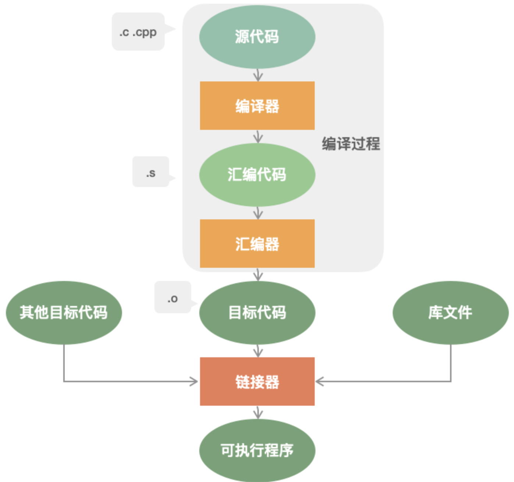

# C++ 程序编译过程
编译过程分为四个过程：编译（编译预处理、编译、优化），汇编，链接。

## 编译预处理
编译预处理：处理以 # 开头的指令，产生 .i 文件；
主要的处理操作如下：
- 对全部的#define进行宏展开。
- 处理全部的条件编译指令，比方#if、#ifdef、#elif、#else、#endif;
- 处理 #include 指令，这个过程是递归的，也就是说被包括的文件可能还包括其它文件;
- 删除全部的注释 // 和 /**/
- 加入行号和文件标识
- 保留全部的 #pragma 编译器指令

ps:经过预处理后的 .i 文件不包括任何宏定义，由于全部的宏已经被展开。而且包括的文件也已经被插入到 .i 文件里。

## 编译、优化
编译、优化：将源码 .cpp 文件翻译成 .s 汇编代码；
- 词法分析：将源代码的字符序列分割成一系列的记号。
- 语法分析：对记号进行语法分析，产生语法树。
- 语义分析：判断表达式是否有意义。
- 代码优化：
- 目标代码生成：生成汇编代码。
- 目标代码优化：

编译会将源代码由文本形式转换成机器语言，编译过程就是把预处理完的文件进行一系列词法分析、语法分析、语义分析以及优化后生成相应的汇编代码文件。编译后的.s是ASCII码文件。

## 汇编
汇编：将汇编代码 .s 翻译成机器指令的 .o 或.obj 目标文件；
- 汇编过程调用汇编器AS来完成，是用于将汇编代码转换成机器可以执行的指令，每一个汇编语句几乎都对应一条机器指令。
- 汇编后的.o文件是纯二进制文件。

## 链接
链接：产生 .out 或 .exe 可运行文件

汇编程序生成的目标文件，即 .o 文件，并不会立即执行，因为可能会出现：.cpp 文件中的函数引用了另一个 .cpp文件中定义的符号或者调用了某个库文件中的函数。那链接的目的就是将这些文件对应的目标文件连接成一个整体，从而生成可执行的程序 .exe文件。

详细来说，链接是将所有的.o文件和库（动态库、静态库）链接在一起，得到可以运行的可执行文件（Windows的.exe文件或Linux的.out文件）等。它的工作就是把一些指令对其他符号地址的引用加以修正。链接过程主要包括了地址和空间分配、符号决议和重定向。

最基本的链接叫做静态链接，就是将每个模块的源代码文件编译、汇编成目标文件（Linux：.o 文件；Windows：.obj文件），然后将目标文件和库一起链接形成最后的可执行文件（.exe或.out等）。库其实就是一组目标文件的包，就是一些最常用的代码变异成目标文件后打包存放。最常见的库就是运行时库，它是支持程序运行的基本函数的集合。

链接分为两种：静态链接 动态链接

### 静态链接
静态链接：代码从其所在的静态链接库中拷贝到最终的可执行程序中，在该程序被执行时，这些代码会被装入到该进程的虚拟地址空间中。

把目标程序运行时需要调用的函数代码直接链接到了生成的可执行文件中，程序在运行的时候不需要其他额外的库文件，且就算你去静态库把程序执行需要的库删掉也不会影响程序的运行，因为所需要的所有东西已经被链接到了链接阶段生成的可执行文件中。

Windows下以.lib为后缀，Linux下以.a为后缀。

### 动态链接
动态链接：代码被放到动态链接库或共享对象的某个目标文件中，链接程序只是在最终的可执行程序中记录了共享对象的名字等一些信息。在程序执行时，动态链接库的全部内容会被映射到运行时相应进行的虚拟地址的空间。

动态 “动” 在了程序在执行阶段需要去寻找相应的函数代码，即在程序运行时才会将程序安装模块链接在一起

具体来说，动态链接就是把调⽤的函数所在⽂件模块（DLL ）和调⽤函数在⽂件中的位置等信息链接进目标程序，程序运⾏的时候再从 DLL 中寻找相应函数代码，因此需要相应 DLL ⽂件的⽀持 。（Windows）

包含函数重定位信息的文件，在Windows下以.dll为后缀，Linux下以.so为后缀。

### 二者的区别
静态链接是将各个模块的obj和库链接成**一个完整的可执行程序**；
动态链接是程序在运行的时候寻找动态库的函数符号（重定位），即**DLL不必被包含在最终的exe文件中**；

1. 链接使用工具不同:
- 静态链接由称为“链接器”的工具完成；
- 动态链接由操作系统在程序运行时完成链接；

2. 库包含限制：
- 静态链接库中不能再包含其他的动态链接库或者静态库；
- 动态链接库中还可以再包含其他的动态或静态链接库。

3. 运行速度：
- 静态链接运行速度快（因为执行过程中不用重定位），可独立运行
- 动态链接运行速度慢、不可独立运行

4. 二者的优缺点：
- 静态链接：浪费空间，每个可执行程序都会有目标文件的一个副本，这样如果目标文件进行了更新操作，就需要重新进行编译链接生成可执行程序（更新困难）；优点就是执行的时候运行速度快，因为可执行程序具备了程序运行的所有内容。
- 动态链接：节省内存、更新方便，但是动态链接是在程序运行时，每次执行都需要链接，相比静态链接会有一定的性能损失。