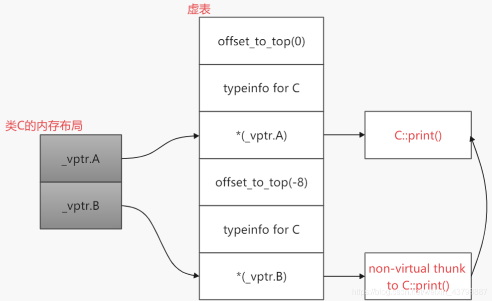

# 强制类型转换

## C风格的强制类型转换

C风格的强制类型转换很容易理解，不管什么类型都可以直接进行转换，使用格式如下：

```c++
Type b = (Type)a;
```

当然，C++也是支持C风格的强制类型转换的，但是C风格的强制类型转换可能会带来一些隐患，出现一些难以察觉的问题，所以C++又推出了四种新的强制类型转换来替代C风格的强制类型转换，降低使用风险。

## C++风格的强制类型转换

在C++中新增了四个关键字 ``static_cast``、``const_cast``、``reinterpret_cast``和 ``dynamic_cast``，用于支持C++风格的强制类型转换。这几个看起来有点像类模板，但事实上他们是正儿八经的关键字。C++风格的强制类型转换的好处是它们能更清晰的表明它们要干什么，程序员只要扫一眼这样的代码，就能立即知道一个强制转换的目的，并且在多态场景也只能使用C++风格的强制类型转换。

- static_cast：用于数据的强制类型转换，强制将一种数据类型转换为另一种数据类型。
  1. 用于基本数据类型的转换。
  2. 用于类层次之间的基类和派生类之间 指针或者引用 的转换（不要求必须包含虚函数，但必须是有相互联系的类），进行上行转换（派生类的指针或引用转换成基类表示）是安全的；进行下行转换（基类的指针或引用转换成派生类表示）由于没有动态类型检查，所以是不安全的，最好用 dynamic_cast 进行下行转换。
  3. 可以将空指针转化成目标类型的空指针。
  4. 可以将任何类型的表达式转化成 void 类型。

- const_cast：强制去掉常量属性，不能用于去掉变量的常量性，只能用于去除指针或引用的常量性，将常量指针转化为非常量指针或者将常量引用转化为非常量引用（注意：表达式的类型和要转化的类型是相同的）。

- reinterpret_cast：改变指针或引用的类型、将指针或引用转换为一个足够长度的整型、将整型转化为指针或引用类型。

- dynamic_cast：
  1. 其他三种都是编译时完成的，动态类型转换是在程序运行时处理的，运行时会进行类型检查。
  2. 只能用于带有虚函数的基类或派生类的指针或者引用对象的转换，转换成功返回指向类型的指针或引用，转换失败返回 NULL；不能用于基本数据类型的转换。
  3. 在向上进行转换时，即派生类类的指针转换成基类类的指针和 static_cast 效果是一样的，（注意：这里只是改变了指针的类型，指针指向的对象的类型并未发生改变）。
  4. 在下行转换时，基类的指针类型转化为派生类类的指针类型，只有当要转换的指针指向的对象类型和转化以后的对象类型相同时，才会转化成功。

### static_cast

``static_cast``是最常用的C++风格的强制类型转换，主要是为了执行那些较为合理的强制类型转换，使用格式如下：

```cpp
static_cast<type_id>(expression);
```

因为 ``static_cast``的使用范围比较广，而且限制也比较多，所以下面分小节对各个场景进行分析

#### 1.用于基本内置数据类型之间的转换
   ``static_cast``可以用于基本内置数据类型之间的转换，比如把 ``char``转成 ``float``、``double``转换成 ``long``等，这种内置类型之间的转换往往可以由隐式转换自动执行，而不需要人工特地去执行强制类型转换。由于转换结果可能存在截断性，这种转换的安全性要由开发人员来保证（一般不会出现严重程序运行错误，但是可能会出现逻辑错误），编译器可能会适当打印警告信息。示例如下：

```c++
#include <iostream>

int main(int argc, char* argv[])
{
    char type_char = 'A';
    float type_float = type_char; // 隐式转换也可以
    float type_float_cast = static_cast<float>(type_char); // 显式地使用static_cast进行强制类型转换

    double type_double = 1.23;
    long type_long = type_double; // 隐式转换也可以
    long type_long_cast = static_cast<long>(type_double); // 显式地使用static_cast进行强制类型转换
}
```

#### 2.用于指针之间的转换
   ``static_cast``可以用于指针之间的转换，这种转换类型检查非常严格，不同类型的指针是直接不给转的，除非使用 ``void*``作为中间参数，我们知道隐式转换下 ``void*``类型是无法直接转换为其它类型指针的，这时候就需要借助 ``static_cast``来转换了。示例如下：

```cpp
#include <iostream>

int main(int argc, char* argv[])
{
    int type_int = 10;
    float* float_ptr1 = &type_int; // int* -> float* 隐式转换无效
    float* float_ptr2 = static_cast<float*>(&type_int); // int* -> float* 使用static_cast转换无效
    char* char_ptr1 = &type_int; // int* -> char* 隐式转换无效
    char* char_ptr2 = static_cast<char*>(&type_int); // int* -> char* 使用static_cast转换无效

    void* void_ptr = &type_int; // 任何指针都可以隐式转换为void*
    float* float_ptr3 = void_ptr; // void* -> float* 隐式转换无效
    float* float_ptr4 = static_cast<float*>(void_ptr); // void* -> float* 使用static_cast转换成功
    char* char_ptr3 = void_ptr; // void* -> char* 隐式
  
    转换无效
    char* char_ptr4 = static_cast<char*>(void_ptr); // void* -> char* 使用static_cast转换成功
}
借助void*和static_cast，将一个不同类型的指针指向不同类型的对象。
任何类型 -> void* -> static_cast<类型*>
```

> 补充说明：static_cast是直接不允许不同类型的"引用"进行转换的，因为没有void类型引用可以作为中间介质，这点和指针是有相当大区别的

#### 3.不能转换掉expression的const或volitale属性
   static_cast不能转换掉expression的const或volitale属性。示例如下：

```cpp
#include <iostream>

int main(int argc, char* argv[])
{
    int temp = 10;

    const int* a_const_ptr = &temp;
    int* b_const_ptr = static_cast<int*>(a_const_ptr); // const int* -> int* 无效

    const int a_const_ref = 10;
    int& b_const_ref = static_cast<int&>(a_const_ref); // const int& -> int& 无效

    volatile int* a_vol_ptr = &temp;
    int* b_vol_ptr = static_cast<int*>(a_vol_ptr); // volatile int* -> int* 无效

    volatile int a_vol_ref = 10;
    int& b_vol_ref = static_cast<int&>(a_vol_ref); // volatile int& -> int& 无效
}
```

#### 4.用于类实例的之间转换

```cpp
#include <iostream>

class A
{
public:
    int a;
};

class B
{
public:
    int b;
};

class C : public A, public B // C公有继承A 和 B
{
public:
    int c;
};

int main(int argc, char* argv[])
{
    C c;
    A a = static_cast<A>(c); // 上行转换正常,将派生类转化为基类
    B b = static_cast<B>(c); // 上行转换正常

    C c_a = static_cast<C>(a); // 下行转换无效,将基类转化为派生类
    C c_b = static_cast<C>(b); // 下行转换无效
}
```

从测试程序中可以看到如果对类实例使用static_cast进行转换，static_cast是会进行类型判断的，对于上行转换来说这个过程就是正常的（其实任何合法的上行转换都可以直接由隐式转换来完成，而不需要手工去强制类型转换），但是下行转换则不行，static_cast认为下行转换等同于两个无关联的类进行转换，会报错。但是这个错误是有解决方法的，我们从报错信息中可以看到当static_cast转换失败时，会使用expression作为传入参数来调用type_id的构造函数，所以我们可以把类C改成以下形式，上面的示例即可编译通过

```cpp
class C : public A, public B
{
public:
    C()
    {
    }

    C(const A& v)   // 在类C中构造一个使用对象A为参数的构造函数
    {
        a = v.a;
    }

    C(const B& v)   // 在类C中构造一个使用对象B为参数的构造函数
    {
        b = v.b;
    }

    int c;
};
```

综上，我们可以得出使用 ``static_cast``对类实例进行强制类型转换时有以下特点：
(1)进行上行转换是完全安全合法的，当然这个过程由隐式转换来完成也是合法的。
(2)进行下行转换时，static_cast会认为两个类无关联，这种转换不合法。如果此时硬要转换的话，比如类A->类B（这两个类可以无任何关系，因为实例下行转换static_cast就是认为他们没关联），可以在B中添加一个使用类A进行构造的构造函数，比如B(const A&)，这样就可以正常使用static_cast来进行类A->类B的操作了

#### 5.用于没有多态的类实例指针或引用之间的转换
进行上行转换的示例如下：

```cpp
#include <iostream>

class A
{
public:
    int a;
};

class B
{
public:
    int b;
};

class C : public A, public B
{
public:
    int c;
};

int main(int argc, char* argv[])
{
    C c;

    A* a_ptr = static_cast<A*>(&c); // 上行指针转换正常
    B* b_ptr = static_cast<B*>(&c); // 上行指针转换正常
    A& a_ref = static_cast<A&>(c);  // 上行引用转换正常
    B& b_ref = static_cast<B&>(c);  // 上行引用转换正常
}
```

可以看到上行转换都是正常的，转换过程中不会出现任何显性和隐性错误，下面来看一下下行转换的示例：

```cpp
int main(int argc, char* argv[])
{
    C c;
    A* a_ptr = static_cast<A*>(&c);
    B* b_ptr = static_cast<B*>(&c);
    A& a_ref = static_cast<A&>(c);
    B& b_ref = static_cast<B&>(c);

    C* c_ptra = static_cast<C*>(a_ptr); // 下行指针转换正常
    C* c_ptrb = static_cast<C*>(b_ptr); // 下行指针转换正常
    C& c_refa = static_cast<C&>(a_ref); // 下行引用转换正常
    C& c_refb = static_cast<C&>(b_ref); // 下行引用转换正常

    A* a_ptr_fail = static_cast<A*>(b_ptr); // B* -> A*，无关联的两个类型，无效
}
```

从上面的例子可以看到，下行转换也是正常的，并且static_cast也会拒绝掉两个无关联类之间的转换？？？这和书中说的不一样啊，不是说static_cast下行转换不安全吗？别急，上面的例子是片面的，各位看一下下面的代码就知道了

```cpp
int main(int argc, char* argv[])
{
    A a;
    B b;

    // 以下都能转换成功，说明static_cast根本就没有安全检查，只看到有继承关系就给转换了
    C* c_ptra = static_cast<C*>(&a);
    C* c_ptrb = static_cast<C*>(&b);
    C& c_refa = static_cast<C&>(a);
    C& c_refb = static_cast<C&>(b);
}
```

综上，我们可以得出使用static_cast对没有多态的类实例指针或引用进行强制类型转换时有以下特点：
(1)进行上行转换（派生类指针->基类指针、派生类引用->基类引用）是完全安全的，没有任何问题，当然这个过程由隐式转换来完成也是合法的
(2)进行下行转换（基类指针->派生类指针、基类引用->派生类引用）由于缺乏安全检查，所以是有问题的，要尽量避免这种用法。
(3)如果两个类无继承关系，则使用static_cast进行转换时会失败，但是这种情况下static_cast会显性地展示出错误信息，是安全的。

#### 6.用于具有多态的类实例指针或引用之间的转换
   进行上行转换的示例如下：

```cpp
#include <iostream>

class A
{
public:
    virtual void print()    // 虚函数print()
    {
        std::cout << "A" << std::endl;
    }
};

class B
{
public:
    virtual void print()    // 虚函数print()
    {
        std::cout << "B" << std::endl;
    }
};

class C : public A, public B    // 类c公开继承A和B
{
public:
    virtual void print() override   // 
    {
        std::cout << "C" << std::endl;
    }
};

int main(int argc, char* argv[])
{
    C c;

    A* a_ptr = static_cast<A*>(&c); // 上行指针转换正常
    B* b_ptr = static_cast<B*>(&c); // 上行指针转换正常
    a_ptr->print();                 // 输出C，符合多态的要求
    b_ptr->print();                 // 输出C，符合多态的要求

    A& a_ref = static_cast<A&>(c); // 上行引用转换正常
    B& b_ref = static_cast<B&>(c); // 上行引用转换正常
    a_ref.print();                 // 输出C，符合多态的要求
    b_ref.print();                 // 输出C，符合多态的要求
}
```

可以看到上行转换都是正常的，转换过程中不会出现任何显性和隐性错误，下面来看一下正常的下行转换的示例：

```cpp
int main(int argc, char* argv[])
{
    C c;
    A* a_ptr = static_cast<A*>(&c);
    B* b_ptr = static_cast<B*>(&c);
    A& a_ref = static_cast<A&>(c);
    B& b_ref = static_cast<B&>(c);

    C* c_ptra = static_cast<C*>(a_ptr); // 下行指针转换正常
    C* c_ptrb = static_cast<C*>(b_ptr); // 下行指针转换正常
    c_ptra->print(); // 输出C，符合多态的要求
    c_ptrb->print(); // 输出C，符合多态的要求

    C& c_refa = static_cast<C&>(a_ref); // 下行引用转换正常
    C& c_refb = static_cast<C&>(b_ref); // 下行引用转换正常
    c_refa.print(); // 输出C，符合多态的要求
    c_refb.print(); // 输出C，符合多态的要求
}
```

```cpp
int main(int argc, char* argv[])
{
    A a;
    B b;

    C* c_ptra = static_cast<C*>(&a);    // 指针向下转换
    C* c_ptrb = static_cast<C*>(&b);    // 指针向下转换
    c_ptra->print(); // 正常输出A
    c_ptrb->print(); // 段错误

    C& c_refa = static_cast<C&>(a);     // 类型向下转换
    C& c_refb = static_cast<C&>(b);     // 类型向下转换
    c_refa.print(); // 正常输出A
    c_refb.print(); // 段错误
}
```

上面这个例子中的下行转换是错误的，但是通过c_ptra可以正常调用类A的print()方法打印出字母A来，使用c_ptrb就直接段错误了，原因是类A是第一个被继承的，类B是第二个被继承的，也就是在类C中，第一个虚表指针指向的就是类A的虚表，第二个虚表指针指向的就是类B的虚表。在上面的例子那样进行错误地转换时，由于类A被继承之后它位置的特殊性导致可以使用c_ptra正确地调用类A的print()方法，而类B则不行，可能这有点难理解，下面给大家看张图就明白了，如图2-1所示：

从图2-1中可以看出，对于类C来说，它始终调用着_vptr.A指向的print()方法，当我们使用纯类B类型进行下行转换时，根本就没有这一块的数据（这个转换是不完整的、不安全的），所以就会出现段错误了。当然，使用纯类A类型进行下行转换也是不完整、不安全的，只不过位置刚好才不会出现段错误而已。综合分析上面的代码是完全错误的，一定要杜绝写出这种垃圾代码。

综上，我们可以得出使用static_cast对具有多态的类实例指针或引用进行强制类型转换时有以下特点：
(1)进行上行转换（派生类指针->基类指针、派生类引用->基类引用）是完全安全的，没有任何问题，当然这个过程由隐式转换来完成也是合法的。
(2)进行下行转换（基类指针->派生类指针、基类引用->派生类引用）由于缺乏安全检查，所以是有问题的，并且因为具有多态的类往往具有特殊的用法，所以在这种情况下产生的后果比前面没有多态情况下的要更严重，要尽量避免这种用法。

#### 7.小结
   通过上面的介绍，我们可以很直观地看到static_cast相比C风格的强制类型转换要安全很多，有很大程度上的类型安全检查。本节我们所有的例子都可以使用C风格的强制类型转换去做，但是转出来的结果有可能会错到天际去，并且编译器不会给你任何报错信息。。。同时我们也要认识到static_cast也是有明显缺点的，那就是无法消除const和volatile属性、无法直接对两个不同类型的指针或引用进行转换和下行转换无类型安全检查等，不过没关系，其它三个强制类型转换的关键字刚好能弥补static_cast的这些缺点。

### const_cast--指针和引用

``const_cast``的作用是去除掉指向常量对象的指针或引用的常量(只读)性 ``const``或 ``volitale``属性，前面介绍 ``static_cast``的时候我们知道 ``static_cast``是不具备这种功能的。使用格式如下：

```cpp
const_cast<type_id>(expression);
```

> 注意事项：const_cast不是用于去除变量的常量性，而是去除指向常量对象的指针或引用的常量性，其去除常量性的对象必须为指针或引用，并且const_cast不支持不同类型指针或引用之间的转换，比如说float*转换成int*是不允许的，直白一点说就是type_id和expression要基本类型保持一致，相差的话只能差const或volatile属性。

先来看一个错误的使用示例：

```cpp
#include <iostream>

int main(int argc, char* argv[])
{
    int type_int = 100;
    float type_float = const_cast<float>(type_int);        // 错误，const_cast只能转换引用或者指针
    float* type_float_ptr = const_cast<float*>(&type_int); // 错误，从int* -> float* 无效
    float& type_float_ref = const_cast<float&>(type_int);  // 错误，从int& -> float& 无效
}
```

再来看一个不太正确的使用示例：

```cpp
#include <iostream>

int main(int argc, char* argv[])
{
    const int type_const_int = 100;
    int* type_const_int_ptr = const_cast<int*>(&type_const_int); // 转换正确
    int& type_const_int_ref = const_cast<int&>(type_const_int);  // 转换正确
  
    *type_const_int_ptr = 10;
    std::cout << *type_const_int_ptr << std::endl; // 输出10
    std::cout << type_const_int << std::endl;      // 输出100，没有改变

    type_const_int_ref = 20;
    std::cout << type_const_int_ref << std::endl; // 输出20
    std::cout << type_const_int << std::endl;     // 输出100，没有改变

    // 以下三个输出结果一致，说明const_cast确实只是去除了一些属性，并没有重新搞快内存把需要转换的变量给复制过去
    std::cout << "&type_const_int:\t" << &type_const_int << std::endl;
    std::cout << "type_const_int_ptr:\t" << type_const_int_ptr << std::endl;
    std::cout << "&type_const_int_ref:\t" << &type_const_int_ref << std::endl;
}
```

在上面这个例子中，转换是成功了，但是type_const_int的常量性并没有被改变，这是因为const_cast并没有办法把变量的常量性去除，而且比较有意思的是我们可以看到type_const_int对应地址的内容确实被改变了，但是type_const_int的值却并没有被改变，这是好事，因为从一开始我们把它定义为常量类型时这个值就不应该再被改变了。至于后面使用type_const_int_ptr和type_const_int_ref试图去改变type_const_int的值，这是很危险的做法，不同编译器可能会有不同的处理，是有可能出现严重错误的，要杜绝这种用法。


常量折叠:

由于type_const_int被const修饰，并被初始化为100，编译器在编译优化过程中发现type_const_int的值是可预知的，并被const修饰。之后所有使用type_const_int变量的地方，都可以用预知值替换。因此，编译阶段，cout << "type_const_int =" << type_const_int <<endl;中的type_const_int变量就直接被100替换了。所以后面对type_const_int变量值的修改，其内存中值是被改变了的，但编译阶段提前被替换的type_const_int始终为数值100。

const修饰的变量，其本质还是变量，还是可以修改的。

那么我们怎么才能防止这么常量折叠呢？

一种方法就是，定义为非const变量。

另一种方法就是，加volatile进行修饰。（感觉有点多此一举了，既然定义为const，我们的目的就是不随意修改它）。


从这里看起来const_cast好像有点鸡肋。。。但是事实上不是这样的，在某些场景下const_cast还是挺好用的，比如下面这个例子：

```cpp
#include <iostream>

void fun(const int& v)
{
    int& type_int_ref = const_cast<int&>(v);
    type_int_ref = 10;
}

int main(int argc, char* argv[])
{
    int type_int = 100;

    fun(type_int);
    std::cout << type_int << std::endl; // 输出10，改变了
}
```

上面的例子比较粗糙，但是大致上也就是这么个用法了。如果一个变量本来就不具备const属性，但是在传递过程中被附加了const属性，这时候使用const_cast就能完美清除掉后面附加的那个const属性了。
当然，因为const_cast的这种特殊性，它的应用范围是远不如static_cast广泛的，但是在标准库中还是能找到一些使用const_cast的例子的，比如“著名的”std::addressof在源码实现中就有借助const_cast作为中间层来消除参数的const和volatile属性，具体大家可以看一下这篇文章《C++11的std::addressof源码解析》。

### reinterpret_cast

- 为了让编译器强制接受static_cast不允许的类型转换

reinterpret_cast意为“重新解释”，它是C++中最接近于C风格强制类型转换的一个关键字。它让程序员能够将一种对象类型转换为另一种，不管它们是否相关。使用格式如下：
reinterpret_cast<type_id>(expression);

1. 注意事项如下：
   1. type-id和expression中必须有一个是指针或引用类型（可以两个都是指针或引用，指针引用在一定场景下可以混用，但是建议不要这样做，编译器也会给出相应的警告）。
   2. reinterpret_cast的第一种用途是改变指针或引用的类型
   3. reinterpret_cast的第二种用途是将指针或引用转换为一个整型，这个整型必须与当前系统指针占的字节数一致
   4. reinterpret_cast的第三种用途是将一个整型转换为指针或引用类型
   5. 可以先使用reinterpret_cast把一个指针转换成一个整数，再把该整数转换成原类型的指针，还可以得到原先的指针值（由于这个过程中type-id和expression始终有一个参数是整形，所以另一个必须是指针或引用，并且整型所占字节数必须与当前系统环境下指针占的字节数一致）
   6. 使用reinterpret_cast强制转换过程仅仅只是比特位的拷贝，和C风格极其相似（但是reinterpret_cast不是全能转换，详见第1点），实际上reinterpret_cast的出现就是为了让编译器强制接受static_cast不允许的类型转换，因此使用的时候要谨而慎之
   7. reinterpret_cast同样也不能转换掉expression的const或volitale属性。
      先来看一个错误的使用示例：

```c++
#include <iostream>

class A
{
public:
    int a;
};

class B
{
public:
    int b;
};

int main(int argc, char* argv[])
{
    float type_float = 10.1;
    int type_int = reinterpret_cast<int>(type_float); // 出错，type-id和expression中必须有一个是指针或者引用（注意事项第1点）
    char type_char = reinterpret_cast<char>(&type_float); // 出错，我的是64位系统，这里type-id只能是long类型（注意事项第3点）
    double* type_double_ptr = reinterpret_cast<double*>(type_float); // 出错，这里expression只能是整型（注意事项第4点）

    A a;
    B b;
    long type_long = reinterpret_cast<long>(a); // 出错，type-id和expression中必须有一个是指针或者引用（注意事项第1点）
    B b1 = reinterpret_cast<B>(a); // 出错，type-id和expression中必须有一个是指针或者引用（注意事项第1点）
    A a1 = reinterpret_cast<A>(&b); // 出错，B* -> A不允许，我的是64位系统，type-id只能是long（注意事项第3点）
    A* a_ptr = reinterpret_cast<A*>(b); // 出错，这里expression只能是整型（注意事项第4点）
}
```

下面再来看正确的使用示例：

```cpp
#include <iostream>

class A
{
public:
    int a;
};

class B
{
public:
    int b;
};

int main(int argc, char* argv[])
{
    float type_float = 10.1;

    long type_long = reinterpret_cast<long>(&type_float); // 正确，float* -> long（注意事项第3点）

    float* type_float_ptr = reinterpret_cast<float*>(type_long); // 正确，long -> float*（注意事项第4点）
    std::cout << *type_float_ptr << std::endl; // 正确，仍然输出10.1（注意事项第5点）

    long* type_long_ptr = reinterpret_cast<long*>(&type_float); // 正确，float* -> long*（注意事项第1点）
  
    char type_char = 'A';
    double& type_double_ptr = reinterpret_cast<double&>(type_char); // 正确，char -> double&（注意事项第4点）

    A a;
    B b;
    long a_long = reinterpret_cast<long>(&a); // 正确，A* -> long（注意事项第3点）
    A* a_ptr1 = reinterpret_cast<A*>(type_long); // 正确，long -> A*（注意事项第4点）
    A* a_ptr2 = reinterpret_cast<A*>(&b); // 正确，B* -> A*（注意事项第1点）
}
```

程序中写的比较清楚了，大家配合前面的注意事项去看就行了，很容易就可以看懂了。reinterpret_cast的一个典型使用也是标准库的std::addressof，具体大家可以看一下这篇文章《C++11的std::addressof源码解析》。

### dynamic_cast

``dynamic_cast``是本文讲的最后一个C++风格强制类型转换了，也是最特殊的一个，前面三种都是编译时完成的，而 ``dynamic_cast``是运行时处理的，使用格式如下：

```c++
dynamic_cast<type_id>(expression);
```

注意事项如下：

1. dynamic_cast是运行时处理的，运行时会进行类型检查（这点和static_cast差异较大）
2. dynamic_cast不能用于内置基本数据类型的强制转换，并且dynamic_cast只能对指针或引用进行强制转换
3. dynamic_cast如果转换成功的话返回的是指向类的指针或引用，转换失败的话则会返回nullptr
4. 使用dynamic_cast进行上行转换时，与static_cast的效果是完全一样的
5. 使用dynamic_cast进行下行转换时，dynamic_cast具有类型检查的功能，比static_cast更安全。并且这种情况下dynamic_cast会要求进行转换的类必须具有多态性（即具有虚表，直白来说就是有虚函数或虚继承的类），否则编译不通过
6. 需要有虚表的原因：类中存在虚表，就说明它有想要让基类指针或引用指向派生类对象的情况，dynamic_cast认为此时转换才有意义（事实也确实如此）。而且dynamic_cast运行时的类型检查需要有运行时类型信息，这个信息是存储在类的虚表中的
7. 在C++中，编译期的类型转换有可能会在运行时出现错误，特别是涉及到类对象的指针或引用操作时，更容易产生错误。dynamic_cast则可以在运行期对可能产生问题的类型转换进行测试

先来看一个错误的使用示例：

```cpp
#include <iostream>

class A
{
public:
    void print()
    {
        std::cout << "A" << std::endl;
    }
};

class B
{
public:
    void print()
    {
        std::cout << "B" << std::endl;
    }
};

class C : public A, public B
{
public:
    void print()
    {
        std::cout << "C" << std::endl;
    }
};

int main(int argc, char* argv[])
{
    C c;
    A* a_ptr = dynamic_cast<A*>(&c); // 成功，上行转换没有任何要求（注意事项第4点）
    B* b_ptr = dynamic_cast<B*>(&c); // 成功，上行转换没有任何要求（注意事项第4点）

    A a = dynamic_cast<A>(c); // 错误，dynamic_cast无法用于转换类实例（注意事项第2点）

    C* c_ptra = dynamic_cast<C*>(a_ptr); // 错误，类C不具备多态，无法进行下行转换（注意事项第5点）
    C* c_ptrb = dynamic_cast<C*>(b_ptr); // 错误，类C不具备多态，无法进行下行转换（注意事项第5点）
}
```

从上面的例子中可以看到，dynamic_cast是无法对实例进行转换的，并且dynamic_cast进行下行转换时是需要对应的类拥有多态性的，这两点和static_cast是有区别，当然这些不是最重要的区别，下面我们再来看一个例子：

```c++
#include <iostream>

class A
{
public:
    virtual void print()
    {
        std::cout << "A" << std::endl;
    }
};

class B
{
public:
    virtual void print()
    {
        std::cout << "B" << std::endl;
    }
};

class C : public A, public B
{
public:
    virtual void print()
    {
        std::cout << "C" << std::endl;
    }
};

int main(int argc, char* argv[])
{
    C c;

    // 第一组
    A* a_ptr = dynamic_cast<A*>(&c);
    B* b_ptr = dynamic_cast<B*>(&c);
    C* c_ptra = dynamic_cast<C*>(a_ptr); // 成功，类C具备多态性，可以使用dynamic_cast进行下行转换
    C* c_ptrb = dynamic_cast<C*>(b_ptr); // 成功，类C具备多态性，可以使用dynamic_cast进行下行转换
    // 以下输出内容一致
    std::cout << &c << std::endl;
    std::cout << c_ptra << std::endl;
    std::cout << c_ptra << std::endl;

    // 第二组
    A a;
    B b;
    C* c_ptra1 = dynamic_cast<C*>(&a); // 编译正常（好的编译器会给你个警告），转换结果为nullptr，说明转换失败
    C* c_ptrb1 = dynamic_cast<C*>(&b); // 编译正常（好的编译器会给你个警告），转换结果为nullptr，说明转换失败
    // 以下输出内容一致，都是0，说明c_ptra1和c_ptrb1都是nullptr
    std::cout << c_ptra1 << std::endl;
    std::cout << c_ptrb1 << std::endl;
}
```

从上面的例子中可以看出以下几点信息：

- 对于第一组来说，因为这一组的下行转换是安全的（因为a_ptr和b_ptr本来就是类C的指针类型转换过去的），所以对于这种情况static_cast和dynamic_cast是一样的，都可以正常使用。
- 对于第二组来说，这个是一个错误使用的示例，我们之前也有用static_cast做过同样的实验（忘了的话可以翻回去2.1.3小节看一下），当时使用static_cast进行这种错误的下行转换时是一点问题没有的，可以转换成功，甚至可以使用一下（当然这是极其糟糕的行为），而现在使用dynamic_cast来转换则不同了，虽然编译也可以通过，但是它返回的结果是一个空指针，这就可以在运行时提示我们转换不合法了。

### 总结

本文讲解了C++中存在的五种强制类型转换，其中C风格的只是一笔带过而已，重点讲的是C++中新增的四种强制类型转换，文中也有对它们各自的优点和缺点进行解析。整体来说C++增加的这几种强制类型转换相比C风格的更加安全，所以在编写C++代码时还是尽量使用它们替换C风格的强制类型转换吧。
