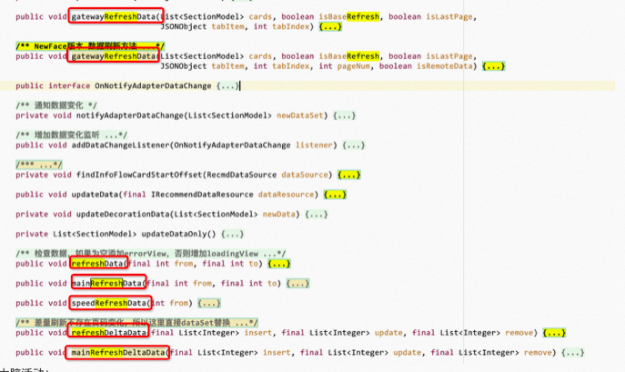

# 命名

你可不能像给狗狗取名字那样给类、方法、变量命名。仅仅因为它很可爱或者听上去不错。

在写代码的时候，你要经常想着，那个最终维护你代码的人可能将是一个有暴力倾向的疯子，并且他还知道你住在哪里。

## 一、为什么命名很重要？

在项目中，从项目的创建到方法的实现，每一步都以命名为起点，我们需要给变量、方法、参数、类命名，这些名字出现在代码的每个角落，随处可见，混乱或错误的命名不仅让我们对代码难以理解，更糟糕的是，会误导我们的思维，导致对代码的理解完全错误。如果整个项目始终贯穿着好的命名，就能给阅读者一个神清气爽的开始，也能给阅读者一个好的指引。
要知道，代码的阅读次数远远多于编写的次数。请确保你所取的名字更侧重于阅读方便而不是编写方便。

## 二、为什么很难正确命名？

有人称编程中最难的事情就是命名。我同样深以为然，中国有句古话叫做万事开头难。抛开环境搭建，真正到了编码阶段第一件事就是命名，而最常见的一种情况，就是毫无目的、仅凭个人的喜好的去决定了一个名字。但因为没有想清楚目标和具体实施步骤，所以进行过程中往往会面临无数次的小重构甚至是推倒重来。

### 1、缺乏意愿

害怕在选择名字上花时间，对做好命名的意愿不足，随心所欲，甚至无视团队对命名的基本规范，觉得编译器能编译通过，代码能正常运行就成。
其实对发现的命名问题进行重构和推倒重来并不可怕，最可怕的是当下程序员不具备发现问题后肯回过头来纠偏的意愿。这终将演变成为一场灾难。

### 2、缺乏思考

没想清楚被命名的事物是什么，事物应该承担什么职责，是否会对其他人造成误解。
新手程序员总会花很多时间学习一门编程语言、代码语法、技术和工具。他们觉得如果掌握了这些东西，就能成为一个好程序员。然而事实并不是这样，事实上，编程不仅仅关乎掌握技能和工具，更重要的是在特定范畴内解决问题的能力，还有和其他程序员合作的能力。因此，能在代码中准确的表达自己的想法就变得异常重要，代码中最直观的表达方式是命名，其次是注释。

### 3、缺乏技巧

选一个好的名字真很难，你可能得有较高的描述能力和共同的文化背景。并且知晓一些常见且应该避免的命名问题。
如果最终还是没法找到合适的名字，还请添加准确的注释辅助他人理解，等想到合适的名字后再进行替换，不过往往能够通过注释（母语）描述清楚的事物，命名应该问题不大，问题大的是连注释都无法准确表达，那说明可能当前类、函数、变量承担的职责太多太杂。

## 三、如何正确的命名？

这里不讨论具体语言的命名规则，原因是不同编程语言命名规则各不相同，甚至不同团队间相同语言的命名规则也有出入。这里主要从提高可读性出发，结合我所在的客户端团队日常开发情况，以Java作为演示语言，给一些关于命名的建议。

### 1、名副其实

无论是变量、方法、或者类，在看到他名称的时候应该以及答复了所有的大问题，它应该告诉你，它为什么会存在，他做什么事，应该怎么做。如果在看到名称时，还需要去查找注释来确认自己的理解，那就不算名副其实。而且在发现有更好的命名时，记得果断替换。
Case1：到底怎样算End?
代码示例：

```java
public interface OnRequestListener {
/**
 * 请求结束 只有成功点才认为是真正的结束
 * @param ...
 */
void onRequestEnd(....);
/**
 * 请求开始
 * @param ...
 */
void onRequestStart(...);
}
```

大脑活动：
    onRequestEnd是请求的什么阶段？请求成功和失败任一情况都算 “end”吗？喔，原来注释有写：“只有成功点才认为是真正的结束”。
修改建议：

```java
// 省略注释
public interface OnRequestListener {
  void onStart(....);
  void onSuccess(....);
  void onFailure(...);
}
```

### 2、避免误导

在每种语言中都有内置的标识符,他们都有特定的含义，如果和他们没有关联就不要在命名中加上他们。

#### 2.1 避免使用令人误解的名字

Case1：命错名的集合
代码示例：

```java
private List<SectionModel> dataSet;
```

大脑活动：
    “dataSet” 在最初一定是为了元素去重选择了Set类型，肯定后来某一个历史时刻发现有bug被偷偷改成了List类型，但是变量名没变。
代码跟读：
    跟踪提交记录，呃，在18年被刚定义时就是 List<***> dataSet;
修改建议：

```java
private List<SectionModel> dataList;
或者
private List<SectionModel> sections;
```

Case2：不是View的View类
代码示例：

```java
/** 作者+日期 */
public class RItemOverlayView {
}
```

```java
/** 作者+日期 */
public class NRItemOverlayView {
}
```

大脑活动：
    “N”是啥意思？类名只有一个N的字母差别，难道是新旧的差别，新的和旧的有什么区别呢？
    类名以View结尾，嗯，应该是一个视图，可是，视图为啥不用继承视图基类的？
代码跟读：
    喔，N确实代表“New”的意思，NRItemOverlayView被首页推荐使用，RItemOverlayView被购后推荐使用。
    这个类主要核心工作是构建浮层视图(职责并不单一)，而类本身并不是一个真正的视图；
修改建议：

```java
// 放在首页推荐场景的包下
public class ItemOverlayViewCreator {
}
// 放在购后推荐场景的包下
public class ItemOverlayViewCreator {
}
```

Case3：整形变量为啥要用is开头
代码示例：

```java
private int isFirstEnter = 0;
```

大脑活动：
    为什么“is”开头的变量却声明成整形？到底是要计数还是判断真假呢？
    代码跟读：
    isFirstEnter < 1 做第一次进入的逻辑
修改建议：

```java
private boolean isFirstEnter = true;
```

Case4：开关作用反掉啦
代码示例：

```java
if (InfoFlowOrangeConfig.getBooleanValue(POST_DELAYED_HIDE_COVER_VIEW_ENABLE, true)) {
    hideCoverImageView();
} else {
    delayedHideCoverImageView();
}
```

大脑活动：
    为什么开关名为“delay....”为“true”的时候，走的不是delay逻辑，那开关要怎么发？容我多看几遍，是不是最近没休息好所以看岔了。
代码跟读：
    反复看了几遍，确实是开关命名和实际操作完全相反，开关名意为“延迟隐藏封面视图”，执行的却是“立即隐藏封面视图”。
修改建议：

```java
if (InfoFlowOrangeConfig.getBooleanValue(IMMEDIATELY_HIDE_COVER_VIEW_ENABLE, true)) {
hideCoverImageView();
} else {
    delayedHideCoverImageView();
}
```

### 3、做有意义的区分

如果单纯只是为了区分两个名称不能一样，就使用就使用诸如数字，字母来做区分的话，那似乎是毫无意义的区分。

#### 3.1 避免在名字中使用数字

case1: 来自包名的暴击
问题示例：
    以下是首页客户端的工程目录节选，数字化的包名：recommend、recommend2、recommend3、recommend4

```word
tao->
    homepage
    recommand
    recommand2
    recommand3
```

大脑活动：
    2、3、4难道是因为首页历史包袱太沉重，推荐迭代的版本实在太多导致Old、New单词不够用所以用数字来代替新旧4个历史阶段的版本吗？
代码跟读：
    recommend：推荐的公共工具和模块；
    recommend2：收藏夹场景的推荐实现；
    recommend3：首页场景的推荐实现；
    recommend4：购后场景的推荐实现；
修改建议：
    这里暂时只讨论如何把数字替换成有意义的命名

```word
tao->
    homepage
    recomand->
        common
        scene(场景)->
            aftersale
            favorites
            homepage
```

#### 3.2 避免使用具有相似含义的名字

case1：同一个类下的“刷新7剑客”
代码示例：

大脑活动：
    为什么一个Adapter类对外有七个刷新数据的接口？
    "refreshData()" 和 “speedRefreshData()” 是什么区别？
    “mainRefreshData()” + "refreshDeltaData()" =“mainRefreshDeltaData()” ？是一个拆分组合的关系吗？
    我应该在何总场景下如何正确的使用refresh，我在哪，我在做什么？
代码跟读：
    大部分refresh代码线上并不会被调用。阅读和调试下来，实际还在生效的方法只有一个：“gatewayRefreshData()”。
修改建议：
    实际上这已经不是一个单纯优化命名可以解决的问题，无论叫的多具体，面对7个刷新接口都会懵圈。期望在方法声明期间，作者多体量后来的阅读者和维护者，及时的调整代码。
    后来者可以从实际出发去假存真，做减法干掉其它无用的6个刷新方法保留一个刷新接口。

case2：4个数据源定义，该用谁呢
代码示例：
声明1：

```java
public interface IR4UDataSource { 
    ....
}
```

声明2：

```java
public interface RecommendIDataSource {
    ....
}
```

声明3：

```java
public interface IRecommendDataResource {
    ....
}
```

声明4：

```java
public class RecmdDataSource {
    ....
}
```

大脑活动：
    4个推荐数据源，其中有3个是接口声明，为什么接口定义了不能多态，不能复用接口的声明？这三代的抽象好像有一丢丢失败。
代码跟读：
    homepage 包下的 IR4UDataSource，和非常古老的首页曾经爱过，线上实际不会使用；
    Recommend2 包下的“RecommendIDataSource” 属于收藏夹，但也属于古老版本，收藏夹不在使用；
    Recommend3 包下的“IRecommendDataResource” 确实是首页场景推荐使用，但也是曾经的旧爱；
    原来当今的真命天子是Recommend3包下的“RecmdDataSource”，一个使用俏皮缩写未继承接口的实体类，看来是已经放弃伪装。
修改建议：
......

#### 3.3 避免使用具有不同含义但却有相似名字的变量

case1 : 大家都是view，到底谁是谁
代码示例：

```java
public void showOverlay(@NonNull View view ...) {
    ... 
    View rootView = getRootView(view);
    DxOverlayViewWidget dView = createDxOverlayViewWidget();
    dView.showOverLayer(view.getContext(), (ViewGroup)rootView, cardData, itemData);


    ...
}
```

代码跟读：
    代码中存在3个以view结尾的局部变量，rootView、view 、 dView，其中 view 和 dView 之间只有一个字母的差异，方法如果长一点，view 和 dView 使用频率在高一点，掺杂着rootView会让人抓狂。另外dView也并不是一个view，实际是个DXViewWidget。
修改建议：

```java
public void showOverlay(@NonNull View hostView ...) {
    ... 
    ViewGroup parentView = getParentView(hostView);
    DxOverlayViewWidget dxOverlayViewWidget = createDxOverlayViewWidget();
    dxOverlayViewWidget.showOverLayer(hostView.getContext(), parentView, ...);
    ...
}
```

### 4、使用读的出来的名称

使用读的出来的名称，而不是自造词，这会给你无论是记忆，还是讨论需要说明是哪个方法时，都能带来便利。可以使用达成共识的缩写，避免造成阅读障碍。

#### 4.1 避免使用令人费解的缩写

Case1：接口定义中的俏皮缩写
代码示例：

```java
/**
 * Created by *** on 16/8/6.
 */
public interface IR4UDataSource {
  ....
}
```

大脑活动：
    R4U是什么？ R4和Recommend4这个目录有什么关系，难道是购后推荐的数据源定义吗？那U又代表什么？
代码跟读：
    原来R4U是Recommend For You的俏皮写法
修改建议：

```java
public interface IRecommendForYouDataSource {
  ....
}
```

Case2：成员变量命名的缩写
代码示例：

```java
....
// 标题指示器（indicators）
private LinearLayout mTabLL;
private TabLayout mTabLayout;
....
```

大脑活动：
    “mTabLL”是什么呢？有注释！难道mTabLL是指示器视图？“LL“”也不像是indicators的缩写，喔，LL是LinearLayout的首字母缩写。嗯，使用LinearLayout自定义做成指示器有点厉害！诶，不对，好像TabLayout更像是个选项卡式指示器的样子。
代码跟读：
    原来“mTabLL” 下面声明的 “mTabLayout”才是指示器视图，“mTabLL”只是指示器视图的父视图。还好“mTabLayout”没有缩写成“mTabL”，导致和“mTabLL”傻傻分不清，作者已然是手下留情了。
修改建议：

```java
....
private LinearLayout mTabLayoutParentView;
private TabLayout mTabLayout;
....
```

Case3：局部变量命名的缩写
代码示例：

```java
....
for (PageParams.GroupBuckets ss:params.groupBucketIds.values()) {

if (ss != null) {
        bucketIds.removeAll(ss.bucketIdsAll);
        Collections.addAll(bucketIds, ss.currentBucketIds);
    }
}
....
```

大脑活动：
    "ss"是什么鬼，是不是写错了，GroupBuckets首字母缩写是“gb”，PageParams和GroupBuckets 的首字母缩写是“pg”
    这难道是，PageParams 和 GroupBuckets 的尾字母缩写，在一个圈复杂度为18的方法中看到尾字母缩写“ss”？啊！好难受。
修改建议：

```java
for (PageParams.GroupBuckets groupBuckets :params.groupBucketIds.values()) {
    if (groupBuckets != null) {
        ....
    }
}
```

### 5、使用可搜索的名称

若变量或常量可能在代码中多处使用，则应赋其以便于搜索的名称。

#### 5.1 给魔法值赐名

Case1： 数字魔法值没法搜索也看不懂
代码示例：

```java
public static void updateImmersiveStatusBar(Context context) {
  ....
    if (TextUtils.equals(isFestivalOn, "1")) {
        if (TextUtils.equals(navStyle, "0") || TextUtils.equals(navStyle, "1")) {
            ....
        } else if (TextUtils.equals(navStyle, "2")) {
            ....
        }
    }
  ....
}
```

大脑活动：
    对于TextUtils.equals(isFestivalOn, "1") ，我还能猜测一下这里的“1” 代表开关为开的意思。
    那TextUtils.equals(navStyle, "0"/"1"/"2") 中的“0”，“1”，“2” 我该如何知道代表什么意思？
    老板，请不要再问我为什么需求吞吐率不高，做需求慢了，可能是因为我的想象力不够。
修改建议：
    实际上，协议约定时就不应该以 “0”，“1”，“2” 这类无意义的数字做区分声明。

```java
public static final String FESTIVAL_ON = "1";
public static final String NAV_STYLE_FESTIVAL = "0";
public static final String NAV_STYLE_SKIN = "1";
public static final String NAV_STYLE_DARK = "2";

public static void updateImmersiveStatusBar(Context context) {
  ....
    if (TextUtils.equals(isFestivalOn, FESTIVAL_ON)) {
        if (TextUtils.equals(navStyle, NAV_STYLE_FESTIVAL) 
            || TextUtils.equals(navStyle, NAV_STYLE_SKIN)) {
            ....
        } else if (TextUtils.equals(navStyle, NAV_STYLE_DARK)) {
            ....
        }
    }
  ....
}
```

#### 5.2 避免在名字中拼错单词

Case1：接口拼错单词，实现类也被迫保持队形
代码示例：

```java
public interface xxx {
  ....
  void destory();
}
```

修改建议：

```java
public interface xxx {
  ....
  void destroy();
}
```

### 6、类的命名

应该总是名词在最后面，名词决定了这个类代表什么，前面的部分都是用于修饰这个名词；比如，假如现在你有一个服务，然后又是一 个关于订单的服务，那就可以命名为OrderService，这样命名就是告诉我们这是一个服务，然后是一个订单服务；再比如 CancelOrderCommand，看到这个我们就知道这是一个Command，即命令，然后是什么命令呢？就是一个取消订单的命令，CancelOrder表示取消订单。
类的命名可以参考前面讲述过的规则。实际上往往了解一个类更多需要通过查看类的方法定义，而仅仅通过类名无法知晓类是如何工作的。关于类的更多内容，会在后续章节详细展开。

### 7、方法的命名

可以用一个较强的动词带目标的形式。一个方法往往是对某一目标进行操作，名字应该反映出这个操作过程是干什么的，而对某一目标进行操作则意味着我们应该使用动宾词组。比如：addOrder()。当方法有返回值的时候，方法应该用它所返回的值命名，比如currentPenColor()。
《代码大全》：变量名称的最佳长度是 9 到 15 个字母，方法往往比变量要复杂，因而其名字也要长些。有学者认为恰当的长度是 20 到 35 个字母。但是，一般来说 15 到 20 个字母可能更现实一些，不过有些名称可能有时要比它长。

#### 7.1 避免对方法使用无意义或者模棱两可的动词

避免无意义或者模棱两可的动词 。有些动词很灵活，可以有任何意义，比如 HandleCalculation()，processInput()等方法并没有告诉你它是作什么的。这些名字最多告诉你，它们正在进行一些与计算或输入等有关的处理。
所用的动词意义模糊是由于方法本身要做的工作太模糊。方法存在着功能不清的缺陷，其名字模糊只不过是个标志而已。如果是这种情况，最好的解决办法是重新构造这个方法，弄清它们的功能，从而使它们有一个清楚的、精确描述其功能的名字。

Case1: 名不副实的process
代码示例：

```java
/**
 * 处理主图的数据
 *
 * @return 如果有浮层数据就返回true，没有就返回false
 */
private boolean processMainPic() {
    ....
    boolean hasMainPicFloat = false;
  ....
    return hasMainPicFloat;
}

// 调用处
boolean hasMainPicFloat = processMainPic();
```

大脑活动：
    1、方法名的字面意思是处理主图（暂不纠结缩写Pic了），但是是如何处理主图的呢？
    2、返回值是bool类型，是表示处理成功或失败吗？
    3、查看注释解释，当前方法是在处理主图的数据，返回为是否存在浮层数据，为什么一个处理主图数据的方法检查的是浮层数据呢？
    看完发现，这个方法原来是拿主图数据检查其中是否存在浮层数据，名不副实呀。
修改建议：
    额外说明：既然工程默认“Float”是浮层，这里不做额外修改，但实际上不合理，毕竟Float在Java中表示浮点型数据类型，会引起误解。

```java

/**
 * 是否有浮层数据
 *
 * @return 如果有浮层数据就返回true，没有就返回false
 */
private boolean hasFloatData($MainPictureData) {
    ....
    boolean hasFloatData = false;
  ....
    return hasFloatData;
}

// 调用处
boolean hasFloatData = hasFloatData(mainPictureData);
```

Case2: 我该如何正确使用这个方法
代码示例：

```java
// 10多处调用
... =  GatewayUtils.processTime(System.currentTimeMillis());

public class GatewayUtils {
    ....
    // 这个方法没有注释
    public static long processTime(long time) {
        return time + (SDKUtils.getTimeOffset() * 1000L);
    }
    ....
}
```

大脑活动：
    好多地方调用工具类的processTime，processTime到底是在处理些什么呢？
    如果入参传入的不是 System.currentTimeMillis() 而是 SystemClock.uptimeMillis() 或者随意传入一个long值，方法的返回值会是什么呢？
修改建议：

```java
public static long currentNetworkTime() {
    return System.currentTimeMillis() + (SDKUtils.getTimeOffset() * 1000L);
}
```

#### 7.2 避免返回和方法名定义不一致的类型

Case1: 私有方法就可以乱定义吗？
码示例：

```java

// 唯一调用处
final IPageProvider pageProvider = checkActivityAvaliable();
if (pageProvider == null) {
  ....
    return;
}

// 函数声明
private IPageProvider checkActivityAvaliable() {
  IPageProvider pageProvider = pageProviderWeakReference.get();
    if (pageProvider == null) {
        PopFactory.destroyPopCenter(pageName);
        return null;
    }
    return pageProvider;
}
```

大脑活动：
    check方法如果有返回值的话不应该是bool类型吗？
    “Avaliable”拼错了诶，正确的单词拼写是：“Available”。
    “IPageProvider” 和 “ActivityAvaliable” 是什么关系，为什么校验可用的Activity返回的是“IPageProvider”。
代码跟读：
    原来方法里面偷偷做了一个销毁“PopCenter”的动作。把获取“PageProvider”和销毁“PopCenter”两件事情放在了一起。确实没看懂方法名和方法所做任何一件事情有什么关系。
修改建议：
    干掉checkActivityAvaliable()方法。（这里不展开讨论高质量的函数相关内容）

```java
final IPageProvider pageProvider = pageProviderWeakReference.get();
if (pageProvider == null) {
    PopFactory.destroyPopCenter(pageName);
  ....
    return;
}
```

## 四、养成良好的命名习惯一些建议

1. 对自己严格自律，自己写代码时要有一种希望把每个名称都命名好的强烈意识和严格的自律意识；
2. 要努力分析和思考当前被你命名的事物或逻辑的本质；这点非常关键，思考不深入，就会导致最后对这个事物的命名错误，因为你还没想清楚被你命名的事物是个什么东西；
3. 你的任何一个属性的名字都要和其实际所代表的含义一致；你的任何一个方法所做的事情都要和该方法的名字的含义一致；
4. 要让你的程序的每个相似的地方的命名风格总是一致的。不要一会儿大写，一会儿小写；一会儿全称一会儿简写；一会儿帕斯卡(Pascal)命名法，一会儿骆驼(Camel)命名法或匈牙利命名法；

## 五、个人总结

1. 类
一般规范：C++类/结构的命名类的名称都要以大写字母“C”开头，后跟一个或多个单词。为便于界定，每个单词的首字母要大写。
CFastVector CAnalyzer

2. 函数
一般规范：函数的名称由一个或多个单词组成。为便于界定，每个单词的首字母要大写。
推荐组成形式：函数名应当使用"动词"或者"动词＋名词"（动宾词组）的形式。
保护成员函数:保护成员函数的开头应当加上一个下划线“_”以示区别，例如："_SetState()" ....
私有成员函数:类似地，私有成员函数的开头应当加上两个下划线“__”，例如："__DestroyImp()" ....
虚函数:虚函数习惯以“Do”开头，如："DoRefresh()", "_DoEncryption()" ....
回调和事件处理函数: 回调和事件处理函数习惯以单词“On”开头。例如："_OnTimer()", "OnExit()" ....

3. 数组命名
数组：arr
位置:pos
下标：index subscript
变量:temp
值：value
指针:ptr p+指向对象(类型)的首字母+数字：pu1
字符串:str
插入：push(压入)、insert
排序：sort
删除：pop(取出)、remove()
查找: find
行：row line
列：cou/column

4. 链表
listnode
head:头指针
current:临时指针
dummyhead:虚拟头结点

5. 迭代器
迭代器：iterator、it、iter
输入迭代器：in_iter
输出迭代器：out_iter
