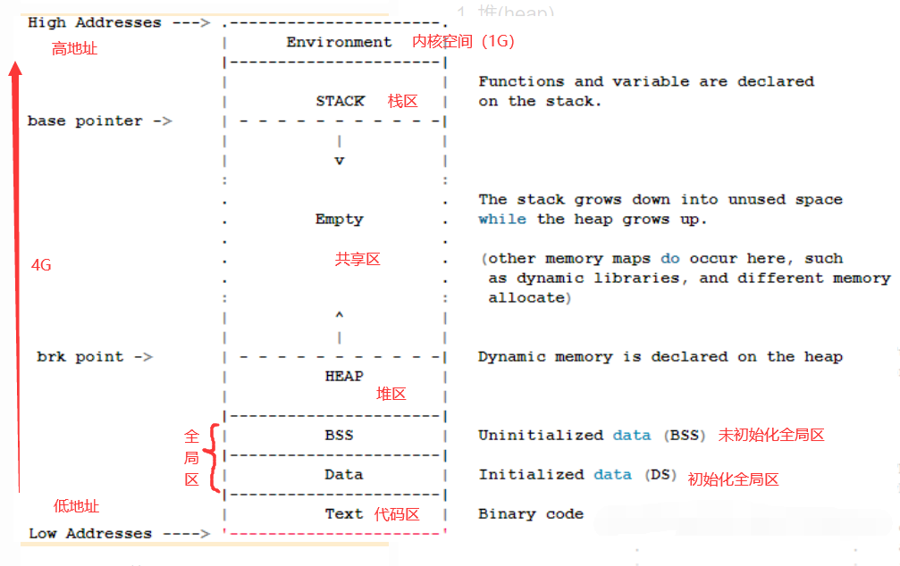

# C++内存模型

## 内存区域与功能

从高地址到低地址，一个程序由 内核空间、栈区、堆区、BSS段、数据段（data）、代码区组成。
常说的C++ 内存分区：栈、堆、全局/静态存储区、常量存储区、代码区。

可执行程序在运行时会多出两个区域：栈和堆

- 栈(stack)：存放函数的局部变量、函数参数、返回地址等，由编译器自动分配和释放。栈从高地址向低地址增长。是一块连续的空间。栈一般分配几M大小的内存。
  - 函数的参数、函数体内声明的变量都会存储在栈中，栈的特点是由运行时系统自动分配与释放，另栈分配空间是向高地址向低地址扩张。
  - 函数的参数、函数体内声明的变量都会存储在栈中，栈的特点是由运行时系统自动分配与释放，另栈分配空间是向高地址向低地址扩张。
  - 栈:由程序员管理，需要手动 new malloc delete free 进行分配和回收，空间较大，但可能会出现内存泄漏和空闲碎片的情况。若程序员不释放，程序结束时可能由OS回收。注意它与数据结构中堆是两回事，分配方式倒是类似于链表。
  - 局部const、局部变量、函数参数等

- 堆(heap)：动态申请的内存空间，就是由 malloc 分配的内存块，由程序员控制它的分配和释放，如果程序执行结束还没有释放，操作系统会自动回收。堆从低地址向高地址增长。一般可以分配几个G大小的内存。

- 共享区：在堆栈之间存在，（文件映射区）。
  - 动态库加载区:动态链接库（DLLs或.so文件）在加载时占用的内存空间。根据程序运行时链接的动态库而定，可以共享内存映射文件

- 数据段(Data Segment) (即全局/静态存储区)(包含.BSS 段和 .data 段)：存放全局变量和静态变量，程序运行结束操作系统自动释放，在 C 语言中，程序中未初始化的全局变量和静态变量存放在.BSS 段中，已初始化的全局变量和静态变量存放在 .data 段中。在C++中，这种区分已经不那么明显了，所有的全局变量和静态变量（无论是否初始化）都被视为初始化，并且存储在同一区域。未初始化的全局或静态变量会被默认初始化为零值（对于基本类型）或默认构造（对于类类型）。
  - 未初始化数据段 (.bss)：存储未初始化的全局变量和静态变量，或者初始化为0（或等效零值）的变量。在程序开始执行时由操作系统清零，不需要在磁盘上占用实际的空间来存储零值。
  - 全局数据段 (.data):存储初始化过的全局变量和静态变量的值，以及那些在定义时赋予了非零初始值的静态数据。在程序开始执行时被初始化，是可读写的。
  - 只读数据段 (.rodata 或 .rdata)：存储常量数据，如字符串字面量、const修饰的全局变量和静态变量，以及枚举类型的值。程序执行期间不可修改，程序运行结束自动释放。

- 代码区（.text 或 Text Segment）：存放程序执行代码的一块内存区域。只读，不允许修改，但可以执行。编译后的二进制文件存放在这里。代码段的头部还会包含一些只读的常量，如字符串常量字面值（注意：const变量虽然属于常量，但是本质还是变量，不存储于代码段）
  - 共享性:即在内存里面只有一份此程序代码,而无论谁都可以使用并运行它. 好处是当被频繁使用时,节约更多空间
  - 只读性:即不允许被修改,

- 线程局部存储区 (Thread Local Storage, TLS):TLS是为了解决多线程环境下数据隔离问题而设计的，每个线程拥有自己独立的TLS区域，其中存储的数据仅对该线程可见，其他线程无法访问。TLS区域通常位于进程的虚拟地址空间内，但其确切位置取决于操作系统和实现细节。是一个额外的、独立管理的区域。TLS可以视作是每个线程独有的“数据段”，其大小和内容随线程的生命周期动态变化。

在linux下size命令可以查看一个可执行二进制文件基本情况：

### 初始化为0的全局变量在bss还是data

BSS段通常是指用来存放程序中未初始化的或者初始化为0的全局变量和静态变量的一块内存区域。特点是可读写的，在程序执行之前BSS段会自动清0。

## 栈和堆的区别

- 申请方式：
  - 栈由系统自动分配
  - 堆是程序员申请开辟;
- 申请效率：
  - 栈是有系统自动分配，申请效率高，但程序员无法控制；
  - 堆是由程序员主动申请，效率低，使用起来方便但是容易产生碎片。
- 申请大小限制不同。
  - 栈顶和栈底是之前预设好的，栈是向栈底扩展，大小固定，可以通过ulimit -a查看，由ulimit -s修改。
  - 堆向高地址扩展，是不连续的内存区域，大小可以灵活调整。
- 申请后系统响应：
  - 分配栈空间，如果剩余空间大于申请空间则分配成功，否则分配失败栈溢出；
  - 申请堆空间，堆在内存中呈现的方式类似于链表（记录空闲地址空间的链表），在链表上寻找第一个大于申请空间的节点分配给程序，将该节点从链表中删除，大多数系统中该块空间的首地址存放的是本次分配空间的大小，便于释放，将该块空间上的剩余空间再次连接在空闲链表上。
- 空间大小：
  - 栈是一块连续的内存区域，大小是操作系统预定好的，windows下栈大小是2M（也有是1M，在 编译时确定，VC中可设置）。
  - 堆是不连续的内存区域（因为系统是用链表来存储空闲内存地址，自然不是连续的），堆大小受限于计算机系统中有效的虚拟内存（32bit 系统理论上是4G），所以堆的空间比较灵活，比较大。
- 存储的内容不同。
  - 栈在函数调用时，第一个进栈的是主函数中后的下一条指令（函数调用语句的下一条可执行语句）的地址，然后是函数的各个参数，在大多数的C编译器中，参数是由右往左入栈的，然后是函数中的局部变量。注意静态变量是不入栈的。 当本次函数调用结束后，局部变量先出栈，然后是参数，最后栈顶指针指向最开始存的地址，也就是主函数中的下一条指令，程序由该点继续运行。
  - 堆：一般是在堆的头部用一个字节存放堆的大小。堆中的具体内容由程序员安排。
- 碎片问题
  - 对于堆，频繁的new/delete会造成大量碎片，使程序效率降低
  - 对于栈，它是有点类似于数据结构上的一个先进后出的栈，进出一一对应，不会产生碎片。（看到这里我突然明白了为什么面试官在问我堆和栈的区别之前先问了我栈和队列的区别）
- 生长方向
  - 堆向上，向高地址方向增长。
  - 栈向下，向低地址方向增长。
- 管理方式
  - 堆中资源由程序员控制，容易产生内存泄漏(memory leak)
  - 栈资源由编译器自动管理，无需手工控制
- 分配方式
  - 堆都是动态分配（没有静态分配的堆）
  - 栈有静态分配和动态分配，静态分配由编译器完成（如局部变量分配），动态分配由alloca函数分配，但栈的动态分配的资源由编译器进行释放，无需程序员实现。
- 分配效率
  - 堆由C/C++函数库提供，机制很复杂。所以堆的效率比栈低很多。
  - 栈是其系统提供的数据结构，计算机在底层对栈提供支持，分配专门 寄存器存放栈地址，栈操作有专门指令。

>形象的比喻
栈就像我们去饭馆里吃饭，只管点菜（发出申请）、付钱、和吃（使用），吃饱了就走，不必理会切菜、洗菜等准备工作和洗碗、刷锅等扫尾工作，他的好处是快捷，但是自由度小。
堆就象是自己动手做喜欢吃的菜肴，比较麻烦，但是比较符合自己的口味，而且自由度大。

### 怎么判断数据分配在栈上还是堆上

- 局部变量分配在栈上；
- 通过malloc和new申请的空间是在堆上。

### 你觉得堆快一点还是栈快一点？

毫无疑问是栈快一点。

- 因为操作系统会在底层对栈提供支持，会分配专门的寄存器存放栈的地址，栈的入栈出栈操作也十分简单，并且有专门的指令执行，所以栈的效率比较高也比较快。

- 而堆的操作是由C/C++函数库提供的，在分配堆内存的时候需要一定的算法寻找合适大小的内存。并且获取堆的内容需要两次访问，第一次访问指针，第二次根据指针保存的地址访问内存，因此堆比较慢。

## 程序启动的过程

操作系统首先创建相应的进程并分配私有的进程空间，然后操作系统的加载器负责把可执行文件的数据段和代码段映射到进程的虚拟内存空间中。

加载器读入可执行程序的导入符号表，根据这些符号表可以查找出该可执行程序的所有依赖的动态链接库。

加载器针对该程序的每一个动态链接库调用LoadLibrary （1）查找对应的动态库文件，加载器为该动态链接库确定一个合适的基地址。 （2）加载器读取该动态链接库的导入符号表和导出符号表，比较应用程序要求的导入符号是否匹配该库的导出符号。 （3）针对该库的导入符号表，查找对应的依赖的动态链接库，如有跳转，则跳到3 （4）调用该动态链接库的初始化函数

初始化应用程序的全局变量，对于全局对象自动调用构造函数。

进入应用程序入口点函数开始执行。

## STL分配的内存

### vector

C++的std::vector本身作为一个对象，其在内存中的位置取决于它的声明方式：

1. 当你这样声明一个`vector：std::vector<int> myVector;`，这个vector对象myVector本身是创建在栈上的，但是它所管理的元素（即你放入vector中的那些int值）是存储在堆上的。这是因为vector需要能够动态地调整其大小，而栈上的内存是静态分配的，无法满足这种动态变化的需求。因此，当向vector添加元素时，vector会自动在堆上分配或重新分配内存来容纳这些元素。

2. 如果你使用指针来创建vector，如：`std::vector<int>* myVector = new std::vector<int>;`，这时不仅vector内部管理的元素在堆上，连vector对象本身也在堆上，因为你使用了new操作符显式地在堆上分配了vector对象的内存。

总结来说，std::vector容器本身作为对象可以存储在栈或堆上，但其包含的元素总是存储在堆上，以支持容量的动态调整。

### STL

STL（Standard Template Library）容器根据其设计目的和特性，在内存分配上有所不同，但普遍遵循以下原则：

1. 动态内存分配容器：大多数STL容器，如std::vector、std::list、std::map、std::unordered_map等，它们的元素是存储在堆上的。这是因为这些容器需要能够在运行时动态地调整大小，而堆内存是唯一能够提供这种灵活性的内存区域。容器本身（即管理元素的数据结构）如果是局部变量，则存储在栈上，但它们所持有的数据则位于堆中。

2. 静态内存分配容器：像std::array这样的容器，它是一个静态大小的数组，其元素和容器本身（因为它不是一个动态容器）都存储在栈上，或者如果它是类或结构体的成员，则存储在相应的内存区域。std::array不涉及堆分配，其大小在编译时就必须确定。

3. 容器适配器：如std::stack、std::queue和std::priority_queue等，它们不直接管理内存，而是基于其他容器（默认情况下是std::deque或std::vector）实现。因此，它们的内存分配特性跟随底层使用的容器。例如，基于std::vector的std::stack会将元素存储在堆上。

4. 内存分配器：STL容器使用一个名为Allocator的模板参数来控制内存的分配和释放，默认情况下使用的是std::allocator，它从自由存储区（即堆）分配内存。尽管如此，用户可以通过自定义Allocator来改变内存的来源，比如从栈上分配（尽管这在实践中很少见且具有挑战性，因为栈的大小限制和缺乏动态性）。

总的来说，STL容器大部分涉及动态内存分配的元素都存储在堆上，以适应元素数量的变化，而容器的管理结构如果作为局部变量，则位于栈上。
