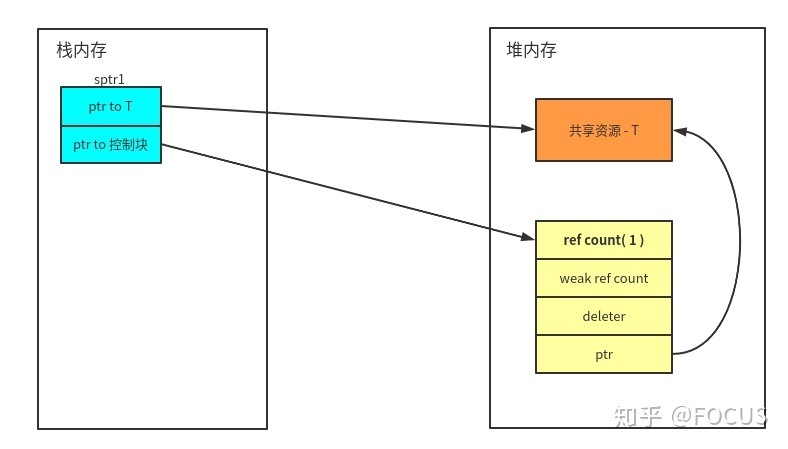
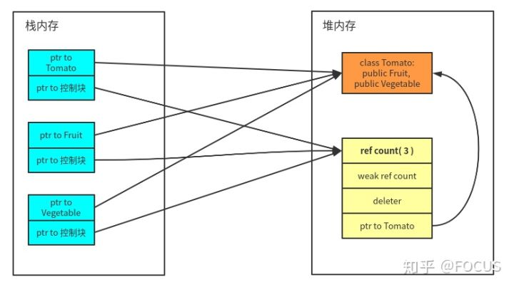
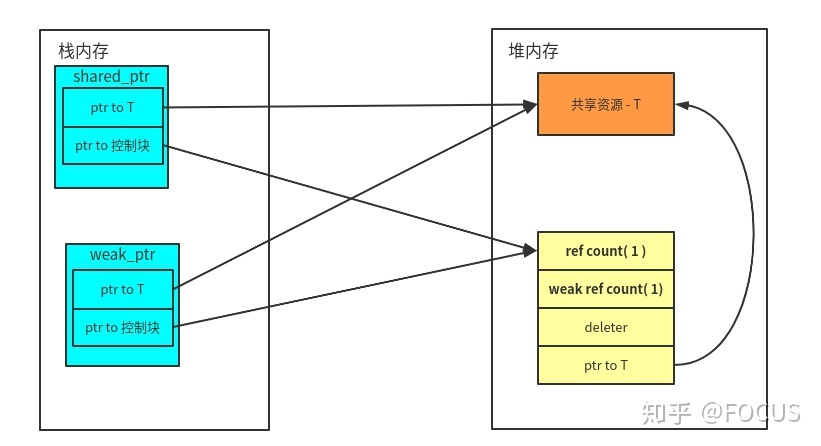

# 智能指针

## 智能指针有哪几种？

智能指针是为了解决动态内存分配时忘记释放内存导致的内存泄漏以及多次释放同一块内存空间而提出的。C++11 中封装在了``#include <memory>`` 头文件中。

std::auto_ptr:C++标准库早期提供的一个智能指针类模板，C++11弃用，C++17移除。
C++11 引入了 3 个新的智能指针类型：

- std::unique_ptr ：独占资源所有权的指针。
- std::shared_ptr ：共享资源所有权的指针。
- std::weak_ptr ：共享资源的观察者，需要和 std::shared_ptr 一起使用，不影响资源的生命周期。

共享指针（shared_ptr）：资源可以被多个指针共享，使用计数机制表明资源被几个指针共享。通过 use_count() 查看资源的所有者的个数，可以通过 unique_ptr、weak_ptr 来构造，调用 release() 释放资源的所有权，计数减一，当计数减为 0 时，会自动释放内存空间，从而避免了内存泄漏。

独占指针（unique_ptr）：独享所有权的智能指针，资源只能被一个指针占有，该指针不能拷贝构造和赋值。但可以进行移动构造和移动赋值构造（调用move() 函数），即一个 unique_ptr 对象赋值给另一个 unique_ptr 对象，可以通过该方法进行赋值。

弱指针（weak_ptr）：指向 shared_ptr 指向的对象，能够解决由shared_ptr带来的循环引用问题。

### auto_ptr

C++98/03 ：std::auto_ptr

#### 基本用法

```cpp
#include <memory>
int main()
{
    //方法1
    std::auto_ptr<int> sp1(new int(8));
    //方法2
    std::auto_ptr<int> sp2;
    sp2.reset(new int(8));

    return 0;
}
```

智能指针对象sp1和sp2均持有一个在堆上分配的int对象，值都是8，这两块堆内存都在sp1和sp2释放时得到释放。这是std::auto_ptr的基本用法。

#### 缺陷

std::auto_ptr真正容易让人误用的地方是其不常用的复制语义，即当复制一个std::auto_ptr对象时（拷贝复制或operator =复制），原对象所持有的堆内存对象也会转移给复制出来的对象。

```cpp
#include <iostream>
#include <memory>
using namespace std;
int main()
{
   //测试拷贝构造
   std::auto_ptr<int> sp1(new int(8));
   std::auto_ptr<int> sp2(sp1);
   if (sp1.get() != NULL)
   {
     std::cout << "sp1 is not empty." << std::endl;
   }
   else
   {
      std::cout << "sp1 is empty." << std::endl;
   }
   if (sp2.get() != NULL)
   {   
      std::cout << "sp2 is not empty." << std::endl;
   }
   else
   {
       std::cout << "sp2 is empty." << std::endl;
    }
     //测试赋值构造
    std::auto_ptr<int> sp3(new int(8));
    std::auto_ptr<int> sp4;
    sp4 = sp3;
    if (sp3.get() != NULL)
    {
        std::cout << "sp3 is not empty." << std::endl;
    }
    else
    {
        std::cout << "sp3 is empty." << std::endl;
    }
    if (sp4.get() != NULL)
    {
        std::cout << "sp4 is not empty." << std::endl;
    }
    else
    {
        std::cout << "sp4 is empty." << std::endl;
    }
    return 0;
}
```

所以我们不能使用这样的代码

```cpp
std::vector<std::auto_ptr<int>> v1;
```

当用算法对容器操作的时候（如最常见的容器元素遍历），很难避免不对容器中的元素实现赋值传递，这样便会使容器中多个元素被置为空指针，这不是我们希望看到的，可能会造成一些意想不到的错误。

以史为鉴，作为std::auto_ptr的替代者std::unique_ptr吸取了这个经验教训

正因为std::auto_ptr的设计存在如此重大缺陷，C++11标准在充分借鉴和吸收了boost库中智能指针的设计思想，引入了三种类型的智能指针，即std::unique_ptr、std::shared_ptr和std::weak_ptr。

### unique_ptr

C++ 11 std::unique_ptr

#### 定义

std::unique_ptr对其持有的堆内存具有唯一拥有权，也就是说引用计数永远是1，std::unique_ptr对象销毁时会释放其持有的堆内存。可以使用以下方式初始化一个std::unique_ptr对象：

```cpp
//初始化方式1
std::unique_ptr<int> sp1(new int(123));

//初始化方式2
std::unique_ptr<int> sp2;
sp2.reset(new int(123));

//初始化方式3
std::unique_ptr<int> sp3 = std::make_unique<int>(123);
```

推荐使用初始化方式3：为什么？
参考:[C++11 make_shared](https://www.jianshu.com/p/03eea8262c11)
其中std::make_unique 是C++14才有 C++11没有 ，但是可以自己手动写
代码如下：

```cpp
template<typename T, typename... Ts>

std::unique_ptr<T> make_unique(Ts&& ...params)
{
    return std::unique_ptr<T>(new T(std::forward<Ts>(params)...));
}
```

#### 推荐使用make_unique

1. 代码简洁性:
`std::make_unique` 提供了一个更简洁、更易读的语法来创建并初始化 std::unique_ptr 实例。使用 `make_unique<T>(args...)` 形式的单一调用就可以完成分配和初始化，相比之下，使用 new 需要两步操作：先使用 new 分配内存，然后将指针传递给 `unique_ptr` 构造函数。

2. 异常安全性:
std::make_unique 在内部作为一个整体操作执行，如果在构造对象过程中发生异常，它能确保资源被正确清理，避免了内存泄漏。这是因为在构造 unique_ptr 对象之前，内存资源就已经被分配和绑定，如果构造过程中抛出异常，make_unique 内部的构造会自动清理分配的内存。
直接使用 new 分配内存后，如果在接下来的 unique_ptr 构造之前发生了异常，你必须手动编写异常处理代码来释放之前分配的内存，这增加了编码复杂度和潜在错误。

3. 最佳实践:
C++11引入了 std::make_unique（虽然在某些编译器中稍晚才得到支持），作为创建 unique_ptr 的首选方法，因为它遵循了资源获取即初始化（RAII）的原则，提高了代码的健壮性和可维护性。
使用 make_unique 还有助于统一代码风格，使得意图更加清晰，因为它明确表示了正在创建并管理一个独占所有权的智能指针。

4. 编译器支持:
std::make_unique 是C++14标准中正式加入的，尽管许多现代编译器即使在C++11模式下也支持它。对于不支持 std::make_unique 的编译器，可能需要手动实现类似功能或者直接使用 new 配合 unique_ptr。

#### 禁止复制语义

鉴于std::auto_ptr的前车之鉴，std::unique_ptr禁止复制语义，为了达到这个效果，std::unique_ptr类的拷贝构造函数和赋值运算符（operator =）被标记为 =delete。

```cpp
template <class T>
class unique_ptr
{
//省略其他代码..
//拷贝构造函数和赋值运算符被标记为delete
unique_ptr(const unique_ptr&) = delete;
unique_ptr& operator=(const unique_ptr&) = delete;
};
```

```cpp
std::unique_ptr<int> sp1(std::make_unique<int>(123));;

//以下代码无法通过编译

//std::unique_ptr<int> sp2(sp1);

std::unique_ptr<int> sp3;

//以下代码无法通过编译

//sp3 = sp1;
```

禁止复制语义也存在特例，即可以通过一个函数返回一个std::unique_ptr：

```cpp
#include <memory>
using namespace std;
std::unique_ptr<int> func(int val)
{
    std::unique_ptr<int> up(new int(val));
    return up;
}
int main()
{
    std::unique_ptr<int> sp1 = func(123);
    return 0;
}
```

#### 使用移动构造 std::move()

既然std::unique_ptr不能复制，那么如何将一个std::unique_ptr对象持有的堆内存转移给另外一个呢？答案是使用移动构造，示例代码如下：

```cpp
#include <memory>
int main()
{
    std::unique_ptr<int> sp1(std::make_unique<int>(123));
    std::unique_ptr<int> sp2(std::move(sp1));
    std::unique_ptr<int> sp3;
    sp3 = std::move(sp2);
    return 0;
}
```

以上代码利用std::move将sp1持有的堆内存（值为123）转移给sp2，再把sp2转移给sp3。最后，sp1和sp2不再持有堆内存的引用，变成一个空的智能指针对象。并不是所有的对象的std::move操作都有意义，只有实现了移动构造函数（Move Constructor）或移动赋值运算符（operator =）的类才行，而std::unique_ptr正好实现了这二者

#### std::unique_ptr实现伪码

```cpp
template<typename T, typename Deletor>
class unique_ptr
{
    //其他函数省略...
public:
    unique_ptr(unique_ptr&& rhs)
    {
        this->m_pT = rhs.m_pT;
        //源对象释放        
        rhs.m_pT = nullptr;
    }
    unique_ptr& operator=(unique_ptr&& rhs)
    {
        this->m_pT = rhs.m_pT;
        //源对象释放
        rhs.m_pT = nullptr;
        return *this;
    }
private:
    T*    m_pT;
};
```

#### std::unique_ptr数组

std::unique_ptr不仅可以持有一个堆对象，也可以持有一组堆对象

```cpp
#include <iostream>
#include <memory>
using namespace std;
int main()
{
    //创建10个int类型的堆对象
    //形式1
    std::unique_ptr<int[]> sp1(new int[10]);
    
    //形式2
    std::unique_ptr<int[]> sp2;
    sp2.reset(new int[10]);
    //形式3
    std::unique_ptr<int[]> sp3(std::make_unique<int[]>(10));

    for (int i = 0; i < 10; ++i)
    {
        sp1[i] = i;
        sp2[i] = i;
        sp3[i] = i;
    }

    for (int i = 0; i < 10; ++i)
    {
        std::cout << sp1[i] << ", " << sp2[i] << ", " << sp3[i] << std::endl;
    }

    return 0;
}
```

程序执行结果如下：

```cpp
root@iZuf65i08ucxtob67o6urwZ:/usr/myC++/shared_ptr# g++ -o test_unique_ptr_int test_unique_ptr_int.cpp 
root@iZuf65i08ucxtob67o6urwZ:/usr/myC++/shared_ptr# ./test
test1_error_ex       test_left            test_unique_ptr_int  
root@iZuf65i08ucxtob67o6urwZ:/usr/myC++/shared_ptr# ./test
test1_error_ex       test_left            test_unique_ptr_int  
root@iZuf65i08ucxtob67o6urwZ:/usr/myC++/shared_ptr# ./test_unique_ptr_int 
0, 0, 0
1, 1, 1
2, 2, 2
3, 3, 3
4, 4, 4
5, 5, 5
6, 6, 6
7, 7, 7
8, 8, 8
9, 9, 9
root@iZuf65i08ucxtob67o6urwZ:/usr/myC++/shared_ptr# 
```

std::shared_ptr和std::weak_ptr也可以持有一组堆对象，用法与std::unique_ptr相同

#### Deletor：自定义智能指针对象持有的资源的释放函数

Deletor：自定义智能指针对象持有的资源的释放函数
默认情况下，智能指针对象在析构时只会释放其持有的堆内存（调用delete 或者delete[]），但是假设这块堆内存代表的对象还对应一种需要回收的资源（如操作系统的套接字句柄、文件句柄等），我们可以通过自定义智能指针的资源释放函数。假设现在有一个Socket类，对应着操作系统的套接字句柄，在回收时需要关闭该对象，我们可以如下自定义智能指针对象的资源析构函数，这里以std::unique_ptr为例：

```cpp
#include <iostream>
#include <memory>
using namespace std;
class Socket
{
public:
    Socket()
    {

    }

    ~Socket()
    {

    }

    //关闭资源句柄
    void close()
    {

    }
};

int main()
{
    auto deletor = [](Socket* pSocket) {
        //关闭句柄
        pSocket->close();
        //TODO: log日志
        delete pSocket;
    };

    std::unique_ptr<Socket, void(*)(Socket * pSocket)> spSocket(new Socket(), deletor);

    return 0;
}
```

自定义std::unique_ptr的资源释放函数其规则是：

### std::shared_ptr

**std::unique_ptr对其持有的资源具有独占性，而std::shared_ptr持有的资源可以在多个std::shared_ptr之间共享，每多一个std::shared_ptr对资源的引用，资源引用计数将增加1，每一个指向该资源的std::shared_ptr对象析构时，资源引用计数减1，最后一个std::shared_ptr对象析构时，发现资源计数为0，将释放其持有的资源。多个线程之间，递增和减少资源的引用计数是安全的。（注意：这不意味着多个线程同时操作std::shared_ptr引用的对象是安全的）。std::shared_ptr提供了一个use_count()方法来获取当前持有资源的引用计数。除了上面描述的，std::shared_ptr用法和std::unique_ptr基本相同。**

#### 初始化

```cpp
//初始化方式1
std::shared_ptr<int> sp1(new int(123));

//初始化方式2
std::shared_ptr<int> sp2;
sp2.reset(new int(123));

//初始化方式3
std::shared_ptr<int> sp3;
sp3 = std::make_shared<int>(123);
```

和std::unique_ptr一样，应该优先使用std::make_shared去初始化一个std::shared_ptr对象。

```cpp
#include <iostream>
#include <memory>
using namespace std;
class A
{
public:
    A()
    {
        std::cout << "A constructor" << std::endl;
    }

    ~A()
    {
        std::cout << "A destructor" << std::endl;
    }
};

int main()
{
    {
        //初始化方式1
        std::shared_ptr<A> sp1(new A());

        std::cout << "use count: " << sp1.use_count() << std::endl;

        //初始化方式2
        std::shared_ptr<A> sp2(sp1);
        std::cout << "use count: " << sp1.use_count() << std::endl;

        sp2.reset();
        std::cout << "use count: " << sp1.use_count() << std::endl;

        {
            std::shared_ptr<A> sp3 = sp1;
            std::cout << "use count: " << sp1.use_count() << std::endl;
        }

        std::cout << "use count: " << sp1.use_count() << std::endl;
    }
       
    return 0;
}
```

```cpp
root@iZuf65i08ucxtob67o6urwZ:/usr/myC++/shared_ptr# ./test_shared_ptr_use_count
A constructor
use count: 1
use count: 2
use count: 1
use count: 2
use count: 1
A destructor
```

#### std::enable_shared_from_this

有时候需要在类中返回包裹当前对象（this）的一个std::shared_ptr对象给外部使用，C++新标准也为我们考虑到了这一点，有如此需求的类只要继承自`std::enable_shared_from_this<T>`模板对象即可。用法如下：

```cpp
#include <iostream>
#include <memory>
using namespace std;
class A : public std::enable_shared_from_this<A>
{
public:
    A()
    {
        std::cout << "A constructor" << std::endl;
    }

    ~A()
    {
        std::cout << "A destructor" << std::endl;
    }

    std::shared_ptr<A> getSelf()
    {
        return shared_from_this();
    }
};

int main()
{
    std::shared_ptr<A> sp1(new A());

    std::shared_ptr<A> sp2 = sp1->getSelf();

    std::cout << "use count: " << sp1.use_count() << std::endl;

    return 0;
}
```

```s
root@iZuf65i08ucxtob67o6urwZ:/usr/myC++/shared_ptr# ./test_shared_ptr_from_this 
A constructor
use count: 2
A destructor
root@iZuf65i08ucxtob67o6urwZ:/usr/myC++/shared_ptr# 
```

上述代码中，类A继承自`std::enable_shared_from_this<A>`并提供一个getSelf()方法返回自身的std::shared_ptr对象，在getSelf()中调用shared_from_this()即可。

std::enable_shared_from_this用起来比较方便，但是也存在很多不易察觉的陷阱。

#### 陷阱一：不应该共享栈对象的 this 给智能指针对象

```cpp
//其他相同代码省略...

int main()
{
    A a;

    std::shared_ptr<A> sp2 = a.getSelf();

    std::cout << "use count: " << sp2.use_count() << std::endl;

    return 0;
}
```

运行修改后的代码会发现程序在`std::shared_ptr<A> sp2 = a.getSelf()`;产生崩溃。这是因为，智能指针管理的是堆对象，栈对象会在函数调用结束后自行销毁，因此不能通过shared_from_this()将该对象交由智能指针对象管理。切记：智能指针最初设计的目的就是为了管理堆对象的（即那些不会自动释放的资源）

```cpp
#include <iostream>
#include <memory>

class A : public std::enable_shared_from_this<A>
{
public:
    A()
    {
        m_i = 9;
        //注意:
        //比较好的做法是在构造函数里面调用shared_from_this()给m_SelfPtr赋值
        //但是很遗憾不能这么做,如果写在构造函数里面程序会直接崩溃

        std::cout << "A constructor" << std::endl;
    }

    ~A()
    {
        m_i = 0;

        std::cout << "A destructor" << std::endl;
    }

    void func()
    {
        m_SelfPtr = shared_from_this();
    }

public:
    int                 m_i;
    std::shared_ptr<A>  m_SelfPtr;

};

int main()
{
    {
        std::shared_ptr<A> spa(new A());
        spa->func();
    }

    return 0;
}
```

结果如下

```cpp
root@iZuf65i08ucxtob67o6urwZ:/usr/myC++/shared_ptr# ./shared_ptr_trap1 
A constructor
root@iZuf65i08ucxtob67o6urwZ:/usr/myC++/shared_ptr# 
```

在程序的整个生命周期内，只有A类构造函数的调用输出，没有A类析构函数的调用输出，这意味着new出来的A对象产生了内存泄漏了！

我们来分析一下new出来的A对象为什么得不到释放。当程序执行到42行后，spa出了其作用域准备析构，在析构时其发现仍然有另外的一个std::shared_ptr对象即A::m_SelfPtr 引用了A，因此spa只会将A的引用计数递减为1，然后就销毁自身了。现在留下一个矛盾的处境：必须销毁A才能销毁其成员变量m_SelfPtr，而销毁A必须先销毁m_SelfPtr。这就是所谓的std::enable_shared_from_this的循环引用问题。
我们在实际开发中应该避免做出这样的逻辑设计，这种情形下即使使用了智能指针也会造成内存泄漏。也就是说一个资源的生命周期可以交给一个智能指针对象，但是该智能指针的生命周期不可以再交给该资源本身来管理。

### weak_ptr

std::weak_ptr是一个不控制资源生命周期的智能指针，是对对象的一种弱引用，只是提供了对其管理的资源的一个访问手段，引入它的目的为协助std::shared_ptr工作。

std::weak_ptr可以从一个std::shared_ptr或另一个std::weak_ptr对象构造，std::shared_ptr可以直接赋值给std::weak_ptr ，也可以通过std::weak_ptr的lock()函数来获得std::shared_ptr。它的构造和析构不会引起引用计数的增加或减少。std::weak_ptr可用来解决std::shared_ptr相互引用时的死锁问题，即两个std::shared_ptr相互引用，那么这两个指针的引用计数永远不可能下降为0， 资源永远不会释放。

#### weak_ptr初始化

```cpp
#include <iostream>
#include <memory>

int main()
{
    //创建一个std::shared_ptr对象
    std::shared_ptr<int> sp1(new int(123));
    std::cout << "use count: " << sp1.use_count() << std::endl;

    //通过构造函数得到一个std::weak_ptr对象
    std::weak_ptr<int> sp2(sp1);
    std::cout << "use count: " << sp1.use_count() << std::endl;

    //通过赋值运算符得到一个std::weak_ptr对象
    std::weak_ptr<int> sp3 = sp1;
    std::cout << "use count: " << sp1.use_count() << std::endl;

    //通过一个std::weak_ptr对象得到另外一个std::weak_ptr对象
    std::weak_ptr<int> sp4 = sp2;
    std::cout << "use count: " << sp1.use_count() << std::endl;

    return 0;
}
```

运行结果：

```cpp
root@iZuf65i08ucxtob67o6urwZ:/usr/myC++/shared_ptr# g++ -o weak_ptr_test weak_ptr_test.cpp root@iZuf65i08ucxtob67o6urwZ:/usr/myC++/shared_ptr# ./weak_ptr_test 
use count: 1
use count: 1
use count: 1
use count: 1
```

无论通过何种方式创建std::weak_ptr都不会增加资源的引用计数，因此每次输出引用计数的值都是1。

#### expired()

既然，std::weak_ptr不管理对象的生命周期，那么其引用的对象可能在某个时刻被销毁了，如何得知呢？std::weak_ptr提供了一个expired()方法来做这一项检测，返回true，说明其引用的资源已经不存在了；返回false，说明该资源仍然存在，这个时候可以使用std::weak_ptr 的lock()方法得到一个std::shared_ptr对象然后继续操作资源，以下代码演示了该用法：

```cpp
//tmpConn_是一个std::weak_ptr<TcpConnection>对象
//tmpConn_引用的TcpConnection已经销毁，直接返回
if (tmpConn_.expired())
    return;

std::shared_ptr<TcpConnection> conn = tmpConn_.lock();
if (conn)
{
    //对conn进行操作，省略...
}
```

#### 不能直接操作对象

既然使用了std::weak_ptr的expired()方法判断了对象是否存在，为什么不直接使用std::weak_ptr对象对引用资源进行操作呢？
实际上这是行不通的，std::weak_ptr类没有重写operator->和operator方法，因此不能像std::shared_ptr或std::unique_ptr一样直接操作对象，同时std::weak_ptr类也没有重写operator bool()操作，因此也不能通过std::weak_ptr对象直接判断其引用的资源是否存在：

```cpp
#include <memory>
#include <iostream>
class A
{
public:
    void doSomething()
    {
        std::cout<< "do something" << std::endl;
    }
};

int main()
{    
    std::shared_ptr<A> sp1(new A());
    
    std::weak_ptr<A> sp2(sp1);

    //正确代码
    if (sp1)
    {
        //正确代码
        sp1->doSomething();
        (*sp1).doSomething();
    }

    //正确代码
    if (!sp1)
    {

    }

    //错误代码，无法编译通过
    //if (sp2)
    //{
    //    //错误代码，无法编译通过
    //    sp2->doSomething();
    //    (*sp2).doSomething();
    //}

    //错误代码，无法编译通过
    //if (!sp2)
    //{

    //}

    return 0;
}
```

结果：

```s
root@iZuf65i08ucxtob67o6urwZ:/usr/myC++/shared_ptr# g++ -o weak_ptr_test2 weak_ptr_test2.cpp 
root@iZuf65i08ucxtob67o6urwZ:/usr/myC++/shared_ptr# ./weak_ptr_test2do something
do something
root@iZuf65i08ucxtob67o6urwZ:/usr/myC++/shared_ptr# 
```

#### 应用场景

之所以std::weak_ptr不增加引用资源的引用计数来管理资源的生命周期，是因为即使它实现了以上说的几个方法，调用它们仍然是不安全的，因为在调用期间，引用的资源可能恰好被销毁了，这样可能会造成比较棘手的错误和麻烦。

因此，std::weak_ptr的正确使用场景是那些资源如果可用就使用，如果不可用则不使用的场景，它不参与资源的生命周期管理。例如，网络分层结构中，Session对象（会话对象）利用Connection对象（连接对象）提供的服务来进行工作，但是Session对象不管理Connection对象的生命周期，Session管理Connection的生命周期是不合理的，因为网络底层出错会导致Connection对象被销毁，此时Session对象如果强行持有Connection对象则与事实矛盾。

std::weak_ptr的应用场景，经典的例子是订阅者模式或者观察者模式中。

## 智能指针应用举例

### unique_ptr应用

unique_ptr 的使用比较简单，也是用得比较多的智能指针。当我们独占资源的所有权的时候，可以使用 unique_ptr 对资源进行管理——离开 unique_ptr 对象的作用域时，会自动释放资源。这是很基本的 RAII 思想。

- 自动管理内存
使用裸指针时，要记得释放内存。

```cpp
{
    int* p = new int(100);
    // ...
    delete p;  // 要记得释放内存
}
```

- 使用 unique_ptr 自动管理内存。

```cpp
{
    std::unique_ptr<int> uptr = std::make_unique<int>(200);
    //...
    // 离开 uptr 的作用域的时候自动释放内存
}
```

- unique_ptr 是 move-only 的，也是实现将一个 unique_ptr 对象赋值给另一个 unique_ptr 对象的方法

```cpp
{
    std::unique_ptr<int> uptr = std::make_unique<int>(200);
    std::unique_ptr<int> uptr1 = uptr;  // 编译错误，std::unique_ptr<T> 是 move-only 的

    std::unique_ptr<int> uptr2 = std::move(uptr);
    assert(uptr == nullptr);
}
```

- unique_ptr 可以指向一个数组

```cpp
{
    std::unique_ptr<int[]> uptr = std::make_unique<int[]>(10);
    for (int i = 0; i < 10; i++) {
        uptr[i] = i * i;
    }   
    for (int i = 0; i < 10; i++) {
        std::cout << uptr[i] << std::endl; //0 1 4 9 ...81
    }   
}
也可以用向量：
unique_ptr<vector<int>> p (new vector<int>(5, 6)); //n = 5, value = 6
std::cout << *p->begin() << endl;//6
```

### shared_ptr应用

shared_ptr 其实就是对资源做引用计数——当引用计数 sptr.use_count() 为 0
的时候，自动释放资源。其中，assert(p);用于判断指针内容是否非空，空指针nullptr 与什么未指向的野指针过不了assert

```cpp
{
    std::shared_ptr<int> sptr = std::make_shared<int>(200);
    assert(sptr.use_count() == 1);  // 此时引用计数为 1
    {   
        std::shared_ptr<int> sptr1 = sptr;
        assert(sptr.get() == sptr1.get());
        assert(sptr.use_count() == 2);   // sptr 和 sptr1 共享资源，引用计数为 2
    }   
    assert(sptr.use_count() == 1);   // sptr1 已经释放
}
// use_count 为 0 时自动释放内存
```

- 和 unique_ptr 一样，shared_ptr 也可以指向数组和自定义 deleter。

```cpp
{
    // C++20 才支持 std::make_shared<int[]>
    // std::shared_ptr<int[]> sptr = std::make_shared<int[]>(100);
    std::shared_ptr<int[]> sptr(new int[10]);
    for (int i = 0; i < 10; i++) {
        sptr[i] = i * i;
    }   
    for (int i = 0; i < 10; i++) {
        std::cout << sptr[i] << std::endl;
    }   
}
```

附：
一个 shared_ptr 对象的内存开销要比裸指针和无自定义 deleter 的 unique_ptr 对象略大。
无自定义 deleter 的 unique_ptr 只需要将裸指针用 RAII 的手法封装好就行，无需保存其它信息，所以它的开销和裸指针是一样的。如果有自定义 deleter，还需要保存 deleter 的信息。

shared_ptr 需要维护的信息有两部分：

1. 指向共享资源的指针。
2. 引用计数等共享资源的控制信息——实现上是维护一个指向控制信息的指针。

所以，shared_ptr 对象需要保存两个指针。shared_ptr 的 的 deleter 是保存在控制信息中，所以，是否有自定义 deleter 不影响 shared_ptr 对象的大小。

当我们创建一个 shared_ptr 时，其实现一般如下：

```cpp
std::shared_ptr<T> sptr1(new T);
最好使用make_shared实现：
shared_ptr<string> p1 = make_shared<string>(10, '9');
shared_ptr<int> p2 = make_shared<int>(42);
```



复制一个 shared_ptr ：

```cpp
std::shared_ptr<T> sptr2 = sptr1;
```


为什么控制信息和每个 shared_ptr 对象都需要保存指向共享资源的指针？可不可以去掉 shared_ptr 对象中指向共享资源的指针，以节省内存开销？

答案是：不能。 因为 shared_ptr 对象中的指针指向的对象不一定和控制块中的指针指向的对象一样。

来看一个例子:

```cpp
struct Fruit {
    int juice;
};

struct Vegetable {
    int fiber;
};

struct Tomato : public Fruit, Vegetable {
    int sauce;
};

 // 由于继承的存在，shared_ptr 可能指向基类对象
std::shared_ptr<Tomato> tomato = std::make_shared<Tomato>();
std::shared_ptr<Fruit> fruit = tomato;
std::shared_ptr<Vegetable> vegetable = tomato;
```


此外，在使用 shared_ptr 时，会涉及两次内存分配：一次分配共享资源对象；一次分配控制块。C++ 标准库提供了 make_shared 函数来创建一个 shared_ptr 对象，只需要一次内存分配，所以推荐用make_shared 函数来创建对象。

### weak_ptr应用

weak_ptr 要与 shared_ptr 一起使用。 一个 weak_ptr 对象看做是 shared_ptr 对象管理的资源的观察者，它不影响共享资源的生命周期：

1. 如果需要使用 weak_ptr 正在观察的资源，可以将 weak_ptr 提升为 shared_ptr。
2. 当 shared_ptr 管理的资源被释放时，weak_ptr 会自动变成 nullptr。

```cpp
void Observe(std::weak_ptr<int> wptr) {
    if (auto sptr = wptr.lock()) {
        std::cout << "value: " << *sptr << std::endl;
    } else {
        std::cout << "wptr lock fail" << std::endl;
    }
}

std::weak_ptr<int> wptr;
{
    auto sptr = std::make_shared<int>(111);
    wptr = sptr;
    Observe(wptr);  // sptr 指向的资源没被释放，wptr 可以成功提升为 shared_ptr
}
Observe(wptr);  // sptr 指向的资源已被释放，wptr 无法提升为 shared_ptr
```



当 shared_ptr 析构并释放共享资源的时候，只要 weak_ptr 对象还存在，控制块就会保留，weak_ptr 可以通过控制块观察到对象是否存活。


## 智能指针的实现原理： 计数原理

## 循环引用

**智能指针可能出现的问题：循环引用：**

比如定义了两个类 Parent、Child，在两个类中分别定义另一个类的对象的共享指针，由于在程序结束后，两个指针相互指向对方的内存空间，导致内存无法释放。

**循环引用的解决方法： weak_ptr：*

**循环引用**：该被调用的析构函数没有被调用，从而出现了内存泄漏。

weak_ptr 对被 shared_ptr 管理的对象存在**非拥有性（弱）引用**，在访问所引用的对象前必须先转化为 shared_ptr；
weak_ptr 用来打断 shared_ptr 所管理对象的循环引用问题，若这种环被孤立（没有指向环中的外部共享指针），shared_ptr 引用计数无法抵达 0，内存被泄露；令环中的指针之一为弱指针可以避免该情况；
weak_ptr 用来表达临时所有权的概念，当某个对象只有存在时才需要被访问，而且随时可能被他人删除，可以用 weak_ptr 跟踪该对象；需要获得所有权时将其转化为 shared_ptr，此时如果原来的 shared_ptr 被销毁，则该对象的生命期被延长至这个临时的 shared_ptr 同样被销毁。

## 智能指针使用事项

C++新标准提倡的理念之一是不应该再手动调用delete或者free函数去释放内存了，而应该把它们交给新标准提供的各种智能指针对象。C++新标准中的各种智能指针是如此的实用与强大，在现代C++ 项目开发中，读者应该尽量去使用它们。智能指针虽然好用，但稍不注意，也可能存在许多难以发现的bug，这里我根据经验总结了几条：

### 一旦一个对象使用智能指针管理后，就不该再使用原始裸指针去操作

```cpp
#include <memory>

class Subscriber
{
 //省略具体实现
};

int main()
{    
    Subscriber* pSubscriber = new Subscriber();

    std::unique_ptr<Subscriber> spSubscriber(pSubscriber);

    delete pSubscriber;

    return 0;
}
```

记住，一旦智能指针对象接管了你的资源，所有对资源的操作都应该通过智能指针对象进行，不建议再通过原始指针进行操作了。当然，除了std::weak_ptr，std::unique_ptr和std::shared_ptr都提供了获取原始指针的方法——get()函数。

```cpp
int main()
{    
    Subscriber* pSubscriber = new Subscriber();

    std::unique_ptr<Subscriber> spSubscriber(pSubscriber);
 
 //pTheSameSubscriber和pSubscriber指向同一个对象
    Subscriber* pTheSameSubscriber= spSubscriber.get();

    return 0;
}
```

### 分清楚场合应该使用哪种类型的智能指针

通常情况下，如果你的资源不需要在其他地方共享，那么应该优先使用std::unique_ptr，反之使用std::shared_ptr，当然这是在该智能指针需要管理资源的生命周期的情况下；如果不需要管理对象的生命周期，请使用std::weak_ptr。

### 认真考虑，避免操作某个引用资源已经释放的智能指针

```cpp
#include <iostream>
#include <memory>

class T
{
public:
    void doSomething()
    {
        std::cout << "T do something..." << m_i << std::endl;
    }

private:
    int     m_i;
};

int main()
{    
    std::shared_ptr<T> sp1(new T());
    const auto& sp2 = sp1;

    sp1.reset();

    //由于sp2已经不再持有对象的引用，程序会在这里出现意外的行为
    sp2->doSomething();

    return 0;
}
```

上述代码中，sp2是sp1的引用，sp1被置空后，sp2也一同为空。这时候调用sp2->doSomething()，sp2->（即 operator->）在内部会调用get()方法获取原始指针对象，这时会得到一个空指针（地址为0），继续调用doSomething()导致程序崩溃。
