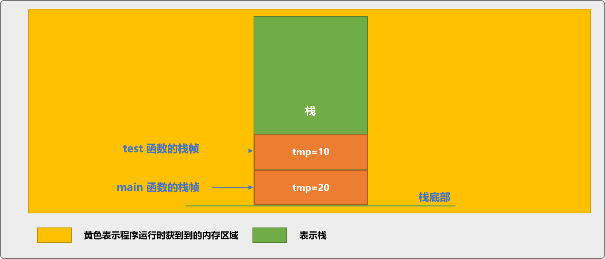
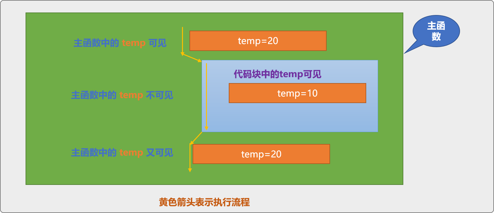

# 生命周期和作用域

## 变量的存储类别

- auto      自动变量(动态存储方式)
- register  寄存器变量(动态存储方式)
- static    静态变量(静态存储方式)
- extern 　 外部变量(静态存储方式)  

## 生命周期(存储类型)

- 生命周期指数据在内存中保留的时间，也可称为存储持续性。
- 变量从定义(分配空间)到销毁(空间被收回)的时间段，称为变量的生命周期。

1. 自动存储：如函数定义时声明的变量就属于自动存储类别。生命周期较短，仅在函数被调用到函数执行结束后其内存就会被释放。
2. 静态存储：在函数定义外声明的变量（全局变量）、使用关键字static声明的变量都为静态存储类别。它们在整个程序运行过程中都存在。
3. 线程存储：在并发、并行环境中，如果变量使用关键字 thread_local声明，则生命周期和所依附的线程生命周期同步。
4. 动态存储：使用``new``运算符声明的变量，其存储块一般在堆中，如果开发者不显示释放``delete``会一直存在，直到程序结束。

### 自动存储

函数体内声明的变量属于自动存储类别。变量在函被调用时生命开始（分配空间），函数执行完毕后，变量的生命结束（回收空间）。此类型的变量的特点：

- 局部的。
- 没有共享性。

#### 共享性

共享性指变量中的数据是否能让其它的代码可见、可用。
局部变量的局部的含义可以理解为不共享，作用域范围只供自己使用。

```c++
#include <iostream>
void test(){
    int tmp=10;
}
int main(int argc, char** argv) {
    int tmp=20;
    test();
    return 0;
}
在函数 test中声明的 tmp变量只有在 test函数被调用时才会分配空间，当函数调用结束后自动释放。
同时 main中 tmp变量也局部变量。虽然 test和 main函数中有同名的 tmp变量，两者是互不可见的，或者说两者存在于 2 个不同的时空中。
```

#### 为什么会互不可见？

- 原因可用函数的底层调用机制解释：
  - C++调用函数时，会在栈中为函数分配一个区域用来存储此函数有关的数据，称这个区域叫栈帧。
  - 每一个函数所分配到的栈帧是隔离的，且按先调用先分配的栈原则。


#### 变量间的隐藏性

```c++
#include <iostream>
using namespace std;
int main(int argc, char** argv) {
    int temp=20;
    {
    int temp=10;
    cout<<"代码块中输出:"<<temp<<endl; 
    } 
    cout<<"代码块外输出:"<<temp<<endl; 
    return 0;
}
```

输出结果是：

```c++
代码块中输出:10
代码块外输出:20
```

1. 什么是隐藏性？
    main函数中的第一次声明的 temp变量实际作用域是整个 main函数中，但是，当执行到内部代码块时，发现代码块中的 temp变量和代码块外的变量 temp同名。此时C++如何处理这种情况？
    C++会采用就近原则，进入代码块后使用代码块中定义的 temp变量，外部的 temp 变量被暂时隐藏起来。离开代码块后，重回 main函数的主体，回收代码块使用的内存资源。此时main函数中的 temp又变得可见。

    

    >当执行流从高级别的作用域进入低级别作用域后，如果有同名变量，则会隐藏高级别变量的可见性。
    当再次从低级别作用域返回高级别作用域后，高级别作用域中的同名变量会变得可见。

2. 在同一个作用域内是不能有同名变量的，如下代码，会报错。

    ```c++
    int main(int argc, char** argv) {
        //函数体内这一范围内不能出现同名变量
        int guoKe; 
        int guoKe; 
        return 0;
    }
    ```

    ```c++
    int main(int argc, char** argv) {
        {
            //同一代码块中不能出现同名变量
            int guoKe; 
            int guoKe; 
        }
        return 0;
    }
    ```

3. 在C++ 中有 2 个与自动存储变量相关的关键字：

   - auto： auto关键字在C++ 11以前的版本和 C语言中，用来显示指定变量为自动存储。 C++ 11中表示自动类型推断。
   - register：此关键字由C语言引入，如果有 register关键字的变量声明为寄存器变量，目的是为加快数据的访问速度。而在C++ 11中的语义是显示指定此变量为自动存储，和以前的 auto 功能相同。

### 静态存储

C++对内存进行管理划分时，除了分有栈和堆之外，还分有==全局\静态区域==（还有常量区域、自由存储区域），具有静态存储类别的变量被存储在此区域。

静态存储变量的特点：

- 生命周期长。其生命周期从变量声明开始，可以直到程序结束。
- 生命周期长，并不意味着谁都可以看得见它，谁都可以使用它。其作用域有外部可见、内部可见、局部可见 3 种情形。

#### 外部可见

外部可见作用域，可认为在整个程序中可用。此类型变量为广义上的全局变量。
>一个有一定规模的程序往往会有多个源代码文件。

```c++
#include <iostream>
int guoKe; 
using namespace std;
int main(int argc, char** argv) {
 cout<<guoKe;
    return 0;
}
//输出值为 `0`
```

变量 guoKe在文件中声明，默认为静态存储类型变量。变量guoKe可以在本文件中使用，也可以在外部文件中使用。如果声明时没有为其赋值，C++会对其初始化，赋值为 0。
>本文件可使用的范围指从变量声明位置开始一直到文件结束的任一位置都能使用。外部文件可使用指在另一个文件中也可以使用。

如果要在文件的外部使用，需要使用 extern变量说明符。
>如果在整个程序运行期间，需要一个在整个程序中大家都能访问到的全局可用的变量时，则可以使用外部可见的存储方案。

#### 内部可见

在文件内当使用 static关键字声明的变量其作用域为本文件可见，也就是内部可见。变量只能在声明的文件内使用，不能在外部文件中使用，也是广义上的全局变量。

```c++
static int chengxuyuan = 996;
```

#### 局部可见

在函数体内使用``static``声明的变量， 如下声明语句，则认为变量的作用域是局部可见，变量只能在声明它的函数体内使用。也是广义上的局部变量。

```c++
#include <iostream>
using namespace std;
void test(){
    //静态局部变量
 static int temp=20;
 temp++;
 cout<<temp<<endl;
} 

int main(int argc, char** argv) {
   test();
   return 0;
}
```

和前文没有使用 static关键字声明的自动存储类型的局部变量有本质的不同。
使用 static关键字声明的局部变量其生命周期是程序级别的。即使函数调用结束，变量依然还在，数据也还在。
变量只能在声明它的函数内使用，其作用域是函数级别的。这也验证了前文所说的生命周期长并不意味着变量的作用域范围就一定广。

#### 总结

声明变量时，存储类别决定了变量的生命周期。
生命周期指变量的存活时间，作用域指变量能在一个什么范围之内被使用。两者之间有很明显的区别，本文聊到了自动存储类型和静态存储类别的变量。另，如动态存储和线程存储可以自行了解。

## 作用域

变量的生命周期内，其存储的数据并不是在任何地方都能使用。变量能使用的范围(可见区域)，称为变量的作用域。

### 作用域种类

广义而言，可以根据变量的声明位置，把变量分为全局（全局作用域）变量和局部（局部作用域）变量：

#### 广义分类

- 全局变量： 在一个较大的范围之内声明的变量。如在源代码文件中声明的变量能在整个文件中使用（文件级别作用域），在类中声明的变量能在类中使用（类级别作用域）、名称空间中声明的变量可以在整个名称空间内使用。除此之外，还有(程序级别作用域)，变量能在整个程序中使用。
- 局部变量： 如函数体内声明的变量（作用域函数级别）、代码块内声明的变量（代码块级别的作用域）。

>变量的声明位置也决定了变量在内存中的存储位置，如函数体内声明的局部变量一般会存储在栈中，如类中声明的变量存储在堆中，文件中声明的全局变量存储在全局\静态存储区。

#### C++细分

C++可细分为：

- 全局作用域:全局变量
- 局部作用域:局部变量、静态局部变量
- 语句作用域
- 类作用域
- 命名空间作用域
- 文件作用域

#### 常量的作用域

const修饰的变量称为常量

- c++中，const常量作用域是local(内部链接)(只能在本文件中可用)
- const static 共同修饰的变量，拥有外部链接性(可以在其他文件使用)
