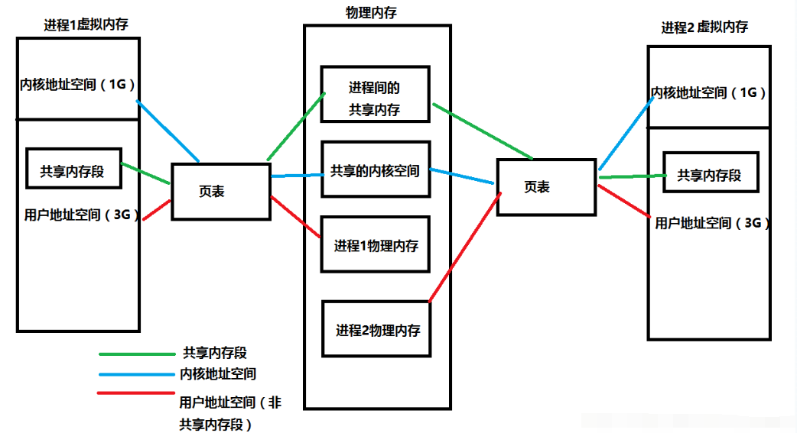

# 虚拟内存

## 物理内存与虚拟内存

物理内存：

- 物理内存实际上是CPU中能直接寻址的地址线条数。由于物理内存是有限的，例如32位平台下，寻址的大小是4G，并且是固定的。内存很快就会被分配完，于是没有得到分配资源的进程就只能等待。当一个进程执行完了以后，再将等待的进程装入内存。这种频繁的装入内存的操作是很没效率的。

- 虚拟内存：
在进程创建的时候，系统都会给每个进程分配4G的内存空间，这其实是虚拟内存空间。进程得到的这4G虚拟内存，进程自身以为是一段连续的空间，而实际上，通常被分隔成多个物理内存碎片，还有一部分存储在外部磁盘存储器上，需要的时候进行数据交换。

关于虚拟内存与物理内存的联系，下面这张图可以帮助我们巩固。

## 虚拟内存机理

1. 地址映射：虚拟内存系统使用页表或段表等数据结构，将进程看到的虚拟地址（逻辑地址）映射到实际的物理地址。每个进程拥有独立的地址空间，这增加了系统的安全性和稳定性。

2. 分页与分段：虚拟内存通常采用分页或分段（或两者的结合）来管理内存。分页系统将内存分为固定大小的块（页面），而分段则是基于逻辑模块划分内存。页面或段不在使用时可以被换出到硬盘上，腾出物理内存供其他数据使用。

3. 页面置换算法：当物理内存不足以存放新的数据时，系统需要选择某些页面从内存中移除（换出）到硬盘上，这称为页面置换。常见的页面置换算法有最近最少使用（LRU）、先进先出（FIFO）等。

4. 请求调页：当程序尝试访问一个尚未加载到物理内存中的页面时，会发生缺页中断，操作系统会负责将所需页面从硬盘读入内存，这个过程称为请求调页。

## 虚拟内存是如何工作的？

- 当每个进程创建的时候，内核会为进程分配4G的虚拟内存，当进程还没有开始运行时，这只是一个内存布局。实际上并不立即就把虚拟内存对应位置的程序数据和代码（比如.text .data段）拷贝到物理内存中，只是建立好虚拟内存和磁盘文件之间的映射就好（叫做存储器映射）。这个时候数据和代码还是在磁盘上的。当运行到对应的程序时，进程去寻找页表，发现页表中地址没有存放在物理内存上，而是在磁盘上，于是发生缺页异常，于是将磁盘上的数据拷贝到物理内存中。

- 另外在进程运行过程中，要通过malloc来动态分配内存时，也只是分配了虚拟内存，即为这块虚拟内存对应的页表项做相应设置，当进程真正访问到此数据时，才引发缺页异常。

- 可以认为虚拟空间都被映射到了磁盘空间中（事实上也是按需要映射到磁盘空间上，通过mmap，mmap是用来建立虚拟空间和磁盘空间的映射关系的）

## 虚拟内存优点

1. 扩大内存容量：通过虚拟地址空间，应用程序可以使用超过物理内存大小的地址空间，解决了物理内存有限的问题。

2. 内存保护：每个进程看到的是独立的地址空间，操作系统可以限制进程只能访问自己分配的地址区域，提高了系统的安全性。

3. 内存共享：多个进程可以映射到相同的物理内存页面，便于实现共享库的使用和内存的有效利用。

4. 减少碎片：通过动态的内存分配和回收，虚拟内存有助于减少内存碎片，提高内存利用率。

5. 提高程序兼容性：程序员可以编写程序时不必考虑实际物理内存的限制，降低了程序的编写难度。

6. 提升系统稳定性：即使某个进程崩溃或异常，也不会影响到其他进程的地址空间，增强了系统的稳定性和可靠性。

然而，虚拟内存的使用也带来了一些潜在缺点，如增加的I/O开销（频繁的硬盘读写）可能导致系统响应变慢，以及在物理内存和虚拟内存间频繁交换数据可能导致的性能下降。因此，合理配置虚拟内存大小和优化页面置换策略对系统性能至关重要。

## 利用虚拟内存机制的优点？

- 既然每个进程的内存空间都是一致而且固定的（32位平台下都是4G），所以链接器在链接可执行文件时，可以设定内存地址，而不用去管这些数据最终实际内存地址，这交给内核来完成映射关系

- 当不同的进程使用同一段代码时，比如库文件的代码，在物理内存中可以只存储一份这样的代码，不同进程只要将自己的虚拟内存映射过去就好了，这样可以节省物理内存

- 在程序需要分配连续空间的时候，只需要在虚拟内存分配连续空间，而不需要物理内存时连续的，实际上，往往物理内存都是断断续续的内存碎片。这样就可以有效地利用我们的物理内存
