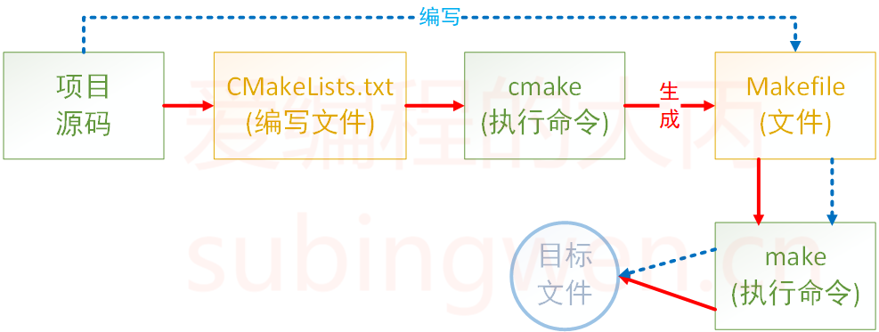

<!--cmake的总结文档-->
# 1.cmake简介

CMake 是一个项目构建工具，并且是跨平台的。关于项目构建我们所熟知的还有 Makefile（通过 make 命令进行项目的构建），大多是 IDE 软件都集成了 make，比如：VS 的 nmake、linux 下的 GNU make、Qt 的 qmake 等，如果自己动手写 makefile，会发现，makefile 通常依赖于当前的编译平台，而且编写 makefile 的工作量比较大，解决依赖关系时也容易出错。

而 CMake 恰好能解决上述问题， 其允许开发者指定整个工程的编译流程，在根据编译平台，自动生成本地化的Makefile和工程文件，最后用户只需 make 编译即可，所以可以把 CMake 看成一款自动生成 Makefile 的工具，其编译流程如下图：


- 蓝色虚线表示使用 ``makefile`` 构建项目的过程
- 红色实线表示使用 ``cmake`` 构建项目的过程

## 优点

- 跨平台
- 能够管理大型项目
- 简化编译构建过程和编译过程
- 可扩展：可以为 cmake 编写特定功能的模块，扩充 cmake 功能

# 2.cmake的使用

CMake命令是大小写不敏感的，CMake 支持大写、小写、混合大小写的命令。如果在编写 CMakeLists.txt 文件时使用的工具有对应的命令提示，那么大小写随缘即可，不要太过在意。

## 2.1 注释

### 2.1.1  注释行

``CMake`` 使用 ``#`` 进行行注释，可以放在任何位置。

```cmake
# 这是一个CMakeList.txt文件
```

### 2.1.2 注释块

``CMake`` 使用 ``#[[ ]]`` 形式进行``块注释``。

```cmake
#[[ 这是一个 CMakeLists.txt 文件。
这是一个 CMakeLists.txt 文件
这是一个 CMakeLists.txt 文件]]
cmake_minimum_required(VERSION 3.0.0)
```

## 2.2 只有源文件

### 2.2.1 执行 CMake 命令

万事俱备只欠东风，将 CMakeLists.txt 文件编辑好之后，就可以执行 cmake 命令了。

```shell
# cmake 命令原型
$ cmake CMakeLists.txt文件所在路径
```

```shell
$ tree
.
├── add.c
├── CMakeLists.txt
├── div.c
├── head.h
├── main.c
├── mult.c
└── sub.c

0 directories, 7 files
robin@OS:~/Linux/3Day/calc$ cmake .
```

当执行 cmake 命令之后，CMakeLists.txt 中的命令就会被执行，所以一定要注意给 cmake 命令指定路径的时候一定不能出错。
执行命令之后，看一下源文件所在目录中是否多了一些文件：

```shell
$ tree -L 1
.
├── add.c
├── CMakeCache.txt         # new add file
├── CMakeFiles             # new add dir
├── cmake_install.cmake    # new add file
├── CMakeLists.txt
├── div.c
├── head.h
├── main.c
├── Makefile               # new add file
├── mult.c
└── sub.c
```

我们可以看到在对应的目录下生成了一个 makefile 文件，此时再执行 make 命令，就可以对项目进行构建得到所需的可执行程序了。

```shell
$ make
Scanning dependencies of target app
[ 16%] Building C object CMakeFiles/app.dir/add.c.o
[ 33%] Building C object CMakeFiles/app.dir/div.c.o
[ 50%] Building C object CMakeFiles/app.dir/main.c.o
[ 66%] Building C object CMakeFiles/app.dir/mult.c.o
[ 83%] Building C object CMakeFiles/app.dir/sub.c.o
[100%] Linking C executable app
[100%] Built target app

# 查看可执行程序是否已经生成
$ tree -L 1
.
├── add.c
├── app     # 生成的可执行程序
├── CMakeCache.txt
├── CMakeFiles
├── cmake_install.cmake
├── CMakeLists.txt
├── div.c
├── head.h
├── main.c
├── Makefile
├── mult.c
└── sub.c
```

最终可执行程序 app 就被编译出来了（这个名字是在 CMakeLists.txt 中指定的）。

```cmake
手动在文件夹内创建build文件夹，并在build下进行编译
# 创建一个build
mkdir build
# 编译上层目录的源码
cmake ..
# 在本目录下(.)生成可执行文件
cmake --build .
```

### 2.2.2 VIP 包房

通过上面的例子可以看出，如果在 CMakeLists.txt 文件所在目录执行了 cmake 命令之后就会生成一些目录和文件（包括 makefile 文件），如果再基于 makefile文件执行 make 命令，程序在编译过程中还会生成一些中间文件和一个可执行文件，这样会导致整个项目目录看起来很混乱，不太容易管理和维护，此时我们就可以把生成的这些与项目源码无关的文件统一放到一个对应的目录里边，比如将这个目录命名为 build:

```cmake
$ mkdir build
$ cd build
$ cmake ..
-- The C compiler identification is GNU 5.4.0
-- The CXX compiler identification is GNU 5.4.0
-- Check for working C compiler: /usr/bin/cc
-- Check for working C compiler: /usr/bin/cc -- works
-- Detecting C compiler ABI info
-- Detecting C compiler ABI info - done
-- Detecting C compile features
-- Detecting C compile features - done
-- Check for working CXX compiler: /usr/bin/c++
-- Check for working CXX compiler: /usr/bin/c++ -- works
-- Detecting CXX compiler ABI info
-- Detecting CXX compiler ABI info - done
-- Detecting CXX compile features
-- Detecting CXX compile features - done
-- Configuring done
-- Generating done
-- Build files have been written to: /home/robin/Linux/build
```

现在 cmake 命令是在 build 目录中执行的，但是 CMakeLists.txt 文件是 build 目录的上一级目录中，所以 cmake 命令后指定的路径为..，即当前目录的上一级目录。

当命令执行完毕之后，在 build 目录中会生成一个 makefile 文件

```cmake
$ tree build -L 1
build
├── CMakeCache.txt
├── CMakeFiles
├── cmake_install.cmake
└── Makefile

1 directory, 3 files
```

这样就可以在 build 目录中执行 make 命令编译项目，生成的相关文件自然也就被存储到 build 目录中了。这样通过 cmake 和 make 生成的所有文件就全部和项目源文件隔离开了，各回各家，各找各妈。

## 2.3 私人订制

### 2.3.1 定义变量

在上面的例子中一共提供了 5 个源文件，假设这五个源文件需要反复被使用，每次都直接将它们的名字写出来确实是很麻烦，此时我们就需要定义一个变量，将文件名对应的字符串存储起来，在 cmake 里定义变量需要使用 set。

## 2.3.2 指定使用的C++标准

## 2.3.3 指定输出的路径

## 2.4 搜索文件

### 2.4.1 aux_source_directory

在 CMake 中使用 aux_source_directory 命令可以查找某个路径下的所有源文件，命令格式为：

```cmake
aux_source_directory(< dir > < variable >)
```

- dir：要搜索的目录
- variable：将从 dir 目录下搜索到的源文件列表存储到该变量中

```cmake
cmake_minimum_required(VERSION 3.0)
project(CALC)
include_directories(${PROJECT_SOURCE_DIR}/include)
# 搜索 src 目录下的源文件
aux_source_directory(${CMAKE_CURRENT_SOURCE_DIR}/src SRC_LIST)
add_executable(app  ${SRC_LIST})
```

### 2.4.2 file

如果一个项目里边的源文件很多，在编写 CMakeLists.txt 文件的时候不可能将项目目录的各个文件一一罗列出来，这样太麻烦了。所以，在 CMake 中为我们提供了搜索文件的命令，他就是 file（当然，除了搜索以外通过 file 还可以做其他事情）。

```cmake
file(GLOB/GLOB_RECURSE 变量名 要搜索的文件路径和文件类型)
```

- GLOB: 将指定目录下搜索到的满足条件的所有文件名生成一个列表，并将其存储到变量中。
- GLOB_RECURSE：递归搜索指定目录，将搜索到的满足条件的文件名生成一个列表，并将其存储到变量中。

搜索当前目录的 src 目录下所有的源文件，并存储到变量中

```cmake
file(GLOB MAIN_SRC ${CMAKE_CURRENT_SOURCE_DIR}/src/*.cpp)
file(GLOB MAIN_HEAD ${CMAKE_CURRENT_SOURCE_DIR}/include/*.h)
```

- CMAKE_CURRENT_SOURCE_DIR 宏表示当前访问的 CMakeLists.txt 文件所在的路径。
- 关于要搜索的文件路径和类型可加双引号，也可不加:

```cmake
file(GLOB MAIN_HEAD "${CMAKE_CURRENT_SOURCE_DIR}/src/*.h")
```

## 2.5 包含头文件

在编译项目源文件的时候，很多时候都需要将源文件对应的头文件路径指定出来，这样才能保证在编译过程中编译器能够找到这些头文件，并顺利通过编译。在 CMake 中设置要包含的目录也很简单，通过一个命令就可以搞定了，他就是 ``include_directories``:

```cmake
include_directories(headpath)
```

## 2.6 制作动态库或静态库

### 2.6.1 制作静态库 .lib

在 cmake 中，如果要制作静态库，需要使用的命令如下：

```cmake
add_library(库名称 STATIC 源文件1 [源文件2] ...) 
```

- 在 Linux 中，静态库名字分为三部分：lib+ 库名字 +.a，此处只需要指定出库的名字就可以了，另外两部分在生成该文件的时候会自动填充。
- 在 Windows 中虽然库名和 Linux 格式不同，但也只需指定出名字即可。

### 2.6.2 制作动态库

在 cmake 中，如果要制作动态库，需要使用的命令如下：

```cmake
add_library(库名称 SHARED 源文件1 [源文件2] ...) 
```

- 在 Linux 中，动态库名字分为三部分：lib+ 库名字 +.so，此处只需要指定出库的名字就可以了，另外两部分在生成该文件的时候会自动填充。
- 在 Windows 中虽然库名和 Linux 格式不同，但也只需指定出名字即可。

### 2.6.3 指定输出的路径

1. 方式 1 - 适用于动态库
    对于生成的库文件来说和可执行程序一样都可以指定输出路径。由于在Linux下生成的动态库默认是有执行权限的，所以可以按照生成可执行程序的方式去指定它生成的目录：

    ```cmake
    set(EXECUTABLE_OUTPUT_PATH ${PROJECT_SOURCE_DIR}/lib)
    ```

    对于这种方式来说，其实就是通过 set 命令给 EXECUTABLE_OUTPUT_PATH 宏设置了一个路径，这个路径就是可执行文件生成的路径。

2. 都适用
    由于在 Linux 下生成的静态库默认不具有可执行权限，所以在指定静态库生成的路径的时候就不能使用 EXECUTABLE_OUTPUT_PATH 宏了，而应该使用 LIBRARY_OUTPUT_PATH，这个宏对应静态库文件和动态库文件都适用。

    ```cmake
    cmake_minimum_required(VERSION 3.0)
    project(CALC)
    include_directories(${PROJECT_SOURCE_DIR}/include)
    file(GLOB SRC_LIST "${CMAKE_CURRENT_SOURCE_DIR}/src/*.cpp")
    # 设置动态库/静态库生成路径
    set(LIBRARY_OUTPUT_PATH ${PROJECT_SOURCE_DIR}/lib)
    # 生成动态库
    #add_library(calc SHARED ${SRC_LIST})
    # 生成静态库
    add_library(calc STATIC ${SRC_LIST})
    ```

# cmake常用语法

## 1.cmake_minimum_required：指定使用的 cmake 的最低版本

- 可选，非必须，如果不加可能会有警告

## 2.project：定义工程名称，并可指定工程的版本、工程描述、web 主页地址、支持的语言（默认情况支持所有语言），如果不需要这些都是可以忽略的，只需要指定出工程名字即可

```cmake
# PROJECT 指令的语法是：
project(<PROJECT-NAME> [<language-name>...])
project(<PROJECT-NAME>
       [VERSION <major>[.<minor>[.<patch>[.<tweak>]]]]
       [DESCRIPTION <project-description-string>]
       [HOMEPAGE_URL <url-string>]
       [LANGUAGES <language-name>...])
```

## 3.add_executable：定义工程会生成一个可执行程序

```cmake
add_executable(可执行程序名 源文件名称)
```

- 这里的可执行程序名和 project 中的项目名没有任何关系
- 源文件名可以是一个也可以是多个，如有多个可用空格或 ; 间隔

```cmake
# 样式1
add_executable(app add.c div.c main.c mult.c sub.c)
# 样式2
add_executable(app add.c;div.c;main.c;mult.c;sub.c)
```

## 4.set

### 4.1 指定变量

```cmake
# SET 指令的语法是：
# [] 中的参数为可选项, 如不需要可以不写
SET(VAR [VALUE] [CACHE TYPE DOCSTRING [FORCE]])
```

- VAR：变量名
- VALUE：变量值

```cmake
# 方式1: 各个源文件之间使用空格间隔
# set(SRC_LIST add.c  div.c   main.c  mult.c  sub.c)

# 方式2: 各个源文件之间使用分号 ; 间隔
set(SRC_LIST add.c;div.c;main.c;mult.c;sub.c)
add_executable(app  ${SRC_LIST})
```

### 4.2 指定使用的 C++ 标准

在编写 C++ 程序的时候，可能会用到 C++11、C++14、C++17、C++20 等新特性，那么就需要在编译的时候在编译命令中制定出要使用哪个标准：

```shell
g++ *.cpp -std=c++11 -o app
```

上面的例子中通过参数 -std=c++11 指定出要使用 c++11 标准编译程序，C++ 标准对应有一宏叫做 DCMAKE_CXX_STANDARD。在 CMake 中想要指定 C++ 标准有两种方式：

1. 在 CMakeLists.txt 中通过 set 命令指定

    ```cmake
    #增加-std=c++11
    set(CMAKE_CXX_STANDARD 11)
    #增加-std=c++14
    set(CMAKE_CXX_STANDARD 14)
    #增加-std=c++17
    set(CMAKE_CXX_STANDARD 17)
    ```

2. 在执行 cmake 命令的时候指定出这个宏的值

    ```cmake
    #增加-std=c++11
    cmake CMakeLists.txt文件路径 -DCMAKE_CXX_STANDARD=11
    #增加-std=c++14
    cmake CMakeLists.txt文件路径 -DCMAKE_CXX_STANDARD=14
    #增加-std=c++17
    cmake CMakeLists.txt文件路径 -DCMAKE_CXX_STANDARD=17
    ```
  
>在上面例子中 CMake 后的路径需要根据实际情况酌情修改。

### 4.3 指定输出的路径

在 CMake 中指定可执行程序输出的路径，也对应一个宏，叫做 EXECUTABLE_OUTPUT_PATH，它的值还是通过 set 命令进行设置:

```cmake
set(HOME /home/robin/Linux/Sort)
set(EXECUTABLE_OUTPUT_PATH ${HOME}/bin)
```

- 第一行：定义一个变量用于存储一个绝对路径
- 第二行：将拼接好的路径值设置给 EXECUTABLE_OUTPUT_PATH 宏
  - 如果这个路径中的子目录不存在，会自动生成，无需自己手动创建

>由于可执行程序是基于 cmake 命令生成的 makefile 文件然后再执行 make 命令得到的，所以如果此处指定可执行程序生成路径的时候使用的是相对路径 ./xxx/xxx，那么这个路径中的 ./ 对应的就是 makefile 文件所在的那个目录。

## 5. aux_source_directory

在 CMake 中使用 aux_source_directory 命令可以查找某个路径下的所有源文件，命令格式为：

```cmake
aux_source_directory(< dir > < variable >)
```

- dir：要搜索的目录
- variable：将从 dir 目录下搜索到的源文件列表存储到该变量中

```cmake
cmake_minimum_required(VERSION 3.0)
project(CALC)
include_directories(${PROJECT_SOURCE_DIR}/include)
# 搜索 src 目录下的源文件
aux_source_directory(${CMAKE_CURRENT_SOURCE_DIR}/src SRC_LIST)
add_executable(app  ${SRC_LIST})
```

## 6. file

如果一个项目里边的源文件很多，在编写 CMakeLists.txt 文件的时候不可能将项目目录的各个文件一一罗列出来，这样太麻烦了。所以，在 CMake 中为我们提供了搜索文件的命令，他就是 file（当然，除了搜索以外通过 file 还可以做其他事情）。

```cmake
file(GLOB/GLOB_RECURSE 变量名 要搜索的文件路径和文件类型)
```

- GLOB: 将指定目录下搜索到的满足条件的所有文件名生成一个列表，并将其存储到变量中。
- GLOB_RECURSE：递归搜索指定目录，将搜索到的满足条件的文件名生成一个列表，并将其存储到变量中。

搜索当前目录的 src 目录下所有的源文件，并存储到变量中

```cmake
file(GLOB MAIN_SRC ${CMAKE_CURRENT_SOURCE_DIR}/src/*.cpp)
file(GLOB MAIN_HEAD ${CMAKE_CURRENT_SOURCE_DIR}/include/*.h)
```

- CMAKE_CURRENT_SOURCE_DIR 宏表示当前访问的 CMakeLists.txt 文件所在的路径。
- 关于要搜索的文件路径和类型可加双引号，也可不加:

```cmake
file(GLOB MAIN_HEAD "${CMAKE_CURRENT_SOURCE_DIR}/src/*.h")
```

# Cmake 常见变量

## 1.预定义变量

1. PROJECT_SOURCE_DIR:工程的根目录
2. PROJECT_BINARY_DIR:运行 cmake 命令的目录，通常是 ${PROJECT_SOURCE_DIR}/build
3. PROJECT_NAME:返回通过 project 命令定义的项目名称
4. CMAKE_CURRENT_SOURCE_DIR:当前处理的 CMakeLists.txt 所在的路径
5. CMAKE_CURRENT_BINARY_DIR:target 编译目录
6. CMAKE_CURRENT_LIST_DIR:CMakeLists.txt 的完整路径
7. CMAKE_CURRENT_LIST_LINE:当前所在的行
8. CMAKE_MODULE_PATH:定义自己的 cmake 模块所在的路径，SET(CMAKE_MODULE_PATH ${PROJECT_SOURCE_DIR}/cmake)，然后可以用INCLUDE命令来调用自己的模块
9. EXECUTABLE_OUTPUT_PATH:重新定义目标二进制可执行文件的存放位置
10. LIBRARY_OUTPUT_PATH:重新定义目标链接库文件的存放位置

## 2.环境变量

1. 使用环境变量:$ENV{Name}
2. 写入环境变量:set(ENV{Name} value)  这里没有“$”符号
3. 系统信息
    1. ­CMAKE_MAJOR_VERSION
    cmake 主版本号，比如 3.4.1 中的 3
    2. ­CMAKE_MINOR_VERSION
    cmake 次版本号，比如 3.4.1 中的 4
    3. ­CMAKE_PATCH_VERSION
    cmake 补丁等级，比如 3.4.1 中的 1
    4. ­CMAKE_SYSTEM
    系统名称，比如 Linux-­2.6.22
    5. ­CMAKE_SYSTEM_NAME
    不包含版本的系统名,比如Linux
    6. CMAKE_SYSTEM_VERSION
    系统版本，比如 2.6.22
    7. ­CMAKE_SYSTEM_PROCESSOR
    处理器名称，比如 i686
    8. ­UNIX
    在所有的类 UNIX 平台下该值为 TRUE，包括 OS X 和 cygwin
    9. ­WIN32
    在所有的 win32 平台下该值为 TRUE，包括 cygwin
4. 主要开关选项
    1. BUILD_SHARED_LIBS
    这个开关用来控制默认的库编译方式，如果不进行设置，使用 add_library 又没有指定库类型的情况下，默认编译生成的库都是静态库。
    如果 set(BUILD_SHARED_LIBS ON) 后，默认生成的为动态库

    2. CMAKE_C_FLAGS
    设置 C 编译选项，也可以通过指令 add_definitions() 添加

    3. CMAKE_CXX_FLAGS
    设置 C++ 编译选项，也可以通过指令 add_definitions() 添加

    4. add_definitions(-DENABLE_DEBUG -DABC) # 参数之间用空格分隔
