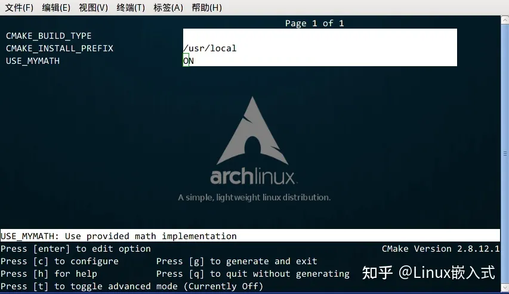

# 全网最细的CMake教程

<https://zhuanlan.zhihu.com/p/534439206>

## 什么是 CMake?

你或许听过好几种 Make 工具，例如 GNU Make ，QT 的 qmake ，微软的 MS nmake，BSD Make（pmake），Makepp，等等。这些 Make 工具遵循着不同的规范和标准，所执行的 Makefile 格式也千差万别。这样就带来了一个严峻的问题：如果软件想跨平台，必须要保证能够在不同平台编译。而如果使用上面的 Make 工具，就得为每一种标准写一次 Makefile ，这将是一件让人抓狂的工作。CMake 就是针对上面问题所设计的工具：它首先允许开发者编写一种平台无关的 CMakeList.txt 文件来定制整个编译流程，然后再根据目标用户的平台进一步生成所需的本地化 Makefile 和工程文件，如 Unix 的 Makefile 或 Windows 的 Visual Studio 工程。从而做到“Write once, run everywhere”。显然，CMake 是一个比上述几种 make 更高级的编译配置工具。一些使用 CMake 作为项目架构系统的知名开源项目有 VTK、ITK、KDE、OpenCV、OSG 等 [1]。在 linux 平台下使用 CMake 生成 Makefile 并编译的流程如下：

1. 写 CMake 配置文件 CMakeLists.txt 。
2. 执行命令 cmake PATH 或者 ccmake PATH 生成 Makefile（ccmake 和 cmake 的区别在于前者提供了一个交互式的界面）。其中， PATH 是 CMakeLists.txt 所在的目录。
3. 使用 make 命令进行编译。

## 单文件例子

### 单个源文件

```cpp
对于简单的项目，只需要写几行代码就可以了。例如，假设现在我们的项目中只有一个源文件 main.cc ，该程序的用途是计算一个数的指数幂。
#include <stdio.h>
#include <stdlib.h>

/**
 * power - Calculate the power of number.
 * @param base: Base value.
 * @param exponent: Exponent value.
 *
 * @return base raised to the power exponent.
 */
double power(double base, int exponent)
{
    int result = base;
    int i;
    
    if (exponent == 0) {
        return 1;
    }
    
    for(i = 1; i < exponent; ++i){
        result = result * base;
    }

    return result;
}

int main(int argc, char *argv[])
{
    if (argc < 3){
        printf("Usage: %s base exponent \n", argv[0]);
        return 1;
    }
    double base = atof(argv[1]);
    int exponent = atoi(argv[2]);
    double result = power(base, exponent);
    printf("%g ^ %d is %g\n", base, exponent, result);
    return 0;
}
```

### 编写 CMakeLists.txt

首先编写 CMakeLists.txt 文件，并保存在与 <http://main.cc> 源文件同个目录下：

```cpp
# CMake 最低版本号要求
cmake_minimum_required (VERSION 2.8)

# 项目信息
project (Demo1)

# 指定生成目标
add_executable(Demo main.cc)
```

``CMakeLists.txt``的语法比较简单，由命令、注释和空格组成，其中命令是不区分大小写的。符号 # 后面的内容被认为是注释。命令由命令名称、小括号和参数组成，参数之间使用空格进行间隔。对于上面的``CMakeLists.txt``文件，依次出现了几个命令：

1. cmake_minimum_required：指定运行此配置文件所需的 CMake 的最低版本；
2. project：参数值是 Demo1，该命令表示项目的名称是 Demo1 。
3. add_executable：将名为 main.cc 的源文件编译成一个名称为 Demo 的可执行文件。

### 编译项目

之后，在当前目录执行 cmake . ，得到 Makefile 后再使用 make 命令编译得到 Demo1 可执行文件。

```cpp
[ehome@xman Demo1]$ cmake .
-- The C compiler identification is GNU 4.8.2
-- The CXX compiler identification is GNU 4.8.2
-- Check for working C compiler: /usr/sbin/cc
-- Check for working C compiler: /usr/sbin/cc -- works
-- Detecting C compiler ABI info
-- Detecting C compiler ABI info - done
-- Check for working CXX compiler: /usr/sbin/c++
-- Check for working CXX compiler: /usr/sbin/c++ -- works
-- Detecting CXX compiler ABI info
-- Detecting CXX compiler ABI info - done
-- Configuring done
-- Generating done
-- Build files have been written to: /home/ehome/Documents/programming/C/power/Demo1
[ehome@xman Demo1]$ make
Scanning dependencies of target Demo
[100%] Building C object CMakeFiles/Demo.dir/main.cc.o
Linking C executable Demo
[100%] Built target Demo
[ehome@xman Demo1]$ ./Demo 5 4
5 ^ 4 is 625
[ehome@xman Demo1]$ ./Demo 7 3
7 ^ 3 is 343
[ehome@xman Demo1]$ ./Demo 2 10
2 ^ 10 is 1024
```

## 多个源文件

### 同一目录，多个源文件

上面的例子只有单个源文件。现在假如把 power 函数单独写进一个名为 MathFunctions.c 的源文件里，使得这个工程变成如下的形式：

```cpp
./Demo2
    |
    +--- main.cc
    |
    +--- MathFunctions.cc
    |
    +--- MathFunctions.h
```

这个时候，CMakeLists.txt 可以改成如下的形式：

```cmake
# CMake 最低版本号要求
cmake_minimum_required (VERSION 2.8)

# 项目信息
project (Demo2)

# 指定生成目标
add_executable(Demo main.cc MathFunctions.cc)
```

唯一的改动只是在 ``add_executable`` 命令中增加了一个 ``MathFunctions.cc`` 源文件。这样写当然没什么问题，但是如果源文件很多，把所有源文件的名字都加进去将是一件烦人的工作。更省事的方法是使用 ``aux_source_directory`` 命令，该命令会查找指定目录下的所有源文件，然后将结果存进指定变量名。其语法如下：

```cpp
aux_source_directory(<dir> <variable>)
```

因此，可以修改 CMakeLists.txt 如下：

```cpp
# CMake 最低版本号要求
cmake_minimum_required (VERSION 2.8)

# 项目信息
project (Demo2)

# 查找当前目录下的所有源文件
# 并将名称保存到 DIR_SRCS 变量
aux_source_directory(. DIR_SRCS)

# 指定生成目标
add_executable(Demo ${DIR_SRCS})
```

这样，``CMake`` 会将当前目录所有源文件的文件名赋值给变量 ``DIR_SRCS`` ，再指示变量 ``DIR_SRCS`` 中的源文件需要编译成一个名称为 ``Demo`` 的可执行文件。

### 多个目录，多个源文件

现在进一步将 MathFunctions.h 和 <http://MathFunctions.cc> 文件移动到 math 目录下。

```cpp
./Demo3
    |
    +--- main.cc
    |
    +--- math/
          |
          +--- MathFunctions.cc
          |
          +--- MathFunctions.h
```

对于这种情况，需要分别在项目根目录 Demo3 和 math 目录里各编写一个 CMakeLists.txt 文件。为了方便，我们可以先将 math 目录里的文件编译成静态库再由 main 函数调用。根目录中的 CMakeLists.txt ：

```cpp
# CMake 最低版本号要求
cmake_minimum_required (VERSION 2.8)

# 项目信息
project (Demo3)

# 查找当前目录下的所有源文件
# 并将名称保存到 DIR_SRCS 变量
aux_source_directory(. DIR_SRCS)

# 添加 math 子目录
add_subdirectory(math)

# 指定生成目标 
add_executable(Demo main.cc)

# 添加链接库
target_link_libraries(Demo MathFunctions)
```

该文件添加了下面的内容: 第3行，使用命令 ``add_subdirectory`` 指明本项目包含一个子目录 ``math``，这样 ``math`` 目录下的 ``CMakeLists.txt`` 文件和源代码也会被处理 。第6行，使用命令 ``target_link_libraries`` 指明可执行文件 ``main`` 需要连接一个名为 ``MathFunctions`` 的链接库 。子目录中的 ``CMakeLists.txt：``

```cpp
# 查找当前目录下的所有源文件
# 并将名称保存到 DIR_LIB_SRCS 变量
aux_source_directory(. DIR_LIB_SRCS)

# 生成链接库
add_library (MathFunctions ${DIR_LIB_SRCS})
```

在该文件中使用命令 add_library 将 src 目录中的源文件编译为静态链接库。

## 自定义编译选项

CMake 允许为项目增加编译选项，从而可以根据用户的环境和需求选择最合适的编译方案。例如，可以将 MathFunctions 库设为一个可选的库，如果该选项为 ON ，就使用该库定义的数学函数来进行运算。否则就调用标准库中的数学函数库。

### 修改 CMakeLists 文件

我们要做的第一步是在顶层的 CMakeLists.txt 文件中添加该选项：

```cpp
# CMake 最低版本号要求
cmake_minimum_required (VERSION 2.8)

# 项目信息
project (Demo4)

# 加入一个配置头文件，用于处理 CMake 对源码的设置
configure_file (
  "${PROJECT_SOURCE_DIR}/config.h.in"
  "${PROJECT_BINARY_DIR}/config.h"
  )

# 是否使用自己的 MathFunctions 库
option (USE_MYMATH
       "Use provided math implementation" ON)

# 是否加入 MathFunctions 库
if (USE_MYMATH)
  include_directories ("${PROJECT_SOURCE_DIR}/math")
  add_subdirectory (math)  
  set (EXTRA_LIBS ${EXTRA_LIBS} MathFunctions)
endif (USE_MYMATH)

# 查找当前目录下的所有源文件
# 并将名称保存到 DIR_SRCS 变量
aux_source_directory(. DIR_SRCS)

# 指定生成目标
add_executable(Demo ${DIR_SRCS})
target_link_libraries (Demo  ${EXTRA_LIBS})
```

其中：

1. 第7行的 configure_file 命令用于加入一个配置头文件 config.h ，这个文件由 CMake 从 config.h.in 生成，通过这样的机制，将可以通过预定义一些参数和变量来控制代码的生成。
2. 第13行的 option 命令添加了一个 USE_MYMATH 选项，并且默认值为 ON 。
3. 第17行根据 USE_MYMATH 变量的值来决定是否使用我们自己编写的 MathFunctions 库。

### 修改 main.cc 文件

之后修改 main.cc 文件，让其根据 ``USE_MYMATH`` 的预定义值来决定是否调用标准库还是 MathFunctions 库：

```cpp
#include <stdio.h>
#include <stdlib.h>
#include "config.h"

#ifdef USE_MYMATH
  #include "math/MathFunctions.h"
#else
  #include <math.h>
#endif


int main(int argc, char *argv[])
{
    if (argc < 3){
        printf("Usage: %s base exponent \n", argv[0]);
        return 1;
    }
    double base = atof(argv[1]);
    int exponent = atoi(argv[2]);
    
#ifdef USE_MYMATH
    printf("Now we use our own Math library. \n");
    double result = power(base, exponent);
#else
    printf("Now we use the standard library. \n");
    double result = pow(base, exponent);
#endif
    printf("%g ^ %d is %g\n", base, exponent, result);
    return 0;
}
```

### 编写 config.h.in 文件

上面的程序值得注意的是第2行，这里引用了一个 ``config.h`` 文件，这个文件预定义了 ``USE_MYMATH`` 的值。但我们并不直接编写这个文件，为了方便从 ``CMakeLists.txt`` 中导入配置，我们编写一个 ``config.h.in``文件，内容如下：

```cpp
#cmakedefine USE_MYMATH
```

这样 CMake 会自动根据 CMakeLists 配置文件中的设置自动生成 config.h 文件。

### 自定义编译项目

现在编译一下这个项目，为了便于交互式的选择该变量的值，可以使用 ``ccmake`` 命令（也可以使用 ``cmake -i`` 命令，该命令会提供一个会话式的交互式配置界面）：

CMake的交互式配置界面从中可以找到刚刚定义的 ``USE_MYMATH`` 选项，按键盘的方向键可以在不同的选项窗口间跳转，按下 ``enter`` 键可以修改该选项。修改完成后可以按下 ``c`` 选项完成配置，之后再按 ``g`` 键确认生成 ``Makefile`` 。ccmake 的其他操作可以参考窗口下方给出的指令提示。我们可以试试分别将 ``USE_MYMATH`` 设为 ``ON`` 和 ``OFF`` 得到的结果：

### USE_MYMATH 为 ON

运行结果：

```cpp
[ehome@xman Demo4]$ ./Demo
Now we use our own MathFunctions library. 
 7 ^ 3 = 343.000000
 10 ^ 5 = 100000.000000
 2 ^ 10 = 1024.000000
```

此时 config.h 的内容为：

```cpp
#define USE_MYMATH
```

### USE_MYMATH 为 OFF

运行结果：

```cpp
[ehome@xman Demo4]$ ./Demo
Now we use the standard library. 
 7 ^ 3 = 343.000000
 10 ^ 5 = 100000.000000
 2 ^ 10 = 1024.000000
```

此时 config.h 的内容为：

```cpp
/* #undef USE_MYMATH */
```

## 安装和测试

``CMake`` 也可以指定安装规则，以及添加测试。这两个功能分别可以通过在产生 ``Makefile`` 后使用 ``make install`` 和 ``make test`` 来执行。在以前的 ``GNU Makefile`` 里，你可能需要为此编写 ``install`` 和 ``test`` 两个伪目标和相应的规则，但在 ``CMake`` 里，这样的工作同样只需要简单的调用几条命令。

### 定制安装规则

首先先在 math/CMakeLists.txt 文件里添加下面两行：

```cmake
# 指定 MathFunctions 库的安装路径
install (TARGETS MathFunctions DESTINATION bin)
install (FILES MathFunctions.h DESTINATION include)
```

指明 MathFunctions 库的安装路径。之后同样修改根目录的 CMakeLists 文件，在末尾添加下面几行：

```cmake
# 指定安装路径
install (TARGETS Demo DESTINATION bin)
install (FILES "${PROJECT_BINARY_DIR}/config.h"
         DESTINATION include)
```

通过上面的定制，生成的 ``Demo`` 文件和 ``MathFunctions`` 函数库 ``libMathFunctions.o`` 文件将会被复制到 ``/usr/local/bin`` 中，而 ``MathFunctions.h`` 和生成的 ``config.h`` 文件则会被复制到 ``/usr/local/include`` 中。我们可以验证一下（顺带一提的是，这里的 ``/usr/local/`` 是默认安装到的根目录，可以通过修改 ``CMAKE_INSTALL_PREFIX`` 变量的值来指定这些文件应该拷贝到哪个根目录）：

```cpp
[ehome@xman Demo5]$ sudo make install
[ 50%] Built target MathFunctions
[100%] Built target Demo
Install the project...
-- Install configuration: ""
-- Installing: /usr/local/bin/Demo
-- Installing: /usr/local/include/config.h
-- Installing: /usr/local/bin/libMathFunctions.a
-- Up-to-date: /usr/local/include/MathFunctions.h
[ehome@xman Demo5]$ ls /usr/local/bin
Demo  libMathFunctions.a
[ehome@xman Demo5]$ ls /usr/local/include
config.h  MathFunctions.h
```

### 为工程添加测试

添加测试同样很简单。CMake 提供了一个称为 CTest 的测试工具。我们要做的只是在项目根目录的 CMakeLists 文件中调用一系列的 add_test 命令。

```cpp
# 启用测试
enable_testing()

# 测试程序是否成功运行
add_test (test_run Demo 5 2)

# 测试帮助信息是否可以正常提示
add_test (test_usage Demo)
set_tests_properties (test_usage
  PROPERTIES PASS_REGULAR_EXPRESSION "Usage: .* base exponent")

# 测试 5 的平方
add_test (test_5_2 Demo 5 2)

set_tests_properties (test_5_2
 PROPERTIES PASS_REGULAR_EXPRESSION "is 25")

# 测试 10 的 5 次方
add_test (test_10_5 Demo 10 5)

set_tests_properties (test_10_5
 PROPERTIES PASS_REGULAR_EXPRESSION "is 100000")

# 测试 2 的 10 次方
add_test (test_2_10 Demo 2 10)

set_tests_properties (test_2_10
 PROPERTIES PASS_REGULAR_EXPRESSION "is 1024")
```
