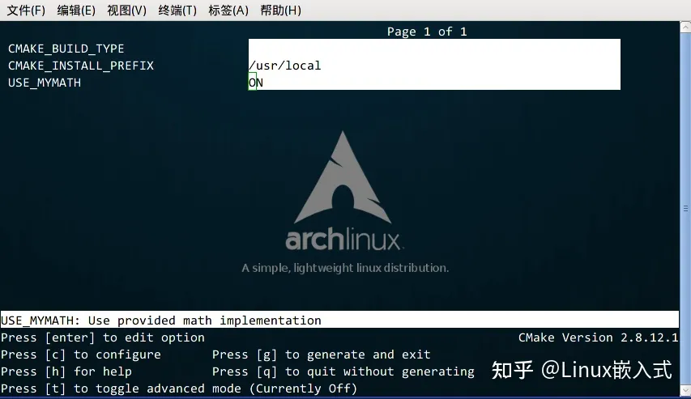

# cmake 例子

## 单个源文件

```cmake
#设置cmake最小的版本要求
cmake_minimum_required(VERSION 3.10)

#设置项目名
project(project_name)

#添加可执行文件(第一个参数是生成的可执行文件的名字，第二个参数是源文件)
add_executable(project_name xxx.cpp)
```

## 同一目录，多个源文件

1.现在假如把 power 函数单独写进一个名为 MathFunctions.c 的源文件里，使得这个工程变成如下的形式：

```cpp
./Demo2
    |
    +--- main.cc
    |
    +--- MathFunctions.cc
    |
    +--- MathFunctions.h
```

这个时候，CMakeLists.txt 可以改成如下的形式：

```cpp
# CMake 最低版本号要求
cmake_minimum_required (VERSION 2.8)

# 项目信息
project (Demo2)

# 指定生成目标
add_executable(Demo main.cc MathFunctions.cc) # 依次加入该目录下的所有源文件
```

2.但是如果源文件很多，把所有源文件的名字都加进去将是一件烦人的工作。更省事的方法是使用 aux_source_directory 命令，该命令会查找指定目录下的所有源文件，然后将结果存进指定变量名。其语法如下：

```cmake
aux_source_directory(<dir> <variable>)
```

可以修改 CMakeLists.txt 如下：

```cmake
# CMake 最低版本号要求
cmake_minimum_required (VERSION 2.8)

# 项目信息
project (Demo2)

# 查找当前目录下的所有源文件
# 并将名称保存到 DIR_SRCS 变量
aux_source_directory(. DIR_SRCS)

# 指定生成目标
add_executable(Demo ${DIR_SRCS})
```

这样，CMake 会将当前目录所有源文件的文件名赋值给变量 DIR_SRCS ，再指示变量 DIR_SRCS 中的源文件需要编译成一个名称为 Demo 的可执行文件。

==总结==

1. 可以将多个文件都添加到add_executable()中。
2. 使用aux_source_directory将所有源文件赋值给一个变量，添加该变量到add_executable()中。

## 多个目录，多个源文件

现在进一步将 MathFunctions.h 和 MathFunctions.cc 文件移动到 math 目录下。

```cpp
./Demo3
    |
    +--- main.cc
    |
    +--- math/
          |
          +--- MathFunctions.cc
          |
          +--- MathFunctions.h
```

对于这种情况，需要分别在项目根目录 Demo3 和 math 目录里各编写一个 CMakeLists.txt 文件。为了方便，我们可以先将 math 目录里的文件编译成静态库再由 main 函数调用。
根目录中的 CMakeLists.txt ：

```cmake
# CMake 最低版本号要求
cmake_minimum_required (VERSION 3.1)

# 项目信息
project (Demo3)

# 查找当前目录下的所有源文件
# 并将名称保存到 DIR_SRCS 变量
aux_source_directory(. DIR_SRCS)

# 添加 math 子目录
add_subdirectory(math)

# 指定生成目标 
add_executable(Demo main.cc)

# 添加链接库
target_link_libraries(Demo MathFunctions)
```

该文件添加了下面的内容: 第3行，使用命令 add_subdirectory 指明本项目包含一个子目录 math，这样 math 目录下的 CMakeLists.txt 文件和源代码也会被处理 。第6行，使用命令 target_link_libraries 指明可执行文件 main 需要连接一个名为 MathFunctions 的链接库 。
子目录中的 CMakeLists.txt：

```cmake
# 查找当前目录下的所有源文件
# 并将名称保存到 DIR_LIB_SRCS 变量
aux_source_directory(. DIR_LIB_SRCS)

# 生成链接库
add_library (MathFunctions ${DIR_LIB_SRCS})
```

- 在该文件中使用命令 add_library 将 src 目录中的源文件编译为==静态链接库==。

==总结==：

1. 先在每个子目录中，将所有源文件保存为一个变量并生成链接库
2. 在根目录里添加所有子目录
3. 生成目标
4. 添加子目录里的链接库

## 自定义编译选项

CMake 允许为项目增加编译选项，从而可以根据用户的环境和需求选择最合适的编译方案。

例如，可以将 MathFunctions 库设为一个可选的库，如果该选项为 ON ，就使用该库定义的数学函数来进行运算。否则就调用标准库中的数学函数库。

### 1.修改 CMakeLists 文件

我们要做的第一步是在顶层的 CMakeLists.txt 文件中添加该选项：

```cmake
# CMake 最低版本号要求
cmake_minimum_required (VERSION 2.8)

# 项目信息
project (Demo4)

# 加入一个配置头文件，用于处理 CMake 对源码的设置
configure_file (
  "${PROJECT_SOURCE_DIR}/config.h.in"
  "${PROJECT_BINARY_DIR}/config.h"
  )

# 是否使用自己的 MathFunctions 库
option (USE_MYMATH
       "Use provided math implementation" ON)

# 是否加入 MathFunctions 库
if (USE_MYMATH)
  include_directories ("${PROJECT_SOURCE_DIR}/math")
  add_subdirectory (math)  
  set (EXTRA_LIBS ${EXTRA_LIBS} MathFunctions)
endif (USE_MYMATH)

# 查找当前目录下的所有源文件
# 并将名称保存到 DIR_SRCS 变量
aux_source_directory(. DIR_SRCS)

# 指定生成目标
add_executable(Demo ${DIR_SRCS})
target_link_libraries (Demo  ${EXTRA_LIBS})
```

其中：

1. 第7行的 configure_file 命令用于加入一个配置头文件 config.h ，这个文件由 CMake 从 config.h.in 生成，通过这样的机制，将可以通过预定义一些参数和变量来控制代码的生成。
2. 第13行的 option 命令添加了一个 USE_MYMATH 选项，并且默认值为 ON 。
3. 第17行根据 USE_MYMATH 变量的值来决定是否使用我们自己编写的 MathFunctions 库。

### 2.修改 main.cc 文件

之后修改 main.cc 文件，让其根据 USE_MYMATH 的预定义值来决定是否调用标准库还是 MathFunctions 库：

```cmake
#include <stdio.h>
#include <stdlib.h>
#include "config.h"

#ifdef USE_MYMATH
  #include "math/MathFunctions.h"
#else
  #include <math.h>
#endif


int main(int argc, char *argv[])
{
    if (argc < 3){
        printf("Usage: %s base exponent \n", argv[0]);
        return 1;
    }
    double base = atof(argv[1]);
    int exponent = atoi(argv[2]);
    
#ifdef USE_MYMATH
    printf("Now we use our own Math library. \n");
    double result = power(base, exponent);
#else
    printf("Now we use the standard library. \n");
    double result = pow(base, exponent);
#endif
    printf("%g ^ %d is %g\n", base, exponent, result);
    return 0;
}
```

### 3.编写 config.h.in 文件

上面的程序值得注意的是第2行，这里引用了一个 config.h 文件，这个文件预定义了 USE_MYMATH 的值。但我们并不直接编写这个文件，为了方便从 CMakeLists.txt 中导入配置，我们编写一个 config.h.in 文件，内容如下：

```cpp
#cmakedefine USE_MYMATH
```

这样 CMake 会自动根据 CMakeLists 配置文件中的设置自动生成 config.h 文件。

### 4.编译项目

现在编译一下这个项目，为了便于交互式的选择该变量的值，可以使用 ccmake 命令（也可以使用 cmake -i 命令，该命令会提供一个会话式的交互式配置界面）：

CMake的交互式配置界面
从中可以找到刚刚定义的 USE_MYMATH 选项，按键盘的方向键可以在不同的选项窗口间跳转，按下 enter 键可以修改该选项。修改完成后可以按下 c 选项完成配置，之后再按 g 键确认生成 Makefile 。ccmake 的其他操作可以参考窗口下方给出的指令提示。

我们可以试试分别将 USE_MYMATH 设为 ON 和 OFF 得到的结果：

USE_MYMATH 为 ON

运行结果：

```c
[ehome@xman Demo4]$ ./Demo
Now we use our own MathFunctions library. 
 7 ^ 3 = 343.000000
 10 ^ 5 = 100000.000000
 2 ^ 10 = 1024.000000
```

此时 config.h 的内容为：

```cpp
#define USE_MYMATH
```

USE_MYMATH 为 OFF
运行结果：

```c
[ehome@xman Demo4]$ ./Demo
Now we use the standard library. 
 7 ^ 3 = 343.000000
 10 ^ 5 = 100000.000000
 2 ^ 10 = 1024.000000
```

此时 config.h 的内容为：

```cpp
/* #undef USE_MYMATH */
```
